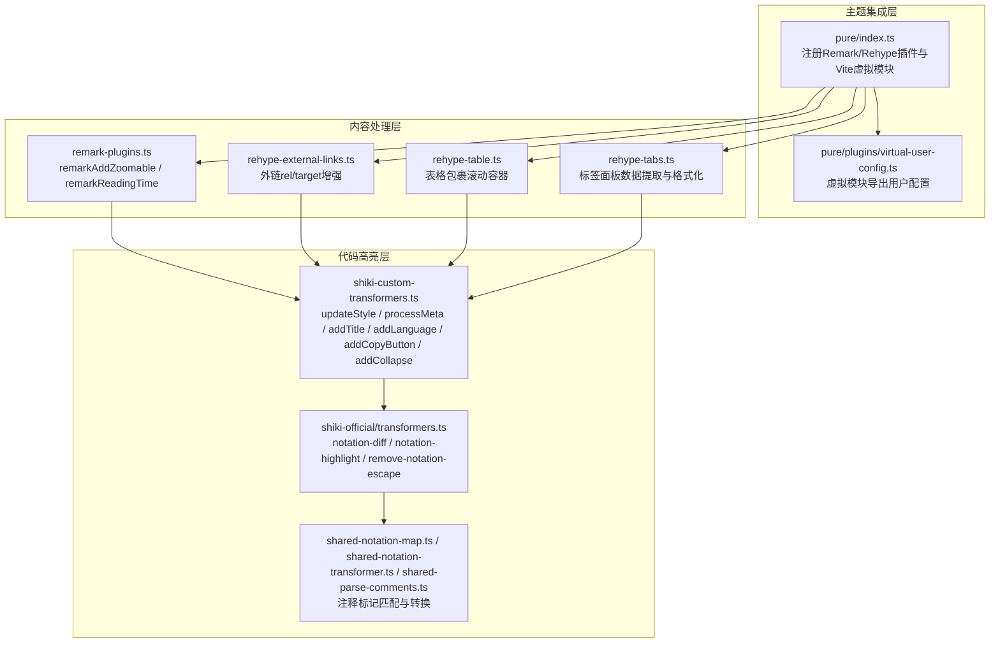
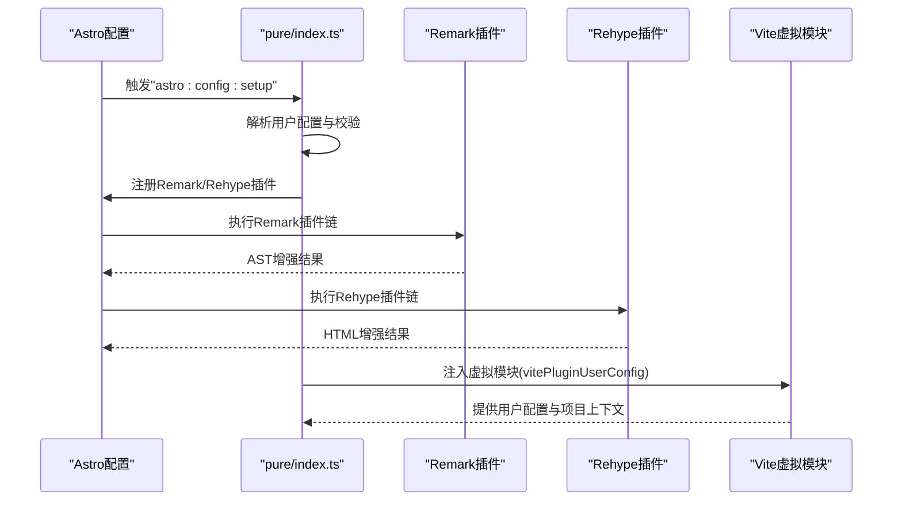
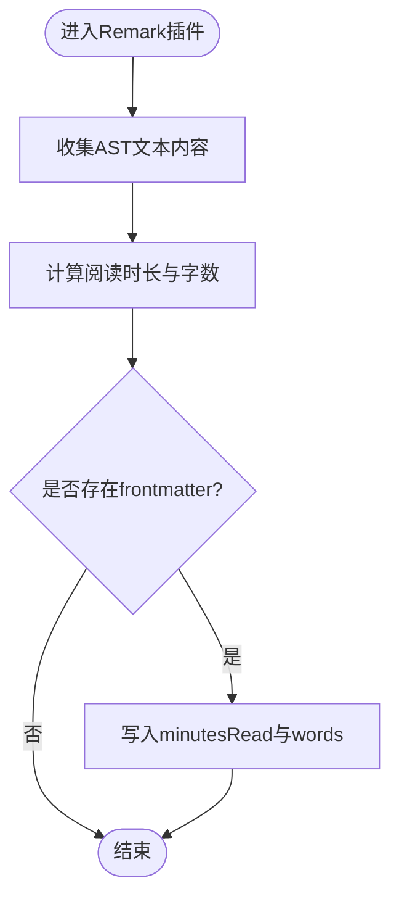
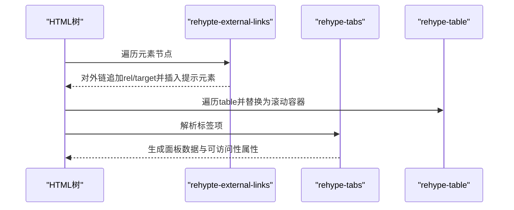
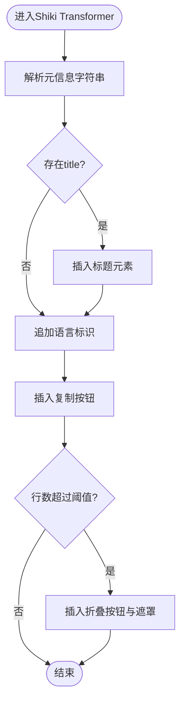
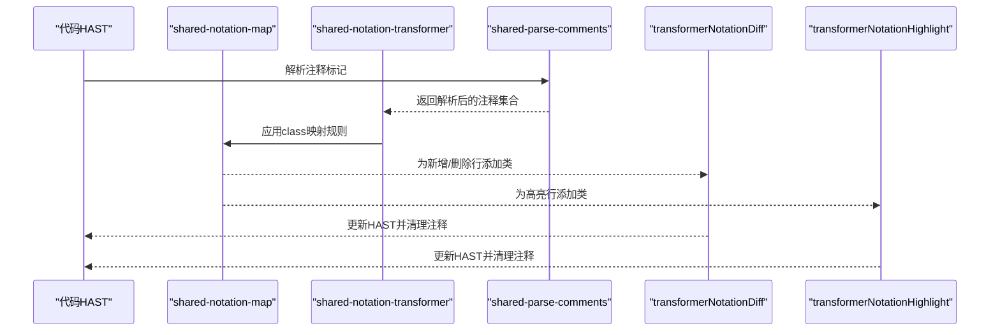
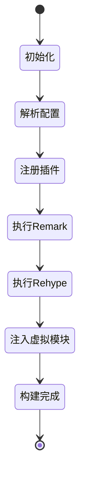
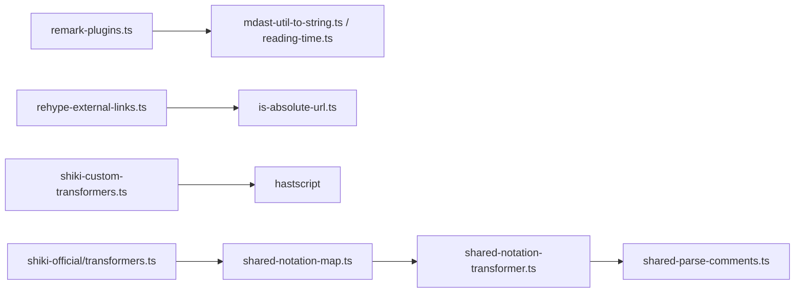

# Markdown插件

<cite>
**本文引用的文件**
- [packages/pure/index.ts](file://packages/pure/index.ts)
- [packages/pure/plugins/remark-plugins.ts](file://packages/pure/plugins/remark-plugins.ts)
- [packages/pure/plugins/rehype-external-links.ts](file://packages/pure/plugins/rehype-external-links.ts)
- [packages/pure/plugins/rehype-table.ts](file://packages/pure/plugins/rehype-table.ts)
- [packages/pure/plugins/rehype-tabs.ts](file://packages/pure/plugins/rehype-tabs.ts)
- [packages/pure/plugins/virtual-user-config.ts](file://packages/pure/plugins/virtual-user-config.ts)
- [packages/pure/utils/mdast-util-to-string.ts](file://packages/pure/utils/mdast-util-to-string.ts)
- [packages/pure/utils/reading-time.ts](file://packages/pure/utils/reading-time.ts)
- [packages/pure/types/user-config.ts](file://packages/pure/types/user-config.ts)
- [packages/pure/types/integrations-config.ts](file://packages/pure/types/integrations-config.ts)
- [src/plugins/shiki-custom-transformers.ts](file://src/plugins/shiki-custom-transformers.ts)
- [src/plugins/shiki-official/transformers.ts](file://src/plugins/shiki-official/transformers.ts)
- [src/plugins/shiki-official/shared-notation-map.ts](file://src/plugins/shiki-official/shared-notation-map.ts)
- [src/plugins/shiki-official/shared-notation-transformer.ts](file://src/plugins/shiki-official/shared-notation-transformer.ts)
- [src/plugins/shiki-official/shared-parse-comments.ts](file://src/plugins/shiki-official/shared-parse-comments.ts)
- [src/content.config.ts](file://src/content.config.ts)
- [src/site.config.ts](file://src/site.config.ts)
</cite>

## 目录
1. [引言](#引言)
2. [项目结构](#项目结构)
3. [核心组件](#核心组件)
4. [架构总览](#架构总览)
5. [组件详解](#组件详解)
6. [依赖关系分析](#依赖关系分析)
7. [性能考量](#性能考量)
8. [故障排查指南](#故障排查指南)
9. [结论](#结论)
10. [附录](#附录)

## 引言
本文件面向Astro主题Pure的Markdown插件体系，系统性梳理Remark与Rehype插件的开发与配置方式，深入解析shiki自定义transformer与官方transformers的实现原理与语法解析流程，并提供插件开发、生命周期管理、错误处理、性能优化与缓存策略的最佳实践。读者可据此理解并扩展Markdown处理能力，提升站点的可读性、交互性与可维护性。

## 项目结构
Pure主题将Markdown处理能力分为三层：
- 主题集成层：在Astro集成钩子中注册Remark/Rehype插件与Vite虚拟模块，统一注入到构建配置中。
- 内容处理层：通过Remark插件对AST进行语义增强（如阅读时长、图片类名），通过Rehype插件对HTML进行结构化增强（外链、表格滚动、标签页）。
- 代码高亮层：基于Shiki的transformers对代码块进行样式包装、元信息解析、标题/语言/复制按钮/折叠等增强。

**图示来源**
- [packages/pure/index.ts](file://packages/pure/index.ts#L29-L96)
- [packages/pure/plugins/virtual-user-config.ts](file://packages/pure/plugins/virtual-user-config.ts#L19-L99)
- [packages/pure/plugins/remark-plugins.ts](file://packages/pure/plugins/remark-plugins.ts#L9-L28)
- [packages/pure/plugins/rehype-external-links.ts](file://packages/pure/plugins/rehype-external-links.ts#L37-L74)
- [packages/pure/plugins/rehype-table.ts](file://packages/pure/plugins/rehype-table.ts#L8-L35)
- [packages/pure/plugins/rehype-tabs.ts](file://packages/pure/plugins/rehype-tabs.ts#L51-L97)
- [src/plugins/shiki-custom-transformers.ts](file://src/plugins/shiki-custom-transformers.ts#L21-L152)
- [src/plugins/shiki-official/transformers.ts](file://src/plugins/shiki-official/transformers.ts#L31-L122)
- [src/plugins/shiki-official/shared-notation-map.ts](file://src/plugins/shiki-official/shared-notation-map.ts#L23-L48)
- [src/plugins/shiki-official/shared-notation-transformer.ts](file://src/plugins/shiki-official/shared-notation-transformer.ts#L20-L126)
- [src/plugins/shiki-official/shared-parse-comments.ts](file://src/plugins/shiki-official/shared-parse-comments.ts#L35-L155)

**章节来源**
- [packages/pure/index.ts](file://packages/pure/index.ts#L19-L96)
- [packages/pure/plugins/virtual-user-config.ts](file://packages/pure/plugins/virtual-user-config.ts#L19-L99)

## 核心组件
- Remark插件
  - remarkAddZoomable：为图片节点添加可缩放类名，便于后续lightbox库处理。
  - remarkReadingTime：统计页面文本字数与时长，写入frontmatter，供页面渲染使用。
- Rehype插件
  - rehypeExternalLinks：对外部链接自动追加rel与target，并可插入可访问性提示元素。
  - rehypeTable：将内容区内的表格包裹为可横向滚动的容器，提升移动端可读性。
  - rehypeTabs：解析Starlight风格的标签项，生成面板数据与可访问性属性。
- Shiki Transformers
  - 自定义transformers：updateStyle、processMeta、addTitle、addLanguage、addCopyButton、addCollapse。
  - 官方transformers：transformerNotationDiff、transformerNotationHighlight、transformerRemoveNotationEscape。
- 虚拟模块与配置
  - vitePluginUserConfig：导出用户配置与项目上下文，供运行时消费。

**章节来源**
- [packages/pure/plugins/remark-plugins.ts](file://packages/pure/plugins/remark-plugins.ts#L9-L28)
- [packages/pure/plugins/rehype-external-links.ts](file://packages/pure/plugins/rehype-external-links.ts#L37-L74)
- [packages/pure/plugins/rehype-table.ts](file://packages/pure/plugins/rehype-table.ts#L8-L35)
- [packages/pure/plugins/rehype-tabs.ts](file://packages/pure/plugins/rehype-tabs.ts#L51-L112)
- [src/plugins/shiki-custom-transformers.ts](file://src/plugins/shiki-custom-transformers.ts#L21-L152)
- [src/plugins/shiki-official/transformers.ts](file://src/plugins/shiki-official/transformers.ts#L31-L122)
- [packages/pure/plugins/virtual-user-config.ts](file://packages/pure/plugins/virtual-user-config.ts#L19-L99)

## 架构总览
主题在Astro的“astro:config:setup”钩子中完成插件注册与配置注入，确保Remark/Rehype插件按顺序生效，同时提供虚拟模块以供运行时读取用户配置与项目路径。

**图示来源**
- [packages/pure/index.ts](file://packages/pure/index.ts#L32-L96)
- [packages/pure/plugins/virtual-user-config.ts](file://packages/pure/plugins/virtual-user-config.ts#L19-L99)

**章节来源**
- [packages/pure/index.ts](file://packages/pure/index.ts#L29-L96)

## 组件详解

### Remark插件：阅读时长与图片缩放
- remarkAddZoomable
  - 功能：遍历AST中的图片节点，为其附加可缩放类名，便于外部lightbox库识别与处理。
  - 关键点：使用unist-util-visit遍历节点，设置节点的hProperties以注入class。
- remarkReadingTime
  - 功能：将AST序列化为字符串，计算阅读时长与字数，写入frontmatter，供页面渲染展示。
  - 关键点：依赖mdast-util-to-string与reading-time工具函数；将结果写入data.astro.frontmatter。

**图示来源**
- [packages/pure/plugins/remark-plugins.ts](file://packages/pure/plugins/remark-plugins.ts#L17-L28)
- [packages/pure/utils/mdast-util-to-string.ts](file://packages/pure/utils/mdast-util-to-string.ts#L21-L47)
- [packages/pure/utils/reading-time.ts](file://packages/pure/utils/reading-time.ts#L39-L73)

**章节来源**
- [packages/pure/plugins/remark-plugins.ts](file://packages/pure/plugins/remark-plugins.ts#L9-L28)
- [packages/pure/utils/mdast-util-to-string.ts](file://packages/pure/utils/mdast-util-to-string.ts#L21-L47)
- [packages/pure/utils/reading-time.ts](file://packages/pure/utils/reading-time.ts#L39-L73)

### Rehype插件：外链、表格与标签页
- rehypeExternalLinks
  - 功能：对外部绝对链接追加rel与target，支持插入可访问性提示元素。
  - 关键点：协议白名单、相对协议处理、可选content与属性合并。
- rehypeTable
  - 功能：将内容区直接子级的table包裹为可横向滚动的div容器。
  - 关键点：使用unist-util-visit定位table并替换为wrapper。
- rehypeTabs
  - 功能：解析Starlight标签项，生成面板数据与可访问性属性，隐藏非首面板。
  - 关键点：使用hast-util-select选择焦点元素，必要时为面板补充tabindex。

**图示来源**
- [packages/pure/plugins/rehype-external-links.ts](file://packages/pure/plugins/rehype-external-links.ts#L40-L73)
- [packages/pure/plugins/rehype-table.ts](file://packages/pure/plugins/rehype-table.ts#L8-L35)
- [packages/pure/plugins/rehype-tabs.ts](file://packages/pure/plugins/rehype-tabs.ts#L51-L112)

**章节来源**
- [packages/pure/plugins/rehype-external-links.ts](file://packages/pure/plugins/rehype-external-links.ts#L37-L74)
- [packages/pure/plugins/rehype-table.ts](file://packages/pure/plugins/rehype-table.ts#L8-L35)
- [packages/pure/plugins/rehype-tabs.ts](file://packages/pure/plugins/rehype-tabs.ts#L51-L112)

### Shiki自定义Transformers：代码块增强
- updateStyle
  - 功能：将pre节点嵌套进新的div容器，改变根标签为div，便于外层样式控制。
- processMeta
  - 功能：解析代码块元信息字符串，将键值对合并到options.meta中，供其他transformer使用。
- addTitle
  - 功能：从元信息读取title并在代码块顶部插入标题容器。
- addLanguage
  - 功能：在代码块末尾追加语言标识元素，显示当前语言。
- addCopyButton
  - 功能：插入复制按钮，点击后将代码写入剪贴板并切换视觉状态。
- addCollapse
  - 功能：当代码行数超过阈值时，为代码块添加折叠态与折叠按钮，配合CSS实现展开/收起。

**图示来源**
- [src/plugins/shiki-custom-transformers.ts](file://src/plugins/shiki-custom-transformers.ts#L4-L18)
- [src/plugins/shiki-custom-transformers.ts](file://src/plugins/shiki-custom-transformers.ts#L21-L152)

**章节来源**
- [src/plugins/shiki-custom-transformers.ts](file://src/plugins/shiki-custom-transformers.ts#L21-L152)

### Shiki官方Transformers：注释标记与差异高亮
- transformerNotationDiff
  - 功能：使用[!code ++]与[!code --]标记新增/删除行，支持自定义类名与匹配算法。
- transformerNotationHighlight
  - 功能：使用[!code highlight]或[!code hl]标记高亮行，支持自定义类名与匹配算法。
- transformerRemoveNotationEscape
  - 功能：移除转义的注释标记，使输出中出现原生[!code ...]。
- 支撑能力
  - shared-notation-map：将注释标记映射为行级样式，支持范围与多行标记。
  - shared-notation-transformer：通用注释标记解析器，支持v1/v3匹配算法。
  - shared-parse-comments：解析不同语言风格的注释，兼容JSX与多token场景。

**图示来源**
- [src/plugins/shiki-official/transformers.ts](file://src/plugins/shiki-official/transformers.ts#L31-L122)
- [src/plugins/shiki-official/shared-notation-map.ts](file://src/plugins/shiki-official/shared-notation-map.ts#L23-L48)
- [src/plugins/shiki-official/shared-notation-transformer.ts](file://src/plugins/shiki-official/shared-notation-transformer.ts#L20-L126)
- [src/plugins/shiki-official/shared-parse-comments.ts](file://src/plugins/shiki-official/shared-parse-comments.ts#L35-L155)

**章节来源**
- [src/plugins/shiki-official/transformers.ts](file://src/plugins/shiki-official/transformers.ts#L31-L122)
- [src/plugins/shiki-official/shared-notation-map.ts](file://src/plugins/shiki-official/shared-notation-map.ts#L23-L48)
- [src/plugins/shiki-official/shared-notation-transformer.ts](file://src/plugins/shiki-official/shared-notation-transformer.ts#L20-L126)
- [src/plugins/shiki-official/shared-parse-comments.ts](file://src/plugins/shiki-official/shared-parse-comments.ts#L35-L155)

### 插件注册、生命周期与错误处理
- 插件注册
  - 在“astro:config:setup”钩子中，根据用户配置决定启用哪些Remark/Rehype插件，并调用updateConfig注入markdown配置。
- 生命周期
  - 集成阶段：解析配置、注入插件、注册虚拟模块。
  - 构建阶段：插件按序执行，Remark先于Rehype；构建完成后可触发额外任务（如Pagefind）。
- 错误处理
  - 使用AstroError抛出配置无效的错误；使用parseWithFriendlyErrors进行友好报错。

**图示来源**
- [packages/pure/index.ts](file://packages/pure/index.ts#L32-L96)
- [packages/pure/types/user-config.ts](file://packages/pure/types/user-config.ts#L6-L20)

**章节来源**
- [packages/pure/index.ts](file://packages/pure/index.ts#L19-L96)
- [packages/pure/types/user-config.ts](file://packages/pure/types/user-config.ts#L6-L20)

## 依赖关系分析
- 插件耦合
  - remark-plugins依赖utils工具函数；rehype-external-links依赖is-absolute-url工具。
  - shiki-custom-transformers彼此独立，但processMeta可为其他transformer提供元信息。
  - shiki官方transformers共享注释解析与匹配逻辑，形成统一的注释标记处理管线。
- 外部依赖
  - unified生态（unified、unist-util-visit）、hast生态（hastscript、hast-util-select）。
  - Astro集成（@astrojs/mdx、sitemap、unocss）与Vite虚拟模块机制。

**图示来源**
- [packages/pure/plugins/remark-plugins.ts](file://packages/pure/plugins/remark-plugins.ts#L1-L8)
- [packages/pure/plugins/rehype-external-links.ts](file://packages/pure/plugins/rehype-external-links.ts#L1-L7)
- [src/plugins/shiki-custom-transformers.ts](file://src/plugins/shiki-custom-transformers.ts#L1-L2)
- [src/plugins/shiki-official/transformers.ts](file://src/plugins/shiki-official/transformers.ts#L1-L7)
- [src/plugins/shiki-official/shared-notation-map.ts](file://src/plugins/shiki-official/shared-notation-map.ts#L1-L6)
- [src/plugins/shiki-official/shared-notation-transformer.ts](file://src/plugins/shiki-official/shared-notation-transformer.ts#L1-L7)
- [src/plugins/shiki-official/shared-parse-comments.ts](file://src/plugins/shiki-official/shared-parse-comments.ts#L1-L6)

**章节来源**
- [packages/pure/plugins/remark-plugins.ts](file://packages/pure/plugins/remark-plugins.ts#L1-L8)
- [packages/pure/plugins/rehype-external-links.ts](file://packages/pure/plugins/rehype-external-links.ts#L1-L7)
- [src/plugins/shiki-custom-transformers.ts](file://src/plugins/shiki-custom-transformers.ts#L1-L2)
- [src/plugins/shiki-official/transformers.ts](file://src/plugins/shiki-official/transformers.ts#L1-L7)

## 性能考量
- AST遍历与序列化
  - remarkReadingTime对整页AST进行序列化，建议仅在必要时启用，避免在大量页面上重复计算。
- HTML增强
  - rehypeTable与rehypeTabs均使用unist-util-visit进行树遍历，注意避免在超大HTML上做深度替换。
- Shiki Transformers
  - 自定义transformers在pre/code节点上进行DOM操作，应尽量减少不必要的节点创建与样式切换。
  - addCollapse与addCopyButton涉及事件绑定与DOM查询，建议在客户端按需初始化。
- 缓存与预处理
  - 可考虑对代码块的高亮结果进行缓存（如基于源码哈希），避免重复高亮。
  - 将常用元信息解析结果缓存至options.meta，减少重复parseMeta的成本。

[本节为通用性能建议，不直接分析具体文件]

## 故障排查指南
- 配置无效
  - 现象：插件未生效或报错。
  - 排查：确认用户配置schema校验是否通过；检查integration是否被用户显式禁用；查看AstroError提示。
- 外链处理异常
  - 现象：外链未添加rel/target或提示元素未插入。
  - 排查：核对协议白名单与content配置；确认链接是否为绝对URL。
- 表格溢出问题
  - 现象：表格在移动端不可滚动。
  - 排查：确认表格是否为内容区直接子节点；检查CSS类名拼接是否正确。
- 代码块增强失效
  - 现象：标题、语言、复制按钮、折叠未出现。
  - 排查：检查元信息字符串格式；确认transformers顺序；验证DOM结构是否被其他插件破坏。
- 注释标记不生效
  - 现象：[!code ...]未被识别或样式未应用。
  - 排查：确认匹配算法（v1/v3）与语言支持；检查注释分词与多token场景；验证class映射是否正确。

**章节来源**
- [packages/pure/index.ts](file://packages/pure/index.ts#L20-L25)
- [packages/pure/plugins/rehype-external-links.ts](file://packages/pure/plugins/rehype-external-links.ts#L37-L74)
- [packages/pure/plugins/rehype-table.ts](file://packages/pure/plugins/rehype-table.ts#L8-L35)
- [src/plugins/shiki-custom-transformers.ts](file://src/plugins/shiki-custom-transformers.ts#L21-L152)
- [src/plugins/shiki-official/shared-parse-comments.ts](file://src/plugins/shiki-official/shared-parse-comments.ts#L35-L155)

## 结论
Pure主题的Markdown插件体系通过Remark与Rehype实现了从内容语义到HTML结构的多层增强，结合Shiki的自定义与官方transformers，提供了丰富的代码块交互体验。通过在Astro集成钩子中集中注册与注入配置，既保证了插件的可控性，也为扩展与维护提供了清晰边界。遵循本文的开发指南、生命周期管理与性能优化策略，可帮助开发者稳定地扩展Markdown处理能力。

## 附录
- 开发指南
  - 插件注册：在“astro:config:setup”中通过updateConfig注入remarkPlugins与rehypePlugins。
  - 生命周期：利用“astro:build:done”执行构建后任务（如Pagefind）。
  - 错误处理：使用AstroError与parseWithFriendlyErrors提供友好报错。
- 最佳实践
  - 将通用逻辑抽象为工具函数（如AST序列化、阅读时长计算）。
  - 控制插件执行顺序，避免互相覆盖DOM结构。
  - 对高成本操作（如Shiki高亮、复杂DOM遍历）进行缓存与按需初始化。
- 配置参考
  - 用户配置schema与默认值位于用户配置与集成配置类型文件中。
  - 内容集合schema定义于content.config.ts。

**章节来源**
- [packages/pure/index.ts](file://packages/pure/index.ts#L32-L96)
- [packages/pure/types/user-config.ts](file://packages/pure/types/user-config.ts#L6-L20)
- [packages/pure/types/integrations-config.ts](file://packages/pure/types/integrations-config.ts#L5-L62)
- [src/content.config.ts](file://src/content.config.ts#L12-L76)
- [src/site.config.ts](file://src/site.config.ts#L101-L181)