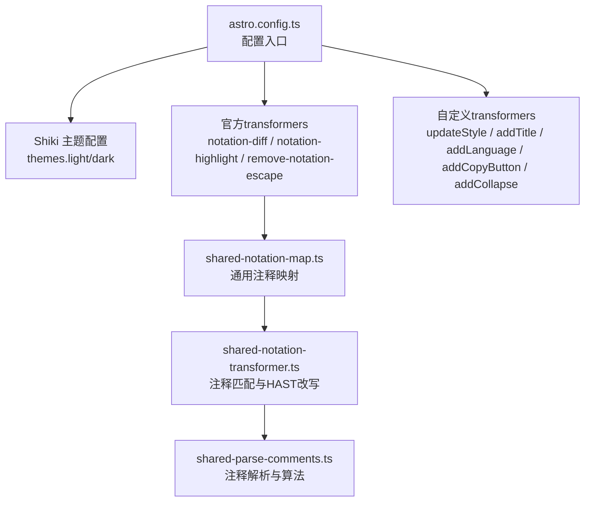
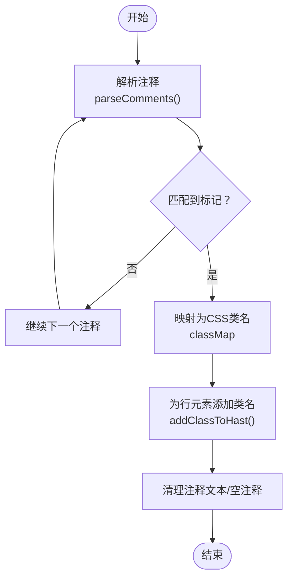
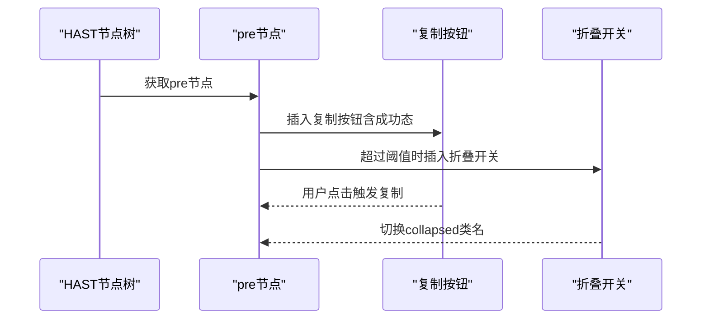
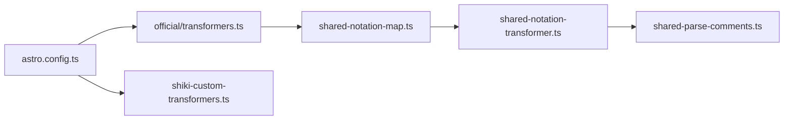

# 代码高亮插件

<cite>
**本文引用的文件**
- [astro.config.ts](file://astro.config.ts)
- [shiki-custom-transformers.ts](file://src/plugins/shiki-custom-transformers.ts)
- [transformers.ts](file://src/plugins/shiki-official/transformers.ts)
- [shared-notation-transformer.ts](file://src/plugins/shiki-official/shared-notation-transformer.ts)
- [shared-notation-map.ts](file://src/plugins/shiki-official/shared-notation-map.ts)
- [shared-parse-comments.ts](file://src/plugins/shiki-official/shared-parse-comments.ts)
- [global.css](file://src/assets/styles/global.css)
- [uno.config.ts](file://uno.config.ts)
- [2025-09-20-五分钟快速部署：用 Docker 和 Docker Compose 部署 FastAPI 应用.md](file://src/content/blog/2025-09-20-五分钟快速部署：用 Docker 和 Docker Compose 部署 FastAPI 应用.md)
</cite>

## 目录
1. [简介](#简介)
2. [项目结构](#项目结构)
3. [核心组件](#核心组件)
4. [架构总览](#架构总览)
5. [组件详解](#组件详解)
6. [依赖关系分析](#依赖关系分析)
7. [性能考量](#性能考量)
8. [故障排除指南](#故障排除指南)
9. [结论](#结论)
10. [附录](#附录)

## 简介
本文件面向Astro主题Pure的代码高亮插件体系，系统化阐述Shiki引擎在Astro中的集成与配置，覆盖官方transformers的使用、自定义transformers的实现原理（代码块包装、标题添加、语言标签、复制按钮、折叠功能）、共享注释解析与映射机制（shared-notation-map与shared-notation-transformer），以及性能优化策略（缓存与懒加载思路）。文末提供扩展开发指南、与主题系统的集成与兼容性处理、实际配置示例与故障排除建议。

## 项目结构
Astro配置集中于根部配置文件，将Shiki主题与transformers注入Markdown渲染流程；官方transformers与自定义transformers分别位于独立模块，按职责分层组织。



图表来源
- [astro.config.ts](file://astro.config.ts#L68-L96)
- [transformers.ts](file://src/plugins/shiki-official/transformers.ts#L1-L122)
- [shared-notation-map.ts](file://src/plugins/shiki-official/shared-notation-map.ts#L1-L49)
- [shared-notation-transformer.ts](file://src/plugins/shiki-official/shared-notation-transformer.ts#L1-L127)
- [shared-parse-comments.ts](file://src/plugins/shiki-official/shared-parse-comments.ts#L1-L224)

章节来源
- [astro.config.ts](file://astro.config.ts#L68-L96)

## 核心组件
- Shiki主题配置：在Astro配置中设置light/dark主题，决定代码块配色风格。
- 官方transformers：
  - 差异高亮：通过特定注释标记对增删行进行视觉标注。
  - 行高亮：对指定行添加高亮类名。
  - 注释转义移除：将转义的注释标记还原为真实输出。
- 自定义transformers：
  - 样式包裹：将原生pre容器升级为div并嵌套pre，便于外层布局控制。
  - 标题展示：从代码块元信息读取title并插入标题区域。
  - 语言标签：在代码块尾部追加语言标识。
  - 复制按钮：注入复制到剪贴板的交互按钮与成功态反馈。
  - 折叠功能：超过阈值行数自动折叠，点击展开/收起。

章节来源
- [astro.config.ts](file://astro.config.ts#L68-L96)
- [transformers.ts](file://src/plugins/shiki-official/transformers.ts#L1-L122)
- [shiki-custom-transformers.ts](file://src/plugins/shiki-custom-transformers.ts#L1-L153)

## 架构总览
下图展示从Markdown到最终HTML的代码高亮处理链路，包括Shiki主题选择、官方与自定义transformers的执行顺序，以及样式与主题系统的衔接。

```mermaid
sequenceDiagram
participant MD as "Markdown源码"
participant ASTRO as "Astro配置<br/>astro.config.ts"
participant SHIKI as "Shiki引擎"
participant OFF as "官方transformers"
participant CUS as "自定义transformers"
participant THEME as "主题与样式"
MD->>ASTRO : 提交Markdown内容
ASTRO->>SHIKI : 加载themes与shikiConfig
SHIKI->>OFF : 应用官方transformers
OFF-->>SHIKI : 返回HAST含差异/高亮
SHIKI->>CUS : 应用自定义transformers
CUS-->>SHIKI : 返回HAST标题/语言/复制/折叠
SHIKI-->>THEME : 输出HTML + CSS类名
THEME-->>MD : 渲染为最终页面
```

图表来源
- [astro.config.ts](file://astro.config.ts#L68-L96)
- [transformers.ts](file://src/plugins/shiki-official/transformers.ts#L1-L122)
- [shiki-custom-transformers.ts](file://src/plugins/shiki-custom-transformers.ts#L1-L153)
- [global.css](file://src/assets/styles/global.css#L192-L218)

## 组件详解

### 官方transformers：差异与高亮
- 功能要点
  - 差异高亮：使用特定注释标记对新增/删除行进行标注，并在根节点添加“存在差异”的类名。
  - 行高亮：对目标行添加高亮类名，并在根节点添加“存在高亮”的类名。
  - 注释转义移除：将形如“[\!code”还原为“[!code”，避免输出转义文本。
- 实现机制
  - 通过共享的注释解析器识别行内注释标记，再由映射器将匹配到的标记映射为对应的CSS类名，最后在HAST上添加类名或移除注释文本。
- 可配置项
  - 差异高亮：新增/删除行类名、根节点活跃类名等。
  - 行高亮：高亮行类名、根节点活跃类名等。
  - 匹配算法：v1/v3两种匹配策略，影响注释位置与多token场景的处理。



图表来源
- [shared-parse-comments.ts](file://src/plugins/shiki-official/shared-parse-comments.ts#L35-L155)
- [shared-notation-transformer.ts](file://src/plugins/shiki-official/shared-notation-transformer.ts#L20-L127)
- [shared-notation-map.ts](file://src/plugins/shiki-official/shared-notation-map.ts#L23-L49)

章节来源
- [transformers.ts](file://src/plugins/shiki-official/transformers.ts#L1-L122)
- [shared-notation-transformer.ts](file://src/plugins/shiki-official/shared-notation-transformer.ts#L1-L127)
- [shared-parse-comments.ts](file://src/plugins/shiki-official/shared-parse-comments.ts#L1-L224)

### 自定义transformers：增强UI与交互
- 样式包裹（updateStyle）
  - 将原生pre容器升级为div并嵌套pre，便于外层布局控制与主题适配。
- 标题添加（addTitle）
  - 从代码块元信息中解析title参数，插入顶部标题区域。
- 语言标签（addLanguage）
  - 在代码块尾部追加语言标识，提升可读性。
- 复制按钮（addCopyButton）
  - 注入复制到剪贴板的按钮，支持成功态反馈与超时恢复。
- 折叠功能（addCollapse）
  - 当代码行数超过阈值时自动折叠，点击切换展开/收起状态。



图表来源
- [shiki-custom-transformers.ts](file://src/plugins/shiki-custom-transformers.ts#L88-L152)

章节来源
- [shiki-custom-transformers.ts](file://src/plugins/shiki-custom-transformers.ts#L1-L153)

### 注释解析与匹配算法
- 解析策略
  - 支持多种注释格式（行注释、块注释、多token注释等），并区分JSX场景下的注释位置。
  - v1与v3两种匹配算法：v1更保守，v3对多token注释进行拆分与合并处理，提升兼容性。
- 关键点
  - 对注释前缀/后缀进行空格裁剪，避免误匹配。
  - 处理多token注释（如某些主题将“//”与“[!code”拆分为不同token）时，回溯合并以正确识别完整注释。
  - v1/v3在注释末尾空前缀清理上采用不同策略，保证输出整洁。

章节来源
- [shared-parse-comments.ts](file://src/plugins/shiki-official/shared-parse-comments.ts#L16-L224)

### 与主题系统的集成与兼容性
- 主题配置
  - 在Astro配置中设置light/dark主题，确保代码块在不同模式下具有一致的可读性与对比度。
- 样式衔接
  - 全局样式中针对高亮与差异类名提供默认背景与伪元素标记，保证视觉一致性。
  - UnoCSS主题变量与颜色体系与代码块颜色搭配协调，避免冲突。
- 兼容性
  - 官方transformers与自定义transformers均基于HAST节点树操作，遵循统一的生命周期钩子，避免与Markdown渲染流程产生冲突。

章节来源
- [astro.config.ts](file://astro.config.ts#L68-L96)
- [global.css](file://src/assets/styles/global.css#L192-L218)
- [uno.config.ts](file://uno.config.ts#L14-L64)

## 依赖关系分析
- 模块耦合
  - 官方transformers依赖共享注释解析与匹配器；自定义transformers独立于Shiki类型系统，仅依赖HAST与上下文信息。
- 导入关系
  - astro.config.ts集中导入并注册所有transformers，形成稳定的执行序列。
- 循环依赖
  - 各模块职责清晰，未见循环依赖迹象。



图表来源
- [astro.config.ts](file://astro.config.ts#L11-L22)
- [transformers.ts](file://src/plugins/shiki-official/transformers.ts#L1-L122)
- [shared-notation-map.ts](file://src/plugins/shiki-official/shared-notation-map.ts#L1-L49)
- [shared-notation-transformer.ts](file://src/plugins/shiki-official/shared-notation-transformer.ts#L1-L127)
- [shared-parse-comments.ts](file://src/plugins/shiki-official/shared-parse-comments.ts#L1-L224)
- [shiki-custom-transformers.ts](file://src/plugins/shiki-custom-transformers.ts#L1-L153)

章节来源
- [astro.config.ts](file://astro.config.ts#L11-L22)

## 性能考量
- 缓存机制
  - 在构建阶段，官方transformers与自定义transformers均对HAST进行就地修改，避免重复计算。注释解析结果在单个代码块范围内缓存，减少重复解析成本。
- 懒加载建议
  - 对于大型代码块，可结合自定义transformers的折叠能力，仅在用户交互时展开，降低首屏渲染压力。
  - 复制按钮的交互逻辑在客户端执行，避免额外网络请求。
- 体积与加载
  - 通过主题精简与样式按需引入，减少CSS体积；将transformers执行前置在构建期，避免运行时开销。

[本节为通用性能指导，不直接分析具体文件]

## 故障排除指南
- 注释标记未生效
  - 检查是否启用了注释转义移除transformer，确认注释格式符合解析器预期。
  - 若使用v1算法，注意注释必须位于行尾；v3算法对多token注释更友好。
- 差异/高亮类名无效
  - 确认全局样式中已为目标类名提供背景与伪元素标记。
  - 检查Astro配置中是否正确注册官方transformers。
- 复制按钮无响应
  - 确认浏览器允许剪贴板API；检查按钮事件绑定与类名是否被主题覆盖。
- 折叠功能不触发
  - 确认行数阈值设置合理；检查容器类名与折叠开关的交互逻辑是否被样式覆盖。

章节来源
- [shared-parse-comments.ts](file://src/plugins/shiki-official/shared-parse-comments.ts#L16-L224)
- [transformers.ts](file://src/plugins/shiki-official/transformers.ts#L97-L122)
- [global.css](file://src/assets/styles/global.css#L192-L218)
- [shiki-custom-transformers.ts](file://src/plugins/shiki-custom-transformers.ts#L88-L152)

## 结论
该代码高亮插件体系以Shiki为核心，通过官方transformers实现差异与高亮标注，辅以自定义transformers完善UI与交互体验。共享注释解析与映射机制保证了跨语言、跨主题的一致性与可扩展性。配合主题系统与样式规范，既满足可用性需求，又兼顾性能与可维护性。

[本节为总结性内容，不直接分析具体文件]

## 附录

### 实际配置示例
- 在Astro配置中启用Shiki主题与transformers，参考如下片段路径：
  - [Shiki主题与transformers配置](file://astro.config.ts#L68-L96)
- 示例Markdown中使用代码块与元信息（如标题），参考：
  - [示例Markdown（含代码块）](file://src/content/blog/2025-09-20-五分钟快速部署：用 Docker 和 Docker Compose 部署 FastAPI 应用.md#L17-L50)

### 扩展开发指南
- 新增官方transformers
  - 基于共享注释映射器扩展新的标记语义，复用现有匹配与清理逻辑。
  - 参考：[共享注释映射器](file://src/plugins/shiki-official/shared-notation-map.ts#L23-L49)、[注释匹配器](file://src/plugins/shiki-official/shared-notation-transformer.ts#L20-L127)
- 新增自定义transformers
  - 在pre钩子中对HAST进行节点插入与属性变更，保持与主题类名一致。
  - 参考：[自定义transformers集合](file://src/plugins/shiki-custom-transformers.ts#L1-L153)
- 自定义样式
  - 在全局样式中为新增类名提供视觉表现，确保与主题变量协同。
  - 参考：[全局样式（高亮/差异）](file://src/assets/styles/global.css#L192-L218)、[UnoCSS主题变量](file://uno.config.ts#L127-L143)