# 插件系统

<cite>
**本文引用的文件**
- [packages/pure/index.ts](file://packages/pure/index.ts)
- [packages/pure/plugins/remark-plugins.ts](file://packages/pure/plugins/remark-plugins.ts)
- [packages/pure/plugins/rehype-external-links.ts](file://packages/pure/plugins/rehype-external-links.ts)
- [packages/pure/plugins/rehype-table.ts](file://packages/pure/plugins/rehype-table.ts)
- [packages/pure/plugins/rehype-steps.ts](file://packages/pure/plugins/rehype-steps.ts)
- [packages/pure/plugins/rehype-tabs.ts](file://packages/pure/plugins/rehype-tabs.ts)
- [packages/pure/plugins/toc.ts](file://packages/pure/plugins/toc.ts)
- [packages/pure/plugins/link-preview.ts](file://packages/pure/plugins/link-preview.ts)
- [packages/pure/plugins/override-svg-attributes.ts](file://packages/pure/plugins/override-svg-attributes.ts)
- [packages/pure/plugins/virtual-user-config.ts](file://packages/pure/plugins/virtual-user-config.ts)
- [src/plugins/rehype-auto-link-headings.ts](file://src/plugins/rehype-auto-link-headings.ts)
- [src/plugins/shiki-official/transformers.ts](file://src/plugins/shiki-official/transformers.ts)
- [src/plugins/shiki-custom-transformers.ts](file://src/plugins/shiki-custom-transformers.ts)
</cite>

## 目录
1. [简介](#简介)
2. [项目结构](#项目结构)
3. [核心组件](#核心组件)
4. [架构总览](#架构总览)
5. [详细组件分析](#详细组件分析)
6. [依赖关系分析](#依赖关系分析)
7. [性能考量](#性能考量)
8. [故障排查指南](#故障排查指南)
9. [结论](#结论)
10. [附录](#附录)

## 简介
本文件面向Astro主题Pure的插件系统，系统性梳理Markdown处理（Remark）与HTML处理（Rehype）插件的实现原理、配置方式与扩展开发方法；同时覆盖代码高亮（Shiki）的集成与自定义transformer开发、自动链接标题（自动锚点）插件的实现思路、插件注册与生命周期管理、错误处理策略、性能优化与缓存策略，并提供最佳实践与维护升级建议。

## 项目结构
Pure主题的插件体系由“主题集成入口”和“各类插件实现”组成：
- 主题集成入口负责在Astro生命周期中注册Remark/Rehype插件、注入Vite虚拟模块、以及按需启用其他集成（如sitemap、MDX、UnoCSS等）。
- 插件实现分布在pure包内（主题内建插件）与src/plugins（站点侧插件/官方transformers示例）两类目录下。

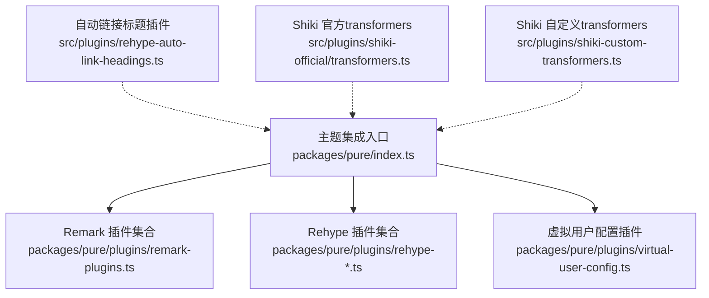

图表来源
- [packages/pure/index.ts](file://packages/pure/index.ts#L19-L96)
- [packages/pure/plugins/remark-plugins.ts](file://packages/pure/plugins/remark-plugins.ts#L1-L29)
- [packages/pure/plugins/rehype-external-links.ts](file://packages/pure/plugins/rehype-external-links.ts#L1-L75)
- [packages/pure/plugins/rehype-table.ts](file://packages/pure/plugins/rehype-table.ts#L1-L38)
- [packages/pure/plugins/rehype-steps.ts](file://packages/pure/plugins/rehype-steps.ts#L1-L83)
- [packages/pure/plugins/rehype-tabs.ts](file://packages/pure/plugins/rehype-tabs.ts#L1-L113)
- [packages/pure/plugins/virtual-user-config.ts](file://packages/pure/plugins/virtual-user-config.ts#L1-L100)
- [src/plugins/rehype-auto-link-headings.ts](file://src/plugins/rehype-auto-link-headings.ts#L1-L43)
- [src/plugins/shiki-official/transformers.ts](file://src/plugins/shiki-official/transformers.ts#L1-L123)
- [src/plugins/shiki-custom-transformers.ts](file://src/plugins/shiki-custom-transformers.ts#L1-L153)

章节来源
- [packages/pure/index.ts](file://packages/pure/index.ts#L19-L96)

## 核心组件
- 主题集成入口：在Astro配置设置阶段解析用户配置、注册Remark/Rehype插件、注入Vite虚拟模块、按需启用sitemap/MDX/UnoCSS等集成，并在构建完成后可选触发Pagefind索引。
- Remark插件：提供图片添加可缩放类名、计算阅读时长并写入frontmatter等能力。
- Rehype插件：提供外链rel/target增强、表格溢出滚动容器包裹、步骤组件校验与样式注入、标签页组件数据提取与属性转换等。
- 自动链接标题插件：为带id的标题元素自动插入锚点链接，支持前置/追加/包裹三种行为。
- Shiki transformert：提供官方transformers（高亮/差异/去转义）与自定义transformers（标题/语言标签/复制按钮/折叠）。
- 虚拟用户配置插件：通过Vite虚拟模块暴露用户配置与项目上下文，供运行时消费。

章节来源
- [packages/pure/index.ts](file://packages/pure/index.ts#L19-L96)
- [packages/pure/plugins/remark-plugins.ts](file://packages/pure/plugins/remark-plugins.ts#L1-L29)
- [packages/pure/plugins/rehype-external-links.ts](file://packages/pure/plugins/rehype-external-links.ts#L1-L75)
- [packages/pure/plugins/rehype-table.ts](file://packages/pure/plugins/rehype-table.ts#L1-L38)
- [packages/pure/plugins/rehype-steps.ts](file://packages/pure/plugins/rehype-steps.ts#L1-L83)
- [packages/pure/plugins/rehype-tabs.ts](file://packages/pure/plugins/rehype-tabs.ts#L1-L113)
- [src/plugins/rehype-auto-link-headings.ts](file://src/plugins/rehype-auto-link-headings.ts#L1-L43)
- [src/plugins/shiki-official/transformers.ts](file://src/plugins/shiki-official/transformers.ts#L1-L123)
- [src/plugins/shiki-custom-transformers.ts](file://src/plugins/shiki-custom-transformers.ts#L1-L153)
- [packages/pure/plugins/virtual-user-config.ts](file://packages/pure/plugins/virtual-user-config.ts#L1-L100)

## 架构总览
主题以Astro Integration形式接入，统一在配置阶段完成插件注册与全局配置更新；Markdown渲染阶段由Remark/Rehype流水线处理；Shiki在代码高亮环节通过transformers进行二次加工；站点侧插件（如自动链接标题）与官方transformers示例作为补充。

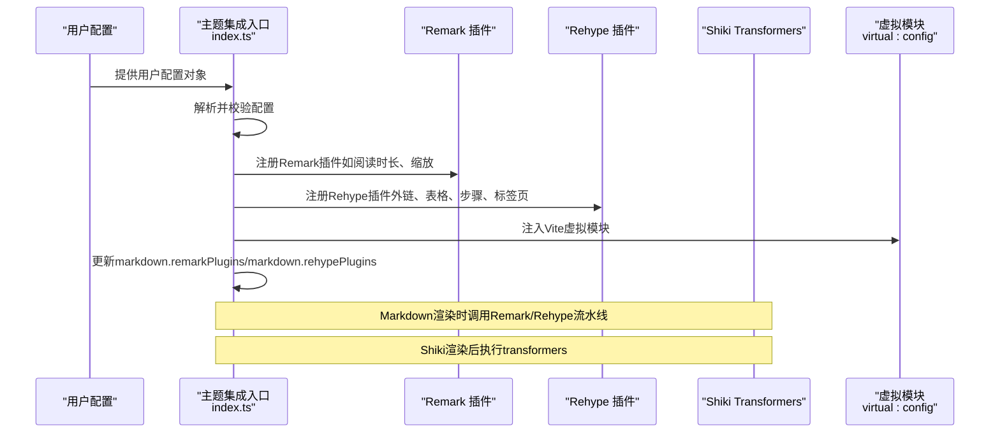

图表来源
- [packages/pure/index.ts](file://packages/pure/index.ts#L32-L96)
- [packages/pure/plugins/remark-plugins.ts](file://packages/pure/plugins/remark-plugins.ts#L1-L29)
- [packages/pure/plugins/rehype-external-links.ts](file://packages/pure/plugins/rehype-external-links.ts#L1-L75)
- [packages/pure/plugins/rehype-table.ts](file://packages/pure/plugins/rehype-table.ts#L1-L38)
- [packages/pure/plugins/rehype-steps.ts](file://packages/pure/plugins/rehype-steps.ts#L1-L83)
- [packages/pure/plugins/rehype-tabs.ts](file://packages/pure/plugins/rehype-tabs.ts#L1-L113)
- [src/plugins/shiki-official/transformers.ts](file://src/plugins/shiki-official/transformers.ts#L1-L123)
- [src/plugins/shiki-custom-transformers.ts](file://src/plugins/shiki-custom-transformers.ts#L1-L153)
- [packages/pure/plugins/virtual-user-config.ts](file://packages/pure/plugins/virtual-user-config.ts#L61-L79)

## 详细组件分析

### Remark插件：图片缩放与阅读时长
- 图片缩放：遍历AST中的image节点，为每个节点附加hProperties（如class），便于后续样式或交互处理。
- 阅读时长：将整篇内容转为字符串，计算分钟数与字数，写入frontmatter，供页面展示使用。

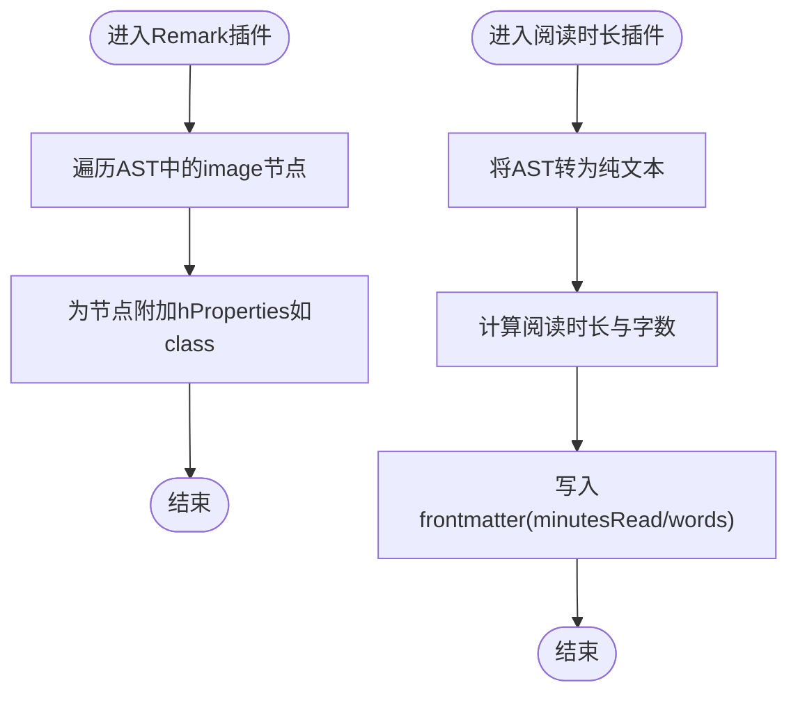

图表来源
- [packages/pure/plugins/remark-plugins.ts](file://packages/pure/plugins/remark-plugins.ts#L9-L15)
- [packages/pure/plugins/remark-plugins.ts](file://packages/pure/plugins/remark-plugins.ts#L17-L29)

章节来源
- [packages/pure/plugins/remark-plugins.ts](file://packages/pure/plugins/remark-plugins.ts#L1-L29)

### Rehype插件：外链增强、表格滚动、步骤与标签页
- 外链增强：识别绝对URL与协议相对链接，为a元素添加rel、target等属性，并可选追加提示图标。
- 表格滚动：定位直接位于#content下的table，将其包裹到一个具备滚动类的div中，避免横向滚动破坏布局。
- 步骤组件：校验传入HTML仅包含一个ol根元素，为其添加role、className与起始序号的CSS变量，确保无障碍与样式一致性。
- 标签页组件：扫描自定义标签starlight-tab-item，转换为div并注入panel/tab ID、ARIA属性与隐藏逻辑，同时记录面板元数据。

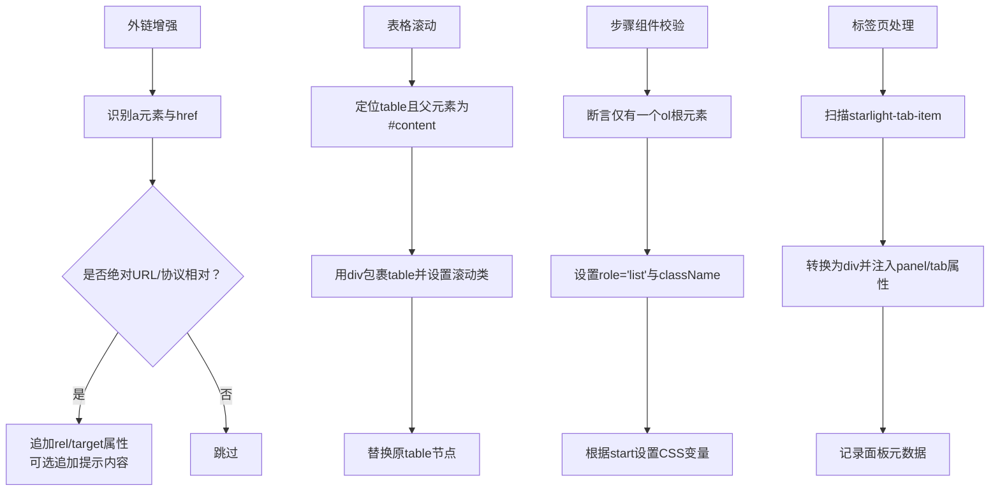

图表来源
- [packages/pure/plugins/rehype-external-links.ts](file://packages/pure/plugins/rehype-external-links.ts#L37-L75)
- [packages/pure/plugins/rehype-table.ts](file://packages/pure/plugins/rehype-table.ts#L8-L35)
- [packages/pure/plugins/rehype-steps.ts](file://packages/pure/plugins/rehype-steps.ts#L13-L62)
- [packages/pure/plugins/rehype-tabs.ts](file://packages/pure/plugins/rehype-tabs.ts#L51-L97)

章节来源
- [packages/pure/plugins/rehype-external-links.ts](file://packages/pure/plugins/rehype-external-links.ts#L1-L75)
- [packages/pure/plugins/rehype-table.ts](file://packages/pure/plugins/rehype-table.ts#L1-L38)
- [packages/pure/plugins/rehype-steps.ts](file://packages/pure/plugins/rehype-steps.ts#L1-L83)
- [packages/pure/plugins/rehype-tabs.ts](file://packages/pure/plugins/rehype-tabs.ts#L1-L113)

### 自动链接标题插件：标题锚点与导航增强
- 功能：对带有id的h1-h6元素，自动在其子节点中插入指向该id的锚点链接，支持prepend/wrap/append三种行为。
- 错误处理：当行为参数非法时抛出错误，保证配置正确性。
- 可扩展：content支持传入任意HAST节点或文本，满足不同视觉需求。

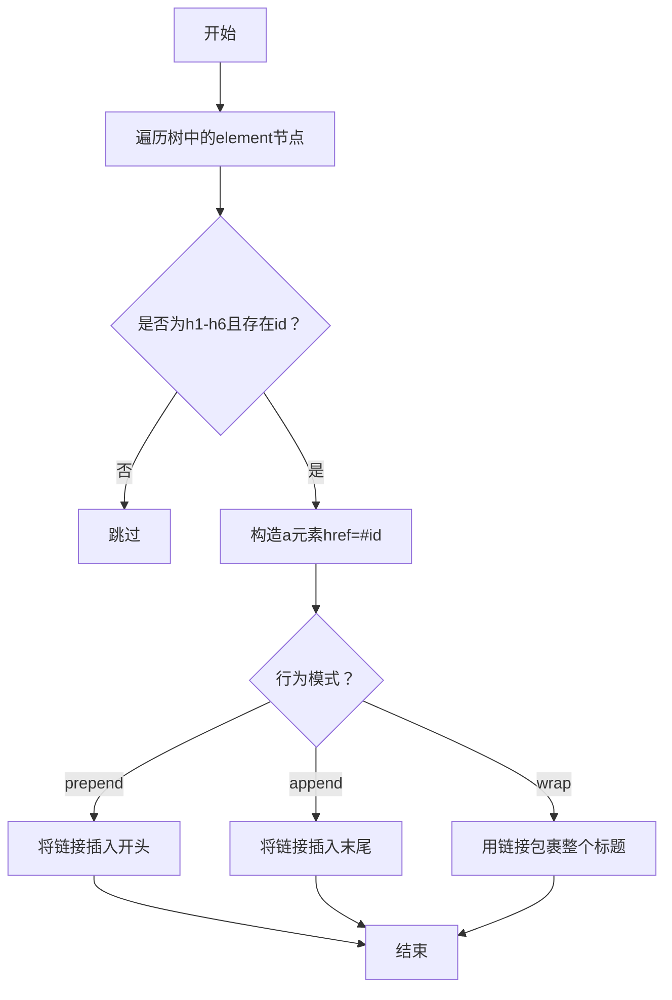

图表来源
- [src/plugins/rehype-auto-link-headings.ts](file://src/plugins/rehype-auto-link-headings.ts#L7-L42)

章节来源
- [src/plugins/rehype-auto-link-headings.ts](file://src/plugins/rehype-auto-link-headings.ts#L1-L43)

### 代码高亮与Shiki集成：transformers开发
- 官方transformers：提供高亮行、差异行、去除转义等能力，通过class映射与匹配算法实现。
- 自定义transformers：支持为代码块增加标题/语言标签、复制按钮、折叠开关等交互；解析meta字符串以支持title等参数。
- 使用建议：优先复用官方transformers，必要时在官方基础上组合自定义transformers，保持可维护性。

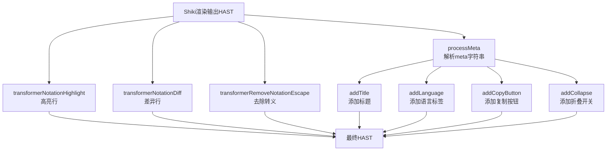

图表来源
- [src/plugins/shiki-official/transformers.ts](file://src/plugins/shiki-official/transformers.ts#L10-L53)
- [src/plugins/shiki-official/transformers.ts](file://src/plugins/shiki-official/transformers.ts#L74-L95)
- [src/plugins/shiki-official/transformers.ts](file://src/plugins/shiki-official/transformers.ts#L104-L122)
- [src/plugins/shiki-custom-transformers.ts](file://src/plugins/shiki-custom-transformers.ts#L33-L44)
- [src/plugins/shiki-custom-transformers.ts](file://src/plugins/shiki-custom-transformers.ts#L47-L70)
- [src/plugins/shiki-custom-transformers.ts](file://src/plugins/shiki-custom-transformers.ts#L73-L85)
- [src/plugins/shiki-custom-transformers.ts](file://src/plugins/shiki-custom-transformers.ts#L88-L121)
- [src/plugins/shiki-custom-transformers.ts](file://src/plugins/shiki-custom-transformers.ts#L124-L152)

章节来源
- [src/plugins/shiki-official/transformers.ts](file://src/plugins/shiki-official/transformers.ts#L1-L123)
- [src/plugins/shiki-custom-transformers.ts](file://src/plugins/shiki-custom-transformers.ts#L1-L153)

### 目录生成（TOC）：标题层级树构建
- 输入：MarkdownHeading数组（含depth/slug/text）。
- 算法：使用栈维护当前路径，逐项比较深度决定父子关系，最终返回根目录下的子标题列表。

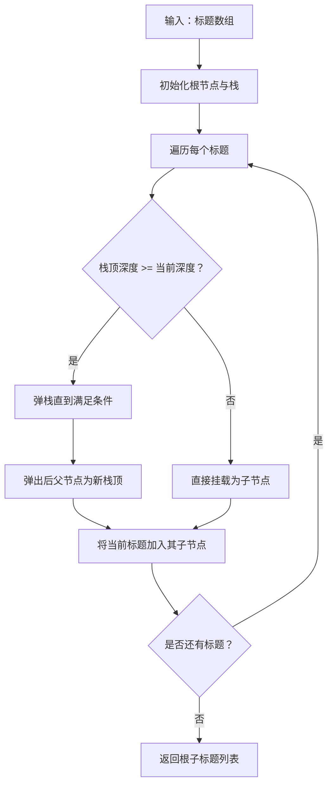

图表来源
- [packages/pure/plugins/toc.ts](file://packages/pure/plugins/toc.ts#L7-L24)

章节来源
- [packages/pure/plugins/toc.ts](file://packages/pure/plugins/toc.ts#L1-L25)

### 链接预览：安全获取与OG元数据解析
- 安全获取：封装fetch，捕获异常并记录错误日志，支持HTML与JSON两种解析器。
- 缓存策略：基于LRU的轻量缓存，避免重复请求。
- OG解析：从meta属性与title/link等位置抽取标题、描述、图像、视频等信息，并做URL合法性过滤。

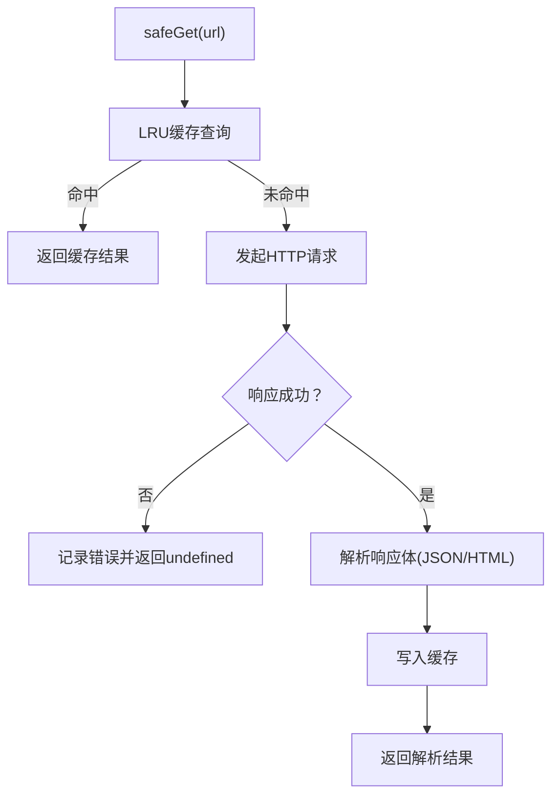

图表来源
- [packages/pure/plugins/link-preview.ts](file://packages/pure/plugins/link-preview.ts#L46-L68)
- [packages/pure/plugins/link-preview.ts](file://packages/pure/plugins/link-preview.ts#L79-L108)

章节来源
- [packages/pure/plugins/link-preview.ts](file://packages/pure/plugins/link-preview.ts#L1-L111)

### SVG属性覆盖：安全解析与属性合并
- 输入校验：要求非空且必须以<svg开头，否则抛错。
- 解析与合并：解析HTML为AST，定位首个svg节点，合并用户提供的属性并渲染回字符串。

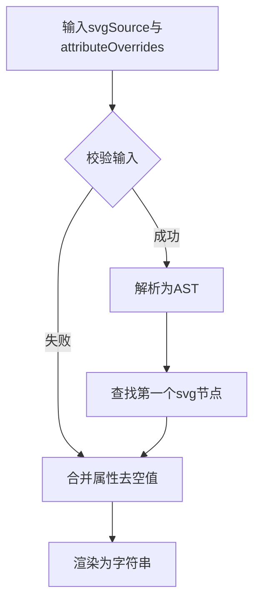

图表来源
- [packages/pure/plugins/override-svg-attributes.ts](file://packages/pure/plugins/override-svg-attributes.ts#L13-L41)

章节来源
- [packages/pure/plugins/override-svg-attributes.ts](file://packages/pure/plugins/override-svg-attributes.ts#L1-L42)

### 虚拟用户配置：Vite虚拟模块注入
- 暴露内容：将用户配置、项目上下文、自定义CSS导入、集合配置等以虚拟模块形式注入，供运行时使用。
- 解析与加载：通过resolveId/load钩子将虚拟模块名映射到`\0`前缀ID并返回对应代码字符串。

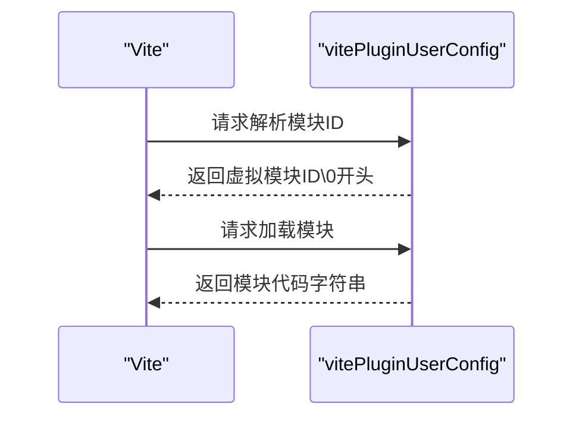

图表来源
- [packages/pure/plugins/virtual-user-config.ts](file://packages/pure/plugins/virtual-user-config.ts#L89-L99)
- [packages/pure/plugins/virtual-user-config.ts](file://packages/pure/plugins/virtual-user-config.ts#L61-L79)

章节来源
- [packages/pure/plugins/virtual-user-config.ts](file://packages/pure/plugins/virtual-user-config.ts#L1-L100)

## 依赖关系分析
- 主题集成入口依赖各插件模块，并在Astro生命周期中集中注册；Remark/Rehype插件之间无强耦合，遵循统一的unified/Rehype处理模型。
- Shiki transformerts与Remark/Rehype处于同一渲染管线的不同阶段，彼此独立但可组合。
- 虚拟模块为运行时提供配置与上下文，不参与构建期渲染，但影响运行时行为。

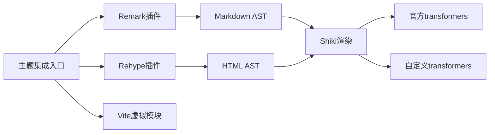

图表来源
- [packages/pure/index.ts](file://packages/pure/index.ts#L52-L67)
- [src/plugins/shiki-official/transformers.ts](file://src/plugins/shiki-official/transformers.ts#L1-L123)
- [src/plugins/shiki-custom-transformers.ts](file://src/plugins/shiki-custom-transformers.ts#L1-L153)
- [packages/pure/plugins/virtual-user-config.ts](file://packages/pure/plugins/virtual-user-config.ts#L61-L79)

章节来源
- [packages/pure/index.ts](file://packages/pure/index.ts#L19-L96)

## 性能考量
- 插件注册顺序：主题在Astro配置阶段集中注册，避免重复扫描与多次解析。
- 缓存策略：链接预览采用LRU缓存，减少重复网络请求；建议在自定义transformers中也考虑对昂贵操作（如远程资源解析）做缓存。
- 渲染路径：尽量在Remark/Rehype阶段完成结构化处理，减少运行时DOM操作；代码块交互（复制/折叠）建议在客户端完成，避免服务端渲染负担。
- 构建优化：按需启用sitemap/MDX/UnoCSS等集成，避免不必要的打包体积与编译时间。

## 故障排查指南
- 配置校验错误：主题集成入口对用户配置进行Schema校验，若格式不合法会抛出AstroError，检查配置对象结构与字段类型。
- 外链增强异常：确认协议列表与URL合法性；若出现target缺失导致可访问性问题，可在contentProperties中补充提示。
- 表格滚动无效：检查目标表格是否直接位于#content下，且未被其他包装层干扰。
- 步骤组件报错：确保传入HTML仅包含一个ol根元素，且ol具有正确的role与样式类。
- 标签页组件报错：确认starlight-tab-item标签使用了dataLabel属性，且未混用其他标签。
- 自动链接标题行为错误：检查behavior参数是否为prepend/wrap/append之一。
- Shiki transformers冲突：多个transformers可能对同一节点进行修改，建议按需启用并测试组合效果。
- 链接预览失败：查看控制台错误日志，确认URL可达性与OG元数据完整性；必要时调整缓存大小或禁用缓存以排除缓存污染。

章节来源
- [packages/pure/index.ts](file://packages/pure/index.ts#L20-L24)
- [packages/pure/plugins/rehype-steps.ts](file://packages/pure/plugins/rehype-steps.ts#L73-L82)
- [packages/pure/plugins/rehype-tabs.ts](file://packages/pure/plugins/rehype-tabs.ts#L51-L97)
- [src/plugins/rehype-auto-link-headings.ts](file://src/plugins/rehype-auto-link-headings.ts#L27-L29)
- [packages/pure/plugins/link-preview.ts](file://packages/pure/plugins/link-preview.ts#L63-L67)

## 结论
Pure主题的插件系统以Astro Integration为核心，围绕Remark/Rehype与Shiki构建了完整的Markdown与HTML处理链路。通过虚拟模块注入用户配置、按需注册插件、以及提供丰富的transformers，既满足了主题的通用需求，也为站点侧扩展提供了清晰的接口。建议在实际开发中遵循“最小可用原则”，优先使用官方transformers与内置插件，再按需扩展自定义能力，并重视缓存与错误处理，确保稳定与高性能。

## 附录
- 开发者指南
  - 插件注册：在主题集成入口的配置阶段集中注册Remark/Rehype插件，确保顺序与依赖正确。
  - 生命周期管理：利用Astro的配置与构建完成钩子，完成插件启用与后处理任务。
  - 错误处理：对用户输入与外部依赖（如网络请求）进行显式校验与容错，提供友好提示。
  - 性能优化：合理选择transformers组合，避免重复遍历与昂贵操作；对远程资源使用缓存。
  - 维护与升级：关注Astro/Remark/Rehype/Shiki版本变更，及时迁移API；保持插件职责单一，便于测试与演进。