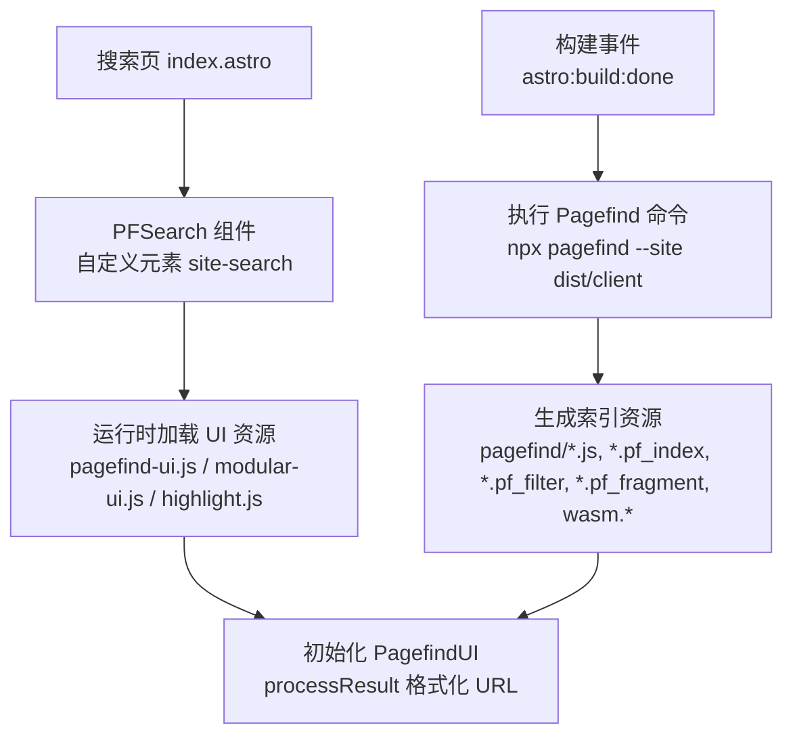
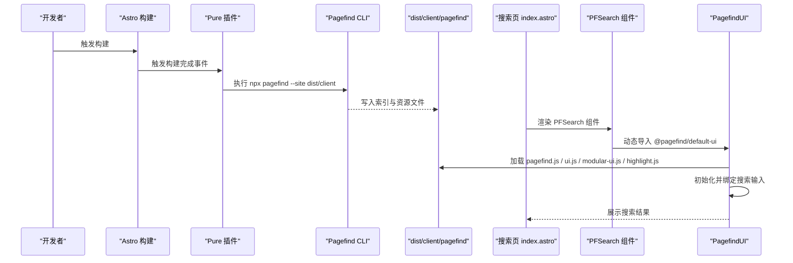
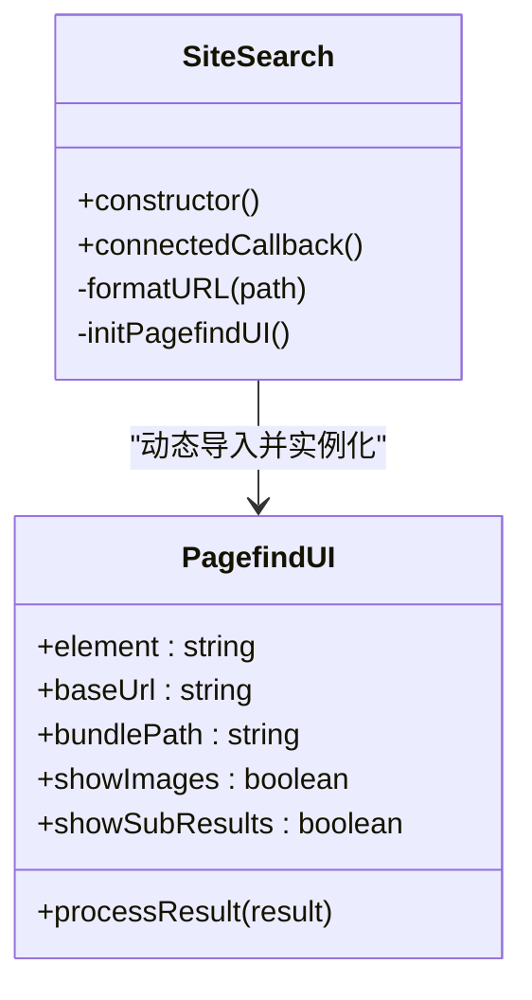

# 搜索功能

<cite>
**本文引用的文件**
- [packages/pure/components/pages/PFSearch.astro](file://packages/pure/components/pages/PFSearch.astro)
- [src/pages/search/index.astro](file://src/pages/search/index.astro)
- [packages/pure/index.ts](file://packages/pure/index.ts)
- [src/site.config.ts](file://src/site.config.ts)
- [packages/pure/types/integrations-config.ts](file://packages/pure/types/integrations-config.ts)
- [packages/pure/types/user-config.ts](file://packages/pure/types/user-config.ts)
- [dist/client/pagefind/pagefind-entry.json](file://dist/client/pagefind/pagefind-entry.json)
- [dist/client/pagefind/pagefind.js](file://dist/client/pagefind/pagefind.js)
- [dist/client/pagefind/pagefind-ui.js](file://dist/client/pagefind/pagefind-ui.js)
- [dist/client/pagefind/pagefind-modular-ui.js](file://dist/client/pagefind/pagefind-modular-ui.js)
- [dist/client/pagefind/pagefind-highlight.js](file://dist/client/pagefind/pagefind-highlight.js)
- [dist/client/pagefind/index/en-us_cfe0248.pf_index](file://dist/client/pagefind/index/en-us_cfe0248.pf_index)
- [dist/client/pagefind/filter/en-us_b96b26c.pf_filter](file://dist/client/pagefind/filter/en-us_b96b26c.pf_filter)
- [dist/client/pagefind/fragment/en-us_1876c7e.pf_fragment](file://dist/client/pagefind/fragment/en-us_1876c7e.pf_fragment)
- [dist/client/pagefind/wasm.en-us.pagefind](file://dist/client/pagefind/wasm.en-us.pagefind)
- [dist/client/pagefind/wasm.unknown.pagefind](file://dist/client/pagefind/wasm.unknown.pagefind)
- [package.json](file://package.json)
</cite>

## 目录
1. [简介](#简介)
2. [项目结构](#项目结构)
3. [核心组件](#核心组件)
4. [架构总览](#架构总览)
5. [详细组件分析](#详细组件分析)
6. [依赖关系分析](#依赖关系分析)
7. [性能考虑](#性能考虑)
8. [故障排除指南](#故障排除指南)
9. [结论](#结论)
10. [附录](#附录)

## 简介
本文件系统性阐述 Astro 主题 Pure 中 Pagefind 搜索功能的集成与实现，覆盖以下方面：
- Pagefind 的构建期索引生成与运行时加载机制
- PFSearch 组件的前端实现、界面设计与交互体验
- 搜索结果展示、排序与相关性评分的说明
- 实时搜索、搜索建议与搜索历史的前端实践要点
- 多语言搜索支持与本地化配置
- 性能优化（索引压缩、缓存策略）
- 调试与故障排除方法
- 扩展与定制方案

## 项目结构
搜索功能由“主题集成 + 页面渲染 + 构建期索引 + 运行时 UI”四部分组成：
- 主题层：通过 Pure 插件在构建完成后自动调用 Pagefind 生成索引，并在页面中注入默认 UI 样式与脚本。
- 页面层：在搜索页引入 PFSearch 组件，按配置决定是否启用搜索。
- 构建层：在 Astro 构建完成事件中执行 Pagefind 命令生成索引资源。
- 运行时层：浏览器端加载 Pagefind JS 与 UI 资源，初始化默认 UI 并进行搜索。

图表来源
- [packages/pure/index.ts](file://packages/pure/index.ts#L98-L110)
- [src/pages/search/index.astro](file://src/pages/search/index.astro#L1-L34)
- [packages/pure/components/pages/PFSearch.astro](file://packages/pure/components/pages/PFSearch.astro#L1-L70)

章节来源
- [packages/pure/index.ts](file://packages/pure/index.ts#L98-L110)
- [src/pages/search/index.astro](file://src/pages/search/index.astro#L1-L34)
- [packages/pure/components/pages/PFSearch.astro](file://packages/pure/components/pages/PFSearch.astro#L1-L70)

## 核心组件
- PFSearch 组件：封装 Pagefind 默认 UI，负责在生产模式下初始化搜索框、格式化结果 URL、注入样式变量。
- 搜索页 index.astro：根据站点配置决定是否显示搜索组件与提示文案。
- 主题插件：在构建完成后自动触发 Pagefind 索引生成，确保产物中包含 pagefind 资源。

章节来源
- [packages/pure/components/pages/PFSearch.astro](file://packages/pure/components/pages/PFSearch.astro#L1-L70)
- [src/pages/search/index.astro](file://src/pages/search/index.astro#L1-L34)
- [packages/pure/index.ts](file://packages/pure/index.ts#L98-L110)

## 架构总览
从构建到运行时的关键交互如下：

图表来源
- [packages/pure/index.ts](file://packages/pure/index.ts#L98-L110)
- [src/pages/search/index.astro](file://src/pages/search/index.astro#L1-L34)
- [packages/pure/components/pages/PFSearch.astro](file://packages/pure/components/pages/PFSearch.astro#L19-L53)

## 详细组件分析

### PFSearch 组件实现
- 自定义元素注册：组件以自定义元素形式注册，避免 SSR 与客户端不一致问题。
- 生产模式判断：开发模式下禁用搜索 UI，防止误触发。
- 运行时加载：使用 requestIdleCallback 在空闲时异步加载 Pagefind 默认 UI。
- 资源路径：通过 BASE_URL 计算 bundlePath，指向 /pagefind 目录。
- 结果处理：processResult 中统一格式化结果 URL，去除末尾斜杠与锚点影响，保证导航一致性。
- 样式变量：通过 CSS 变量映射主题色板，适配暗色/亮色模式。

图表来源
- [packages/pure/components/pages/PFSearch.astro](file://packages/pure/components/pages/PFSearch.astro#L19-L53)

章节来源
- [packages/pure/components/pages/PFSearch.astro](file://packages/pure/components/pages/PFSearch.astro#L1-L70)

### 搜索页集成
- 条件渲染：根据站点配置 integ.pagefind 控制是否渲染 PFSearch 组件。
- 提示文案：在启用时显示引导文本，帮助用户理解搜索入口。
- 返回按钮：提供返回博客列表的便捷导航。

章节来源
- [src/pages/search/index.astro](file://src/pages/search/index.astro#L1-L34)

### 构建期索引生成
- 触发时机：Astro 构建完成事件中执行。
- 执行命令：npx pagefind --site dist/client，扫描静态产物生成索引。
- 产物位置：dist/client/pagefind 下生成 pagefind.js、UI 脚本、索引文件、过滤器、片段与 WASM 文件。

章节来源
- [packages/pure/index.ts](file://packages/pure/index.ts#L98-L110)

### 运行时资源与初始化
- 资源清单：pagefind-entry.json 记录入口信息；pagefind.js 提供搜索能力；pagefind-ui.js 或 modular-ui.js 提供 UI；highlight.js 支持高亮。
- 索引与片段：index/en-us_*.pf_index 为主索引；filter/en-us_*.pf_filter 为过滤器；fragment/en-us_*.pf_fragment 为分片索引；wasm.* 为 WebAssembly 引擎。
- 初始化流程：组件在 DOMContentLoaded 后按需加载 UI，设置 baseUrl 与 bundlePath，绑定搜索行为。

章节来源
- [dist/client/pagefind/pagefind-entry.json](file://dist/client/pagefind/pagefind-entry.json)
- [dist/client/pagefind/pagefind.js](file://dist/client/pagefind/pagefind.js)
- [dist/client/pagefind/pagefind-ui.js](file://dist/client/pagefind/pagefind-ui.js)
- [dist/client/pagefind/pagefind-modular-ui.js](file://dist/client/pagefind/pagefind-modular-ui.js)
- [dist/client/pagefind/pagefind-highlight.js](file://dist/client/pagefind/pagefind-highlight.js)
- [dist/client/pagefind/index/en-us_cfe0248.pf_index](file://dist/client/pagefind/index/en-us_cfe0248.pf_index)
- [dist/client/pagefind/filter/en-us_b96b26c.pf_filter](file://dist/client/pagefind/filter/en-us_b96b26c.pf_filter)
- [dist/client/pagefind/fragment/en-us_1876c7e.pf_fragment](file://dist/client/pagefind/fragment/en-us_1876c7e.pf_fragment)
- [dist/client/pagefind/wasm.en-us.pagefind](file://dist/client/pagefind/wasm.en-us.pagefind)
- [dist/client/pagefind/wasm.unknown.pagefind](file://dist/client/pagefind/wasm.unknown.pagefind)

## 依赖关系分析
- Pagefind 版本：主题依赖 @pagefind/default-ui 与 @pagefind/darwin-x64 等平台二进制，确保构建与运行时可用。
- 构建脚本：通过 package.json 的构建脚本触发 astro build，随后 Pure 插件执行 Pagefind。
- 配置约束：用户配置中 pagefind 与 prerender 存在互斥校验，prerender 关闭时禁止启用 Pagefind。

图表来源
- [package.json](file://package.json#L8-L22)
- [packages/pure/index.ts](file://packages/pure/index.ts#L98-L110)

章节来源
- [package.json](file://package.json#L1-L45)
- [packages/pure/types/user-config.ts](file://packages/pure/types/user-config.ts#L15-L23)
- [packages/pure/types/integrations-config.ts](file://packages/pure/types/integrations-config.ts#L9-L14)

## 性能考虑
- 索引生成与压缩
  - 使用 Pagefind 的分片索引（fragment）与过滤器（filter），减少单次加载体积，提升冷启动性能。
  - 通过 WASM 引擎加速搜索解析，降低主线程阻塞。
- 资源加载策略
  - 将 UI 资源与 pagefind.js 分离，按需懒加载，避免阻塞首屏。
  - 使用请求空闲回调延迟初始化 UI，减少对用户交互的影响。
- 结果处理与导航
  - 在 processResult 中统一格式化 URL，避免重复解析与跳转抖动。
- 缓存策略
  - 利用浏览器缓存 pagefind 资源与索引文件；在 CDN 上开启合适的缓存头可进一步提升命中率。
- 多语言与本地化
  - Pagefind 会为不同语言生成独立索引与资源（如 en-us_*），确保跨语言场景下的搜索质量与性能。
- 排序与相关性
  - Pagefind 默认基于词频、字段权重等进行排序；可通过过滤器与元数据增强相关性（见扩展建议）。

## 故障排除指南
- 搜索页无结果或空白
  - 确认构建已完成且生成了 pagefind 资源目录与索引文件。
  - 检查 BASE_URL 与 bundlePath 是否正确拼接，避免 404。
  - 开发模式下组件会禁用搜索 UI，需在生产模式预览验证。
- 构建失败或 Pagefind 未执行
  - 检查构建脚本是否正常执行；确认 Pure 插件已启用 pagefind。
  - 确保 dist/client 目录存在且可写。
- UI 样式异常
  - 确认已引入默认 UI 样式；检查 CSS 变量映射是否生效。
- 多语言搜索不生效
  - 确认站点语言配置与 Pagefind 生成的语言资源匹配；检查索引文件命名与加载路径。
- 调试步骤
  - 在浏览器控制台查看 pagefind.js 与 UI 资源加载日志。
  - 打开 Network 面板观察索引与 WASM 文件的请求状态。
  - 在组件初始化处添加日志，确认 baseUrl 与 bundlePath 设置正确。

章节来源
- [packages/pure/components/pages/PFSearch.astro](file://packages/pure/components/pages/PFSearch.astro#L28-L53)
- [packages/pure/index.ts](file://packages/pure/index.ts#L98-L110)
- [src/pages/search/index.astro](file://src/pages/search/index.astro#L22-L30)

## 结论
Pure 主题通过 Astro 构建事件与 Pagefind CLI 的结合，实现了自动化、低侵入的站内搜索能力。PFSearch 组件在运行时按需加载 UI 资源并格式化结果，兼顾性能与体验。配合分片索引、过滤器与 WASM 引擎，整体具备良好的扩展性与可维护性。后续可在过滤器、元数据与高亮策略上进一步优化，以满足更复杂的搜索需求。

## 附录

### 搜索功能配置与开关
- 启用/禁用：通过站点配置 integ.pagefind 控制是否生成与启用搜索。
- 预渲染限制：当 prerender 关闭时，pagefind 将被强制禁用，以避免运行时不可用。

章节来源
- [src/site.config.ts](file://src/site.config.ts#L124-L124)
- [packages/pure/types/integrations-config.ts](file://packages/pure/types/integrations-config.ts#L9-L14)
- [packages/pure/types/user-config.ts](file://packages/pure/types/user-config.ts#L15-L23)

### 前端实现要点（实时搜索、建议与历史）
- 实时搜索：Pagefind 默认在输入时触发查询，无需额外实现。
- 搜索建议：可结合 UI 的 suggest 功能（若使用 modular UI）或通过自定义逻辑扩展。
- 搜索历史：可在组件外层维护 localStorage，记录最近关键词并在输入框提供快捷选择。
- 高亮：使用 pagefind-highlight.js 对命中词进行高亮展示。

章节来源
- [packages/pure/components/pages/PFSearch.astro](file://packages/pure/components/pages/PFSearch.astro#L34-L47)
- [dist/client/pagefind/pagefind-highlight.js](file://dist/client/pagefind/pagefind-highlight.js)

### 多语言与本地化
- 语言资源：Pagefind 为每种语言生成独立的索引与资源文件（如 en-us_*），确保跨语言搜索。
- 语言切换：在站点配置中设置 locale，确保页面语言与索引语言一致。

章节来源
- [src/site.config.ts](file://src/site.config.ts#L16-L26)
- [dist/client/pagefind/index/en-us_cfe0248.pf_index](file://dist/client/pagefind/index/en-us_cfe0248.pf_index)

### 扩展与定制方案
- 自定义 UI：替换默认 UI 为 modular UI，获得更灵活的布局与交互。
- 过滤器与元数据：通过过滤器增强分类检索；在内容中补充元数据以提升相关性。
- 高级排序：结合过滤器与权重调整，实现更贴合业务的排序策略。
- 主题适配：通过 CSS 变量覆盖 UI 主题色，保持与站点风格一致。

章节来源
- [packages/pure/components/pages/PFSearch.astro](file://packages/pure/components/pages/PFSearch.astro#L55-L68)
- [dist/client/pagefind/pagefind-modular-ui.js](file://dist/client/pagefind/pagefind-modular-ui.js)