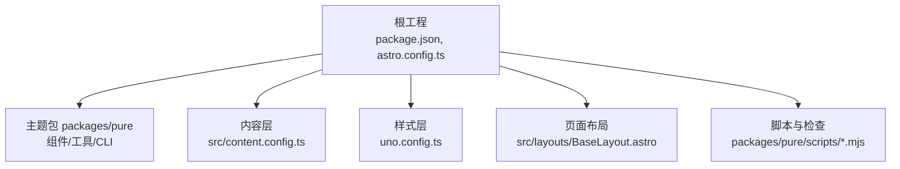
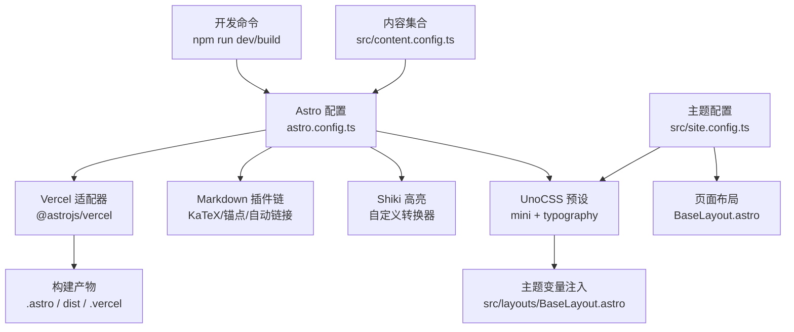
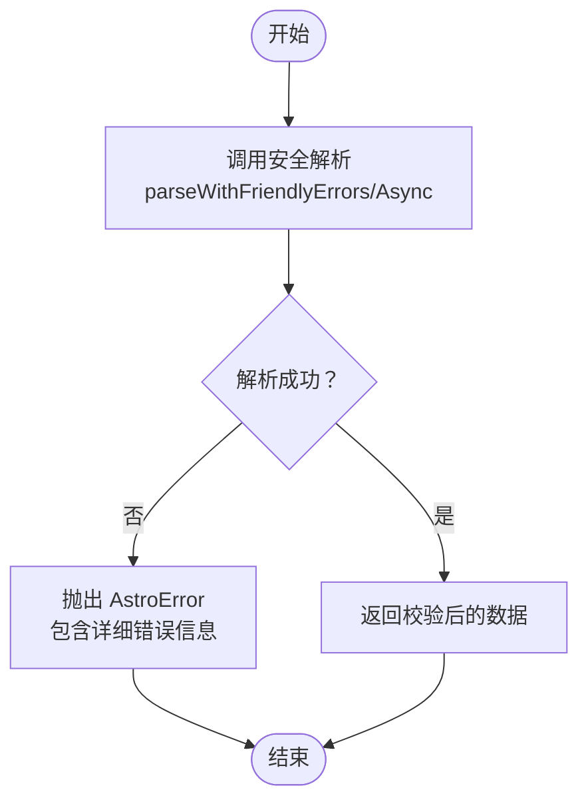
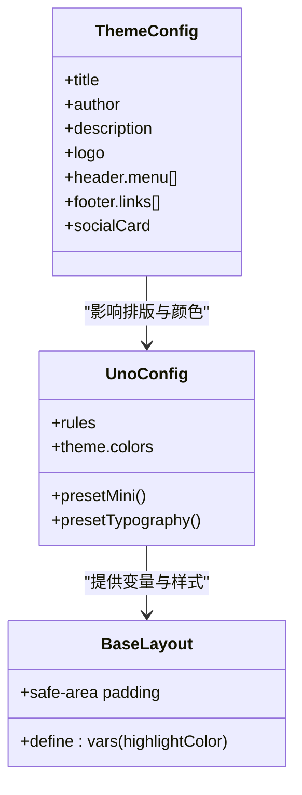
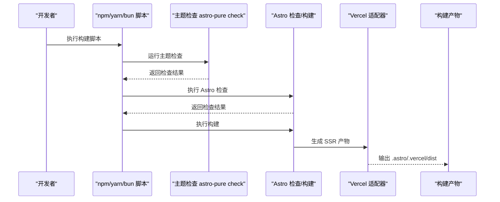
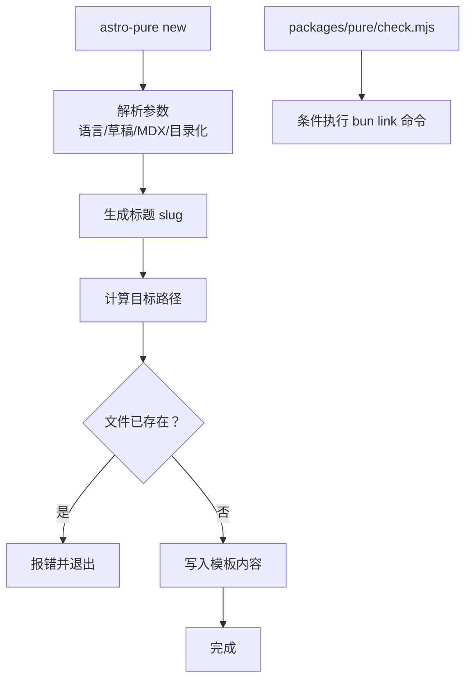
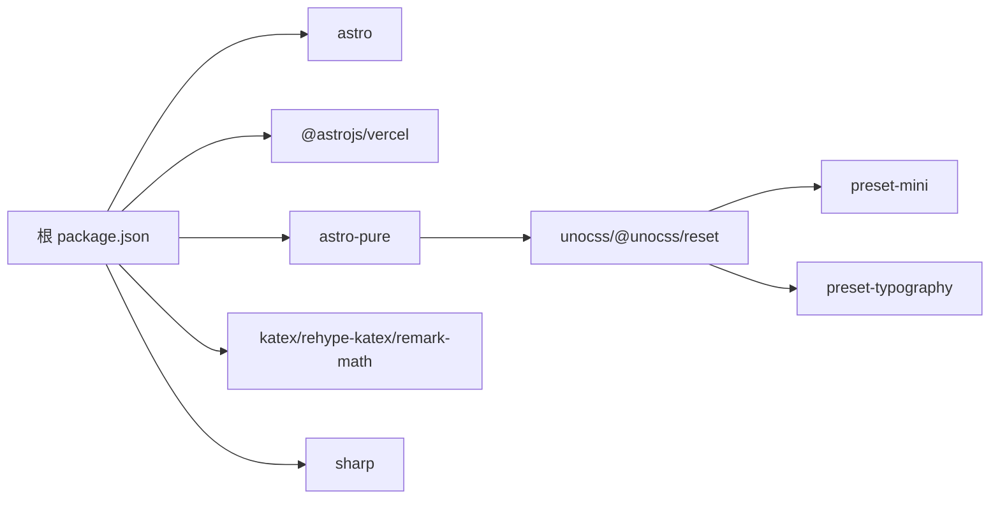

# 故障排除

<cite>
**本文引用的文件**
- [package.json](file://package.json)
- [astro.config.ts](file://astro.config.ts)
- [uno.config.ts](file://uno.config.ts)
- [src/site.config.ts](file://src/site.config.ts)
- [src/content.config.ts](file://src/content.config.ts)
- [eslint.config.mjs](file://eslint.config.mjs)
- [packages/pure/package.json](file://packages/pure/package.json)
- [packages/pure/utils/error-map.ts](file://packages/pure/utils/error-map.ts)
- [packages/pure/utils/toast.ts](file://packages/pure/utils/toast.ts)
- [packages/pure/scripts/check.mjs](file://packages/pure/scripts/check.mjs)
- [packages/pure/scripts/new.mjs](file://packages/pure/scripts/new.mjs)
- [src/layouts/BaseLayout.astro](file://src/layouts/BaseLayout.astro)
</cite>

## 目录
1. [简介](#简介)
2. [项目结构](#项目结构)
3. [核心组件](#核心组件)
4. [架构总览](#架构总览)
5. [详细组件分析](#详细组件分析)
6. [依赖关系分析](#依赖关系分析)
7. [性能考虑](#性能考虑)
8. [故障排除指南](#故障排除指南)
9. [结论](#结论)
10. [附录](#附录)

## 简介
本指南面向使用 Astro 主题 Pure 的开发者与运维人员，覆盖从开发到生产的全流程故障排除方法。内容包括：
- 构建失败、运行时错误与样式问题的诊断与修复
- 性能问题（加载慢、内存高）的排查与优化
- 开发环境问题（依赖冲突、版本不兼容）
- 生产部署问题（Vercel 部署错误、服务器配置）
- 主题定制常见问题
- 调试工具与日志分析技巧
- 社区支持与问题反馈渠道

## 项目结构
该项目采用多包工作区布局，核心由以下部分组成：
- 根工程：负责站点配置、构建与部署脚本
- 主题包 packages/pure：提供主题组件、工具函数与 CLI 脚本
- 内容层：通过 Astro Content Collections 管理博客、文档与 SOP 内容
- 样式层：UnoCSS 预设与主题变量驱动的样式系统

图表来源
- [package.json](file://package.json#L1-L45)
- [astro.config.ts](file://astro.config.ts#L1-L133)
- [uno.config.ts](file://uno.config.ts#L1-L193)
- [src/content.config.ts](file://src/content.config.ts#L1-L77)
- [src/layouts/BaseLayout.astro](file://src/layouts/BaseLayout.astro#L1-L92)
- [packages/pure/package.json](file://packages/pure/package.json#L1-L51)

章节来源
- [package.json](file://package.json#L1-L45)
- [astro.config.ts](file://astro.config.ts#L1-L133)
- [uno.config.ts](file://uno.config.ts#L1-L193)
- [src/content.config.ts](file://src/content.config.ts#L1-L77)
- [src/layouts/BaseLayout.astro](file://src/layouts/BaseLayout.astro#L1-L92)
- [packages/pure/package.json](file://packages/pure/package.json#L1-L51)

## 核心组件
- 构建与适配器：使用 Vercel 适配器与 SSR 输出模式，确保服务端渲染与静态资源优化
- Markdown 与数学公式：启用 KaTeX 数学渲染与标题锚点自动链接
- 代码高亮：基于 Shiki 的自定义转换器，支持标题、语言标签、复制按钮与折叠
- 主题配置：集中于站点配置文件，涵盖标题、作者、页头菜单、页脚、社交卡片等
- UnoCSS：预设 Mini 与 Typography，并注入主题色与自定义规则
- 内容集合：博客、文档与 SOP 三类内容，统一约束字段与去重逻辑
- 错误友好解析：对内容校验失败提供可读性更强的错误信息
- 工具与脚本：提供“新建文章”“本地联调检查”等 CLI 功能

章节来源
- [astro.config.ts](file://astro.config.ts#L26-L133)
- [src/site.config.ts](file://src/site.config.ts#L1-L207)
- [uno.config.ts](file://uno.config.ts#L174-L193)
- [src/content.config.ts](file://src/content.config.ts#L11-L77)
- [packages/pure/utils/error-map.ts](file://packages/pure/utils/error-map.ts#L23-L56)
- [packages/pure/scripts/new.mjs](file://packages/pure/scripts/new.mjs#L60-L131)

## 架构总览
下图展示从开发到部署的关键路径与组件交互。

图表来源
- [astro.config.ts](file://astro.config.ts#L26-L133)
- [uno.config.ts](file://uno.config.ts#L174-L193)
- [src/layouts/BaseLayout.astro](file://src/layouts/BaseLayout.astro#L1-L92)
- [src/content.config.ts](file://src/content.config.ts#L1-L77)
- [src/site.config.ts](file://src/site.config.ts#L1-L207)

## 详细组件分析

### 组件A：内容校验与错误映射
- 目标：对内容集合字段进行强约束，出现错误时输出清晰的可读信息
- 关键点：
  - 使用 Zod schema 对博客、文档、SOP 字段进行校验
  - 自定义错误映射，合并联合类型期望值，避免冗余噪音
  - 支持同步与异步解析，便于复杂校验场景

图表来源
- [packages/pure/utils/error-map.ts](file://packages/pure/utils/error-map.ts#L23-L56)

章节来源
- [src/content.config.ts](file://src/content.config.ts#L11-L77)
- [packages/pure/utils/error-map.ts](file://packages/pure/utils/error-map.ts#L23-L56)

### 组件B：主题配置与 UnoCSS 样式
- 目标：统一站点元信息、页头页脚、社交卡片与样式主题
- 关键点：
  - 主题配置集中于站点配置文件，包含语言、Logo、页头菜单、页脚链接与社交账号
  - UnoCSS 注入主题变量并应用 Typography 预设，提供可定制的颜色与排版
  - 布局中通过 define:vars 注入高亮色与安全区域适配

图表来源
- [src/site.config.ts](file://src/site.config.ts#L3-L99)
- [uno.config.ts](file://uno.config.ts#L174-L193)
- [src/layouts/BaseLayout.astro](file://src/layouts/BaseLayout.astro#L52-L89)

章节来源
- [src/site.config.ts](file://src/site.config.ts#L1-L207)
- [uno.config.ts](file://uno.config.ts#L1-L193)
- [src/layouts/BaseLayout.astro](file://src/layouts/BaseLayout.astro#L1-L92)

### 组件C：构建与部署流水线
- 目标：确保开发、检查、构建、预览与部署的一致性
- 关键点：
  - 根脚本串联主题检查、Astro 检查与构建
  - Vercel 适配器与 SSR 输出模式
  - 图片响应式与 Sharp 服务集成

图表来源
- [package.json](file://package.json#L8-L21)
- [astro.config.ts](file://astro.config.ts#L36-L42)

章节来源
- [package.json](file://package.json#L8-L21)
- [astro.config.ts](file://astro.config.ts#L36-L42)

### 组件D：CLI 工具与辅助脚本
- 目标：提升开发效率，减少重复劳动
- 关键点：
  - 新建文章脚本：支持语言、草稿、MDX、目录化等选项
  - 本地联调检查脚本：用于开发期快速验证

图表来源
- [packages/pure/scripts/new.mjs](file://packages/pure/scripts/new.mjs#L60-L131)
- [packages/pure/scripts/check.mjs](file://packages/pure/scripts/check.mjs#L25-L39)

章节来源
- [packages/pure/scripts/new.mjs](file://packages/pure/scripts/new.mjs#L1-L131)
- [packages/pure/scripts/check.mjs](file://packages/pure/scripts/check.mjs#L1-L40)

## 依赖关系分析
- 核心依赖：Astro、Vercel 适配器、主题包 astro-pure、KaTeX、Sharp、UnoCSS
- 开发依赖：ESLint、Prettier、TypeScript 插件生态
- 主题包导出：组件、工具、服务端工具、类型与用户配置入口

图表来源
- [package.json](file://package.json#L23-L35)
- [packages/pure/package.json](file://packages/pure/package.json#L39-L49)

章节来源
- [package.json](file://package.json#L23-L35)
- [packages/pure/package.json](file://packages/pure/package.json#L1-L51)

## 性能考虑
- 构建与缓存
  - 使用 Vercel 适配器与 SSR 输出，结合图片响应式服务，减少首屏体积
  - 启用字体预加载与 SVGO 优化，降低传输与渲染成本
- 内容与样式
  - 合理设置分页大小与搜索开关，避免一次性渲染过多内容
  - UnoCSS 规则与 safelist 控制样式体积，避免未使用类导致的膨胀
- 运行时
  - 通过主题高亮色与安全区域变量减少不必要的重绘
  - 合理使用图片尺寸与格式，配合 Sharp 服务实现按需压缩

章节来源
- [astro.config.ts](file://astro.config.ts#L44-L50)
- [uno.config.ts](file://uno.config.ts#L174-L193)
- [src/layouts/BaseLayout.astro](file://src/layouts/BaseLayout.astro#L52-L89)

## 故障排除指南

### 一、构建失败
常见症状
- 构建阶段报错或中断
- 主题检查失败
- 内容校验失败

排查步骤
- 运行主题与 Astro 检查
  - 执行根脚本中的检查命令，定位问题后逐项修复
  - 参考内容校验错误映射，修正内容字段类型与必填项
- 检查配置一致性
  - 确认站点配置与内容集合字段一致
  - 校验 Markdown 插件链与 Shiki 转换器是否正确加载
- 清理缓存与重建
  - 删除构建缓存目录后重新构建

建议操作
- 在开发阶段同时运行检查与开发服务器，尽早发现问题
- 使用 ESLint 与 Prettier 规范代码风格，减少因格式导致的构建异常

章节来源
- [package.json](file://package.json#L8-L21)
- [packages/pure/utils/error-map.ts](file://packages/pure/utils/error-map.ts#L23-L56)
- [src/content.config.ts](file://src/content.config.ts#L11-L77)
- [astro.config.ts](file://astro.config.ts#L52-L96)

### 二、运行时错误
常见症状
- 页面空白或白屏
- 样式缺失或闪烁
- 评论/搜索功能异常

排查步骤
- 检查主题配置
  - 确认站点标题、作者、描述、Logo、社交卡片等字段有效
  - 校验页头菜单与页脚链接是否指向有效路径
- 样式与主题变量
  - 确认 UnoCSS 预设与主题变量注入正常
  - 检查布局中高亮色与安全区域变量是否生效
- 第三方集成
  - 校验评论系统与外部搜索服务可用性
  - 确认 CDN 与字体加载状态

建议操作
- 使用浏览器开发者工具查看网络与控制台错误
- 逐步禁用插件与集成，定位具体模块

章节来源
- [src/site.config.ts](file://src/site.config.ts#L3-L99)
- [uno.config.ts](file://uno.config.ts#L174-L193)
- [src/layouts/BaseLayout.astro](file://src/layouts/BaseLayout.astro#L52-L89)

### 三、样式问题
常见症状
- 字体未加载或显示异常
- 排版不一致或断行异常
- 链接与代码块样式不符合预期

排查步骤
- 字体与排版
  - 检查实验性字体预加载配置与字体子集设置
  - 校验 Typography 预设的 CSS 扩展是否按预期注入
- 自定义样式
  - 确认 UnoCSS 规则与 safelist 是否覆盖所需类名
  - 检查全局样式文件是否被正确引入

建议操作
- 优先使用 UnoCSS 类名，减少内联样式的副作用
- 对复杂排版问题，临时移除自定义规则以定位冲突源

章节来源
- [astro.config.ts](file://astro.config.ts#L114-L131)
- [uno.config.ts](file://uno.config.ts#L14-L125)

### 四、性能问题
常见症状
- 首屏加载缓慢
- 内存占用偏高
- 搜索与评论卡顿

排查步骤
- 资源体积
  - 分析构建产物，识别大体积资源与未使用的 CSS/JS
  - 启用图片响应式与合适的图片格式
- 渲染与脚本
  - 减少一次性渲染的内容量，启用分页与懒加载
  - 优化第三方脚本加载时机
- 缓存与 CDN
  - 确保静态资源缓存策略合理
  - 使用可靠的 CDN 提升边缘节点性能

建议操作
- 结合浏览器性能面板与网络面板定位瓶颈
- 逐步回退可疑变更，确认修复效果

章节来源
- [astro.config.ts](file://astro.config.ts#L44-L50)
- [uno.config.ts](file://uno.config.ts#L174-L193)

### 五、开发环境问题
常见症状
- 依赖安装失败或版本冲突
- Lint 报错频繁
- 开发服务器热更新异常

排查步骤
- 依赖与版本
  - 清理 node_modules 与锁定文件后重新安装
  - 核对主题包与 Astro 版本兼容性
- Lint 与格式化
  - 按 ESLint 配置忽略无需检查的目录
  - 使用 Prettier 统一格式，减少 CI 失败

建议操作
- 使用统一的包管理器与版本工具，避免混合环境
- 在提交前执行 lint 与格式化脚本

章节来源
- [eslint.config.mjs](file://eslint.config.mjs#L1-L16)
- [package.json](file://package.json#L36-L43)

### 六、生产部署问题
常见症状
- Vercel 部署失败或构建超时
- 服务器配置错误导致路由 404
- 静态资源 404 或跨域问题

排查步骤
- 适配器与输出模式
  - 确认使用 Vercel 适配器与正确的输出模式
  - 校验站点基础 URL 与子路径配置
- 构建产物
  - 检查 .vercel 与 dist 目录结构是否完整
  - 确认图片与搜索索引资源已生成
- 平台配置
  - 校验环境变量与平台缓存策略
  - 检查重写与回退规则是否正确

建议操作
- 在本地预览构建产物，确保与线上一致
- 使用平台提供的日志与监控工具定位失败原因

章节来源
- [astro.config.ts](file://astro.config.ts#L36-L42)
- [package.json](file://package.json#L8-L21)

### 七、主题定制问题
常见症状
- 页头/页脚菜单不显示
- Logo 或社交卡片路径无效
- 高亮色与安全区域适配异常

排查步骤
- 配置项核对
  - 确认站点配置中的菜单、链接、Logo、社交卡片路径有效
  - 检查高亮色与安全区域变量是否在布局中正确注入
- 组件导入
  - 确认布局中导入的主题组件与配置一致

建议操作
- 从最小配置开始，逐步增加定制项
- 对比官方示例，确保路径与命名规范一致

章节来源
- [src/site.config.ts](file://src/site.config.ts#L48-L99)
- [src/layouts/BaseLayout.astro](file://src/layouts/BaseLayout.astro#L52-L89)

### 八、调试工具与日志分析
- 浏览器开发者工具
  - Network：检查资源加载与错误码
  - Console：查看运行时错误与警告
  - Performance：分析渲染与脚本执行时间
- 构建日志
  - 关注主题检查与 Astro 检查输出
  - 定位内容校验与插件加载失败的具体文件
- 日志与事件
  - 使用主题提供的提示事件进行调试
  - 在第三方集成处添加最小复现示例

章节来源
- [packages/pure/utils/toast.ts](file://packages/pure/utils/toast.ts#L1-L4)

### 九、社区支持与问题反馈
- 官方文档与示例
  - 参考主题包文档与示例项目
- 问题反馈
  - 通过主题包仓库的 Issues 提交问题
  - 提供最小可复现示例与环境信息

章节来源
- [packages/pure/package.json](file://packages/pure/package.json#L14-L14)

## 结论
通过系统化的配置核对、日志分析与性能优化手段，大多数问题可在本地快速定位并修复。建议在开发与部署各阶段均执行检查与预览，确保构建产物与运行时行为一致；同时善用 UnoCSS 与主题配置，减少样式与交互层面的回归问题。

## 附录
- 快速检查清单
  - 运行主题与 Astro 检查
  - 校验内容集合字段与站点配置
  - 确认 Vercel 适配器与输出模式
  - 分析构建产物与网络请求
  - 使用浏览器性能面板定位瓶颈
- 常用命令参考
  - 开发：运行开发服务器与检查
  - 构建：执行主题检查、Astro 检查与构建
  - 预览：本地预览构建产物
  - 清理：删除构建缓存目录

章节来源
- [package.json](file://package.json#L8-L21)