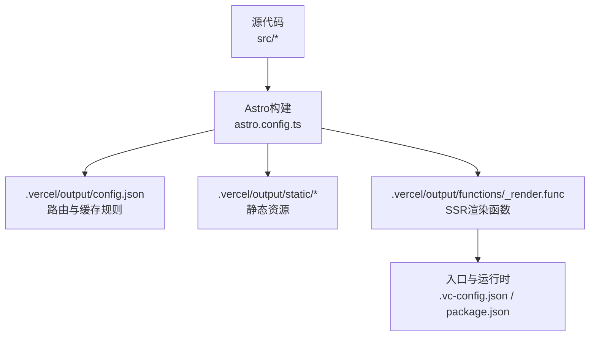
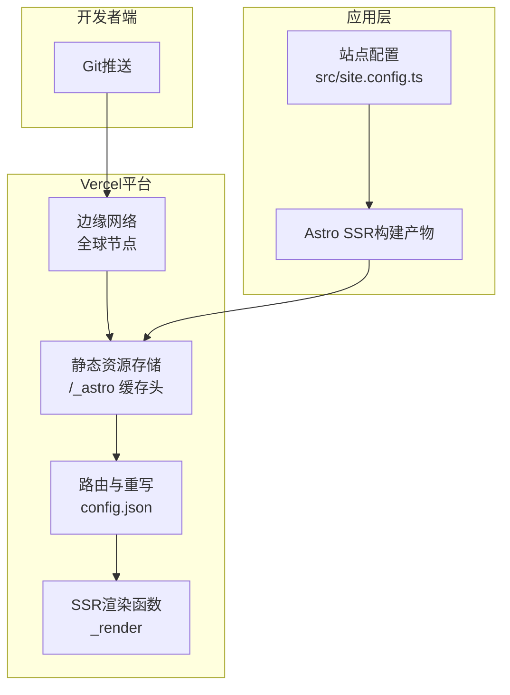
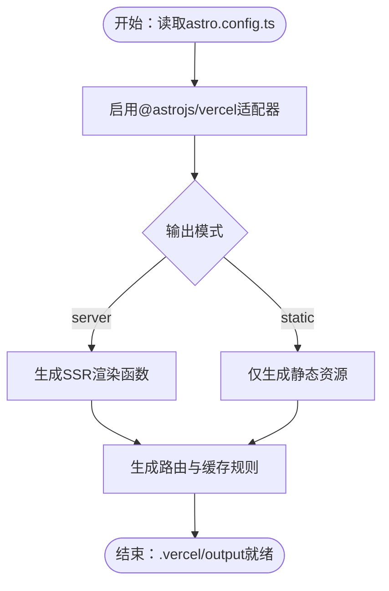
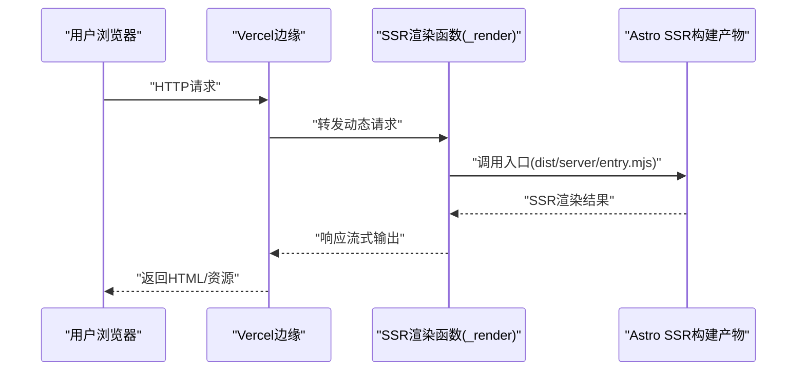
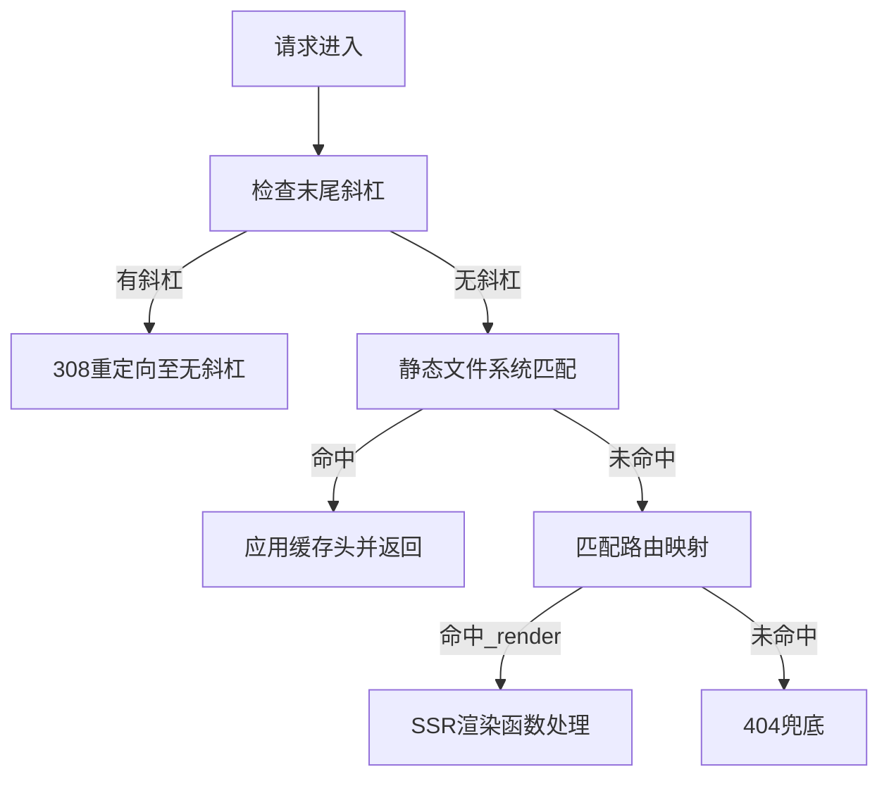
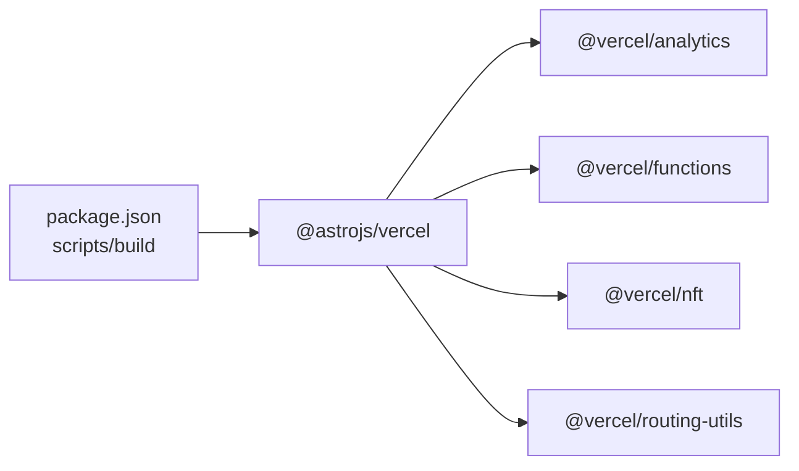

# Vercel部署

<cite>
**本文引用的文件**
- [package.json](file://package.json)
- [astro.config.ts](file://astro.config.ts)
- [.vercel/output/config.json](file://.vercel/output/config.json)
- [.vercel/output/functions/_render.func/.vc-config.json](file://.vercel/output/functions/_render.func/.vc-config.json)
- [.vercel/output/functions/_render.func/package.json](file://.vercel/output/functions/_render.func/package.json)
- [.env](file://.env)
- [src/site.config.ts](file://src/site.config.ts)
- [README.md](file://README.md)
</cite>

## 目录
1. [简介](#简介)
2. [项目结构](#项目结构)
3. [核心组件](#核心组件)
4. [架构总览](#架构总览)
5. [详细组件分析](#详细组件分析)
6. [依赖分析](#依赖分析)
7. [性能考量](#性能考量)
8. [故障排除指南](#故障排除指南)
9. [结论](#结论)
10. [附录](#附录)

## 简介
本指南面向在Vercel平台上部署基于Astro的静态站点与SSR应用的工程团队与个人开发者。文档围绕Vercel适配器的配置与使用展开，覆盖部署环境设置、构建命令、环境变量管理、CDN优化、边缘计算与自动缩放、部署流程（代码推送触发、构建监控、部署状态查看）、高级功能（域名、SSL、访问控制、性能监控），以及多环境部署策略与版本管理最佳实践。文中所有技术细节均以仓库中的实际配置为依据。

## 项目结构
该仓库采用Astro项目结构，结合Vercel适配器输出目录与函数配置，形成“静态资源 + SSR渲染函数”的混合部署形态。关键目录与文件如下：
- 构建产物与Vercel输出：.vercel/output
- SSR渲染函数：.vercel/output/functions/_render.func
- 适配器与输出模式：astro.config.ts中通过@astrojs/vercel配置SSR输出
- 项目脚本与依赖：package.json中包含@astrojs/vercel与构建脚本
- 站点配置：src/site.config.ts用于主题与集成配置
- 环境变量：.env用于本地开发时的环境变量注入

图表来源
- [astro.config.ts](file://astro.config.ts#L26-L42)
- [.vercel/output/config.json](file://.vercel/output/config.json#L1-L99)
- [.vercel/output/functions/_render.func/.vc-config.json](file://.vercel/output/functions/_render.func/.vc-config.json#L1-L6)
- [.vercel/output/functions/_render.func/package.json](file://.vercel/output/functions/_render.func/package.json#L1-L3)

章节来源
- [astro.config.ts](file://astro.config.ts#L26-L42)
- [.vercel/output/config.json](file://.vercel/output/config.json#L1-L99)
- [.vercel/output/functions/_render.func/.vc-config.json](file://.vercel/output/functions/_render.func/.vc-config.json#L1-L6)
- [.vercel/output/functions/_render.func/package.json](file://.vercel/output/functions/_render.func/package.json#L1-L3)

## 核心组件
- Vercel适配器与SSR输出
  - 在astro.config.ts中启用@astrojs/vercel适配器，并将output设为server，实现SSR渲染。
  - 该配置决定了构建产物中包含SSR渲染函数与静态资源，以及Vercel路由规则。
- Vercel函数配置
  - .vc-config.json定义运行时、处理程序入口、流式响应支持等。
  - package.json声明模块类型为ESM，确保函数正确加载。
- 路由与缓存规则
  - config.json中定义了重定向、静态文件系统、缓存头、动态路由到_render函数的映射。
- 站点配置
  - src/site.config.ts集中管理主题、集成、SEO元数据、页脚、社交卡片等，影响最终构建产物与渲染行为。
- 环境变量
  - .env中包含BUN_LINK_PKG=true，用于本地开发时的包链接策略。

章节来源
- [astro.config.ts](file://astro.config.ts#L26-L42)
- [.vercel/output/functions/_render.func/.vc-config.json](file://.vercel/output/functions/_render.func/.vc-config.json#L1-L6)
- [.vercel/output/functions/_render.func/package.json](file://.vercel/output/functions/_render.func/package.json#L1-L3)
- [.vercel/output/config.json](file://.vercel/output/config.json#L1-L99)
- [src/site.config.ts](file://src/site.config.ts#L1-L207)
- [.env](file://.env#L1-L1)

## 架构总览
下图展示从代码提交到用户请求的端到端路径，包括静态资源直传CDN、动态请求经由SSR渲染函数处理、以及Vercel边缘网络的加速与缓存。

图表来源
- [.vercel/output/config.json](file://.vercel/output/config.json#L1-L99)
- [.vercel/output/functions/_render.func/.vc-config.json](file://.vercel/output/functions/_render.func/.vc-config.json#L1-L6)
- [astro.config.ts](file://astro.config.ts#L26-L42)
- [src/site.config.ts](file://src/site.config.ts#L1-L207)

## 详细组件分析

### 组件A：Vercel适配器与SSR输出
- 适配器启用位置与输出模式
  - 在astro.config.ts中通过@astrojs/vercel启用适配器，并将output设为server，使Astro生成SSR渲染函数与静态资源。
- 影响范围
  - 构建产物中出现functions/_render.func与static目录，路由规则由config.json统一管理。
- 关键配置项
  - site、trailingSlash、image、markdown、integrations、experimental等，共同决定最终页面内容与性能表现。

图表来源
- [astro.config.ts](file://astro.config.ts#L26-L42)

章节来源
- [astro.config.ts](file://astro.config.ts#L26-L42)

### 组件B：SSR渲染函数与运行时
- 函数入口与运行时
  - .vc-config.json指定runtime为nodejs22.x，handler为dist/server/entry.mjs，支持响应流式传输。
- 模块类型
  - package.json声明type为module，确保函数按ESM规范加载。
- 处理流程
  - 请求进入_render函数，根据路由规则匹配到对应页面或404，再由Astro SSR渲染返回。

图表来源
- [.vercel/output/functions/_render.func/.vc-config.json](file://.vercel/output/functions/_render.func/.vc-config.json#L1-L6)
- [.vercel/output/functions/_render.func/package.json](file://.vercel/output/functions/_render.func/package.json#L1-L3)

章节来源
- [.vercel/output/functions/_render.func/.vc-config.json](file://.vercel/output/functions/_render.func/.vc-config.json#L1-L6)
- [.vercel/output/functions/_render.func/package.json](file://.vercel/output/functions/_render.func/package.json#L1-L3)

### 组件C：路由与缓存规则
- 重定向与规范化
  - 移除末尾斜杠的永久重定向，避免重复URL。
- 静态资源缓存
  - 对/_astro路径设置长期缓存头，提升静态资源加载速度。
- 动态路由映射
  - 将特定路径映射到_render函数，实现按需SSR渲染。
- 404兜底
  - 未匹配到静态资源或特定路由时，统一转发到_render并返回404。

图表来源
- [.vercel/output/config.json](file://.vercel/output/config.json#L1-L99)

章节来源
- [.vercel/output/config.json](file://.vercel/output/config.json#L1-L99)

### 组件D：站点配置与构建产物
- 主题与集成
  - src/site.config.ts集中管理标题、作者、描述、favicon、socialCard、菜单、页脚、内容分页、搜索、评论系统等。
- 构建影响
  - 配置直接影响页面元数据、导航、样式、图片优化与第三方集成，从而影响最终静态资源与SSR渲染结果。

章节来源
- [src/site.config.ts](file://src/site.config.ts#L1-L207)

### 组件E：环境变量与本地开发
- 环境变量
  - .env中包含BUN_LINK_PKG=true，用于本地开发时的包链接策略，有助于提升开发体验与一致性。
- 与部署的关系
  - 生产环境的环境变量通常在Vercel项目设置中配置，不建议直接提交到仓库。

章节来源
- [.env](file://.env#L1-L1)

## 依赖分析
- 适配器与运行时
  - @astrojs/vercel负责将Astro项目适配到Vercel平台，内部依赖@vercel/analytics、@vercel/functions、@vercel/nft、@vercel/routing-utils等，保障分析、函数运行、打包与路由工具链。
- 构建脚本
  - package.json中的build脚本串联了主题检查、Astro检查与构建，确保在部署前完成质量把关。

图表来源
- [package.json](file://package.json#L8-L21)
- [astro.config.ts](file://astro.config.ts#L1-L10)

章节来源
- [package.json](file://package.json#L8-L21)
- [astro.config.ts](file://astro.config.ts#L1-L10)

## 性能考量
- CDN与缓存
  - 静态资源路径/_astro设置长期缓存头，减少带宽消耗并提升加载速度。
- 边缘计算
  - Vercel边缘网络就近处理请求，降低延迟；SSR渲染函数按需触发，平衡性能与交互性。
- 自动缩放
  - Vercel根据流量自动扩缩容，无需手动干预即可应对突发流量。
- 图片优化
  - astro.config.ts中配置image服务为sharp，结合Vercel Image Optimization，可按需生成多种尺寸与格式的图片，进一步优化加载性能。
- 字体与实验特性
  - experimental中开启fonts与svgo等实验特性，有助于字体预加载与SVG优化，提升首屏性能。

章节来源
- [.vercel/output/config.json](file://.vercel/output/config.json#L16-L18)
- [astro.config.ts](file://astro.config.ts#L45-L50)
- [astro.config.ts](file://astro.config.ts#L107-L131)

## 故障排除指南
- 构建失败
  - 现象：本地或CI构建报错。
  - 排查要点：检查package.json中的build脚本是否能顺利执行；确认依赖安装与Node版本满足要求；核对astro.config.ts中的适配器与输出模式配置。
- SSR渲染异常
  - 现象：动态页面空白或错误。
  - 排查要点：检查.functions/_render.func/.vc-config.json中的runtime与handler是否正确；确认package.json的module类型；验证路由规则是否将目标路径映射到_render。
- 静态资源未缓存
  - 现象：刷新后资源频繁重新下载。
  - 排查要点：确认config.json中/_astro路径的缓存头设置；检查CDN是否正确识别静态资源目录。
- 环境变量问题
  - 现象：生产环境变量缺失导致功能异常。
  - 排查要点：在Vercel项目设置中添加环境变量，避免直接提交到仓库；本地开发时可通过.env使用BUN_LINK_PKG等参数。
- 路由404
  - 现象：访问特定路径返回404。
  - 排查要点：检查config.json中的路由映射与兜底规则；确认目标路径是否被正确转发到_render。

章节来源
- [package.json](file://package.json#L8-L21)
- [.vercel/output/functions/_render.func/.vc-config.json](file://.vercel/output/functions/_render.func/.vc-config.json#L1-L6)
- [.vercel/output/functions/_render.func/package.json](file://.vercel/output/functions/_render.func/package.json#L1-L3)
- [.vercel/output/config.json](file://.vercel/output/config.json#L1-L99)
- [.env](file://.env#L1-L1)

## 结论
本指南基于仓库中的实际配置，系统梳理了在Vercel上部署Astro项目的适配器配置、构建命令、环境变量、CDN与边缘计算、自动缩放、部署流程与高级功能，并提供了故障排除与多环境部署策略建议。遵循本文档的步骤与最佳实践，可显著提升部署效率与线上稳定性。

## 附录
- 快速参考
  - 构建命令：参见package.json中的build脚本。
  - 适配器与输出：参见astro.config.ts中的adapter与output配置。
  - 函数运行时与入口：参见.functions/_render.func/.vc-config.json与package.json。
  - 路由与缓存：参见.vercel/output/config.json。
  - 站点配置：参见src/site.config.ts。
  - 开发环境变量：参见.env。

章节来源
- [package.json](file://package.json#L8-L21)
- [astro.config.ts](file://astro.config.ts#L26-L42)
- [.vercel/output/functions/_render.func/.vc-config.json](file://.vercel/output/functions/_render.func/.vc-config.json#L1-L6)
- [.vercel/output/functions/_render.func/package.json](file://.vercel/output/functions/_render.func/package.json#L1-L3)
- [.vercel/output/config.json](file://.vercel/output/config.json#L1-L99)
- [src/site.config.ts](file://src/site.config.ts#L1-L207)
- [.env](file://.env#L1-L1)
- [README.md](file://README.md#L7-L7)