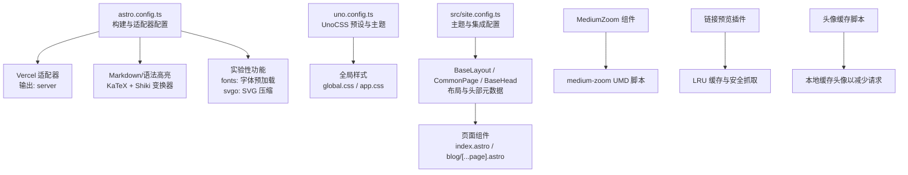
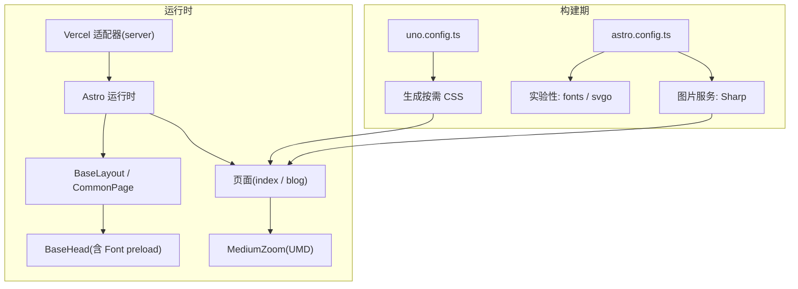
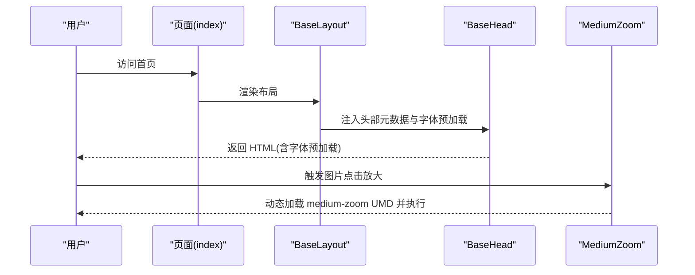
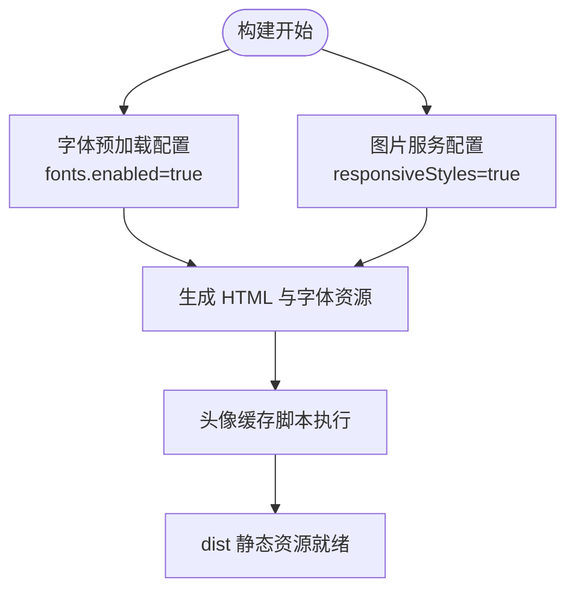
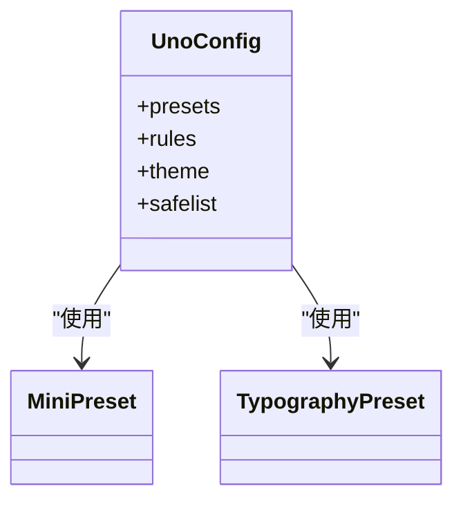
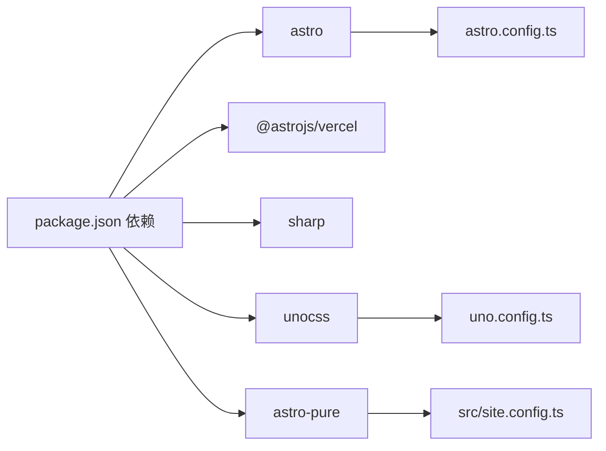

# 性能优化

<cite>
**本文引用的文件**
- [astro.config.ts](file://astro.config.ts)
- [uno.config.ts](file://uno.config.ts)
- [package.json](file://package.json)
- [src/site.config.ts](file://src/site.config.ts)
- [src/layouts/BaseLayout.astro](file://src/layouts/BaseLayout.astro)
- [src/layouts/CommonPage.astro](file://src/layouts/CommonPage.astro)
- [src/components/BaseHead.astro](file://src/components/BaseHead.astro)
- [src/assets/styles/global.css](file://src/assets/styles/global.css)
- [src/assets/styles/app.css](file://src/assets/styles/app.css)
- [src/pages/index.astro](file://src/pages/index.astro)
- [src/pages/blog/[...page].astro](file://src/pages/blog/[...page].astro)
- [packages/pure/components/advanced/MediumZoom.astro](file://packages/pure/components/advanced/MediumZoom.astro)
- [packages/pure/plugins/link-preview.ts](file://packages/pure/plugins/link-preview.ts)
- [preset/scripts/cacheAvatars.ts](file://preset/scripts/cacheAvatars.ts)
</cite>

## 目录
1. [引言](#引言)
2. [项目结构](#项目结构)
3. [核心组件](#核心组件)
4. [架构总览](#架构总览)
5. [详细组件分析](#详细组件分析)
6. [依赖关系分析](#依赖关系分析)
7. [性能考量](#性能考量)
8. [故障排查指南](#故障排查指南)
9. [结论](#结论)
10. [附录](#附录)

## 引言
本指南围绕该 Astro 站点的性能优化实践展开，系统梳理代码分割、懒加载、预加载与缓存策略；静态资源优化（图片、字体、CSS/JS）；UnoCSS 按需生成与 Tree-shaking；实验性功能（字体预加载、SVGO 优化）的影响；以及性能监控与分析（Lighthouse、Web Vitals、Core Web Vitals）与基准测试方法。文档同时给出可落地的优化案例与效果对比建议。

## 项目结构
该项目采用 Astro + Vercel 适配器的 SSR 输出模式，结合 AstroPure 主题与 UnoCSS 提供的样式能力，页面通过预渲染与分页提升首屏与导航性能。构建脚本与依赖集中在根目录配置中，站点主题与集成配置位于独立文件中，便于统一维护与扩展。

图表来源
- [astro.config.ts](file://astro.config.ts#L26-L133)
- [uno.config.ts](file://uno.config.ts#L174-L193)
- [src/site.config.ts](file://src/site.config.ts#L1-L207)
- [src/layouts/BaseLayout.astro](file://src/layouts/BaseLayout.astro#L1-L92)
- [src/components/BaseHead.astro](file://src/components/BaseHead.astro#L1-L99)
- [src/pages/index.astro](file://src/pages/index.astro#L1-L128)
- [src/pages/blog/[...page].astro](file://src/pages/blog/[...page].astro#L1-L111)
- [packages/pure/components/advanced/MediumZoom.astro](file://packages/pure/components/advanced/MediumZoom.astro#L1-L47)
- [packages/pure/plugins/link-preview.ts](file://packages/pure/plugins/link-preview.ts#L1-L110)
- [preset/scripts/cacheAvatars.ts](file://preset/scripts/cacheAvatars.ts#L53-L107)

章节来源
- [astro.config.ts](file://astro.config.ts#L26-L133)
- [uno.config.ts](file://uno.config.ts#L174-L193)
- [src/site.config.ts](file://src/site.config.ts#L1-L207)

## 核心组件
- 构建与适配器配置：启用 Vercel 适配器与 SSR 输出，开启图片响应式与 Sharp 服务，启用实验性字体预加载与 SVGO。
- UnoCSS 配置：使用 mini 与 typography 预设，主题变量驱动，safelist 保障关键类名命中。
- 页面与布局：基础布局注入全局样式与主题提供者，页面通过预渲染与分页提升性能。
- 实验性功能：字体预加载（Font preload）、SVGO 压缩（SVG），均在配置中显式开启。

章节来源
- [astro.config.ts](file://astro.config.ts#L26-L133)
- [uno.config.ts](file://uno.config.ts#L174-L193)
- [src/layouts/BaseLayout.astro](file://src/layouts/BaseLayout.astro#L1-L92)
- [src/layouts/CommonPage.astro](file://src/layouts/CommonPage.astro#L1-L34)
- [src/components/BaseHead.astro](file://src/components/BaseHead.astro#L1-L99)

## 架构总览
下图展示从构建到运行的关键路径：配置驱动构建流程，适配器负责 SSR 输出，页面与组件通过 Astro 运行时渲染，UnoCSS 生成按需 CSS，静态资源由 Vercel CDN 分发。

图表来源
- [astro.config.ts](file://astro.config.ts#L26-L133)
- [uno.config.ts](file://uno.config.ts#L174-L193)
- [src/layouts/BaseLayout.astro](file://src/layouts/BaseLayout.astro#L1-L92)
- [src/components/BaseHead.astro](file://src/components/BaseHead.astro#L30-L36)
- [src/pages/index.astro](file://src/pages/index.astro#L45-L51)
- [packages/pure/components/advanced/MediumZoom.astro](file://packages/pure/components/advanced/MediumZoom.astro#L14-L17)

## 详细组件分析

### 代码分割与懒加载
- 页面级分页与预渲染：博客列表页启用预渲染与分页，降低单页体积与首屏压力。
- 图片懒加载与优先级：首页头像使用 eager 与高优先级属性，确保首屏关键视觉；其他图片遵循默认延迟加载策略。
- 轻量级交互库按需加载：MediumZoom 作为 UMD 脚本按需引入，避免在不使用场景下的资源浪费。

图表来源
- [src/pages/index.astro](file://src/pages/index.astro#L45-L51)
- [src/layouts/BaseLayout.astro](file://src/layouts/BaseLayout.astro#L30-L49)
- [src/components/BaseHead.astro](file://src/components/BaseHead.astro#L30-L36)
- [packages/pure/components/advanced/MediumZoom.astro](file://packages/pure/components/advanced/MediumZoom.astro#L14-L17)

章节来源
- [src/pages/blog/[...page].astro](file://src/pages/blog/[...page].astro#L11-L21)
- [src/pages/index.astro](file://src/pages/index.astro#L45-L51)
- [packages/pure/components/advanced/MediumZoom.astro](file://packages/pure/components/advanced/MediumZoom.astro#L1-L47)

### 预加载与缓存策略
- 字体预加载：在头部显式声明字体变量与预加载，减少 FOIT/FOUT。
- 图片服务：启用 Sharp 图片服务与响应式样式，按设备像素比与视口宽度生成合适尺寸资源。
- 头像缓存：提供脚本将远程头像缓存至本地，减少跨域请求与第三方依赖。

图表来源
- [astro.config.ts](file://astro.config.ts#L45-L50)
- [astro.config.ts](file://astro.config.ts#L114-L130)
- [preset/scripts/cacheAvatars.ts](file://preset/scripts/cacheAvatars.ts#L53-L107)

章节来源
- [src/components/BaseHead.astro](file://src/components/BaseHead.astro#L30-L36)
- [astro.config.ts](file://astro.config.ts#L45-L50)
- [preset/scripts/cacheAvatars.ts](file://preset/scripts/cacheAvatars.ts#L53-L107)

### 静态资源优化
- 图片压缩与格式：使用 Sharp 服务与 AVIF/WebP 等现代格式，结合响应式尺寸与 lazy 加载。
- 字体优化：通过字体预加载与 subset 控制，减少字体包体积与阻塞时间。
- CSS/JS 压缩：UnoCSS 按需生成，配合 safelist 保证关键样式命中；JS 通过 Vercel 适配器与打包链路压缩。

章节来源
- [astro.config.ts](file://astro.config.ts#L45-L50)
- [uno.config.ts](file://uno.config.ts#L174-L193)
- [src/assets/styles/global.css](file://src/assets/styles/global.css#L1-L287)
- [src/assets/styles/app.css](file://src/assets/styles/app.css#L1-L49)

### UnoCSS 按需生成与 Tree-shaking
- 预设组合：mini 与 typography 预设按需提取类名，减少冗余 CSS。
- 主题变量：基于 CSS 变量的主题系统，避免重复定义与无效覆盖。
- safelist：对目录与排版关键类进行白名单，确保首屏样式稳定。

图表来源
- [uno.config.ts](file://uno.config.ts#L174-L193)

章节来源
- [uno.config.ts](file://uno.config.ts#L174-L193)

### 实验性功能的性能影响
- 字体预加载：减少字体加载阻塞，改善可读性与布局稳定性；需注意 subset 与权重裁剪以控制体积。
- SVGO 优化：自动压缩 SVG 资源，减小传输体积；适合图标与装饰图形。

章节来源
- [astro.config.ts](file://astro.config.ts#L114-L130)
- [bun.lock](file://bun.lock#L1299-L1299)

### 性能监控与分析
- Lighthouse：定期在本地与 CI 中运行，关注 Largest Contentful Paint、Cumulative Layout Shift、First Input Delay 等指标。
- Web Vitals：在生产环境接入 Web Vitals 报告，持续观测真实用户性能。
- Core Web Vitals 优化：聚焦 CLS（布局稳定）、LCP（内容可见）、FID（交互响应）三大指标，结合本项目已有的字体预加载与图片响应式策略进一步优化。

（本节为通用指导，无需特定文件引用）

## 依赖关系分析
- 构建与运行：Astro 与 Vercel 适配器负责 SSR 输出；Sharp 提供图片处理；UnoCSS 生成样式。
- 主题与集成：AstroPure 提供组件与集成能力，站点配置集中于 site.config.ts。

图表来源
- [package.json](file://package.json#L23-L34)
- [astro.config.ts](file://astro.config.ts#L26-L133)
- [uno.config.ts](file://uno.config.ts#L1-L3)

章节来源
- [package.json](file://package.json#L23-L34)
- [astro.config.ts](file://astro.config.ts#L26-L133)
- [uno.config.ts](file://uno.config.ts#L1-L3)

## 性能考量
- 代码分割：利用 Astro 的页面级分页与组件按需加载，避免一次性加载过多资源。
- 懒加载：图片与交互库按需加载，减少首屏负担。
- 预加载：字体与关键资源预加载，缩短可读时间。
- 缓存：头像缓存与 CDN 分发，降低重复请求成本。
- 资源优化：图片响应式与现代格式、字体 subset、SVGO 压缩、CSS/JS 压缩。
- 监控：建立 Lighthouse 与 Web Vitals 持续监控，结合 Core Web Vitals 指标迭代优化。

（本节为通用指导，无需特定文件引用）

## 故障排查指南
- 图片加载异常：检查图片服务配置与路径映射，确认 glob 引用与 fetch 优先级设置。
- 字体加载问题：确认字体预加载参数与 subset 权重是否合理，避免过大字体包。
- MediumZoom 不生效：检查 UMD 脚本加载时机与选择器匹配，确保 DOM 结构满足要求。
- 链接预览失败：查看 LRU 缓存与超时设置，确认网络可达性与错误捕获逻辑。
- 头像缓存失败：检查目标目录权限、网络超时与内容类型解析，确保缓存文件完整性。

章节来源
- [src/pages/index.astro](file://src/pages/index.astro#L33-L39)
- [src/components/BaseHead.astro](file://src/components/BaseHead.astro#L30-L36)
- [packages/pure/components/advanced/MediumZoom.astro](file://packages/pure/components/advanced/MediumZoom.astro#L14-L17)
- [packages/pure/plugins/link-preview.ts](file://packages/pure/plugins/link-preview.ts#L1-L110)
- [preset/scripts/cacheAvatars.ts](file://preset/scripts/cacheAvatars.ts#L53-L107)

## 结论
本项目通过 Astro 配置与 UnoCSS 的协同，结合图片响应式、字体预加载、SVGO 与头像缓存等策略，在保证体验的同时有效降低了资源体积与加载阻塞。建议持续以 Lighthouse 与 Web Vitals 为抓手，围绕 Core Web Vitals 指标进行迭代优化，并在 CI 中固化性能基线，确保长期稳定。

## 附录
- 优化案例与效果对比建议
  - 案例一：启用字体 subset 与权重裁剪，对比前后 CLS 与 TTFB 改善。
  - 案例二：引入头像缓存脚本，统计 CDN 回源率下降与首屏时间变化。
  - 案例三：对 SVG 使用 SVGO 压缩，统计资源体积与传输时间变化。
- 基准测试方法
  - 在本地与 CI 中固定设备与网络条件，使用 Lighthouse CLI 或 WebPageTest 执行基准测试，记录 LCP、CLS、FID 指标，形成版本对比表。

（本节为通用指导，无需特定文件引用）