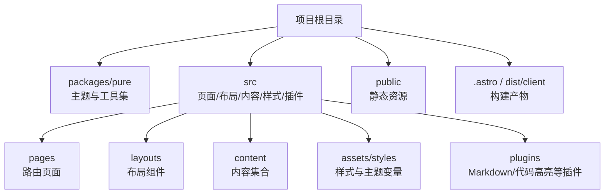
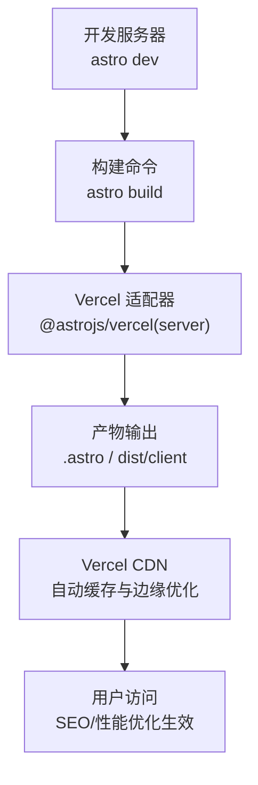
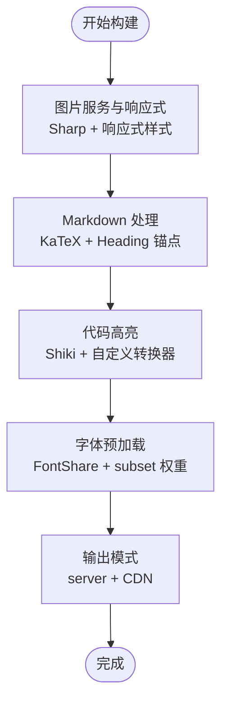
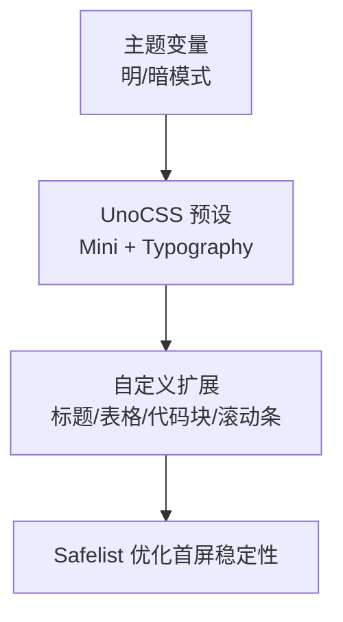
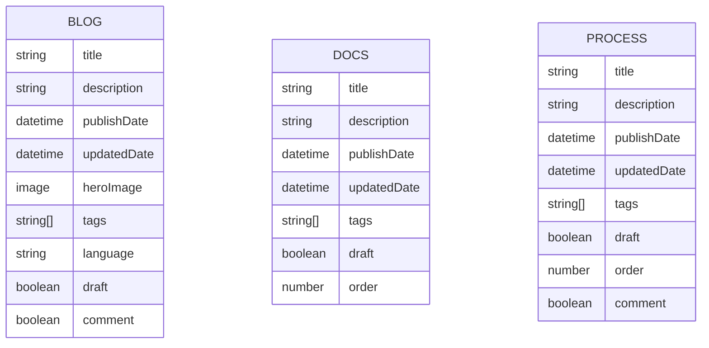
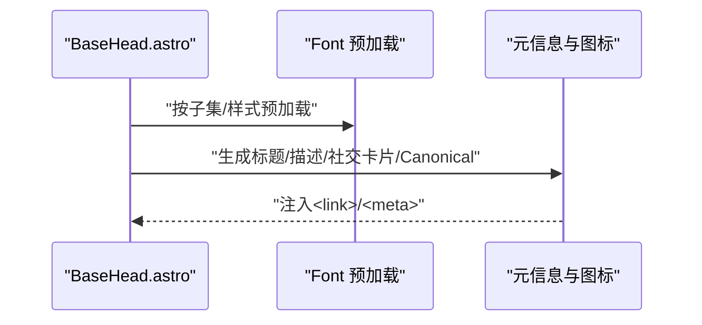
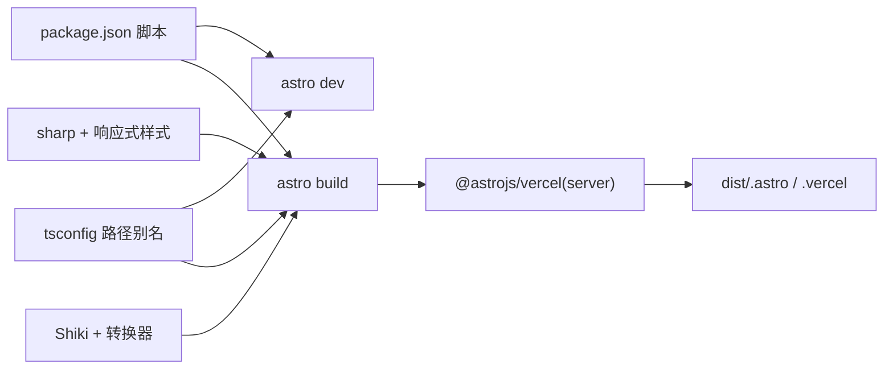

# 构建与部署

<cite>
**本文引用的文件**
- [package.json](file://package.json)
- [astro.config.ts](file://astro.config.ts)
- [README.md](file://README.md)
- [src/site.config.ts](file://src/site.config.ts)
- [uno.config.ts](file://uno.config.ts)
- [tsconfig.json](file://tsconfig.json)
- [src/content.config.ts](file://src/content.config.ts)
- [src/plugins/shiki-custom-transformers.ts](file://src/plugins/shiki-custom-transformers.ts)
- [src/plugins/rehype-auto-link-headings.ts](file://src/plugins/rehype-auto-link-headings.ts)
- [src/components/BaseHead.astro](file://src/components/BaseHead.astro)
- [src/assets/styles/app.css](file://src/assets/styles/app.css)
- [src/assets/styles/global.css](file://src/assets/styles/global.css)
</cite>

## 目录
1. [简介](#简介)
2. [项目结构](#项目结构)
3. [核心组件](#核心组件)
4. [架构总览](#架构总览)
5. [详细组件分析](#详细组件分析)
6. [依赖关系分析](#依赖关系分析)
7. [性能考量](#性能考量)
8. [故障排除指南](#故障排除指南)
9. [结论](#结论)
10. [附录](#附录)

## 简介
本指南面向使用 Astro 主题 Pure 的开发者，系统讲解构建与部署全流程，覆盖以下重点：
- Astro 构建配置优化（性能、资源、代码分割）
- Vercel 平台部署配置（命令、环境变量、CDN 优化）
- 本地构建与预览（生产模拟与性能测试）
- 静态资源优化（图片、字体、缓存）
- CI/CD 集成与自动化部署
- 监控与日志分析
- 故障排除与性能优化最佳实践
- 多环境部署与版本管理

## 项目结构
该项目采用工作区组织，核心目录与职责如下：
- packages/pure：主题包与可复用组件、插件、类型定义
- src：站点源码（页面、布局、内容集合、样式、插件）
- public：无需 Astro 处理的静态资源
- .astro / dist/client：构建产物（Astro 输出与 Vercel 产物）

**图表来源**
- [astro.config.ts](file://astro.config.ts#L1-L133)
- [src/content.config.ts](file://src/content.config.ts#L1-L77)

**章节来源**
- [astro.config.ts](file://astro.config.ts#L1-L133)
- [src/content.config.ts](file://src/content.config.ts#L1-L77)

## 核心组件
- 构建与适配器：使用 Vercel 适配器输出为 server 模式，启用图片响应式与 Sharp 服务
- Markdown 与代码高亮：集成 KaTeX 数学公式、Heading 锚点、Shiki 自定义转换器
- UnoCSS 与主题：基于主题变量与排版预设，提供深色模式与滚动条美化
- 内容模型：定义 blog/docs/process 三类内容集合，含字段校验与去重逻辑
- 字体与图标：启用字体预加载与 SVGO 优化实验特性

**章节来源**
- [astro.config.ts](file://astro.config.ts#L26-L133)
- [uno.config.ts](file://uno.config.ts#L1-L193)
- [src/content.config.ts](file://src/content.config.ts#L1-L77)
- [src/site.config.ts](file://src/site.config.ts#L1-L207)

## 架构总览
下图展示从开发到部署的关键路径：本地构建、Vercel 适配器打包、静态资源与字体优化、CDN 分发。

**图表来源**
- [astro.config.ts](file://astro.config.ts#L36-L42)
- [package.json](file://package.json#L8-L21)

**章节来源**
- [astro.config.ts](file://astro.config.ts#L26-L42)
- [package.json](file://package.json#L8-L21)

## 详细组件分析

### 构建配置与性能优化
- 图片优化与响应式
  - 启用响应式样式与 Sharp 服务入口，提升图片加载性能与体积控制
- Markdown 与代码高亮
  - KaTeX 数学渲染、Heading 锚点、Shiki 主题与自定义转换器（标题、语言标签、复制按钮、折叠）
- 实验性优化
  - SVGO 优化 SVG；字体预加载与优化（FontShare 提供商）
- 路由与输出
  - server 输出模式配合 Vercel；禁用尾随斜杠以减少重复路径

**图表来源**
- [astro.config.ts](file://astro.config.ts#L44-L96)
- [astro.config.ts](file://astro.config.ts#L111-L131)

**章节来源**
- [astro.config.ts](file://astro.config.ts#L44-L96)
- [astro.config.ts](file://astro.config.ts#L111-L131)
- [src/plugins/shiki-custom-transformers.ts](file://src/plugins/shiki-custom-transformers.ts#L1-L153)
- [src/plugins/rehype-auto-link-headings.ts](file://src/plugins/rehype-auto-link-headings.ts#L1-L43)

### UnoCSS 与主题样式
- 主题变量：明/暗两套 HSL 变量，统一颜色语义
- 排版增强：Typography 预设与自定义 CSS 扩展（标题锚点可见性、表格、代码块、滚动条）
- Safelist：保留 TOC 与基础排版类，避免运行时抖动

**图表来源**
- [uno.config.ts](file://uno.config.ts#L14-L125)
- [uno.config.ts](file://uno.config.ts#L174-L193)
- [src/assets/styles/app.css](file://src/assets/styles/app.css#L1-L49)
- [src/assets/styles/global.css](file://src/assets/styles/global.css#L1-L287)

**章节来源**
- [uno.config.ts](file://uno.config.ts#L1-L193)
- [src/assets/styles/app.css](file://src/assets/styles/app.css#L1-L49)
- [src/assets/styles/global.css](file://src/assets/styles/global.css#L1-L287)

### 内容模型与站点配置
- 内容集合：blog/docs/process，统一 schema 校验、标签去重与大小限制
- 站点配置：标题、作者、描述、语言、Logo、页头菜单、页脚、分享、评论系统、搜索等

**图表来源**
- [src/content.config.ts](file://src/content.config.ts#L11-L77)
- [src/site.config.ts](file://src/site.config.ts#L3-L99)

**章节来源**
- [src/content.config.ts](file://src/content.config.ts#L1-L77)
- [src/site.config.ts](file://src/site.config.ts#L1-L207)

### 字体与头部元信息
- 字体预加载：通过 Font 组件按需预加载指定子集与样式
- 元信息：站点标题、描述、社交卡片、Canonical 链接、Manifest 与图标

**图表来源**
- [src/components/BaseHead.astro](file://src/components/BaseHead.astro#L1-L39)
- [astro.config.ts](file://astro.config.ts#L116-L131)

**章节来源**
- [src/components/BaseHead.astro](file://src/components/BaseHead.astro#L1-L39)
- [astro.config.ts](file://astro.config.ts#L116-L131)

## 依赖关系分析
- 构建脚本：dev/build/preview/check/sync/format/lint/clean 等
- 适配器与平台：@astrojs/vercel(server) 输出
- 图像处理：sharp 与 astro/assets/services/sharp
- 语法高亮：shiki 官方与自定义转换器
- 类型与路径别名：tsconfig 配置与路径映射

**图表来源**
- [package.json](file://package.json#L8-L21)
- [astro.config.ts](file://astro.config.ts#L36-L50)
- [tsconfig.json](file://tsconfig.json#L17-L27)

**章节来源**
- [package.json](file://package.json#L1-L45)
- [astro.config.ts](file://astro.config.ts#L36-L50)
- [tsconfig.json](file://tsconfig.json#L1-L31)

## 性能考量
- 构建性能
  - 使用 server 输出与 Vercel 边缘分发，减少冷启动与首字节时间
  - 启用图片响应式与 Sharp 服务，按设备像素比与尺寸裁剪
  - 启用 SVGO 与字体预加载，降低 SVG 体积与字体 FOIT
- 资源优化
  - 代码高亮与折叠：减少长代码块渲染压力
  - 排版与滚动条：轻量 CSS，避免复杂 JS
- 预览与测试
  - 使用 preview 模拟生产环境，结合 Lighthouse 或 WebPageTest 进行端到端评估

**章节来源**
- [astro.config.ts](file://astro.config.ts#L44-L96)
- [uno.config.ts](file://uno.config.ts#L1-L193)
- [src/plugins/shiki-custom-transformers.ts](file://src/plugins/shiki-custom-transformers.ts#L124-L153)

## 故障排除指南
- 构建失败或样式异常
  - 检查 tsconfig 路径别名是否与实际目录一致
  - 确认 UnoCSS safelist 是否包含必要类
- 图片加载问题
  - 确认 Sharp 依赖安装与响应式样式启用
  - 检查图片尺寸与格式是否符合预期
- 字体加载闪烁
  - 确认 Font 预加载参数与字体提供商配置
- 代码高亮不生效
  - 检查 Shiki 转换器是否正确注册与版本兼容
- 预览与生产差异
  - 使用 preview 严格模拟生产环境，排查 SSR/静态导出差异

**章节来源**
- [tsconfig.json](file://tsconfig.json#L17-L27)
- [uno.config.ts](file://uno.config.ts#L184-L191)
- [astro.config.ts](file://astro.config.ts#L44-L50)
- [src/plugins/shiki-custom-transformers.ts](file://src/plugins/shiki-custom-transformers.ts#L1-L153)

## 结论
通过合理配置 Astro 与 Vercel 适配器、启用图片与字体优化、强化 Markdown 与代码高亮体验，并结合本地预览与性能测试，可显著提升站点的加载速度与用户体验。建议在 CI 中加入构建检查与预览验证，确保多环境一致性与质量稳定。

## 附录

### 本地构建与预览流程
- 开发：启动开发服务器，热更新调试
- 构建：执行构建命令，生成 server 产物
- 预览：本地预览生产构建，验证性能与功能
- 清理：一键清理 .astro、.vercel、dist 目录

**章节来源**
- [package.json](file://package.json#L8-L21)
- [README.md](file://README.md#L55-L81)

### Vercel 部署配置要点
- 输出模式：server（与 @astrojs/vercel 配合）
- 构建命令：使用项目脚本中的构建命令
- 环境变量：根据站点配置与第三方服务（如评论、统计）设置
- CDN 优化：利用 Vercel 边缘缓存与图片优化

**章节来源**
- [astro.config.ts](file://astro.config.ts#L36-L42)
- [src/site.config.ts](file://src/site.config.ts#L161-L180)

### 静态资源优化策略
- 图片：启用响应式与 Sharp 服务，按需裁剪与压缩
- 字体：预加载关键子集与样式，减少阻塞
- 缓存：利用 Vercel CDN 与静态资源指纹化

**章节来源**
- [astro.config.ts](file://astro.config.ts#L44-L50)
- [astro.config.ts](file://astro.config.ts#L116-L131)
- [src/components/BaseHead.astro](file://src/components/BaseHead.astro#L30-L36)

### CI/CD 集成与自动化部署
- 在 CI 中执行：安装依赖、类型检查、构建、预览验证
- 将构建产物交由 Vercel 自动部署，或在 CI 中直接触发部署钩子
- 建议开启分支保护与 PR 预览，保证变更质量

**章节来源**
- [package.json](file://package.json#L8-L21)
- [README.md](file://README.md#L55-L81)

### 监控与日志分析
- 使用 Vercel 平台自带的分析与日志面板进行性能观测
- 对关键页面进行端到端测试与性能基线对比

**章节来源**
- [README.md](file://README.md#L22-L33)