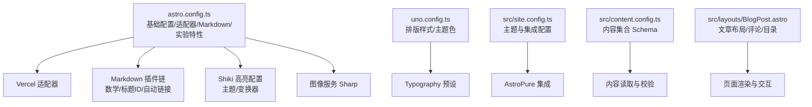
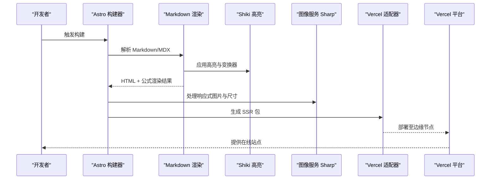
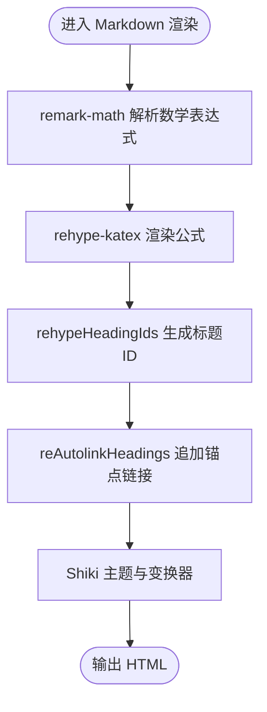
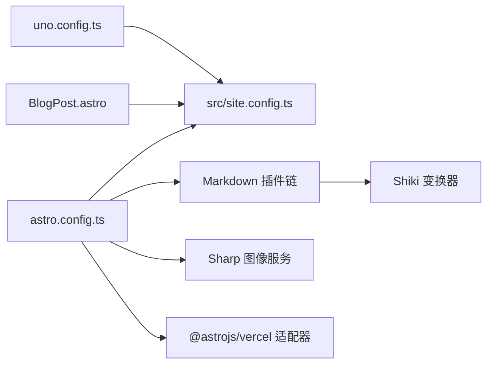

# 构建配置

<cite>
**本文引用的文件**
- [astro.config.ts](file://astro.config.ts)
- [package.json](file://package.json)
- [uno.config.ts](file://uno.config.ts)
- [src/site.config.ts](file://src/site.config.ts)
- [src/content.config.ts](file://src/content.config.ts)
- [src/plugins/rehype-auto-link-headings.ts](file://src/plugins/rehype-auto-link-headings.ts)
- [src/plugins/shiki-custom-transformers.ts](file://src/plugins/shiki-custom-transformers.ts)
- [src/plugins/shiki-official/transformers.ts](file://src/plugins/shiki-official/transformers.ts)
- [src/layouts/BlogPost.astro](file://src/layouts/BlogPost.astro)
</cite>

## 目录
1. [简介](#简介)
2. [项目结构](#项目结构)
3. [核心组件](#核心组件)
4. [架构总览](#架构总览)
5. [详细组件分析](#详细组件分析)
6. [依赖关系分析](#依赖关系分析)
7. [性能考量](#性能考量)
8. [故障排查指南](#故障排查指南)
9. [结论](#结论)
10. [附录](#附录)

## 简介
本文件系统化梳理该 Astro 项目的构建配置，重点覆盖以下方面：
- 基础配置：站点信息、路径与尾斜杠策略
- 适配器配置：Vercel 适配器与输出模式
- 资源优化：图像服务与 Sharp 处理、SVGO 实验特性
- Markdown 配置：数学公式、代码高亮、自动链接标题等
- 主题与集成：AstroPure 主题集成、UnoCSS 排版样式
- 实验性功能：内容智能感知、SVG 优化、字体预加载
- 性能优化与最佳实践：缓存策略、资源加载优化
- 常见问题与调试技巧

## 项目结构
该项目采用“主题 + 内容 + 插件”的分层组织方式：
- 根级配置：astro.config.ts、package.json、uno.config.ts
- 主题与集成：src/site.config.ts（主题与集成配置）
- 内容模型：src/content.config.ts（内容集合定义）
- Markdown 插件：src/plugins 下的自定义与官方 Shiki 变换器
- 页面布局：src/layouts/BlogPost.astro（示例文章布局）

图表来源
- [astro.config.ts](file://astro.config.ts#L26-L132)
- [uno.config.ts](file://uno.config.ts#L174-L192)
- [src/site.config.ts](file://src/site.config.ts#L1-L207)
- [src/content.config.ts](file://src/content.config.ts#L1-L77)
- [src/layouts/BlogPost.astro](file://src/layouts/BlogPost.astro#L1-L75)

章节来源
- [astro.config.ts](file://astro.config.ts#L26-L132)
- [uno.config.ts](file://uno.config.ts#L174-L192)
- [src/site.config.ts](file://src/site.config.ts#L1-L207)
- [src/content.config.ts](file://src/content.config.ts#L1-L77)
- [src/layouts/BlogPost.astro](file://src/layouts/BlogPost.astro#L1-L75)

## 核心组件
- 基础配置
  - 站点地址与尾斜杠策略：用于生成绝对链接与避免重复路径
  - 开发服务器主机暴露：便于局域网联调
- 适配器与输出
  - Vercel 适配器与 SSR 输出模式，适配边缘运行时
- 图像与资源
  - 启用响应式样式与 Sharp 图像服务，提升图片加载体验
  - 实验性开启 SVGO 优化 SVG 资产
- Markdown
  - 数学公式：remark-math + rehype-katex
  - 代码高亮：Shiki 主题与多类变换器（标题、语言标签、复制按钮、折叠、差异/高亮标记）
  - 自动链接标题：为每个标题生成锚点并追加“#”链接
- 主题与集成
  - AstroPure 集成：自动注入 sitemap、MDX、UnoCSS，并提供丰富的 UI 组件与交互
  - UnoCSS 排版：Typography 预设与主题色映射，增强阅读体验
- 实验性功能
  - 内容智能感知：提升编辑器对内容集合的类型提示
  - 字体预加载：通过 Fontshare 提供字体，按需权重与子集

章节来源
- [astro.config.ts](file://astro.config.ts#L26-L132)
- [uno.config.ts](file://uno.config.ts#L174-L192)
- [src/site.config.ts](file://src/site.config.ts#L1-L207)

## 架构总览
下图展示从构建到部署的关键流程：配置驱动 Markdown 渲染、Shiki 高亮、图像处理与适配器打包，最终由 Vercel 边缘运行时提供 SSR 服务。

图表来源
- [astro.config.ts](file://astro.config.ts#L26-L132)
- [src/plugins/shiki-custom-transformers.ts](file://src/plugins/shiki-custom-transformers.ts#L1-L153)
- [src/plugins/shiki-official/transformers.ts](file://src/plugins/shiki-official/transformers.ts#L1-L123)

## 详细组件分析

### 基础配置（site、base、trailingSlash、server）
- site：统一的站点根 URL，用于生成 Open Graph、RSS、Sitemap 等绝对链接
- base：可选的子路径部署（当前注释掉），如启用需配合平台的子路径支持
- trailingSlash：设置为“从不”，避免重复路径与 SEO 影响
- server.host：开发时允许外部访问，便于联调

章节来源
- [astro.config.ts](file://astro.config.ts#L26-L35)

### 适配器配置（Vercel 适配器）
- 使用 @astrojs/vercel 适配器，输出模式为 server（SSR）
- 本地开发可切换为 Node standalone 模式进行调试

章节来源
- [astro.config.ts](file://astro.config.ts#L36-L42)
- [package.json](file://package.json#L23-L34)

### 资源优化配置（图像服务、SVGO 优化）
- 图像服务
  - responsiveStyles：启用响应式样式，自动根据设备像素比选择合适尺寸
  - service.entrypoint：使用 Astro 内置 Sharp 服务处理图片
- SVGO 实验特性
  - experimental.svgo：开启 SVG 优化，减少体积与冗余

章节来源
- [astro.config.ts](file://astro.config.ts#L44-L50)
- [astro.config.ts](file://astro.config.ts#L106-L114)

### Markdown 配置（数学公式、代码高亮、自动链接标题）
- 数学公式
  - remarkPlugins：remark-math 支持 LaTeX 行内/块级语法
  - rehypePlugins：rehype-katex 将 LaTeX 渲染为 HTML
- 代码高亮与增强
  - themes：light/dark 主题分别指定
  - transformers：官方与自定义变换器组合
    - 官方：diff/highlight 标记、转义移除
    - 自定义：容器样式包裹、标题、语言标签、复制按钮、折叠
- 自动链接标题
  - rehypeHeadingIds：为标题生成 ID
  - rehypeAutolinkHeadings：在标题后追加“#”锚点链接，行为为 append，属性包含自定义类名与文本内容

图表来源
- [astro.config.ts](file://astro.config.ts#L52-L96)
- [src/plugins/rehype-auto-link-headings.ts](file://src/plugins/rehype-auto-link-headings.ts#L1-L43)
- [src/plugins/shiki-custom-transformers.ts](file://src/plugins/shiki-custom-transformers.ts#L1-L153)
- [src/plugins/shiki-official/transformers.ts](file://src/plugins/shiki-official/transformers.ts#L1-L123)

章节来源
- [astro.config.ts](file://astro.config.ts#L52-L96)
- [src/plugins/rehype-auto-link-headings.ts](file://src/plugins/rehype-auto-link-headings.ts#L1-L43)
- [src/plugins/shiki-custom-transformers.ts](file://src/plugins/shiki-custom-transformers.ts#L1-L153)
- [src/plugins/shiki-official/transformers.ts](file://src/plugins/shiki-official/transformers.ts#L1-L123)

### 主题集成配置（AstroPure）
- AstroPure 集成：自动注入 sitemap、MDX、UnoCSS
- 主题配置（src/site.config.ts）：标题、作者、描述、语言、Logo、页头/页脚菜单、分享、页脚社交等
- 集成配置（src/site.config.ts）：链接日志、随机语录、排版风格、MediumZoom、Waline 评论系统等

章节来源
- [astro.config.ts](file://astro.config.ts#L98-L104)
- [src/site.config.ts](file://src/site.config.ts#L1-L207)

### UnoCSS 排版样式（Typography）
- 预设：presetMini + presetTypography
- 主题色：基于 CSS 变量映射，统一前景/背景/强调色
- 自定义规则：如 sr-only、object-cover、line-clamp 系列
- Typography 样式：标题滚动锚点、链接断词、内联代码现代样式、引用块装饰、表格与列表排版等

章节来源
- [uno.config.ts](file://uno.config.ts#L174-L192)

### 内容模型（Content Collections）
- blog/docs/process 三类集合，使用 glob 加载 Markdown/MDX
- Schema 校验：标题长度、日期、heroImage 结构、标签去重与小写化、草稿与评论开关等
- 文档集合额外字段：order 用于排序

章节来源
- [src/content.config.ts](file://src/content.config.ts#L1-L77)

### 页面布局（示例：BlogPost.astro）
- 引入 KaTeX 样式
- 使用 AstroPure 组件：Hero、TOC、ArticleBottom、Copyright、MediumZoom
- 读取虚拟配置（virtual:config）以控制高亮颜色与交互
- 条件渲染：评论、文章推荐、目录侧边栏

章节来源
- [src/layouts/BlogPost.astro](file://src/layouts/BlogPost.astro#L1-L75)

## 依赖关系分析
- 配置耦合
  - astro.config.ts 依赖主题配置（src/site.config.ts）以传递集成参数
  - Markdown 插件链依赖 Shiki 变换器与官方工具函数
  - UnoCSS 与主题色变量联动，影响排版与组件样式
- 外部依赖
  - @astrojs/vercel、@astrojs/rss、katex、rehype-katex、remark-math、sharp、astro-pure 等
- 潜在循环依赖
  - 当前未发现直接循环导入；主题配置通过默认导出被 AstroPure 集成消费

图表来源
- [astro.config.ts](file://astro.config.ts#L23-L104)
- [src/site.config.ts](file://src/site.config.ts#L1-L207)
- [uno.config.ts](file://uno.config.ts#L174-L192)
- [src/layouts/BlogPost.astro](file://src/layouts/BlogPost.astro#L1-L75)

章节来源
- [astro.config.ts](file://astro.config.ts#L23-L104)
- [src/site.config.ts](file://src/site.config.ts#L1-L207)
- [uno.config.ts](file://uno.config.ts#L174-L192)
- [src/layouts/BlogPost.astro](file://src/layouts/BlogPost.astro#L1-L75)

## 性能考量
- 构建与运行时
  - SSR 输出与 Vercel 边缘运行时结合，有利于首屏渲染与 SEO
  - 响应式图片与 Sharp 处理可显著降低带宽与加载时间
- 资源加载优化
  - 启用 SVGO 减少 SVG 体积
  - 字体预加载与 subset 控制，减少阻塞
- 缓存策略
  - 利用 Vercel 默认缓存与静态资源指纹化
  - 对于动态内容（如评论、随机语录），合理设置缓存头与失效策略
- 代码高亮与交互
  - 仅在需要的页面引入 KaTeX 样式，避免全局负担
  - 将复制按钮与折叠逻辑按需触发，减少 DOM 体积

[本节为通用指导，无需特定文件来源]

## 故障排查指南
- Markdown 数学公式不显示
  - 检查 remark-math 与 rehype-katex 是否正确注册
  - 确认 KaTeX 样式已在页面中引入（示例布局已引入）
- 代码高亮异常或样式缺失
  - 确认 Shiki 主题与变换器顺序正确
  - 检查自定义变换器是否按预期包裹容器与插入元素
- 标题锚点无效
  - 确保 rehypeHeadingIds 在 rehypeAutolinkHeadings 之前执行
  - 检查行为参数与自定义属性是否符合预期
- 图片加载缓慢
  - 确认 Sharp 服务已启用且响应式样式生效
  - 检查图片尺寸与格式是否合理
- 适配器部署失败
  - 确认输出模式与平台要求一致
  - 检查本地 standalone 模式是否能正常启动
- UnoCSS 排版样式未生效
  - 确认 presetMini 与 presetTypography 已启用
  - 检查主题色变量与 safelist 配置

章节来源
- [astro.config.ts](file://astro.config.ts#L52-L96)
- [src/plugins/rehype-auto-link-headings.ts](file://src/plugins/rehype-auto-link-headings.ts#L1-L43)
- [src/plugins/shiki-custom-transformers.ts](file://src/plugins/shiki-custom-transformers.ts#L1-L153)
- [uno.config.ts](file://uno.config.ts#L174-L192)
- [src/layouts/BlogPost.astro](file://src/layouts/BlogPost.astro#L1-L75)

## 结论
该配置以 AstroPure 为主题基座，结合 Vercel 适配器与 SSR 输出，实现了高性能、可维护的静态/动态混合站点。通过完善的 Markdown 插件链、Shiki 高亮与 UnoCSS 排版，兼顾了内容表达力与阅读体验。建议在生产环境中持续关注资源体积与加载性能，配合 CDN 与缓存策略进一步优化。

[本节为总结性内容，无需特定文件来源]

## 附录
- 最佳实践清单
  - 固定站点地址与尾斜杠策略，避免重复路径
  - 优先使用响应式图片与合适的格式（如 AVIF/WebP）
  - 合理拆分 Markdown 插件链，按需启用功能
  - 对字体与图标资源进行子集化与预加载
  - 使用虚拟配置集中管理主题与集成开关
- 常见问题速查
  - 适配器输出模式与平台要求不符
  - Shiki 变换器版本冲突导致类型错误（已通过 @ts-ignore 处理）
  - SVG 体积过大影响加载性能

[本节为通用指导，无需特定文件来源]