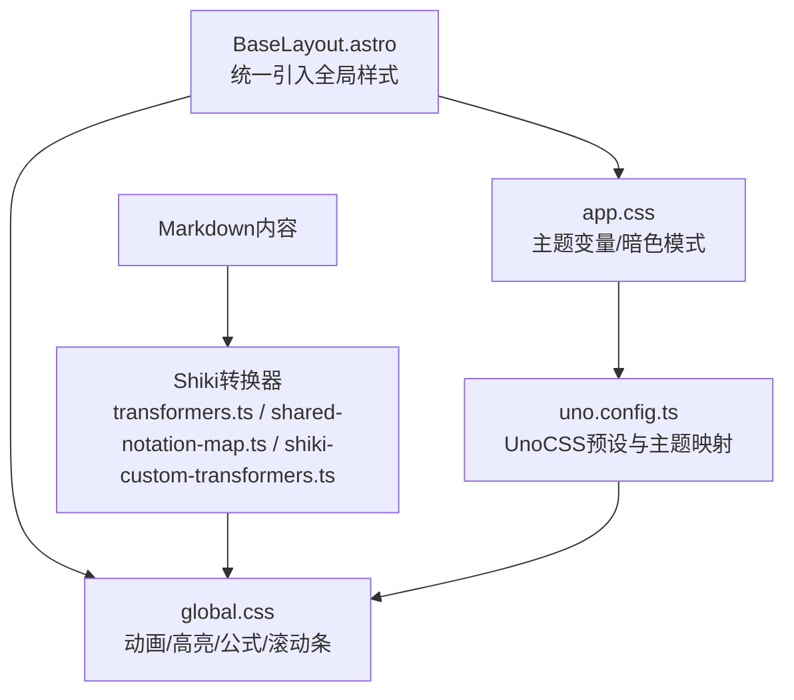
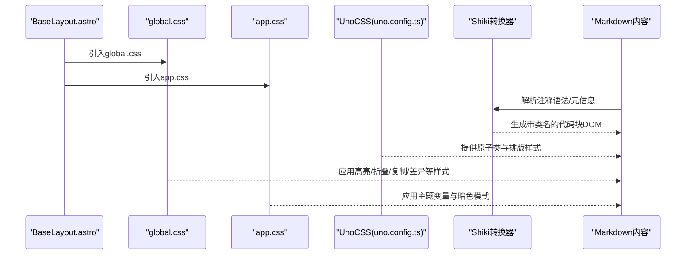
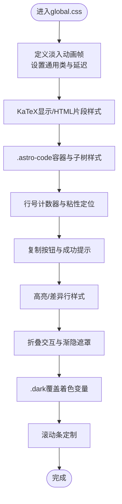
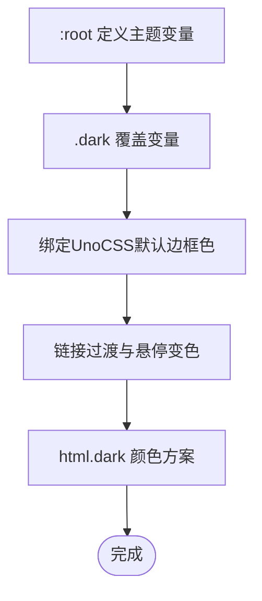
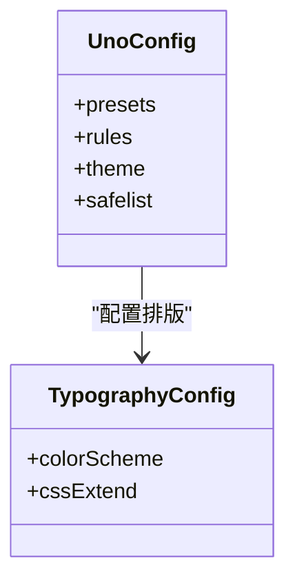
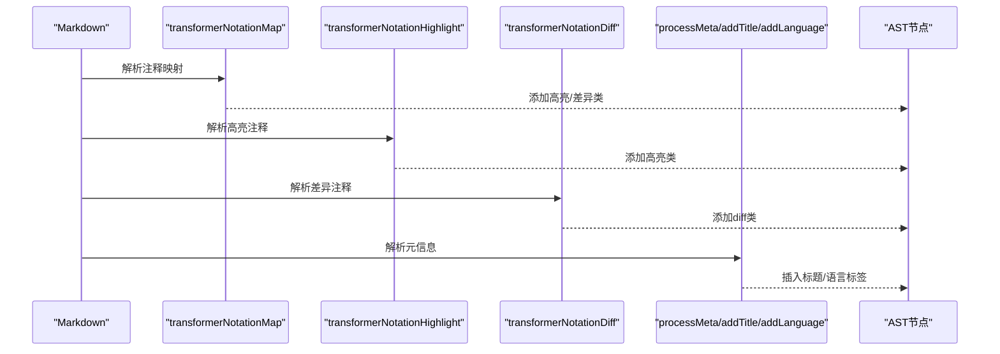
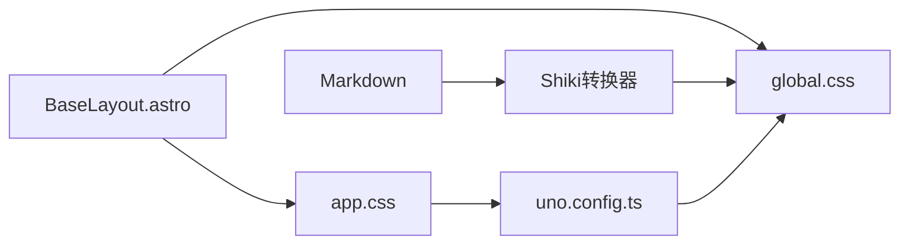

# CSS架构设计

<cite>
**本文引用的文件列表**
- [global.css](file://src/assets/styles/global.css)
- [app.css](file://src/assets/styles/app.css)
- [BaseLayout.astro](file://src/layouts/BaseLayout.astro)
- [uno.config.ts](file://uno.config.ts)
- [transformers.ts](file://src/plugins/shiki-official/transformers.ts)
- [shared-notation-map.ts](file://src/plugins/shiki-official/shared-notation-map.ts)
- [shiki-custom-transformers.ts](file://src/plugins/shiki-custom-transformers.ts)
- [clsx.ts](file://packages/pure/utils/clsx.ts)
</cite>

## 目录
1. [引言](#引言)
2. [项目结构](#项目结构)
3. [核心组件](#核心组件)
4. [架构总览](#架构总览)
5. [详细组件分析](#详细组件分析)
6. [依赖关系分析](#依赖关系分析)
7. [性能考量](#性能考量)
8. [故障排查指南](#故障排查指南)
9. [结论](#结论)
10. [附录](#附录)

## 引言
本文件面向Astro主题Pure的CSS架构，系统性阐述global.css与app.css的职责分工、模块化组织方式、关键选择器使用模式（伪类、属性、组合）、动画与过渡实现（淡入、减少动画模式支持）、以及性能优化策略与扩展维护建议。目标是帮助开发者在不深入源码的前提下理解并高效扩展该主题的样式体系。

## 项目结构
Pure主题采用“布局级引入 + 主题变量 + UnoCSS预设”的分层组织：
- 布局层：通过BaseLayout统一引入global.css与app.css，保证全局样式在所有页面生效。
- 主题层：app.css集中定义CSS变量与暗色模式切换逻辑，形成主题色彩与基础样式的统一入口。
- 全局层：global.css负责动画、代码高亮、数学公式、滚动条等通用UI增强。
- 工具层：UnoCSS配置与自定义转换器（Shiki）共同驱动Markdown渲染产物的样式生成与交互。

图表来源
- [BaseLayout.astro](file://src/layouts/BaseLayout.astro#L7-L10)
- [global.css](file://src/assets/styles/global.css#L1-L287)
- [app.css](file://src/assets/styles/app.css#L1-L49)
- [uno.config.ts](file://uno.config.ts#L1-L193)
- [transformers.ts](file://src/plugins/shiki-official/transformers.ts#L1-L122)
- [shared-notation-map.ts](file://src/plugins/shiki-official/shared-notation-map.ts#L1-L48)
- [shiki-custom-transformers.ts](file://src/plugins/shiki-custom-transformers.ts#L1-L85)

章节来源
- [BaseLayout.astro](file://src/layouts/BaseLayout.astro#L7-L10)
- [uno.config.ts](file://uno.config.ts#L1-L193)

## 核心组件
- global.css：负责全局动画、代码高亮（含行号、复制、折叠、差异高亮）、数学公式（KaTeX）适配、滚动条美化等。
- app.css：集中定义主题变量（明/暗色模式）、基础链接过渡、根元素颜色方案等。
- UnoCSS：通过presetMini与presetTypography提供原子类与排版样式，并将主题变量映射到HSL通道。
- Shiki转换器：将Markdown中的代码块注释语法转换为高亮/差异/标题/语言标签等DOM结构，再由global.css样式进行渲染。

章节来源
- [global.css](file://src/assets/styles/global.css#L1-L287)
- [app.css](file://src/assets/styles/app.css#L1-L49)
- [uno.config.ts](file://uno.config.ts#L127-L143)
- [transformers.ts](file://src/plugins/shiki-official/transformers.ts#L1-L122)
- [shared-notation-map.ts](file://src/plugins/shiki-official/shared-notation-map.ts#L1-L48)
- [shiki-custom-transformers.ts](file://src/plugins/shiki-custom-transformers.ts#L1-L85)

## 架构总览
整体架构围绕“布局注入 + 主题变量 + UnoCSS + Shiki转换器”的协同工作流展开。BaseLayout在HTML层面引入global与app，UnoCSS在构建期生成原子类，Shiki在渲染期将Markdown转换为带语义类名的DOM，最终由global.css完成视觉呈现。

图表来源
- [BaseLayout.astro](file://src/layouts/BaseLayout.astro#L7-L10)
- [global.css](file://src/assets/styles/global.css#L54-L271)
- [app.css](file://src/assets/styles/app.css#L1-L49)
- [uno.config.ts](file://uno.config.ts#L174-L192)
- [transformers.ts](file://src/plugins/shiki-official/transformers.ts#L1-L122)
- [shared-notation-map.ts](file://src/plugins/shiki-official/shared-notation-map.ts#L1-L48)
- [shiki-custom-transformers.ts](file://src/plugins/shiki-custom-transformers.ts#L1-L85)

## 详细组件分析

### global.css：全局样式与动画
- 动画与过渡
  - 定义了淡入向上动画帧与通用类，配合减少动画模式媒体查询降低动画时长，体现对无障碍的支持。
  - 通过选择器为不同区域设置动画延迟，形成有序的页面进入动效。
- 数学公式（KaTeX）
  - 对显示模式容器与HTML片段进行溢出与内边距处理，确保公式在滚动与居中方面的可读性。
- 代码高亮（Shiki）
  - 针对.astro-code容器及其子树（pre/code/行号）进行布局与计数器设置，实现行号固定与粘性定位。
  - 支持标题、语言标签、复制按钮、高亮行、差异行（新增/删除）与折叠交互。
  - 暗色模式下覆盖着色变量，保证高亮一致性。
- 滚动条
  - 通过CSS变量与WebKit伪元素定制滚动条外观，提升阅读体验。

图表来源
- [global.css](file://src/assets/styles/global.css#L1-L287)

章节来源
- [global.css](file://src/assets/styles/global.css#L1-L287)

### app.css：主题变量与基础样式
- 主题变量
  - 在:root与.dark中分别定义主色、前景、背景、卡片、边框、输入、环等HSL变量，形成明/暗两套色彩体系。
  - 将UnoCSS默认边框色映射至CSS变量，确保原子类与主题一致。
- 基础样式
  - 链接默认过渡与悬停变色，提升交互反馈。
  - html.dark设置颜色方案，便于浏览器与系统级主题联动。

图表来源
- [app.css](file://src/assets/styles/app.css#L1-L49)

章节来源
- [app.css](file://src/assets/styles/app.css#L1-L49)

### UnoCSS：原子类与排版
- 预设与主题映射
  - 启用presetMini与presetTypography，将主题变量映射为colors与排版颜色方案，确保原子类与主题一致。
- 排版增强
  - 针对标题锚点、链接、内联代码、块引用、表格、列表等提供样式与阴影/圆角等装饰。
- 自定义规则
  - 提供sr-only、object-cover、bg-cover与行数限制等实用规则，满足常见布局需求。

图表来源
- [uno.config.ts](file://uno.config.ts#L174-L192)

章节来源
- [uno.config.ts](file://uno.config.ts#L1-L193)

### Shiki转换器：代码块语义与交互
- 注释映射
  - 将Markdown注释语法（如高亮/差异/换行范围）映射为类名，供global.css渲染。
- 元信息处理
  - 解析代码块元信息（title/lang），动态插入标题与语言标签节点。
- 工具函数
  - clsx用于合并条件类名，简化组件类名拼接。

图表来源
- [shared-notation-map.ts](file://src/plugins/shiki-official/shared-notation-map.ts#L23-L48)
- [transformers.ts](file://src/plugins/shiki-official/transformers.ts#L31-L53)
- [transformers.ts](file://src/plugins/shiki-official/transformers.ts#L74-L95)
- [shiki-custom-transformers.ts](file://src/plugins/shiki-custom-transformers.ts#L33-L85)
- [clsx.ts](file://packages/pure/utils/clsx.ts#L5-L22)

章节来源
- [shared-notation-map.ts](file://src/plugins/shiki-official/shared-notation-map.ts#L1-L48)
- [transformers.ts](file://src/plugins/shiki-official/transformers.ts#L1-L122)
- [shiki-custom-transformers.ts](file://src/plugins/shiki-custom-transformers.ts#L1-L85)
- [clsx.ts](file://packages/pure/utils/clsx.ts#L1-L25)

## 依赖关系分析
- BaseLayout对global.css与app.css存在直接依赖，确保全局样式贯穿所有页面。
- UnoCSS与Shiki转换器共同影响Markdown渲染产物的类名与结构，进而被global.css消费。
- app.css中的CSS变量被UnoCSS的颜色映射与global.css的HSL变量共同使用，形成统一的主题语义。

图表来源
- [BaseLayout.astro](file://src/layouts/BaseLayout.astro#L7-L10)
- [global.css](file://src/assets/styles/global.css#L1-L287)
- [app.css](file://src/assets/styles/app.css#L1-L49)
- [uno.config.ts](file://uno.config.ts#L1-L193)
- [transformers.ts](file://src/plugins/shiki-official/transformers.ts#L1-L122)

章节来源
- [BaseLayout.astro](file://src/layouts/BaseLayout.astro#L7-L10)
- [uno.config.ts](file://uno.config.ts#L1-L193)

## 性能考量
- 选择器优化
  - 优先使用类选择器与后代选择器，避免深层复杂嵌套与通配符匹配，降低匹配成本。
  - 复杂交互（如复制按钮、语言标签）采用局部hover/focus-within，避免全局监听。
- 减少重绘重排
  - 使用transform与opacity进行动画，避免频繁触发布局与绘制。
  - 代码块行号使用sticky定位，配合最小化的伪元素与线性渐变遮罩，减少滚动时的重排压力。
- 变量与缓存
  - CSS变量统一管理主题色，减少重复计算；WebKit滚动条变量复用，避免多次声明。
- 渐进增强
  - 通过prefers-reduced-motion媒体查询降低动画时长，保障无障碍同时兼顾性能。

[本节为通用性能建议，无需特定文件引用]

## 故障排查指南
- 代码高亮异常
  - 检查是否正确引入global.css与app.css，确认.astro-code容器与子树结构未被外部样式覆盖。
  - 若出现行号错位，确认计数器与粘性定位的z-index与背景色层级合理。
- 数学公式显示问题
  - 确认KaTeX相关容器的溢出与内边距设置未被覆盖；检查容器尺寸与滚动行为。
- 暗色模式不生效
  - 检查.app.css中.dark块是否正确加载；确认html.dark颜色方案已启用。
- UnoCSS原子类失效
  - 检查uno.config.ts中的颜色映射与safelist配置；确认构建产物包含所需类名。

章节来源
- [global.css](file://src/assets/styles/global.css#L54-L271)
- [app.css](file://src/assets/styles/app.css#L19-L40)
- [uno.config.ts](file://uno.config.ts#L127-L143)

## 结论
Pure主题的CSS架构以“布局注入 + 主题变量 + UnoCSS + Shiki转换器”为核心，通过global.css与app.css的职责划分，实现了从主题语义到具体视觉细节的完整链路。该架构具备良好的模块化、可维护性与可扩展性，适合在保持一致性的前提下进行样式增强与功能扩展。

[本节为总结性内容，无需特定文件引用]

## 附录
- 关键选择器使用模式
  - 伪类：hover、focus-within、:has、:not、:first-child、:last-child、:empty、:only-child等，用于交互态与结构态控制。
  - 属性选择器：用于根据属性值或存在性添加样式（如语言标签）。
  - 组合选择器：后代/子代组合，限定作用域，避免全局污染。
- 动画与过渡
  - 使用@keyframes与transform/opacity实现轻量动画；通过prefers-reduced-motion适配无障碍。
- 扩展与维护建议
  - 新增样式时优先在global.css中按功能域（动画/高亮/公式/滚动条）组织，避免分散。
  - 通过UnoCSS预设与自定义规则统一常用布局与排版，减少重复样式。
  - 使用clsx等工具函数管理组件类名，保持可读性与可测试性。

[本节为通用指导，无需特定文件引用]