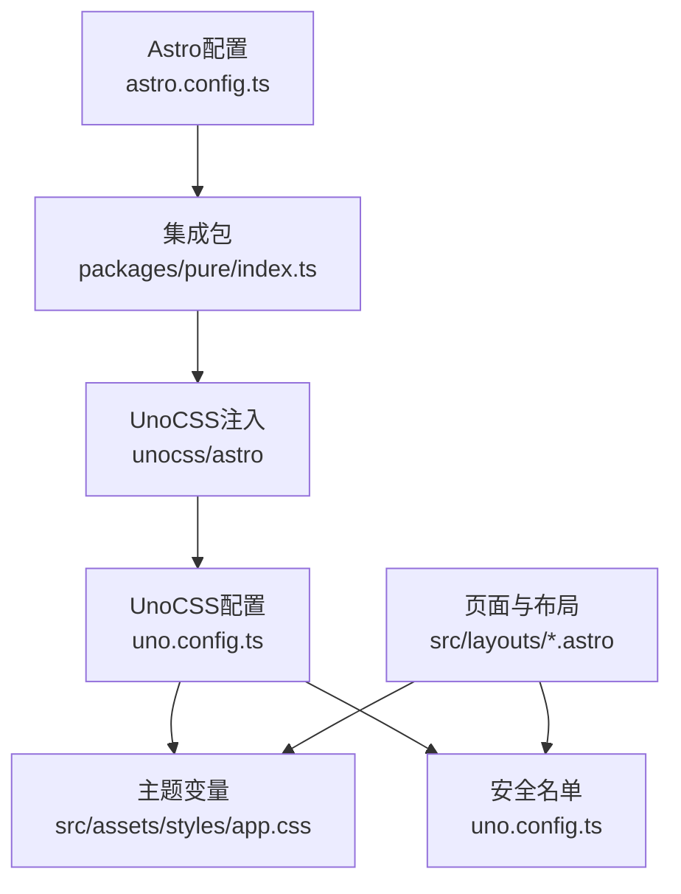
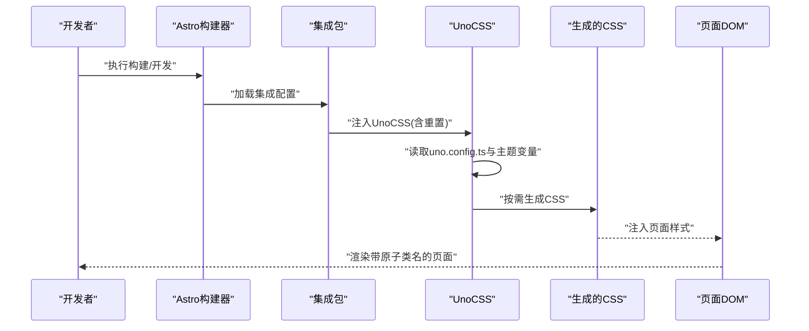
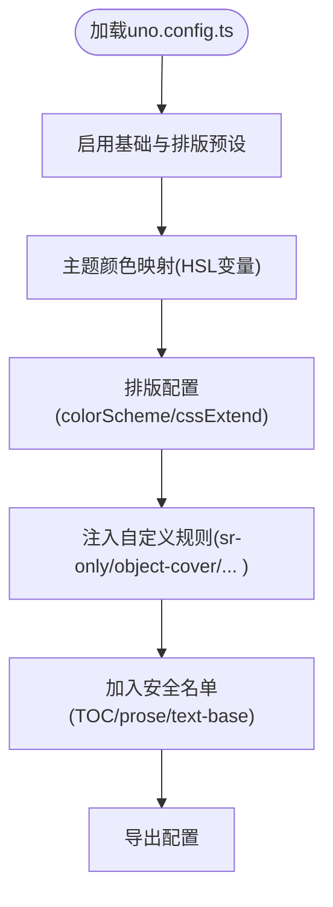
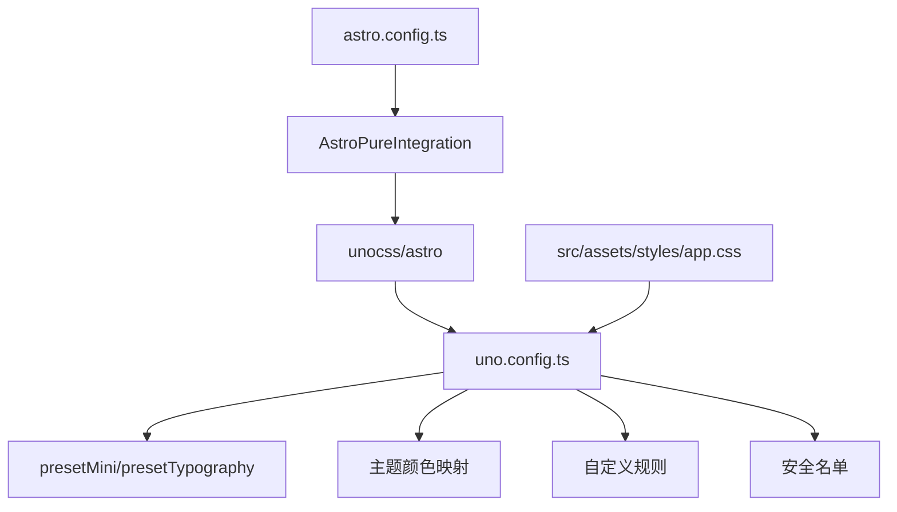

# UnoCSS配置

<cite>
**本文引用的文件**
- [uno.config.ts](file://uno.config.ts)
- [astro.config.ts](file://astro.config.ts)
- [src/site.config.ts](file://src/site.config.ts)
- [packages/pure/index.ts](file://packages/pure/index.ts)
- [src/assets/styles/app.css](file://src/assets/styles/app.css)
- [src/assets/styles/global.css](file://src/assets/styles/global.css)
- [src/layouts/BaseLayout.astro](file://src/layouts/BaseLayout.astro)
- [src/components/BaseHead.astro](file://src/components/BaseHead.astro)
- [src/pages/index.astro](file://src/pages/index.astro)
- [src/layouts/BlogPost.astro](file://src/layouts/BlogPost.astro)
- [packages/pure/utils/theme.ts](file://packages/pure/utils/theme.ts)
</cite>

## 目录
1. [简介](#简介)
2. [项目结构](#项目结构)
3. [核心组件](#核心组件)
4. [架构总览](#架构总览)
5. [详细组件分析](#详细组件分析)
6. [依赖分析](#依赖分析)
7. [性能考虑](#性能考虑)
8. [故障排查指南](#故障排查指南)
9. [结论](#结论)
10. [附录](#附录)

## 简介
本文件面向在Astro项目中使用UnoCSS的开发者，系统性阐述UnoCSS配置体系在本项目中的落地方式，包括配置文件结构、参数作用、原子化CSS工作原理与类名生成规则、样式提取机制、自定义样式与快捷方式、主题变量映射、性能优化策略、与其他CSS框架的集成与兼容性，以及扩展与定制建议。内容基于仓库中的实际配置与使用进行归纳总结，帮助读者快速理解并高效扩展。

## 项目结构
本项目采用“集成式配置 + 主题变量 + 组件内类名”的组织方式：
- UnoCSS配置集中在根目录的配置文件中，启用基础预设与排版预设，并注入主题变量与自定义规则。
- Astro侧通过集成包自动注入UnoCSS，确保样式在构建期按需生成并在运行时生效。
- 主题变量通过CSS变量与HSL色空间在全局样式中统一管理，UnoCSS通过主题映射与安全名单保障关键类名稳定输出。

图表来源
- [astro.config.ts](file://astro.config.ts#L98-L104)
- [packages/pure/index.ts](file://packages/pure/index.ts#L48-L50)
- [uno.config.ts](file://uno.config.ts#L174-L192)
- [src/assets/styles/app.css](file://src/assets/styles/app.css#L1-L48)

章节来源
- [astro.config.ts](file://astro.config.ts#L98-L104)
- [packages/pure/index.ts](file://packages/pure/index.ts#L48-L50)
- [uno.config.ts](file://uno.config.ts#L174-L192)
- [src/assets/styles/app.css](file://src/assets/styles/app.css#L1-L48)

## 核心组件
- UnoCSS配置（uno.config.ts）
  - 启用基础预设与排版预设，定义颜色主题映射，注入自定义规则，设置安全名单。
  - 使用站点配置中的排版选项动态调整排版样式。
- Astro集成（packages/pure/index.ts）
  - 在Astro配置中自动注入UnoCSS，确保样式重置与按需生成。
- 主题变量（src/assets/styles/app.css）
  - 定义明暗主题下的HSL变量与默认边框色，供UnoCSS主题映射与CSS变量消费。
- 页面与布局（src/layouts/*.astro）
  - 在布局与页面中直接使用UnoCSS类名，如背景、文字、容器尺寸等。
- 全局样式（src/assets/styles/global.css）
  - 为代码块、滚动条、KaTeX等提供额外样式，与UnoCSS类名协同工作。

章节来源
- [uno.config.ts](file://uno.config.ts#L1-L193)
- [packages/pure/index.ts](file://packages/pure/index.ts#L19-L50)
- [src/assets/styles/app.css](file://src/assets/styles/app.css#L1-L48)
- [src/layouts/BaseLayout.astro](file://src/layouts/BaseLayout.astro#L30-L49)
- [src/assets/styles/global.css](file://src/assets/styles/global.css#L1-L287)

## 架构总览
下图展示UnoCSS在Astro项目中的端到端工作流：Astro启动时由集成包注入UnoCSS，UnoCSS读取配置与主题变量，按需生成CSS并注入页面；页面与组件通过类名消费原子化样式。

图表来源
- [packages/pure/index.ts](file://packages/pure/index.ts#L48-L50)
- [uno.config.ts](file://uno.config.ts#L174-L192)
- [src/assets/styles/app.css](file://src/assets/styles/app.css#L1-L48)

## 详细组件分析

### UnoCSS配置（uno.config.ts）解析
- 预设与主题
  - 基础预设与排版预设启用，保证常用原子类与排版样式可用。
  - 主题颜色映射使用HSL变量占位符，与全局CSS变量保持一致。
- 排版配置（TypographyOptions）
  - 颜色方案：标题、正文、链接、粗体、引用、代码、表格边框等均基于主题变量。
  - CSS扩展：标题锚点可见性、内联代码块现代样式、块引用装饰、表格与列表样式、图片圆角、键盘元素阴影等。
  - 可选样式：根据站点配置决定块引用与内联代码块的风格。
- 自定义规则
  - sr-only：可访问性隐藏类。
  - object-cover、bg-cover：图像与背景覆盖快捷方式。
  - line-clamp-n：多行文本截断的动态规则。
- 安全名单
  - TOC与排版类名加入安全名单，避免被摇树移除导致样式缺失。

图表来源
- [uno.config.ts](file://uno.config.ts#L14-L125)
- [uno.config.ts](file://uno.config.ts#L127-L172)
- [uno.config.ts](file://uno.config.ts#L184-L192)

章节来源
- [uno.config.ts](file://uno.config.ts#L1-L193)

### Astro集成与UnoCSS注入（packages/pure/index.ts）
- 集成包在Astro配置阶段检测是否已存在UnoCSS，若无则自动注入，并开启样式重置。
- 这保证了UnoCSS在项目中的统一接入，无需手动维护重复配置。

章节来源
- [packages/pure/index.ts](file://packages/pure/index.ts#L48-L50)

### 主题变量与颜色系统（src/assets/styles/app.css）
- 明/暗两套HSL变量，包含主色、前景、背景、柔和前景、柔和背景、卡片、边框、输入、环形光等。
- 默认边框色与颜色模式声明，配合UnoCSS主题映射与CSS变量消费。
- 全局链接过渡与悬停颜色使用主题变量，确保一致性。

章节来源
- [src/assets/styles/app.css](file://src/assets/styles/app.css#L1-L48)

### 页面与布局中的类名使用（src/layouts/*.astro）
- 布局层：使用背景与文字颜色类名，容器宽度与最大宽度约束，安全区域适配。
- 页面层：首页与文章页通过类名组合实现卡片、标签、按钮、导航等UI元素的原子化样式。

章节来源
- [src/layouts/BaseLayout.astro](file://src/layouts/BaseLayout.astro#L30-L49)
- [src/pages/index.astro](file://src/pages/index.astro#L44-L95)
- [src/layouts/BlogPost.astro](file://src/layouts/BlogPost.astro#L47-L72)

### 全局样式与UnoCSS协作（src/assets/styles/global.css）
- 代码块样式：基于主题变量与UnoCSS类名共同实现高亮、行号、复制按钮、折叠等交互。
- 滚动条：使用主题变量控制滚动条外观。
- KaTeX：为数学公式渲染提供必要的滚动与对齐样式。

章节来源
- [src/assets/styles/global.css](file://src/assets/styles/global.css#L54-L287)

### 类名生成规则与样式提取机制
- 类名生成规则
  - 基于预设与自定义规则生成原子类，如颜色、尺寸、布局、排版等。
  - 动态规则支持通配匹配（如line-clamp-n），实现灵活的样式组合。
- 样式提取机制
  - UnoCSS在构建期扫描模板与组件中的类名，仅生成实际使用的样式。
  - 安全名单确保关键类名不被摇树移除。
- 主题变量映射
  - UnoCSS主题颜色映射到CSS变量，运行时通过切换类名或变量值实现主题切换。

章节来源
- [uno.config.ts](file://uno.config.ts#L145-L172)
- [uno.config.ts](file://uno.config.ts#L184-L192)
- [src/assets/styles/app.css](file://src/assets/styles/app.css#L1-L48)

### 自定义样式与快捷方式
- 快捷方式
  - sr-only：无障碍隐藏。
  - object-cover、bg-cover：图像与背景覆盖。
  - line-clamp-n：多行文本截断。
- 变量映射
  - 使用HSL变量占位符，结合全局CSS变量实现明/暗主题切换。
- 条件样式
  - 排版配置根据站点配置动态选择块引用与内联代码块风格。

章节来源
- [uno.config.ts](file://uno.config.ts#L145-L172)
- [uno.config.ts](file://uno.config.ts#L67-L80)
- [uno.config.ts](file://uno.config.ts#L90-L91)

### 主题变量映射关系
- 颜色系统
  - 主色、前景、背景、柔和前景、柔和背景、卡片、边框、输入、环形光。
- 字体系统
  - 通过站点配置与字体预加载，配合UnoCSS类名实现排版一致性。
- 间距系统
  - 使用UnoCSS的尺寸类与全局CSS变量实现统一的间距与圆角。

章节来源
- [src/assets/styles/app.css](file://src/assets/styles/app.css#L1-L48)
- [src/site.config.ts](file://src/site.config.ts#L116-L130)
- [src/components/BaseHead.astro](file://src/components/BaseHead.astro#L30-L36)

### 与其他CSS框架的集成与兼容性
- 与Astro内置样式
  - UnoCSS与Astro的样式注入协同工作，确保类名优先级与原子化特性。
- 与第三方库
  - 代码高亮、数学公式渲染等库通过全局样式补充，与UnoCSS类名互补。
- 兼容性
  - 通过安全名单与主题映射，保证关键样式在不同环境下稳定输出。

章节来源
- [src/assets/styles/global.css](file://src/assets/styles/global.css#L34-L287)
- [uno.config.ts](file://uno.config.ts#L184-L192)

## 依赖分析
UnoCSS在本项目中的依赖关系如下：

图表来源
- [uno.config.ts](file://uno.config.ts#L174-L192)
- [astro.config.ts](file://astro.config.ts#L98-L104)
- [packages/pure/index.ts](file://packages/pure/index.ts#L48-L50)
- [src/assets/styles/app.css](file://src/assets/styles/app.css#L1-L48)

章节来源
- [uno.config.ts](file://uno.config.ts#L174-L192)
- [astro.config.ts](file://astro.config.ts#L98-L104)
- [packages/pure/index.ts](file://packages/pure/index.ts#L48-L50)
- [src/assets/styles/app.css](file://src/assets/styles/app.css#L1-L48)

## 性能考虑
- 按需生成
  - UnoCSS仅生成实际使用的类名，减少CSS体积。
- 缓存策略
  - 构建产物可利用浏览器缓存，配合版本化资源提升加载效率。
- 构建优化
  - 将关键类名加入安全名单，避免摇树误删。
  - 合理拆分样式模块，避免单文件过大。
- 主题切换
  - 使用CSS变量与类名切换实现主题切换，避免重复生成样式。

章节来源
- [uno.config.ts](file://uno.config.ts#L184-L192)
- [src/assets/styles/app.css](file://src/assets/styles/app.css#L1-L48)
- [packages/pure/utils/theme.ts](file://packages/pure/utils/theme.ts#L1-L41)

## 故障排查指南
- 类名未生效
  - 检查是否在安全名单中遗漏关键类名。
  - 确认UnoCSS是否正确注入。
- 主题颜色异常
  - 检查全局CSS变量是否正确设置，确认明/暗主题切换逻辑。
- 排版样式不符合预期
  - 检查站点配置中的排版选项，确认与Typography配置一致。
- 代码块样式错位
  - 检查全局样式中代码块相关规则与UnoCSS类名的组合。

章节来源
- [uno.config.ts](file://uno.config.ts#L184-L192)
- [packages/pure/index.ts](file://packages/pure/index.ts#L48-L50)
- [src/assets/styles/app.css](file://src/assets/styles/app.css#L1-L48)
- [src/assets/styles/global.css](file://src/assets/styles/global.css#L54-L287)

## 结论
本项目通过“集成式注入 + 主题变量 + 自定义规则 + 安全名单”的方式，实现了UnoCSS在Astro中的稳定与高性能使用。配置清晰、扩展性强，既满足日常开发需求，也为后续的主题定制与功能扩展提供了良好基础。

## 附录
- 扩展与定制建议
  - 新增自定义规则时，优先使用动态规则以支持可变参数。
  - 对关键UI类名加入安全名单，避免摇树误删。
  - 使用CSS变量统一管理主题色，便于主题切换与一致性维护。
  - 在集成包层面统一管理UnoCSS注入，避免重复配置。