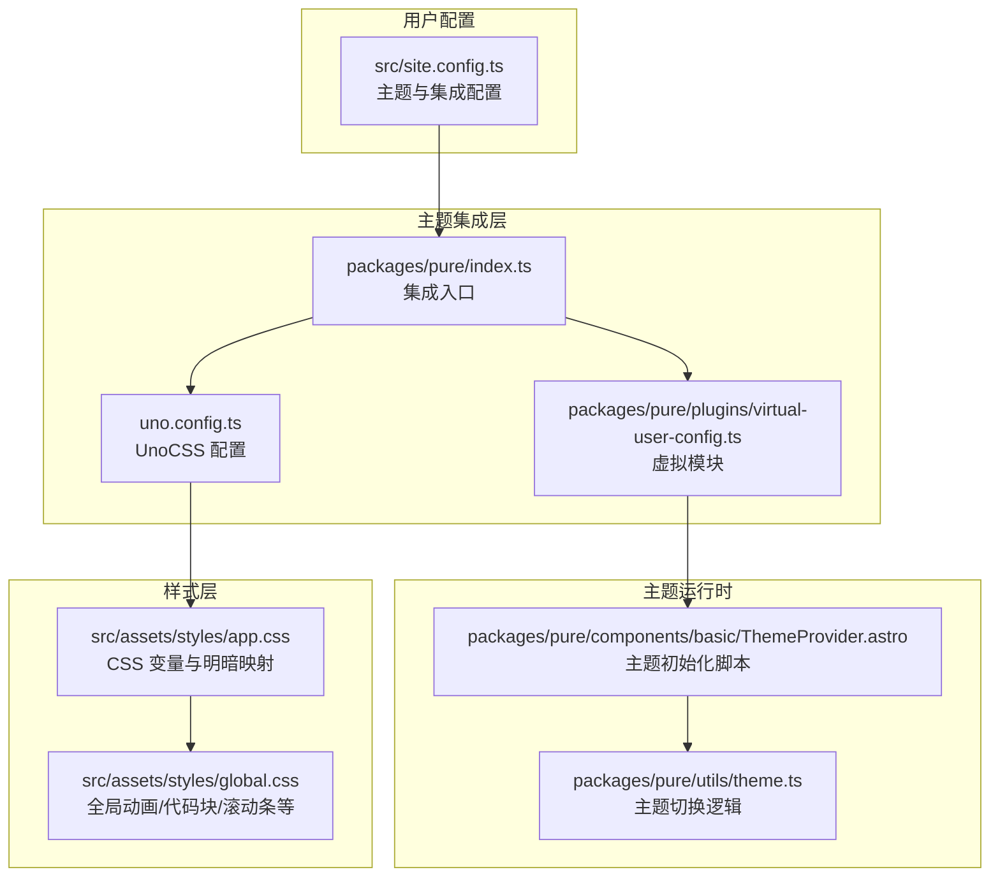
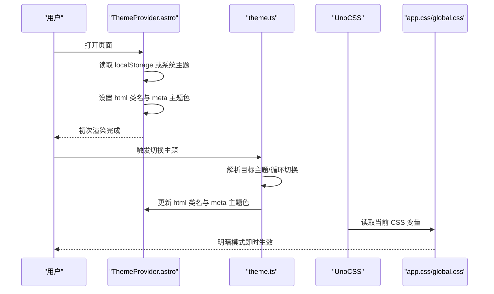
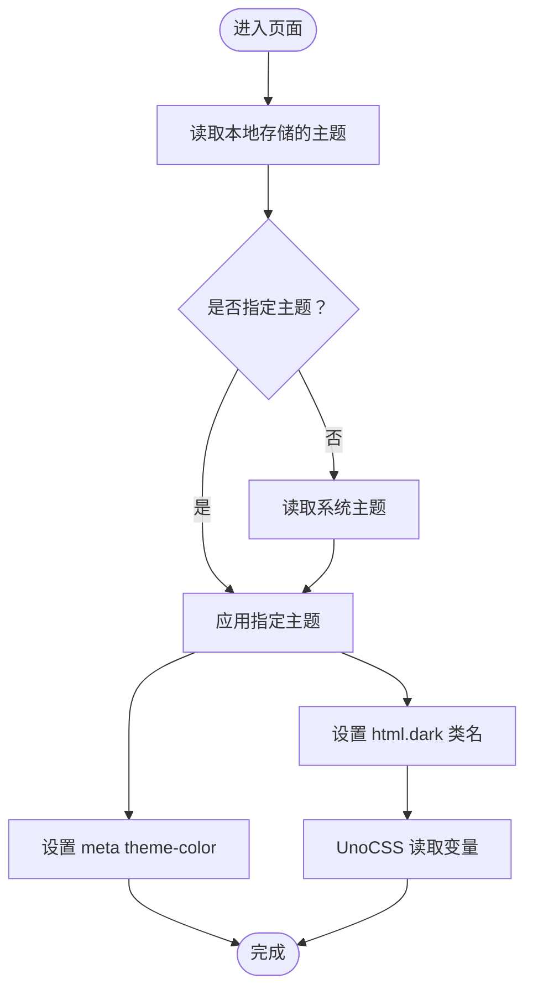
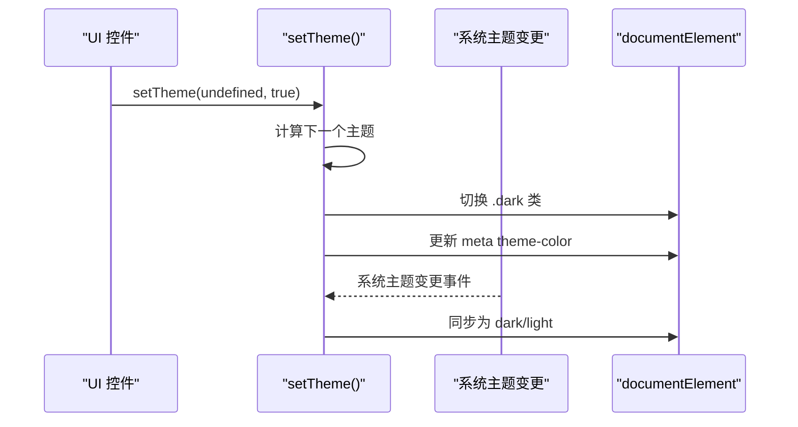
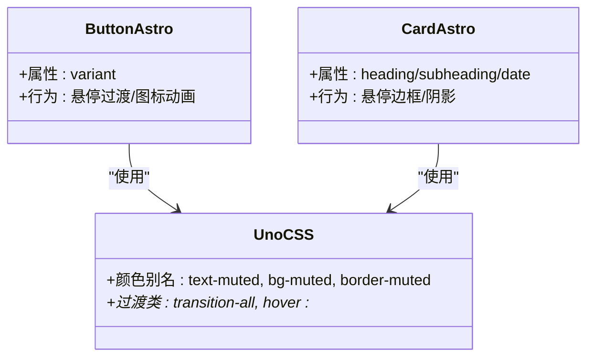
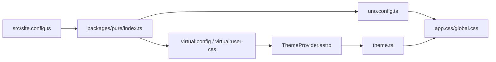

# 主题定制

<cite>
**本文引用的文件**
- [packages/pure/types/theme-config.ts](file://packages/pure/types/theme-config.ts)
- [packages/pure/types/user-config.ts](file://packages/pure/types/user-config.ts)
- [packages/pure/index.ts](file://packages/pure/index.ts)
- [packages/pure/utils/theme.ts](file://packages/pure/utils/theme.ts)
- [packages/pure/components/basic/ThemeProvider.astro](file://packages/pure/components/basic/ThemeProvider.astro)
- [packages/pure/plugins/virtual-user-config.ts](file://packages/pure/plugins/virtual-user-config.ts)
- [src/assets/styles/app.css](file://src/assets/styles/app.css)
- [src/assets/styles/global.css](file://src/assets/styles/global.css)
- [uno.config.ts](file://uno.config.ts)
- [src/site.config.ts](file://src/site.config.ts)
- [packages/pure/components/user/Button.astro](file://packages/pure/components/user/Button.astro)
- [packages/pure/components/user/Card.astro](file://packages/pure/components/user/Card.astro)
- [packages/pure/schemas/header.ts](file://packages/pure/schemas/header.ts)
</cite>

## 目录
1. [简介](#简介)
2. [项目结构](#项目结构)
3. [核心组件](#核心组件)
4. [架构总览](#架构总览)
5. [详细组件分析](#详细组件分析)
6. [依赖关系分析](#依赖关系分析)
7. [性能考量](#性能考量)
8. [故障排查指南](#故障排查指南)
9. [结论](#结论)
10. [附录](#附录)

## 简介
本文件面向使用 Astro 主题 Pure 的开发者，系统性阐述主题定制体系的设计与实现，涵盖以下方面：
- CSS 变量系统与明暗模式切换机制
- 颜色方案（主色、辅助色、语义色）配置
- 字体与排版系统（UnoCSS 预设与自定义）
- 间距与网格系统（UnoCSS 工具类与全局样式）
- 组件样式主题化（组件状态与交互）
- 主题扩展最佳实践（继承与覆盖策略）

目标是帮助你在不破坏现有主题一致性的情况下，安全地进行主题定制与扩展。

## 项目结构
Pure 主题采用“集成插件 + 虚拟模块 + UnoCSS + 全局样式”的组合架构：
- 集成插件负责解析用户配置、注入 Markdown 插件、配置 UnoCSS、注入虚拟模块等
- 虚拟模块向运行时暴露用户配置与项目上下文
- UnoCSS 提供原子化样式与排版能力，绑定 CSS 变量
- 全局样式通过 CSS 变量与伪类实现明暗模式与组件基线样式

图表来源
- [packages/pure/index.ts](file://packages/pure/index.ts#L1-L114)
- [packages/pure/plugins/virtual-user-config.ts](file://packages/pure/plugins/virtual-user-config.ts#L1-L100)
- [uno.config.ts](file://uno.config.ts#L1-L193)
- [packages/pure/components/basic/ThemeProvider.astro](file://packages/pure/components/basic/ThemeProvider.astro#L1-L41)
- [packages/pure/utils/theme.ts](file://packages/pure/utils/theme.ts#L1-L41)
- [src/assets/styles/app.css](file://src/assets/styles/app.css#L1-L49)
- [src/assets/styles/global.css](file://src/assets/styles/global.css#L1-L287)
- [src/site.config.ts](file://src/site.config.ts#L1-L207)

章节来源
- [packages/pure/index.ts](file://packages/pure/index.ts#L1-L114)
- [packages/pure/plugins/virtual-user-config.ts](file://packages/pure/plugins/virtual-user-config.ts#L1-L100)
- [uno.config.ts](file://uno.config.ts#L1-L193)
- [packages/pure/components/basic/ThemeProvider.astro](file://packages/pure/components/basic/ThemeProvider.astro#L1-L41)
- [packages/pure/utils/theme.ts](file://packages/pure/utils/theme.ts#L1-L41)
- [src/assets/styles/app.css](file://src/assets/styles/app.css#L1-L49)
- [src/assets/styles/global.css](file://src/assets/styles/global.css#L1-L287)
- [src/site.config.ts](file://src/site.config.ts#L1-L207)

## 核心组件
- 主题配置模型与校验：通过 Zod Schema 定义主题与集成配置，确保类型安全与默认值
- 主题切换工具：提供读取/保存/循环切换主题、监听系统主题变化、设置根元素类名与 meta 主题色
- 主题 Provider：在页面加载前快速应用主题，避免白屏/闪烁
- UnoCSS 主题绑定：将 CSS 变量映射为 UnoCSS 颜色与排版主题
- 全局样式：基于 CSS 变量的明暗模式、动画、代码块与滚动条样式

章节来源
- [packages/pure/types/theme-config.ts](file://packages/pure/types/theme-config.ts#L1-L193)
- [packages/pure/types/user-config.ts](file://packages/pure/types/user-config.ts#L1-L27)
- [packages/pure/utils/theme.ts](file://packages/pure/utils/theme.ts#L1-L41)
- [packages/pure/components/basic/ThemeProvider.astro](file://packages/pure/components/basic/ThemeProvider.astro#L1-L41)
- [uno.config.ts](file://uno.config.ts#L127-L143)
- [src/assets/styles/app.css](file://src/assets/styles/app.css#L1-L49)
- [src/assets/styles/global.css](file://src/assets/styles/global.css#L1-L287)

## 架构总览
主题系统围绕“配置 → 运行时 → 样式”三段式展开：
- 配置阶段：用户在站点配置中声明主题与集成选项，集成插件解析并注入虚拟模块
- 运行时阶段：主题 Provider 在页面加载早期应用主题；用户可触发主题切换，工具函数更新根元素类名与 meta 主题色
- 样式阶段：UnoCSS 使用 CSS 变量作为颜色源；全局样式以 :root/.dark 映射变量，形成明暗一致的视觉语言

图表来源
- [packages/pure/components/basic/ThemeProvider.astro](file://packages/pure/components/basic/ThemeProvider.astro#L1-L41)
- [packages/pure/utils/theme.ts](file://packages/pure/utils/theme.ts#L1-L41)
- [uno.config.ts](file://uno.config.ts#L127-L143)
- [src/assets/styles/app.css](file://src/assets/styles/app.css#L1-L49)
- [src/assets/styles/global.css](file://src/assets/styles/global.css#L1-L287)

## 详细组件分析

### CSS 变量系统与明暗模式
- 变量定义：在全局样式中以 HSL 角度/饱和度/亮度形式定义主色、前景、背景、卡片、边框、输入、环形等变量
- 明暗映射：.dark 块内对关键变量重新赋值，形成对比度一致的深色版本
- UnoCSS 绑定：将变量映射为 UnoCSS 颜色别名，使工具类如 text-primary、bg-muted 生效
- 运行时切换：通过给 html 添加/移除 dark 类，配合 meta theme-color 实现主题色联动

图表来源
- [packages/pure/components/basic/ThemeProvider.astro](file://packages/pure/components/basic/ThemeProvider.astro#L7-L19)
- [packages/pure/utils/theme.ts](file://packages/pure/utils/theme.ts#L12-L40)
- [uno.config.ts](file://uno.config.ts#L127-L143)
- [src/assets/styles/app.css](file://src/assets/styles/app.css#L1-L49)

章节来源
- [src/assets/styles/app.css](file://src/assets/styles/app.css#L1-L49)
- [uno.config.ts](file://uno.config.ts#L127-L143)
- [packages/pure/utils/theme.ts](file://packages/pure/utils/theme.ts#L1-L41)
- [packages/pure/components/basic/ThemeProvider.astro](file://packages/pure/components/basic/ThemeProvider.astro#L1-L41)

### 主题切换机制与用户偏好检测
- 循环切换：未传入主题时，按 ["system","dark","light"] 轮换，保存到本地存储
- 系统监听：当选择 system 时，监听 prefers-color-scheme 变化，动态更新主题
- DOM 操作：切换 html 的 dark 类与 meta[name="theme-color"] 的 content 属性
- Provider 快速初始化：在页面加载前执行一次主题应用，避免闪烁

图表来源
- [packages/pure/utils/theme.ts](file://packages/pure/utils/theme.ts#L5-L40)
- [packages/pure/components/basic/ThemeProvider.astro](file://packages/pure/components/basic/ThemeProvider.astro#L22-L29)

章节来源
- [packages/pure/utils/theme.ts](file://packages/pure/utils/theme.ts#L1-L41)
- [packages/pure/components/basic/ThemeProvider.astro](file://packages/pure/components/basic/ThemeProvider.astro#L1-L41)

### 颜色系统定制（主色/辅助色/语义色）
- 主色：用于强调、链接悬停、按钮主色等
- 辅助色：用于次级文本、弱化背景、边框等
- 语义色：卡片、输入、环形光圈等语义化背景与边框
- 定制方式：直接修改 app.css 中对应变量值；UnoCSS 将自动映射为颜色别名
- 注意：深浅两套变量需保持视觉对比度与一致性

章节来源
- [src/assets/styles/app.css](file://src/assets/styles/app.css#L2-L34)
- [uno.config.ts](file://uno.config.ts#L127-L143)

### 字体系统与排版（UnoCSS Typography）
- UnoCSS Typography 预设：统一标题、正文、链接、代码、表格、引用等排版
- 自定义样式：通过 uno.config.ts 的 typographyConfig 扩展颜色、字号、行高、装饰等
- 内联代码块风格：支持 classic 与 modern 两种风格
- 链接锚点：为标题添加可见锚点，提升可访问性与导航体验

章节来源
- [uno.config.ts](file://uno.config.ts#L14-L125)
- [src/assets/styles/global.css](file://src/assets/styles/global.css#L34-L123)

### 间距系统与网格（UnoCSS 工具类）
- 间距：通过 UnoCSS 工具类实现内外边距、行高、列间距等
- 线条省略：提供 line-clamp-N 工具类，简化多行文本截断
- 对象填充：object-cover、bg-cover 等常用布局
- 表格与列表：通过预设规则统一表格边框、列表缩进与间距

章节来源
- [uno.config.ts](file://uno.config.ts#L145-L172)
- [src/assets/styles/global.css](file://src/assets/styles/global.css#L104-L119)

### 组件样式主题化（Button、Card 等）
- Button：基于语义色与过渡类实现悬停、图标位移与主色强调
- Card：卡片容器使用 muted 背景与卡片边框，悬停时增强边框与阴影
- 通用原则：优先使用 UnoCSS 颜色别名与过渡类，保证明暗模式下的一致性

图表来源
- [packages/pure/components/user/Button.astro](file://packages/pure/components/user/Button.astro#L1-L91)
- [packages/pure/components/user/Card.astro](file://packages/pure/components/user/Card.astro#L1-L33)
- [uno.config.ts](file://uno.config.ts#L127-L143)

章节来源
- [packages/pure/components/user/Button.astro](file://packages/pure/components/user/Button.astro#L1-L91)
- [packages/pure/components/user/Card.astro](file://packages/pure/components/user/Card.astro#L1-L33)
- [uno.config.ts](file://uno.config.ts#L127-L143)

### 主题扩展最佳实践
- 主题继承：通过修改 app.css 中的变量，即可在不改动组件的前提下实现主题继承
- 样式覆盖：在站点的自定义 CSS 中覆盖 UnoCSS 生成的原子类或全局样式
- 配置驱动：通过 site.config.ts 的 theme 与 integ 字段集中管理主题与功能开关
- 虚拟模块：利用虚拟模块将用户配置注入到运行时，避免硬编码

章节来源
- [packages/pure/plugins/virtual-user-config.ts](file://packages/pure/plugins/virtual-user-config.ts#L61-L79)
- [src/site.config.ts](file://src/site.config.ts#L3-L99)
- [packages/pure/index.ts](file://packages/pure/index.ts#L32-L96)

## 依赖关系分析
- 集成插件依赖：Zod 校验、UnoCSS、MDX、Sitemap 等
- 运行时依赖：localStorage、window.matchMedia、documentElement
- 样式依赖：CSS 变量、伪类选择器、UnoCSS 预设

图表来源
- [src/site.config.ts](file://src/site.config.ts#L1-L207)
- [packages/pure/index.ts](file://packages/pure/index.ts#L1-L114)
- [packages/pure/plugins/virtual-user-config.ts](file://packages/pure/plugins/virtual-user-config.ts#L61-L79)
- [uno.config.ts](file://uno.config.ts#L1-L193)
- [packages/pure/components/basic/ThemeProvider.astro](file://packages/pure/components/basic/ThemeProvider.astro#L1-L41)
- [packages/pure/utils/theme.ts](file://packages/pure/utils/theme.ts#L1-L41)
- [src/assets/styles/app.css](file://src/assets/styles/app.css#L1-L49)
- [src/assets/styles/global.css](file://src/assets/styles/global.css#L1-L287)

章节来源
- [packages/pure/index.ts](file://packages/pure/index.ts#L1-L114)
- [packages/pure/plugins/virtual-user-config.ts](file://packages/pure/plugins/virtual-user-config.ts#L1-L100)
- [uno.config.ts](file://uno.config.ts#L1-L193)
- [packages/pure/components/basic/ThemeProvider.astro](file://packages/pure/components/basic/ThemeProvider.astro#L1-L41)
- [packages/pure/utils/theme.ts](file://packages/pure/utils/theme.ts#L1-L41)
- [src/assets/styles/app.css](file://src/assets/styles/app.css#L1-L49)
- [src/assets/styles/global.css](file://src/assets/styles/global.css#L1-L287)
- [src/site.config.ts](file://src/site.config.ts#L1-L207)

## 性能考量
- 避免闪烁：ThemeProvider 在 astro:page-load 前后均执行，确保首屏即正确主题
- 减少重绘：使用 CSS 变量与伪类，避免频繁 JS 修改样式
- UnoCSS 抽样：通过 safelist 限制高频类名提取，减少构建体积
- 代码块优化：全局样式对代码块进行滚动与行号处理，兼顾可读性与性能

## 故障排查指南
- 主题未生效
  - 检查 html 是否包含 dark 类
  - 确认 meta[name="theme-color"] 是否被正确设置
  - 排查 localStorage 中的 theme 键值
- 系统主题切换无效
  - 确认已调用监听函数
  - 检查浏览器 prefers-color-scheme 支持
- UnoCSS 颜色不匹配
  - 确认 CSS 变量值格式与 UnoCSS 映射一致
  - 检查是否被站点自定义 CSS 覆盖
- 页面闪烁
  - 确保 Provider 脚本在 astro:page-load 前执行
  - 避免在首屏插入大量阻塞样式

章节来源
- [packages/pure/components/basic/ThemeProvider.astro](file://packages/pure/components/basic/ThemeProvider.astro#L1-L41)
- [packages/pure/utils/theme.ts](file://packages/pure/utils/theme.ts#L1-L41)
- [uno.config.ts](file://uno.config.ts#L127-L143)
- [src/assets/styles/app.css](file://src/assets/styles/app.css#L1-L49)

## 结论
Pure 主题通过“配置 → 运行时 → 样式”的清晰分层，实现了以 CSS 变量为核心的明暗模式与主题定制能力。借助 UnoCSS 的原子化与 Typography 预设，开发者可以在不编写复杂样式的情况下，获得一致且可扩展的视觉语言。建议在定制时遵循“变量优先、配置驱动、最小改动”的原则，确保主题升级与维护的可持续性。

## 附录
- 主题配置字段参考：见主题配置模型文件
- 集成配置字段参考：见用户配置模型文件
- 头部菜单默认项：见头部 Schema 文件

章节来源
- [packages/pure/types/theme-config.ts](file://packages/pure/types/theme-config.ts#L1-L193)
- [packages/pure/types/user-config.ts](file://packages/pure/types/user-config.ts#L1-L27)
- [packages/pure/schemas/header.ts](file://packages/pure/schemas/header.ts#L1-L18)