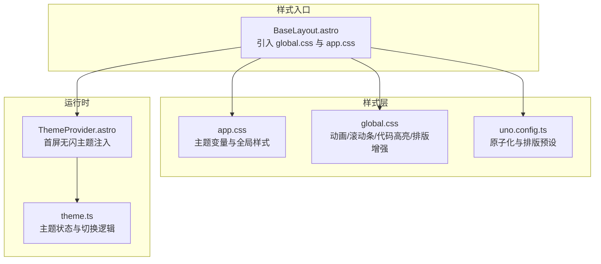
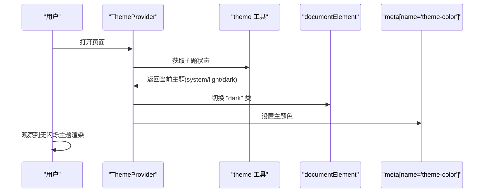
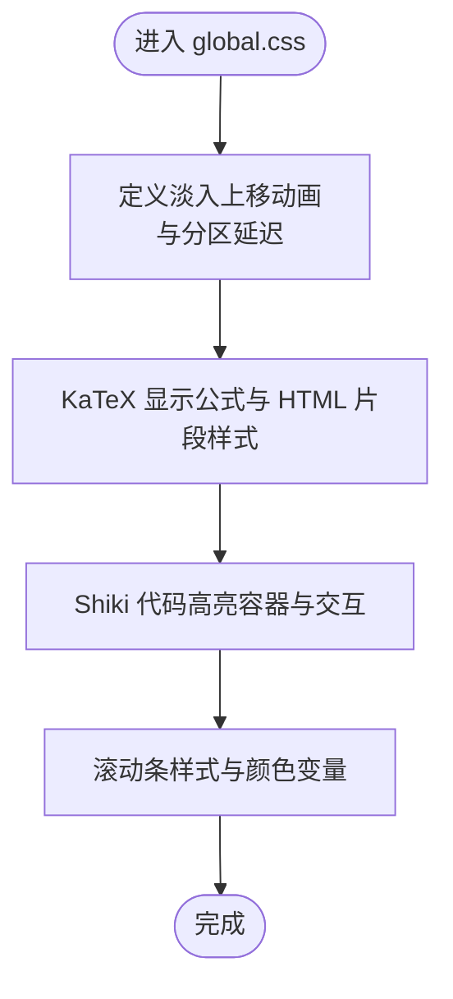
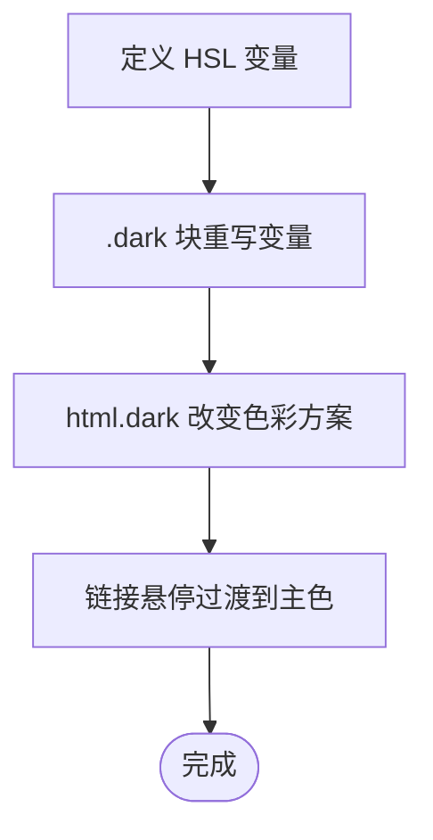
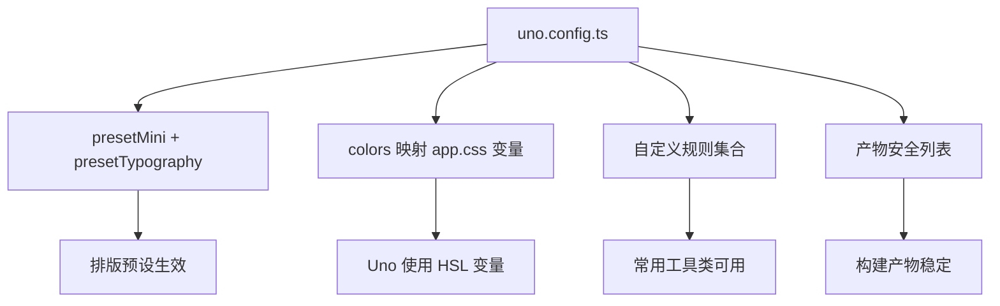
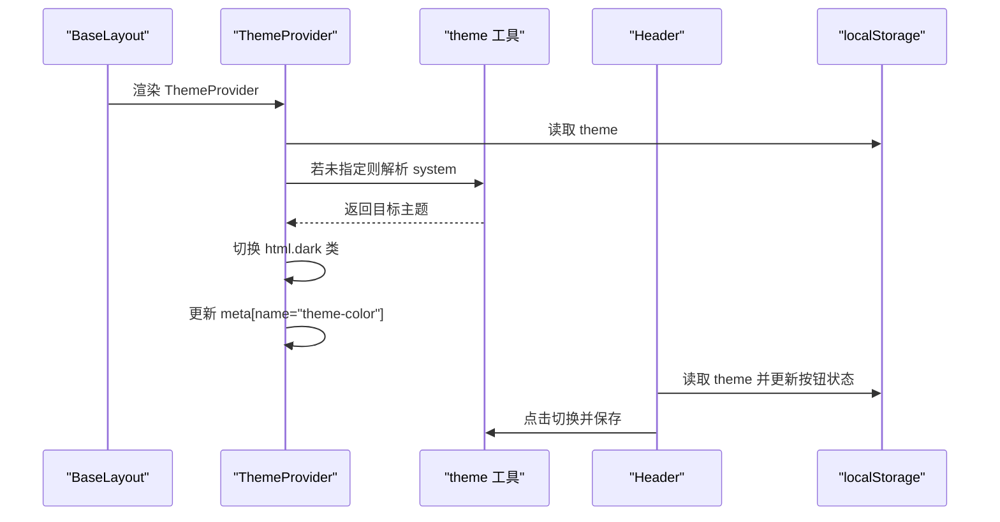
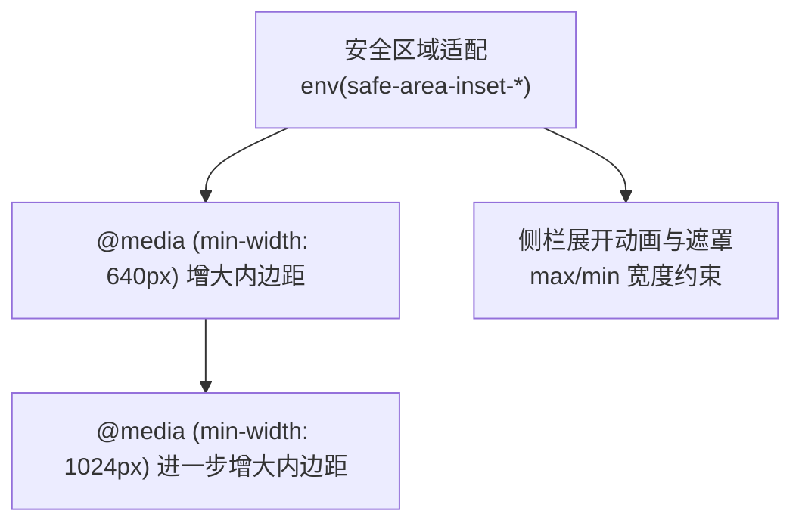
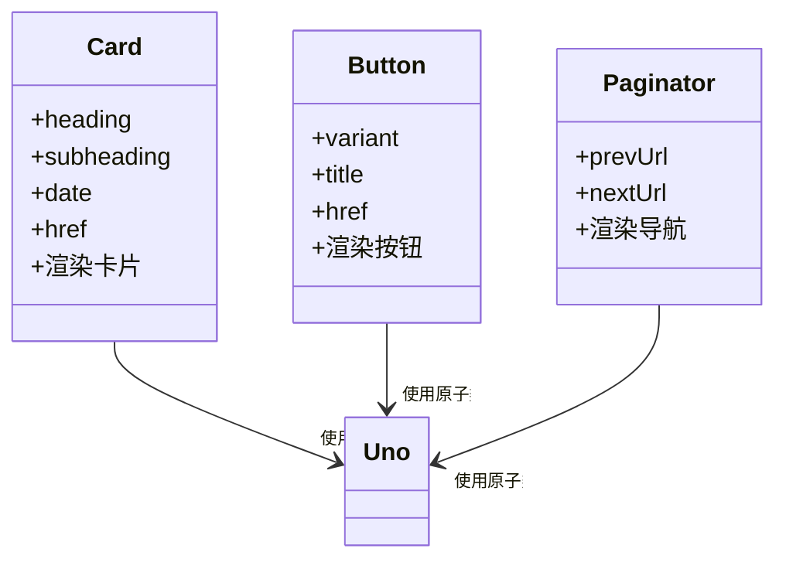
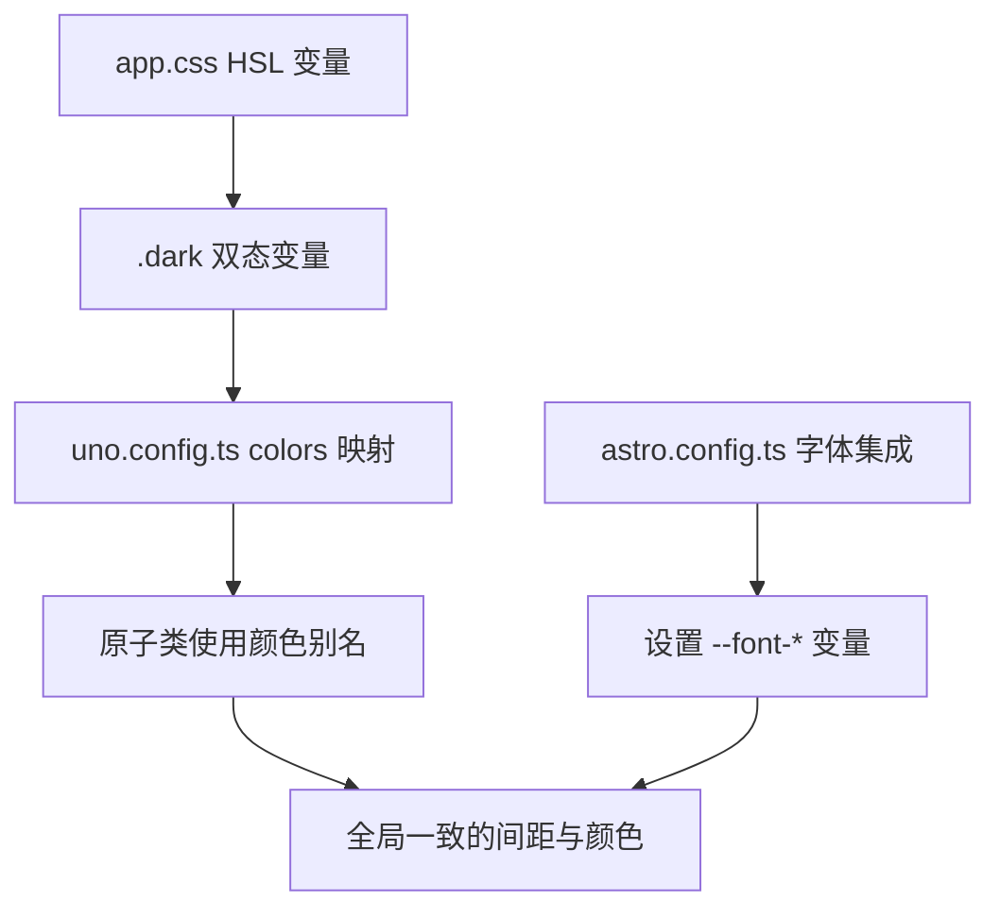
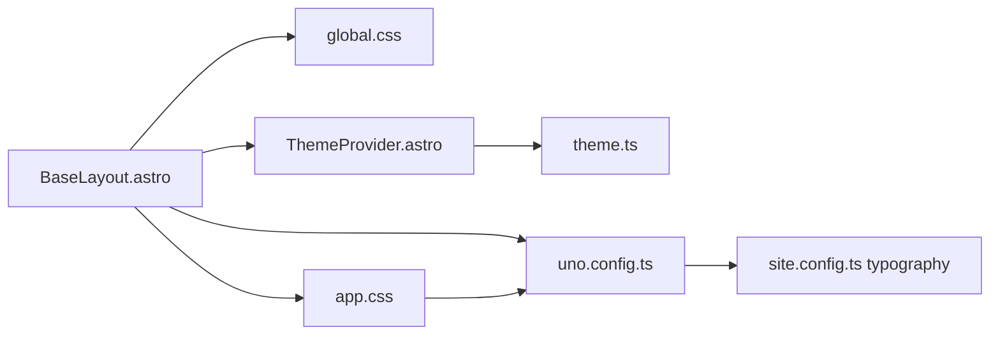

# 样式系统

<cite>
**本文引用的文件**
- [src/assets/styles/global.css](file://src/assets/styles/global.css)
- [src/assets/styles/app.css](file://src/assets/styles/app.css)
- [uno.config.ts](file://uno.config.ts)
- [packages/pure/components/basic/ThemeProvider.astro](file://packages/pure/components/basic/ThemeProvider.astro)
- [packages/pure/utils/theme.ts](file://packages/pure/utils/theme.ts)
- [src/layouts/BaseLayout.astro](file://src/layouts/BaseLayout.astro)
- [src/site.config.ts](file://src/site.config.ts)
- [packages/pure/components/user/Card.astro](file://packages/pure/components/user/Card.astro)
- [packages/pure/components/user/Button.astro](file://packages/pure/components/user/Button.astro)
- [packages/pure/components/pages/Paginator.astro](file://packages/pure/components/pages/Paginator.astro)
- [packages/pure/components/basic/Header.astro](file://packages/pure/components/basic/Header.astro)
- [astro.config.ts](file://astro.config.ts)
</cite>

## 目录
1. [简介](#简介)
2. [项目结构](#项目结构)
3. [核心组件](#核心组件)
4. [架构总览](#架构总览)
5. [详细组件分析](#详细组件分析)
6. [依赖关系分析](#依赖关系分析)
7. [性能考量](#性能考量)
8. [故障排查指南](#故障排查指南)
9. [结论](#结论)
10. [附录](#附录)

## 简介
本文件系统性梳理 Astro 主题 Pure 的样式体系，覆盖 CSS 架构（global.css 与 app.css 的职责与边界）、UnoCSS 原子化 CSS 的配置与使用、主题定制（颜色、字体、间距）、响应式策略、组件样式封装与复用、CSS 变量与主题切换机制、性能优化与兼容性建议，以及扩展与定制指引。目标是帮助开发者快速理解并高效迭代样式系统。

## 项目结构
样式系统由三层构成：
- 全局基础层：全局动画、滚动条、代码高亮、排版等通用规则，位于 global.css。
- 主题变量层：HSL 变体色板、明暗模式切换、默认边框色等，位于 app.css。
- 原子化层：通过 UnoCSS 提供的原子类与预设，统一排版、交互与视觉约束，位于 uno.config.ts。

**图表来源**
- [src/layouts/BaseLayout.astro](file://src/layouts/BaseLayout.astro#L7-L10)
- [src/assets/styles/app.css](file://src/assets/styles/app.css#L1-L49)
- [src/assets/styles/global.css](file://src/assets/styles/global.css#L1-L287)
- [uno.config.ts](file://uno.config.ts#L1-L193)
- [packages/pure/components/basic/ThemeProvider.astro](file://packages/pure/components/basic/ThemeProvider.astro#L1-L41)
- [packages/pure/utils/theme.ts](file://packages/pure/utils/theme.ts#L1-L41)

**章节来源**
- [src/layouts/BaseLayout.astro](file://src/layouts/BaseLayout.astro#L7-L10)
- [src/assets/styles/app.css](file://src/assets/styles/app.css#L1-L49)
- [src/assets/styles/global.css](file://src/assets/styles/global.css#L1-L287)
- [uno.config.ts](file://uno.config.ts#L1-L193)

## 核心组件
- BaseLayout：页面骨架，负责引入全局样式、注入主题变量与安全区域适配、挂载主题提供器。
- ThemeProvider：在页面加载早期读取本地存储或系统偏好，设置 html 类名与主题色 meta，避免闪烁。
- theme 工具：封装主题状态（system/light/dark）循环切换、持久化、监听系统主题变化。
- UnoCSS：提供原子类、排版预设、颜色主题映射、安全列表与自定义规则。
- 组件样式：卡片、按钮、分页等组件以原子类为主，结合局部样式与 CSS 变量实现一致风格。

**章节来源**
- [src/layouts/BaseLayout.astro](file://src/layouts/BaseLayout.astro#L7-L10)
- [packages/pure/components/basic/ThemeProvider.astro](file://packages/pure/components/basic/ThemeProvider.astro#L1-L41)
- [packages/pure/utils/theme.ts](file://packages/pure/utils/theme.ts#L1-L41)
- [uno.config.ts](file://uno.config.ts#L1-L193)

## 架构总览
样式系统采用“变量驱动 + 原子化优先”的设计：
- 变量层：app.css 定义 HSL 色板与半透明变量，支持明暗模式切换。
- 原子层：uno.config.ts 将变量映射到 Uno 的颜色主题，同时配置排版预设与自定义规则。
- 基础层：global.css 提供动画、滚动条、代码块高亮、表格/引用等增强样式。
- 运行时：ThemeProvider 在 SSR/CSR 早期注入主题，theme.ts 提供切换与持久化。

**图表来源**
- [packages/pure/components/basic/ThemeProvider.astro](file://packages/pure/components/basic/ThemeProvider.astro#L5-L20)
- [packages/pure/utils/theme.ts](file://packages/pure/utils/theme.ts#L12-L40)

## 详细组件分析

### global.css：全局样式与增强
- 动画与入场：定义淡入上移动画，按内容分区延迟播放；尊重“减少动态”偏好。
- KaTeX 排版：对显示公式容器与 HTML 片段进行溢出与内边距控制。
- Shiki 代码高亮：为代码块容器、行号、复制按钮、高亮/差异标记、折叠态提供完整样式。
- 滚动条：基于 CSS 变量定义滚动条拇指颜色，统一 WebKit 滚动条外观。

**图表来源**
- [src/assets/styles/global.css](file://src/assets/styles/global.css#L1-L287)

**章节来源**
- [src/assets/styles/global.css](file://src/assets/styles/global.css#L1-L287)

### app.css：主题变量与全局交互
- 主题变量：定义主色、前景/背景、柔和前景、背景、卡片、边框、输入、环形光晕与圆角半径。
- 明暗模式：.dark 块下重写上述变量，配合 html.dark 改变 color-scheme。
- 全局交互：链接悬停过渡至主色，提升可感知的交互反馈。

**图表来源**
- [src/assets/styles/app.css](file://src/assets/styles/app.css#L1-L49)

**章节来源**
- [src/assets/styles/app.css](file://src/assets/styles/app.css#L1-L49)

### UnoCSS：原子化与排版
- 预设与主题映射：启用 mini 与 typography 预设，将 app.css 中的变量映射为 Uno 的颜色主题。
- 排版增强：为标题锚点可见性、内联代码块现代样式、引用装饰、表格边框、键盘元素阴影等提供 cssExtend。
- 自定义规则：sr-only、object-cover、bg-cover、行数省略等规则。
- 安全列表：对目录生成所需的原子类进行白名单，确保产物稳定。

**图表来源**
- [uno.config.ts](file://uno.config.ts#L1-L193)
- [src/assets/styles/app.css](file://src/assets/styles/app.css#L1-L49)

**章节来源**
- [uno.config.ts](file://uno.config.ts#L1-L193)

### 主题切换：变量 + 运行时
- 首屏无闪：ThemeProvider 在页面加载早期执行，根据本地存储或系统偏好设置 html 类与主题色 meta。
- 循环切换：theme 工具支持 system/light/dark 三态循环，可持久化保存；监听系统主题变化。
- 头部联动：Header 组件读取本地存储状态，展示当前主题图标并触发切换。

**图表来源**
- [packages/pure/components/basic/ThemeProvider.astro](file://packages/pure/components/basic/ThemeProvider.astro#L5-L20)
- [packages/pure/utils/theme.ts](file://packages/pure/utils/theme.ts#L12-L40)
- [packages/pure/components/basic/Header.astro](file://packages/pure/components/basic/Header.astro#L67-L108)

**章节来源**
- [packages/pure/components/basic/ThemeProvider.astro](file://packages/pure/components/basic/ThemeProvider.astro#L1-L41)
- [packages/pure/utils/theme.ts](file://packages/pure/utils/theme.ts#L1-L41)
- [packages/pure/components/basic/Header.astro](file://packages/pure/components/basic/Header.astro#L67-L108)

### 响应式设计与移动端适配
- 断点策略：以 640px、1024px 为主要断点，配合媒体查询调整容器内边距与侧栏动画。
- 安全区域：通过 env(safe-area-inset-*) 适配刘海屏与异形屏，随断点递增左右内边距。
- 侧栏与遮罩：移动端侧栏展开使用动画与遮罩，最大宽度与最小宽度限制，保证可用性。

**图表来源**
- [src/layouts/BaseLayout.astro](file://src/layouts/BaseLayout.astro#L72-L89)
- [src/layouts/ContentLayout.astro](file://src/layouts/ContentLayout.astro#L103-L155)

**章节来源**
- [src/layouts/BaseLayout.astro](file://src/layouts/BaseLayout.astro#L72-L89)
- [src/layouts/ContentLayout.astro](file://src/layouts/ContentLayout.astro#L103-L155)

### 组件样式封装与复用
- 卡片组件：使用原子类组合边框、背景、圆角与悬停过渡，支持多插槽内容。
- 按钮组件：通过 variant 控制形状与图标位置，利用组选择器与过渡类实现 hover 效果。
- 分页组件：语义化导航，使用原子类与预取能力提升交互体验。

**图表来源**
- [packages/pure/components/user/Card.astro](file://packages/pure/components/user/Card.astro#L16-L32)
- [packages/pure/components/user/Button.astro](file://packages/pure/components/user/Button.astro#L18-L28)
- [packages/pure/components/pages/Paginator.astro](file://packages/pure/components/pages/Paginator.astro#L18-L31)

**章节来源**
- [packages/pure/components/user/Card.astro](file://packages/pure/components/user/Card.astro#L1-L33)
- [packages/pure/components/user/Button.astro](file://packages/pure/components/user/Button.astro#L1-L91)
- [packages/pure/components/pages/Paginator.astro](file://packages/pure/components/pages/Paginator.astro#L1-L34)

### 主题定制系统
- 颜色方案：通过 app.css 的 HSL 变量与 .dark 块实现明暗双态；Uno 将其映射为 colors 主题，可在任意原子类中使用 primary/foreground/background 等别名。
- 字体配置：通过 Astro 实验性字体集成加载外部字体，设置 CSS 变量供全局使用。
- 间距系统：统一使用 Uno 的原子类与 CSS 变量，如 gap、p、m、rounded 等，保持一致性。

**图表来源**
- [src/assets/styles/app.css](file://src/assets/styles/app.css#L1-L49)
- [uno.config.ts](file://uno.config.ts#L127-L143)
- [astro.config.ts](file://astro.config.ts#L116-L130)

**章节来源**
- [src/assets/styles/app.css](file://src/assets/styles/app.css#L1-L49)
- [uno.config.ts](file://uno.config.ts#L127-L143)
- [astro.config.ts](file://astro.config.ts#L116-L130)

## 依赖关系分析
- BaseLayout 作为样式入口，统一引入 global.css 与 app.css，并挂载 ThemeProvider。
- UnoCSS 依赖 site.config.ts 中的 typography 配置，影响排版预设行为。
- 组件样式依赖 Uno 原子类与 app.css 变量，形成“变量 → 原子 → 组件”的层级依赖。

**图表来源**
- [src/layouts/BaseLayout.astro](file://src/layouts/BaseLayout.astro#L7-L10)
- [uno.config.ts](file://uno.config.ts#L6-L6)
- [src/site.config.ts](file://src/site.config.ts#L142-L149)

**章节来源**
- [src/layouts/BaseLayout.astro](file://src/layouts/BaseLayout.astro#L7-L10)
- [uno.config.ts](file://uno.config.ts#L6-L6)
- [src/site.config.ts](file://src/site.config.ts#L142-L149)

## 性能考量
- 避免闪烁：ThemeProvider 在页面加载早期执行，首屏即确定主题，减少跳变。
- 原子化优先：大量使用 Uno 原子类，减少重复样式与体积膨胀。
- 构建安全列表：对目录生成所需原子类进行 safelist，确保产物稳定且不被摇树移除。
- 图片与字体：通过 Astro 实验性字体与 SVGO 优化，降低资源体积与解析成本。
- 代码高亮：Shiki 仅在需要时加载，容器与交互样式按需生效，避免全局负担。

[本节为通用性能建议，无需特定文件引用]

## 故障排查指南
- 主题切换无效：检查 ThemeProvider 是否在页面头部渲染，确认 theme.ts 的 setTheme 流程与 localStorage 写入是否成功。
- 明暗模式不跟随系统：确认系统偏好监听事件是否绑定，必要时手动刷新页面。
- 排版异常：核对 site.config.ts 中 typography 配置，确认 uno.config.ts 的 cssExtend 是否符合预期。
- 移动端侧栏遮罩不显示：检查断点与动画条件，确认侧栏展开逻辑与遮罩显示条件。
- 代码高亮样式缺失：确认 global.css 中的 .astro-code 相关规则未被覆盖，且 Uno 原子类未冲突。

**章节来源**
- [packages/pure/components/basic/ThemeProvider.astro](file://packages/pure/components/basic/ThemeProvider.astro#L5-L20)
- [packages/pure/utils/theme.ts](file://packages/pure/utils/theme.ts#L12-L40)
- [uno.config.ts](file://uno.config.ts#L145-L172)
- [src/layouts/ContentLayout.astro](file://src/layouts/ContentLayout.astro#L103-L155)
- [src/assets/styles/global.css](file://src/assets/styles/global.css#L54-L271)

## 结论
Pure 主题的样式系统以“变量驱动 + 原子化优先”为核心，通过 app.css 提供主题变量，global.css 强化基础与增强体验，uno.config.ts 统一排版与原子类，ThemeProvider 保障首屏无闪烁与主题一致性。该架构具备良好的可维护性、可扩展性与跨设备适配能力，适合在复杂内容站点中长期演进。

## 附录
- 扩展与定制建议
  - 新增颜色：在 app.css 添加 HSL 变量并在 .dark 块补充对应值，随后在 uno.config.ts 的 colors 映射中暴露别名。
  - 新增排版：在 uno.config.ts 的 typography.cssExtend 中追加规则，或通过自定义规则扩展常用布局类。
  - 新增组件：优先使用原子类组合，必要时在组件内部 style 中局部覆盖，避免污染全局。
  - 响应式：遵循现有断点策略，新增规则时考虑移动端最小可用性与交互成本。
  - 性能：持续关注 safelist 与产物体积，避免过度原子化导致的冗余类。

[本节为通用指导，无需特定文件引用]