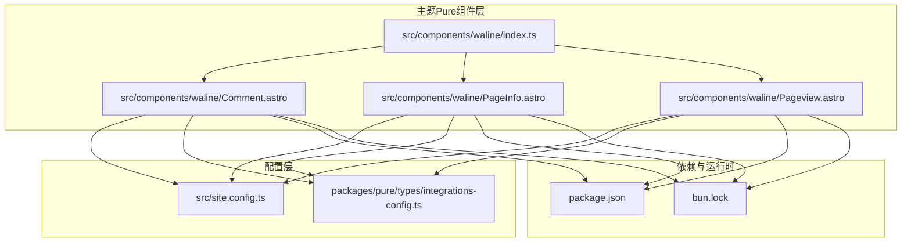
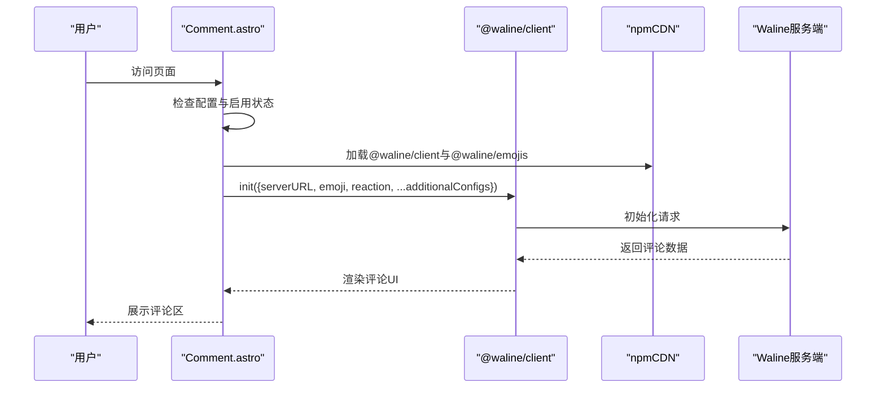
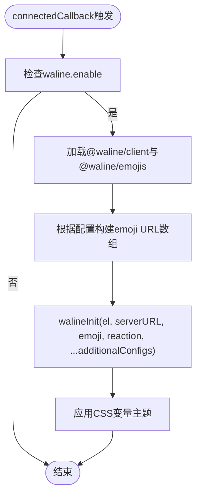
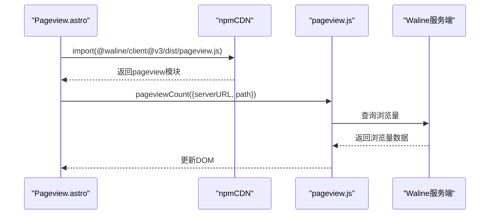
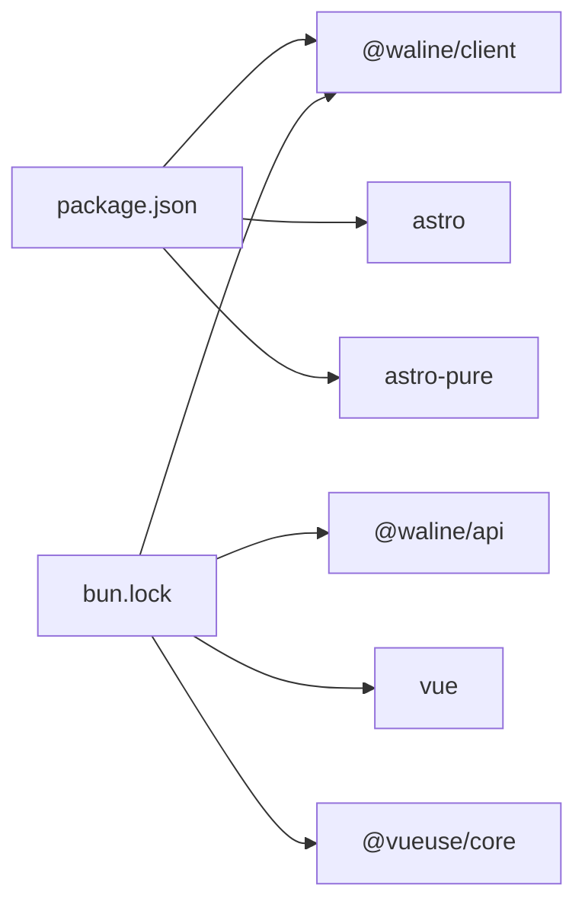

# Waline集成配置

<cite>
**本文档引用的文件**
- [src/components/waline/index.ts](file://src/components/waline/index.ts)
- [src/components/waline/Comment.astro](file://src/components/waline/Comment.astro)
- [src/components/waline/PageInfo.astro](file://src/components/waline/PageInfo.astro)
- [src/components/waline/Pageview.astro](file://src/components/waline/Pageview.astro)
- [packages/pure/types/integrations-config.ts](file://packages/pure/types/integrations-config.ts)
- [src/site.config.ts](file://src/site.config.ts)
- [package.json](file://package.json)
- [bun.lock](file://bun.lock)
</cite>

## 目录
1. [简介](#简介)
2. [项目结构](#项目结构)
3. [核心组件](#核心组件)
4. [架构总览](#架构总览)
5. [详细组件分析](#详细组件分析)
6. [依赖关系分析](#依赖关系分析)
7. [性能考虑](#性能考虑)
8. [故障排除指南](#故障排除指南)
9. [结论](#结论)
10. [附录](#附录)

## 简介
本文件面向Astro主题Pure的Waline评论系统集成，提供从服务端部署配置、客户端初始化配置到CDN与npmCDN使用的完整技术文档。内容涵盖Waline服务端数据库连接、CDN加速、安全防护；客户端serverURL、emoji表情包、reaction反应功能、additionalConfigs扩展配置；Waline服务端安装部署（Docker与传统方式）；评论系统安全配置（内容过滤、垃圾评论防护、用户认证机制）以及Waline配置参数详解与最佳实践建议。

## 项目结构
Waline集成位于主题Pure的组件层，采用Astro组件化设计，通过虚拟配置读取Waline配置，按需加载CDN资源，实现评论区与页面浏览量统计的独立功能模块。

**图表来源**
- [src/components/waline/index.ts](file://src/components/waline/index.ts#L1-L4)
- [src/components/waline/Comment.astro](file://src/components/waline/Comment.astro#L1-L167)
- [src/components/waline/PageInfo.astro](file://src/components/waline/PageInfo.astro#L1-L31)
- [src/components/waline/Pageview.astro](file://src/components/waline/Pageview.astro#L1-L31)
- [packages/pure/types/integrations-config.ts](file://packages/pure/types/integrations-config.ts#L1-L66)
- [src/site.config.ts](file://src/site.config.ts#L1-L207)
- [package.json](file://package.json#L1-L45)
- [bun.lock](file://bun.lock#L491-L501)

**章节来源**
- [src/components/waline/index.ts](file://src/components/waline/index.ts#L1-L4)
- [src/components/waline/Comment.astro](file://src/components/waline/Comment.astro#L1-L167)
- [src/components/waline/PageInfo.astro](file://src/components/waline/PageInfo.astro#L1-L31)
- [src/components/waline/Pageview.astro](file://src/components/waline/Pageview.astro#L1-L31)
- [packages/pure/types/integrations-config.ts](file://packages/pure/types/integrations-config.ts#L1-L66)
- [src/site.config.ts](file://src/site.config.ts#L1-L207)
- [package.json](file://package.json#L1-L45)
- [bun.lock](file://bun.lock#L491-L501)

## 核心组件
- 评论组件：负责渲染评论区容器、初始化Waline客户端、加载emoji与reaction资源、应用主题样式。
- 页面信息组件：展示页面浏览量与评论数，支持点击跳转至评论区。
- 页面浏览量组件：独立加载Waline页面浏览量统计脚本，按路径查询浏览次数。
- 配置系统：通过虚拟配置读取Waline集成配置，支持启用/禁用、serverURL、emoji、reaction、additionalConfigs等。

**章节来源**
- [src/components/waline/Comment.astro](file://src/components/waline/Comment.astro#L1-L167)
- [src/components/waline/PageInfo.astro](file://src/components/waline/PageInfo.astro#L1-L31)
- [src/components/waline/Pageview.astro](file://src/components/waline/Pageview.astro#L1-L31)
- [packages/pure/types/integrations-config.ts](file://packages/pure/types/integrations-config.ts#L49-L61)
- [src/site.config.ts](file://src/site.config.ts#L160-L181)

## 架构总览
Waline集成采用“配置驱动 + CDN资源 + 客户端初始化”的架构模式。前端通过虚拟配置读取Waline配置，按需加载CDN资源，评论区与浏览量统计分别由独立组件处理，避免相互耦合。

**图表来源**
- [src/components/waline/Comment.astro](file://src/components/waline/Comment.astro#L21-L56)
- [src/site.config.ts](file://src/site.config.ts#L35-L35)
- [src/site.config.ts](file://src/site.config.ts#L164-L164)
- [src/site.config.ts](file://src/site.config.ts#L168-L168)
- [src/site.config.ts](file://src/site.config.ts#L170-L179)

## 详细组件分析

### 评论组件（Comment.astro）
- 功能要点
  - 条件渲染：仅当配置启用时才渲染评论区容器。
  - CDN资源加载：通过npmCDN加载@waline/client与@waline/emojis。
  - 初始化：调用walineInit，传入el、serverURL、emoji、reaction与additionalConfigs。
  - 主题适配：通过CSS变量映射到主题色板，适配明暗主题。
  - 兼容性：设置Vue相关全局标志以避免Hydration不匹配问题。
- 关键配置项
  - serverURL：来自配置中的waline.server。
  - emoji：基于配置的emoji数组，拼接npmCDN路径生成预设URL。
  - reaction：使用本地图标路径作为reaction按钮。
  - additionalConfigs：透传配置中的额外属性，如locale、pageview、comment、imageUploader等。
- 性能与体验
  - 仅在启用时注册自定义元素，减少无用DOM。
  - 通过CSS变量统一主题，避免重复样式计算。
  - 反应按钮样式微调，提升交互体验。

**图表来源**
- [src/components/waline/Comment.astro](file://src/components/waline/Comment.astro#L28-L56)
- [src/components/waline/Comment.astro](file://src/components/waline/Comment.astro#L41-L51)

**章节来源**
- [src/components/waline/Comment.astro](file://src/components/waline/Comment.astro#L1-L167)
- [src/site.config.ts](file://src/site.config.ts#L160-L181)

### 页面信息组件（PageInfo.astro）
- 功能要点
  - 展示页面浏览量与评论数，支持可选显示。
  - 当开启评论时，提供跳转至评论区的锚点链接。
  - 通过data-path属性与服务端交互，获取对应路径的统计数据。
- 使用场景
  - 文章列表页：显示浏览量与评论数，便于用户快速了解内容热度。
  - 文章详情页：结合评论区组件，形成完整的互动入口。

**章节来源**
- [src/components/waline/PageInfo.astro](file://src/components/waline/PageInfo.astro#L1-L31)

### 页面浏览量组件（Pageview.astro）
- 功能要点
  - 独立加载@waline/client的pageview模块，按当前路径查询浏览量。
  - 通过define:vars注入npmCDN与walineServer，确保资源与服务端地址正确。
  - 设置超时取消机制，避免长时间阻塞页面渲染。
- 资源加载策略
  - 通过npmCDN动态import，降低首屏压力。
  - 失败时记录错误日志，不影响主流程。

**图表来源**
- [src/components/waline/Pageview.astro](file://src/components/waline/Pageview.astro#L6-L30)
- [src/site.config.ts](file://src/site.config.ts#L35-L35)
- [src/site.config.ts](file://src/site.config.ts#L164-L164)

**章节来源**
- [src/components/waline/Pageview.astro](file://src/components/waline/Pageview.astro#L1-L31)
- [src/site.config.ts](file://src/site.config.ts#L35-L35)
- [src/site.config.ts](file://src/site.config.ts#L164-L164)

### 配置系统（integrations-config.ts 与 site.config.ts）
- 集成配置Schema
  - waline.enable：是否启用Waline评论系统。
  - waline.server：Waline服务端地址。
  - waline.showMeta：是否隐藏评论元信息。
  - waline.emoji：emoji预设数组，将被转换为CDN URL。
  - waline.additionalConfigs：透传给walineInit的其他配置项。
- 默认配置示例
  - 启用：true
  - 服务端：示例地址（需替换为实际部署的服务端）
  - 显示元信息：false
  - 表情包：['bmoji', 'weibo']
  - 附加配置：pageview、comment、locale、imageUploader等

**章节来源**
- [packages/pure/types/integrations-config.ts](file://packages/pure/types/integrations-config.ts#L49-L61)
- [src/site.config.ts](file://src/site.config.ts#L160-L181)

## 依赖关系分析
- 运行时依赖
  - @waline/client：评论系统客户端库。
  - @waline/api：服务端接口封装（在锁文件中可见）。
  - vue、@vueuse/core：客户端依赖（在锁文件中可见）。
- 构建与开发依赖
  - astro、astro-pure：主题与构建框架。
  - eslint、prettier：代码质量与格式化工具。
- 版本与兼容性
  - @waline/client版本：3.8.0（在锁文件中可见）。
  - Vue版本：3.5.22（在锁文件中可见）。

**图表来源**
- [package.json](file://package.json#L23-L35)
- [bun.lock](file://bun.lock#L491-L501)

**章节来源**
- [package.json](file://package.json#L1-L45)
- [bun.lock](file://bun.lock#L491-L501)

## 性能考虑
- CDN资源加载
  - 通过npmCDN按需加载@waline/client与@waline/emojis，减少首屏体积。
  - Pageview组件采用超时取消机制，避免长时间阻塞。
- 主题样式
  - 使用CSS变量映射主题色板，减少重复样式计算，提升渲染效率。
- 条件渲染
  - 仅在启用时注册自定义元素与加载资源，避免无效开销。

[本节为通用性能建议，无需特定文件引用]

## 故障排除指南
- 评论区空白或初始化失败
  - 检查waline.enable与serverURL配置是否正确。
  - 确认npmCDN可达且@waline/client与@waline/emojis可正常加载。
  - 查看浏览器控制台是否存在跨域或资源加载错误。
- 表情包不显示
  - 确认emoji预设名称与npmCDN路径拼接正确。
  - 检查CDN网络连通性与缓存策略。
- 反应按钮样式异常
  - 检查主题CSS变量映射是否生效。
  - 确认暗/亮主题下的滤镜与颜色设置。
- 浏览量统计不更新
  - 确认Pageview组件已正确注入walineServer与path。
  - 检查服务端是否正确返回浏览量数据。
  - 查看控制台错误日志定位问题。

**章节来源**
- [src/components/waline/Comment.astro](file://src/components/waline/Comment.astro#L21-L56)
- [src/components/waline/Pageview.astro](file://src/components/waline/Pageview.astro#L12-L25)

## 结论
本集成方案通过配置驱动与CDN资源加载，实现了Waline评论系统在Astro主题Pure中的高效集成。评论区与浏览量统计分离设计提升了可维护性与性能。建议在生产环境中完善服务端部署与安全配置，并根据业务需求调整emoji与reaction策略，以获得更佳的用户体验。

[本节为总结性内容，无需特定文件引用]

## 附录

### Waline服务端部署指南（Docker与传统方式）
- Docker部署
  - 准备Docker镜像与配置文件，确保数据库连接正确。
  - 暴露必要端口并配置反向代理（如Nginx）。
  - 使用环境变量配置数据库连接、CDN与安全参数。
  - 部署完成后验证服务端健康状态与评论接口可用性。
- 传统部署
  - 安装Node.js与数据库（MongoDB/MySQL等），准备Waline服务端代码。
  - 配置数据库连接字符串、存储路径与CDN加速。
  - 启动服务端进程并配置防火墙与SSL证书。
  - 通过域名访问服务端，确保跨域与CORS配置正确。
- 验证
  - 在客户端配置中填写serverURL，访问页面确认评论区加载成功。
  - 通过Pageview组件验证浏览量统计功能。

[本节为通用部署指导，无需特定文件引用]

### 评论系统安全配置
- 内容过滤
  - 启用服务端内容审核规则，过滤敏感词与违规内容。
  - 配置图片上传白名单与大小限制，防止恶意文件上传。
- 垃圾评论防护
  - 开启验证码（如reCAPTCHA）与频率限制，降低刷评风险。
  - 使用IP黑名单与关键词过滤，阻止已知恶意来源。
- 用户认证机制
  - 支持邮箱验证与第三方登录，减少匿名滥用。
  - 对管理员与版主赋予特殊权限，便于内容治理。
- CDN与网络
  - 使用可信CDN加速静态资源，避免中间人攻击。
  - 配置HTTPS与安全响应头，保护传输安全。

[本节为通用安全建议，无需特定文件引用]

### Waline配置参数详解与最佳实践
- 基础配置
  - enable：控制是否启用评论系统。
  - server：服务端地址，必须与部署一致。
  - showMeta：隐藏评论元信息，提升简洁度。
- 表情包与反应
  - emoji：选择合适的预设集合，注意CDN加载稳定性。
  - reaction：使用本地图标路径，确保在不同主题下显示一致。
- 扩展配置
  - additionalConfigs：透传所有客户端支持的配置项，如locale、pageview、comment、imageUploader等。
  - 最佳实践：按需开启功能，避免加载过多资源；合理设置placeholder与locale文案，提升国际化体验。
- CDN与npmCDN
  - npmCDN：用于加载@waline/client与@waline/emojis，建议选择稳定且就近的CDN节点。
  - Pageview组件通过define:vars注入walineServer，确保资源与服务端地址一致。

**章节来源**
- [packages/pure/types/integrations-config.ts](file://packages/pure/types/integrations-config.ts#L49-L61)
- [src/site.config.ts](file://src/site.config.ts#L35-L35)
- [src/site.config.ts](file://src/site.config.ts#L160-L181)
- [src/components/waline/Comment.astro](file://src/components/waline/Comment.astro#L41-L51)
- [src/components/waline/Pageview.astro](file://src/components/waline/Pageview.astro#L10-L10)