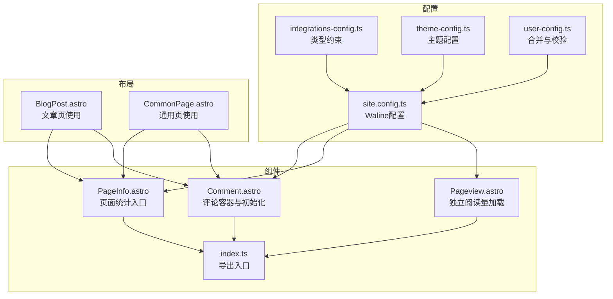
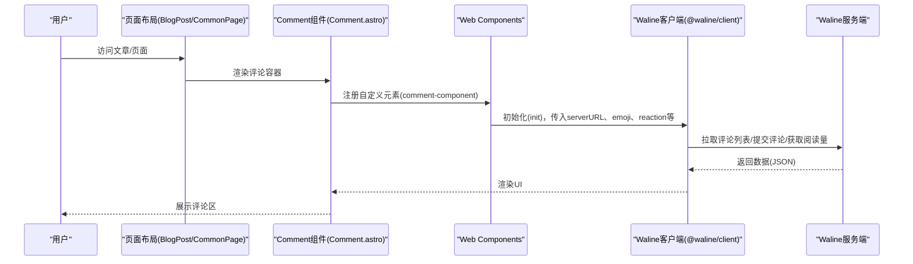
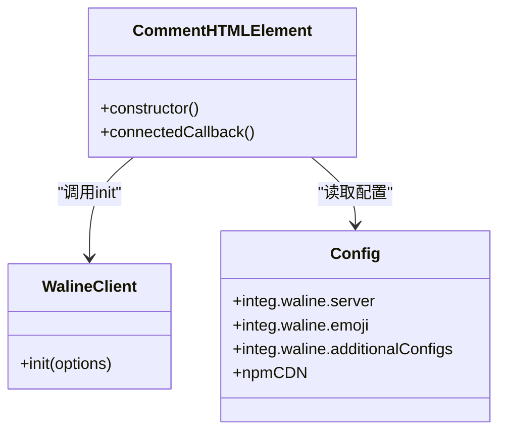
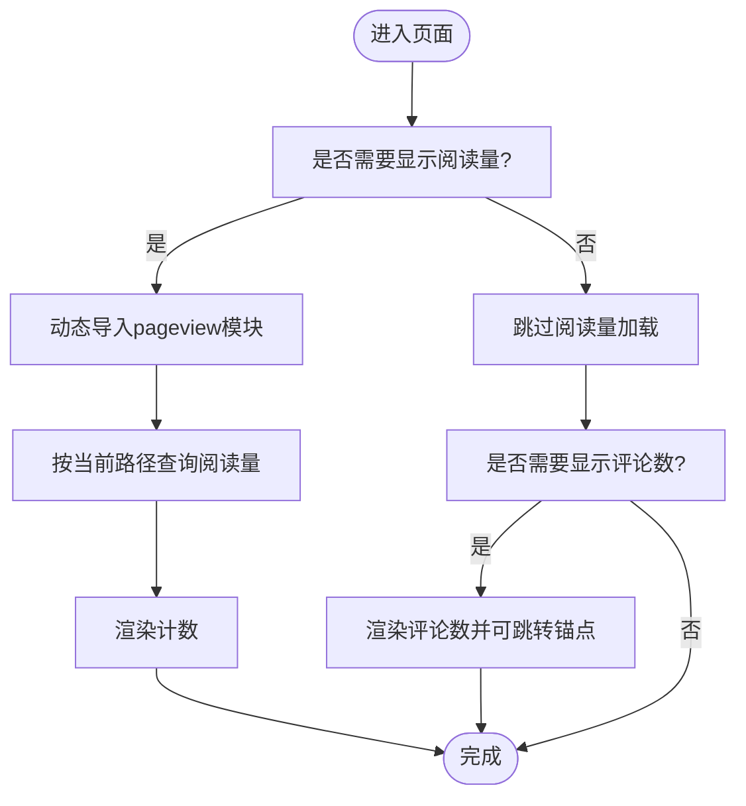
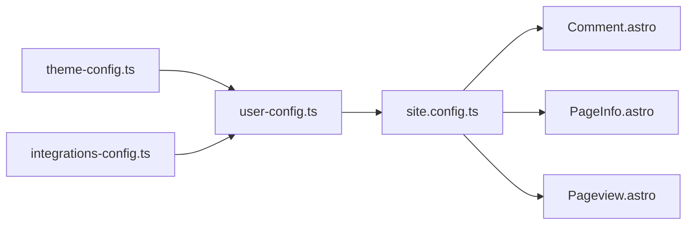

# 评论系统

<cite>
**本文引用的文件**
- [Comment.astro](file://src/components/waline/Comment.astro)
- [PageInfo.astro](file://src/components/waline/PageInfo.astro)
- [Pageview.astro](file://src/components/waline/Pageview.astro)
- [index.ts](file://src/components/waline/index.ts)
- [BlogPost.astro](file://src/layouts/BlogPost.astro)
- [CommonPage.astro](file://src/layouts/CommonPage.astro)
- [site.config.ts](file://src/site.config.ts)
- [integrations-config.ts](file://packages/pure/types/integrations-config.ts)
- [theme-config.ts](file://packages/pure/types/theme-config.ts)
- [user-config.ts](file://packages/pure/types/user-config.ts)
- [class-merge.ts](file://packages/pure/utils/class-merge.ts)
- [clsx.ts](file://packages/pure/utils/clsx.ts)
</cite>

## 目录
1. [简介](#简介)
2. [项目结构](#项目结构)
3. [核心组件](#核心组件)
4. [架构总览](#架构总览)
5. [详细组件分析](#详细组件分析)
6. [依赖关系分析](#依赖关系分析)
7. [性能考量](#性能考量)
8. [故障排除指南](#故障排除指南)
9. [结论](#结论)
10. [附录](#附录)

## 简介
本文件面向Astro主题Pure的评论系统，聚焦于Waline评论与阅读量统计的集成与实现。内容涵盖：
- 服务端部署与配置要点（基于仓库中已配置的服务地址）
- 前端组件实现（评论表单、评论列表、回复与互动、阅读量统计）
- 页面统计组件PageInfo的功能与数据来源
- 用户认证与权限管理现状说明
- 内容安全与审核策略建议
- 通知与邮件推送配置思路
- 性能优化与缓存策略
- 扩展开发与自定义样式指南
- 维护与故障排除实务

## 项目结构
评论系统相关代码主要位于以下位置：
- 组件层：src/components/waline 下的Comment、PageInfo、Pageview三个组件，以及导出入口 index.ts
- 布局层：BlogPost.astro 与 CommonPage.astro 中对评论与页面统计的使用
- 配置层：src/site.config.ts 提供Waline开关、服务端地址、表情包与附加配置；packages/pure/types 下的类型定义确保配置合法

图表来源
- [site.config.ts](file://src/site.config.ts#L161-L180)
- [integrations-config.ts](file://packages/pure/types/integrations-config.ts#L49-L61)
- [Comment.astro](file://src/components/waline/Comment.astro#L1-L167)
- [PageInfo.astro](file://src/components/waline/PageInfo.astro#L1-L31)
- [Pageview.astro](file://src/components/waline/Pageview.astro#L1-L31)
- [BlogPost.astro](file://src/layouts/BlogPost.astro#L12-L69)
- [CommonPage.astro](file://src/layouts/CommonPage.astro#L6-L30)
- [index.ts](file://src/components/waline/index.ts#L1-L4)

章节来源
- [site.config.ts](file://src/site.config.ts#L161-L180)
- [integrations-config.ts](file://packages/pure/types/integrations-config.ts#L49-L61)
- [Comment.astro](file://src/components/waline/Comment.astro#L1-L167)
- [PageInfo.astro](file://src/components/waline/PageInfo.astro#L1-L31)
- [Pageview.astro](file://src/components/waline/Pageview.astro#L1-L31)
- [BlogPost.astro](file://src/layouts/BlogPost.astro#L12-L69)
- [CommonPage.astro](file://src/layouts/CommonPage.astro#L6-L30)
- [index.ts](file://src/components/waline/index.ts#L1-L4)

## 核心组件
- Comment.astro：封装Waline客户端初始化，支持表情包、反应按钮、附加配置透传，并通过Web Components方式挂载到页面。
- PageInfo.astro：聚合显示阅读量与评论数，支持跳转至评论区锚点。
- Pageview.astro：独立加载阅读量模块，按路径查询并渲染阅读量计数。

章节来源
- [Comment.astro](file://src/components/waline/Comment.astro#L1-L167)
- [PageInfo.astro](file://src/components/waline/PageInfo.astro#L1-L31)
- [Pageview.astro](file://src/components/waline/Pageview.astro#L1-L31)

## 架构总览
评论系统从前端到后端的关键交互如下：

图表来源
- [BlogPost.astro](file://src/layouts/BlogPost.astro#L67-L69)
- [CommonPage.astro](file://src/layouts/CommonPage.astro#L23-L29)
- [Comment.astro](file://src/components/waline/Comment.astro#L21-L56)

## 详细组件分析

### Comment组件实现
- 功能要点
  - 条件渲染：仅当配置开启时渲染评论容器
  - Web Components：注册自定义元素，避免与框架冲突
  - 表情包：通过CDN加载指定预设
  - 反应按钮：使用主题图标作为反应项
  - 附加配置：透传additionalConfigs，支持国际化文案、开关等
  - 样式：基于CSS变量适配明暗主题，处理长文本换行与溢出
- 关键行为
  - connectedCallback中执行初始化
  - 通过虚拟配置读取服务端地址与表情包列表
  - 通过类名合并工具注入样式类

图表来源
- [Comment.astro](file://src/components/waline/Comment.astro#L21-L56)
- [site.config.ts](file://src/site.config.ts#L161-L180)
- [class-merge.ts](file://packages/pure/utils/class-merge.ts#L17-L19)
- [clsx.ts](file://packages/pure/utils/clsx.ts#L5-L22)

章节来源
- [Comment.astro](file://src/components/waline/Comment.astro#L1-L167)
- [site.config.ts](file://src/site.config.ts#L161-L180)
- [class-merge.ts](file://packages/pure/utils/class-merge.ts#L17-L19)
- [clsx.ts](file://packages/pure/utils/clsx.ts#L5-L22)

### PageInfo与Pageview组件
- PageInfo
  - 聚合显示阅读量与评论数
  - 支持根据路径查询，点击跳转至评论区锚点
  - 可选择仅显示阅读量或同时显示评论数
- Pageview
  - 独立加载@waline/client的pageview模块
  - 通过define:vars注入CDN与服务端地址
  - 使用超时取消请求，避免阻塞页面

图表来源
- [PageInfo.astro](file://src/components/waline/PageInfo.astro#L16-L28)
- [Pageview.astro](file://src/components/waline/Pageview.astro#L12-L30)

章节来源
- [PageInfo.astro](file://src/components/waline/PageInfo.astro#L1-L31)
- [Pageview.astro](file://src/components/waline/Pageview.astro#L1-L31)

### 布局中的使用
- 文章页：在标题下方展示PageInfo（含评论数），底部插入Comment组件
- 通用页：根据参数决定是否显示PageInfo与Comment

章节来源
- [BlogPost.astro](file://src/layouts/BlogPost.astro#L56-L69)
- [CommonPage.astro](file://src/layouts/CommonPage.astro#L23-L29)

## 依赖关系分析
- 配置类型约束
  - IntegrationsConfigSchema 对 waline 字段进行严格校验，确保 enable、server、showMeta、emoji、additionalConfigs 合法
  - UserConfigSchema 将主题与集成配置合并，并在prerender为false时禁止pagefind
- 运行时配置
  - site.config.ts 提供默认值与示例配置，waline.enable默认开启，指向演示服务端地址
- 组件依赖
  - Comment依赖virtual:config提供的integ.waline配置
  - Pageview依赖npmCDN与waline.server
  - PageInfo依赖当前路径与data-path属性

图表来源
- [theme-config.ts](file://packages/pure/types/theme-config.ts#L1-L193)
- [integrations-config.ts](file://packages/pure/types/integrations-config.ts#L1-L66)
- [user-config.ts](file://packages/pure/types/user-config.ts#L1-L27)
- [site.config.ts](file://src/site.config.ts#L161-L180)
- [Comment.astro](file://src/components/waline/Comment.astro#L24-L26)
- [PageInfo.astro](file://src/components/waline/PageInfo.astro#L13)
- [Pageview.astro](file://src/components/waline/Pageview.astro#L10)

章节来源
- [integrations-config.ts](file://packages/pure/types/integrations-config.ts#L49-L61)
- [user-config.ts](file://packages/pure/types/user-config.ts#L13-L23)
- [site.config.ts](file://src/site.config.ts#L161-L180)
- [Comment.astro](file://src/components/waline/Comment.astro#L24-L26)
- [PageInfo.astro](file://src/components/waline/PageInfo.astro#L13)
- [Pageview.astro](file://src/components/waline/Pageview.astro#L10)

## 性能考量
- 资源加载
  - 表情包通过CDN按需加载，减少首屏体积
  - Pageview采用动态导入与超时取消，避免阻塞主线程
- 渲染优化
  - 通过CSS变量统一主题色，减少重复样式计算
  - 针对长文本与链接的换行策略，降低重排风险
- 缓存策略
  - 建议在服务端启用静态资源缓存与CDN加速
  - 对评论列表与阅读量接口增加浏览器缓存头（如Cache-Control）
- 交互体验
  - 评论区懒加载，仅在可见区域触发初始化
  - 反应按钮与表情包使用轻量级SVG，避免额外脚本开销

## 故障排除指南
- 评论区空白或初始化失败
  - 检查waline.server是否可达，确认CDN可用性
  - 确认enable为true且additionalConfigs未传入不兼容字段
- 阅读量不更新
  - 确认Pageview已成功导入pageview模块并传入正确路径
  - 检查服务端是否记录该路径的页面访问
- 样式异常
  - 检查CSS变量覆盖是否生效，确认暗色主题切换逻辑
  - 确认未被外部样式覆盖关键选择器
- 表情包或反应按钮不显示
  - 核对emoji预设名称与CDN路径
  - 确认reaction图标路径有效

章节来源
- [Comment.astro](file://src/components/waline/Comment.astro#L41-L51)
- [Pageview.astro](file://src/components/waline/Pageview.astro#L12-L30)
- [PageInfo.astro](file://src/components/waline/PageInfo.astro#L16-L28)

## 结论
本评论系统以Waline为核心，结合Pure主题的配置体系与组件化设计，实现了评论与阅读量统计的开箱即用。通过严格的类型约束与灵活的附加配置，既保证了稳定性，也为扩展提供了空间。建议在生产环境中完善服务端部署、安全与审核策略，并持续优化性能与用户体验。

## 附录

### 集成配置清单（摘自site.config.ts）
- 开关与服务端
  - enable: true
  - server: 演示服务端地址
- 显示选项
  - showMeta: false
- 表情包
  - emoji: ['bmoji', 'weibo']
- 附加配置
  - pageview: true
  - comment: true
  - locale.reaction0: 'Like'
  - locale.placeholder: '欢迎留言（填写邮箱可接收回复）'
  - imageUploader: false

章节来源
- [site.config.ts](file://src/site.config.ts#L161-L180)

### 类型约束摘要（摘自types）
- waline.enable: 布尔
- waline.server: 字符串（可选）
- waline.showMeta: 布尔
- waline.emoji: 字符串数组（可选）
- waline.additionalConfigs: 任意对象（可选）

章节来源
- [integrations-config.ts](file://packages/pure/types/integrations-config.ts#L49-L61)

### 用户认证与权限管理
- 当前实现
  - 前端未强制登录，支持匿名评论
  - 通过邮箱字段接收回复提醒
- 建议
  - 在服务端启用登录态校验与权限分级
  - 对敏感操作（删除、编辑）增加管理员权限校验
  - 引入CSRF防护与速率限制

### 内容安全与审核策略
- 前端
  - 保持默认Markdown渲染与链接外链提示
- 服务端
  - 建议启用关键词过滤、敏感词拦截与人工审核队列
  - 对图片上传与附件进行白名单与大小限制
  - 记录IP与UA，便于追溯与风控

### 通知与邮件推送
- 配置思路
  - 在服务端配置SMTP或第三方邮件网关
  - 评论触发时根据被@用户或父评论作者发送通知
- 注意事项
  - 遵循隐私政策，明确收集与使用邮箱的目的
  - 提供退订与屏蔽机制

### 扩展开发与自定义样式
- 扩展点
  - 通过additionalConfigs新增或覆盖Waline客户端能力
  - 自定义reaction图标与表情包集合
  - 在PageInfo中扩展更多统计维度（如点赞、分享）
- 样式定制
  - 通过CSS变量覆盖主题色、边框、背景等
  - 使用暗色主题媒体查询适配深浅模式

章节来源
- [Comment.astro](file://src/components/waline/Comment.astro#L64-L166)
- [PageInfo.astro](file://src/components/waline/PageInfo.astro#L16-L28)