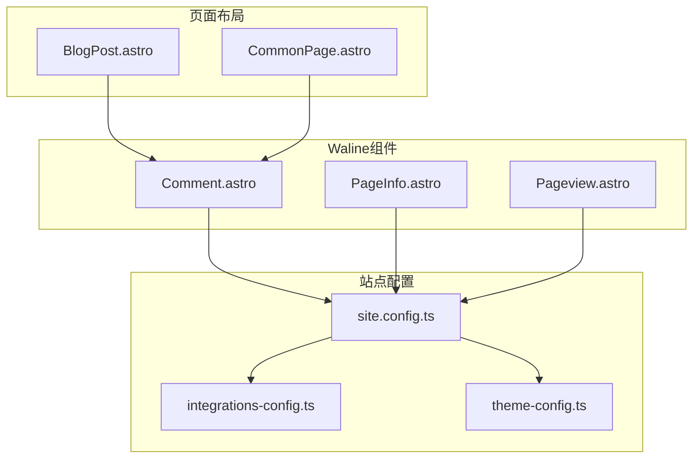
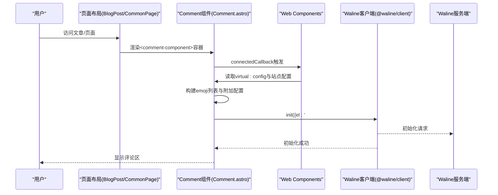
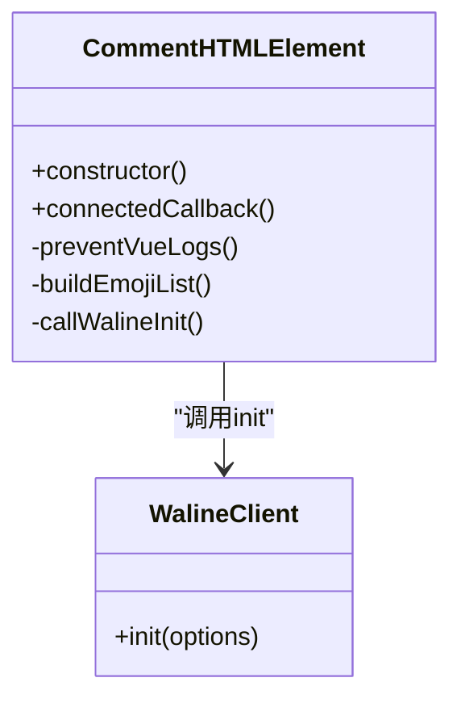
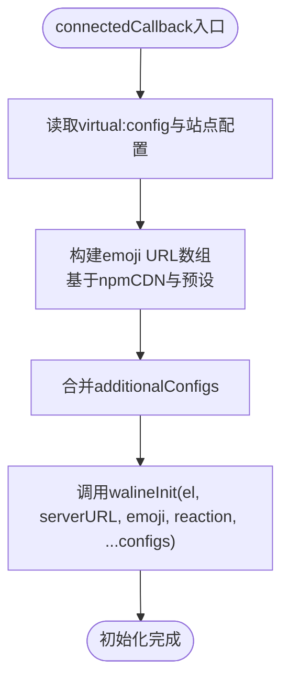
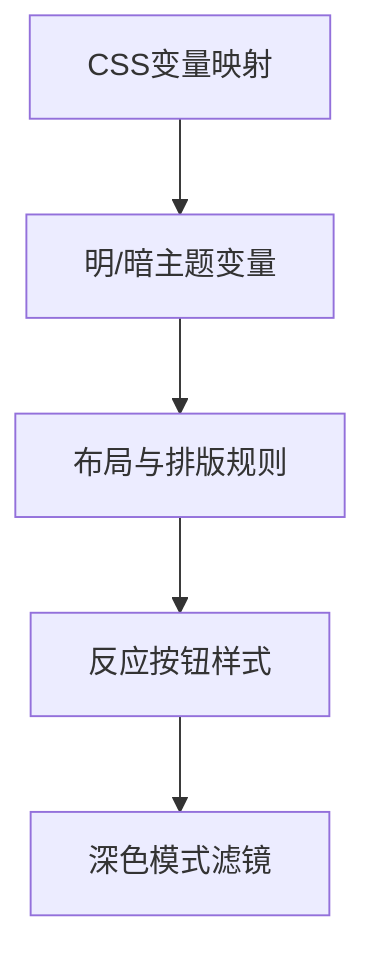
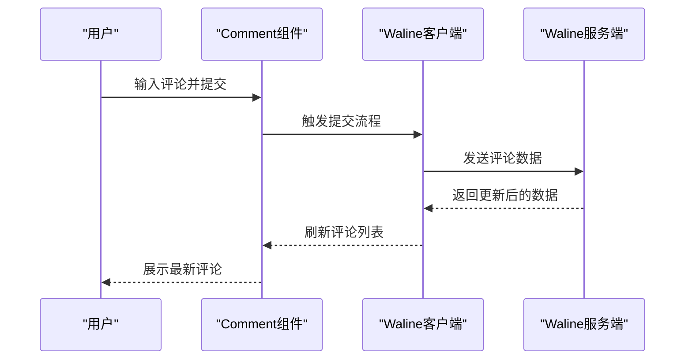
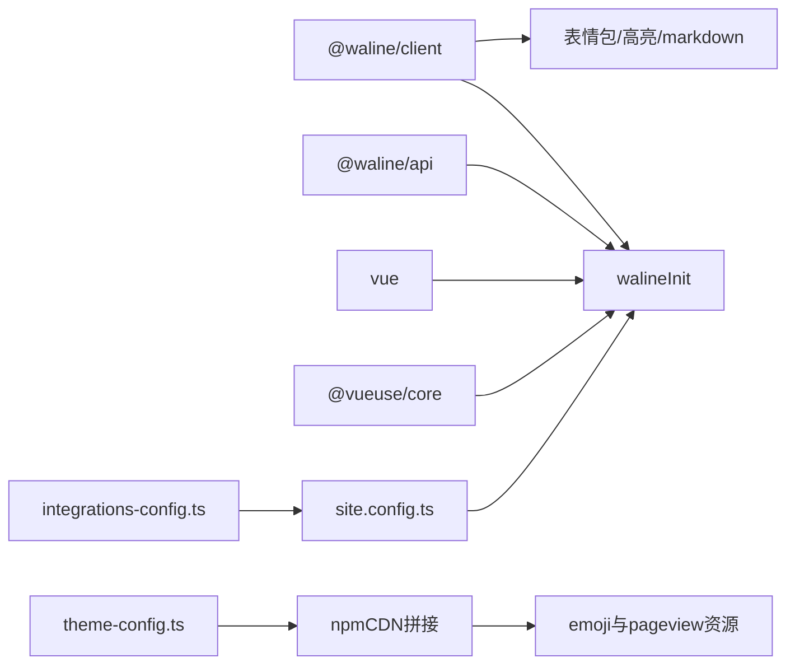

# 评论组件实现

<cite>
**本文档引用的文件**
- [Comment.astro](file://src/components/waline/Comment.astro)
- [index.ts](file://src/components/waline/index.ts)
- [PageInfo.astro](file://src/components/waline/PageInfo.astro)
- [Pageview.astro](file://src/components/waline/Pageview.astro)
- [site.config.ts](file://src/site.config.ts)
- [integrations-config.ts](file://packages/pure/types/integrations-config.ts)
- [theme-config.ts](file://packages/pure/types/theme-config.ts)
- [BlogPost.astro](file://src/layouts/BlogPost.astro)
- [CommonPage.astro](file://src/layouts/CommonPage.astro)
- [bun.lock](file://bun.lock)
</cite>

## 目录
1. [简介](#简介)
2. [项目结构](#项目结构)
3. [核心组件](#核心组件)
4. [架构总览](#架构总览)
5. [详细组件分析](#详细组件分析)
6. [依赖关系分析](#依赖关系分析)
7. [性能考虑](#性能考虑)
8. [故障排查指南](#故障排查指南)
9. [结论](#结论)
10. [附录](#附录)

## 简介
本文件面向Astro主题Pure中的评论系统，聚焦于Comment组件的技术实现与最佳实践。内容涵盖：
- Astro组件结构与生命周期管理（connectedCallback钩子）
- Vue兼容性配置与初始化流程
- walineInit初始化函数的调用过程（DOM选择、配置参数传递、emoji表情包加载）
- 样式定制（CSS变量、主题色映射、响应式设计）
- 事件处理机制（用户交互、评论提交、实时更新）
- 自定义扩展指南（样式修改、功能增强、第三方集成）
- 调试技巧与常见问题解决方案

## 项目结构
评论相关代码主要位于src/components/waline目录，配合站点配置与布局使用：
- Comment.astro：评论容器组件，负责初始化Waline客户端
- PageInfo.astro：文章信息展示（浏览量、评论数）
- Pageview.astro：独立的页面浏览量统计组件
- site.config.ts：Waline集成配置（启用开关、服务端地址、表情包、附加配置等）
- 布局文件：在博客文章页或通用页面中按需引入Comment组件

**图表来源**
- [Comment.astro](file://src/components/waline/Comment.astro#L1-L167)
- [PageInfo.astro](file://src/components/waline/PageInfo.astro#L1-L30)
- [Pageview.astro](file://src/components/waline/Pageview.astro#L1-L30)
- [site.config.ts](file://src/site.config.ts#L160-L181)
- [integrations-config.ts](file://packages/pure/types/integrations-config.ts#L49-L61)
- [theme-config.ts](file://packages/pure/types/theme-config.ts#L103-L114)
- [BlogPost.astro](file://src/layouts/BlogPost.astro#L1-L75)
- [CommonPage.astro](file://src/layouts/CommonPage.astro#L1-L33)

**章节来源**
- [Comment.astro](file://src/components/waline/Comment.astro#L1-L167)
- [index.ts](file://src/components/waline/index.ts#L1-L4)
- [site.config.ts](file://src/site.config.ts#L160-L181)
- [BlogPost.astro](file://src/layouts/BlogPost.astro#L1-L75)
- [CommonPage.astro](file://src/layouts/CommonPage.astro#L1-L33)

## 核心组件
- Comment组件：基于Web Components封装，通过connectedCallback钩子在DOM挂载后初始化Waline客户端；支持emoji表情包加载与自定义反应按钮；通过CSS变量实现主题色映射与响应式样式。
- PageInfo组件：显示当前路径的浏览量与评论数，并可跳转到评论区。
- Pageview组件：独立加载Waline页面浏览量模块，按需请求并限制超时。

**章节来源**
- [Comment.astro](file://src/components/waline/Comment.astro#L1-L167)
- [PageInfo.astro](file://src/components/waline/PageInfo.astro#L1-L30)
- [Pageview.astro](file://src/components/waline/Pageview.astro#L1-L30)

## 架构总览
Waline评论系统在Astro中的工作流如下：
- 页面渲染时，根据站点配置决定是否渲染Comment容器
- Comment组件在connectedCallback中读取配置，构建emoji列表与附加配置
- 通过@waline/client的init函数完成初始化，挂载到#waline节点
- 同步加载@waline/client/style以确保样式可用
- PageInfo/Pageview分别用于展示浏览量与评论数

**图表来源**
- [Comment.astro](file://src/components/waline/Comment.astro#L21-L56)
- [BlogPost.astro](file://src/layouts/BlogPost.astro#L67-L69)
- [CommonPage.astro](file://src/layouts/CommonPage.astro#L29-L30)

## 详细组件分析

### Comment组件：Astro组件结构与生命周期
- 组件结构
  - 模板：条件渲染<comment-component>，内部包含#waline挂载点
  - 样式：导入@waline/client/style，定义CSS变量以适配主题
  - 脚本：定义Comment Web Component类，注册为customElements
- 生命周期
  - connectedCallback：在DOM挂载后执行，设置Vue兼容性标志，构建emoji数组，调用walineInit初始化
- DOM选择与挂载
  - el: '#waline'，确保与模板中的挂载点一致
- 配置参数传递
  - serverURL：来自站点配置
  - emoji：从站点配置的emoji数组映射到CDN路径
  - reaction：自定义反应按钮图标
  - additionalConfigs：合并站点配置中的附加属性
- Vue兼容性
  - 设置全局标志以避免Vue选项API与水合不匹配警告

**图表来源**
- [Comment.astro](file://src/components/waline/Comment.astro#L28-L56)

**章节来源**
- [Comment.astro](file://src/components/waline/Comment.astro#L1-L167)

### walineInit初始化流程详解
- DOM元素选择
  - el: '#waline'，确保与模板一致
- 配置参数
  - serverURL：来自站点配置
  - emoji：若配置存在，则映射为CDN路径数组
  - reaction：固定为本地图标路径
  - additionalConfigs：合并站点配置中的其他属性
- emoji表情包加载机制
  - 从站点配置读取emoji预设名称
  - 通过npmCDN拼接具体版本与包名，形成完整URL数组
  - 传入walineInit作为emoji参数
- Vue兼容性设置
  - 在connectedCallback中设置全局标志，减少框架冲突日志

**图表来源**
- [Comment.astro](file://src/components/waline/Comment.astro#L33-L51)

**章节来源**
- [Comment.astro](file://src/components/waline/Comment.astro#L21-L56)
- [site.config.ts](file://src/site.config.ts#L160-L181)
- [theme-config.ts](file://packages/pure/types/theme-config.ts#L103-L114)

### 样式定制：CSS变量、主题色映射与响应式设计
- CSS变量映射
  - 字体大小、基础色、主题色、边框色、禁用色、代码背景等均映射到CSS变量
  - 使用hsl(var(--xxx))与透明度变量，保证明暗主题一致性
- 布局与排版
  - 针对长文本与链接溢出进行max-width与word-break处理
  - 对meta信息、内容区域、链接等进行统一样式约束
- 反应按钮样式
  - 隐藏默认标题与文本，自定义反应按钮布局与交互态
  - 支持深色模式下的滤镜反转
- 主题适配
  - 通过:global选择器作用于Waline生成的类名，确保样式穿透

**图表来源**
- [Comment.astro](file://src/components/waline/Comment.astro#L64-L166)

**章节来源**
- [Comment.astro](file://src/components/waline/Comment.astro#L64-L166)

### 事件处理机制：用户交互、评论提交与实时更新
- 用户交互
  - 文本输入、表情选择、图片上传（按配置关闭）、搜索（按配置关闭）等由Waline客户端处理
- 评论提交
  - 通过walineInit初始化后，表单提交由客户端发起请求至serverURL
- 实时更新
  - Waline服务端返回数据后，客户端自动刷新评论列表
- 页面信息联动
  - PageInfo组件通过data-path绑定当前路径，展示评论计数与跳转
  - Pageview组件独立加载浏览量统计

**图表来源**
- [Comment.astro](file://src/components/waline/Comment.astro#L45-L51)
- [PageInfo.astro](file://src/components/waline/PageInfo.astro#L16-L28)
- [Pageview.astro](file://src/components/waline/Pageview.astro#L12-L30)

**章节来源**
- [Comment.astro](file://src/components/waline/Comment.astro#L45-L51)
- [PageInfo.astro](file://src/components/waline/PageInfo.astro#L1-L30)
- [Pageview.astro](file://src/components/waline/Pageview.astro#L1-L30)

### 自定义扩展指南
- 样式修改
  - 通过覆盖CSS变量值调整主题色、字体大小、边框与背景
  - 使用:global选择器针对Waline生成的类名进行样式穿透
- 功能增强
  - 在additionalConfigs中添加locale、pageview、comment等选项
  - 自定义reaction图标与placeholder文案
- 第三方集成
  - 通过emoji数组引入CDN上的表情包预设
  - 通过serverURL指向自有Waline服务端实例

**章节来源**
- [Comment.astro](file://src/components/waline/Comment.astro#L45-L51)
- [site.config.ts](file://src/site.config.ts#L160-L181)
- [integrations-config.ts](file://packages/pure/types/integrations-config.ts#L49-L61)

## 依赖关系分析
- 运行时依赖
  - @waline/client：评论核心库，包含init、表情包、高亮、marked等能力
  - @waline/api：服务端接口定义
  - vue与@vueuse/core：用于兼容与工具函数
- 站点配置依赖
  - site.config.ts：定义waline.enable、server、emoji、additionalConfigs等
  - integrations-config.ts：类型校验与默认值
  - theme-config.ts：npmCDN用于拼接emoji与pageview资源路径
- 构建与打包
  - bun.lock记录了@waline/client版本与依赖树

**图表来源**
- [bun.lock](file://bun.lock#L499-L501)
- [site.config.ts](file://src/site.config.ts#L160-L181)
- [integrations-config.ts](file://packages/pure/types/integrations-config.ts#L49-L61)
- [theme-config.ts](file://packages/pure/types/theme-config.ts#L103-L114)

**章节来源**
- [bun.lock](file://bun.lock#L499-L501)
- [site.config.ts](file://src/site.config.ts#L160-L181)
- [integrations-config.ts](file://packages/pure/types/integrations-config.ts#L49-L61)
- [theme-config.ts](file://packages/pure/types/theme-config.ts#L103-L114)

## 性能考虑
- 资源加载策略
  - 通过npmCDN按需加载emoji与pageview模块，避免一次性加载过多资源
  - Pageview组件设置超时取消，防止长时间阻塞
- 样式优化
  - 使用CSS变量减少重复样式定义，提升主题切换性能
  - 仅对必要元素应用:global选择器，降低样式穿透成本
- 初始化时机
  - connectedCallback在DOM挂载后执行，避免SSR阶段的副作用

**章节来源**
- [Comment.astro](file://src/components/waline/Comment.astro#L41-L51)
- [Pageview.astro](file://src/components/waline/Pageview.astro#L27-L30)

## 故障排查指南
- 评论区空白或初始化失败
  - 检查waline.enable与serverURL是否正确配置
  - 确认#waline挂载点是否存在且未被其他逻辑覆盖
- 表情包不显示
  - 核对emoji数组与npmCDN拼接路径是否有效
  - 确保网络可访问CDN资源
- Vue冲突告警
  - connectedCallback中已设置全局标志，如仍有问题，检查项目中其他Vue相关配置
- 页面信息不更新
  - PageInfo/Pageview依赖data-path与serverURL，确认路径与服务端一致

**章节来源**
- [Comment.astro](file://src/components/waline/Comment.astro#L33-L51)
- [site.config.ts](file://src/site.config.ts#L160-L181)
- [PageInfo.astro](file://src/components/waline/PageInfo.astro#L16-L28)
- [Pageview.astro](file://src/components/waline/Pageview.astro#L12-L30)

## 结论
Comment组件通过Web Components与@waline/client实现了与Astro的无缝集成，具备良好的主题适配、样式可定制与运行时性能表现。结合站点配置与布局使用，可在不同页面灵活启用评论功能，并通过emoji、反应按钮与国际化配置提升用户体验。

## 附录
- 组件导出入口：src/components/waline/index.ts
- 使用示例：BlogPost.astro与CommonPage.astro中按需引入Comment组件

**章节来源**
- [index.ts](file://src/components/waline/index.ts#L1-L4)
- [BlogPost.astro](file://src/layouts/BlogPost.astro#L67-L69)
- [CommonPage.astro](file://src/layouts/CommonPage.astro#L29-L30)