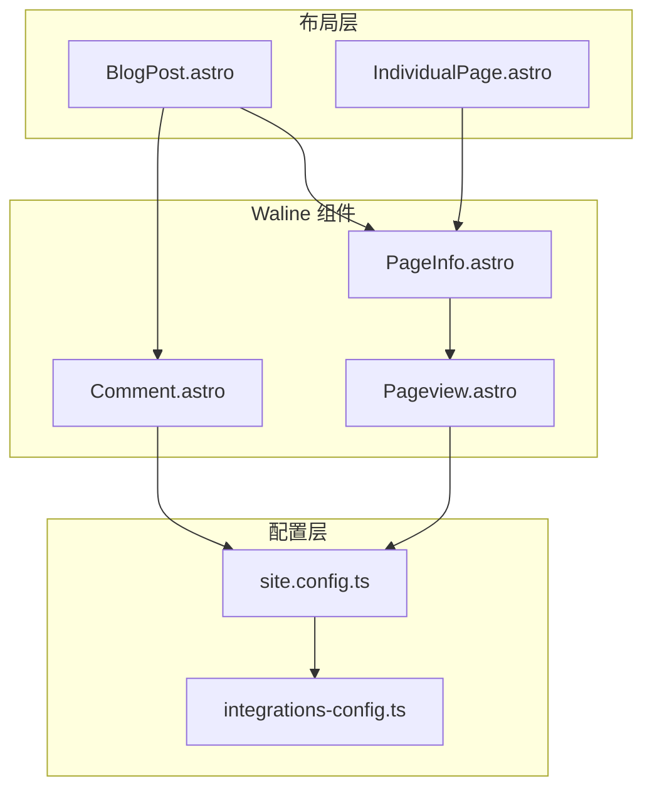
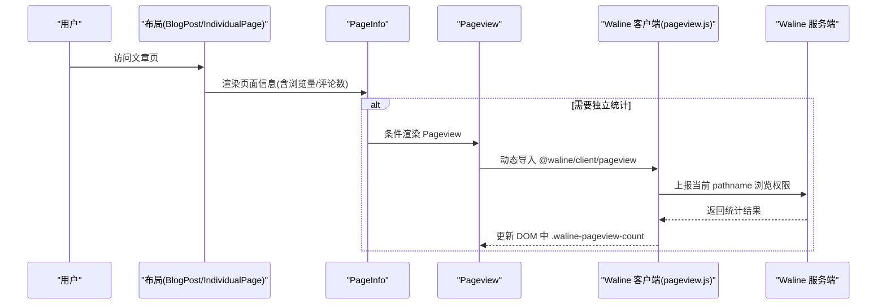
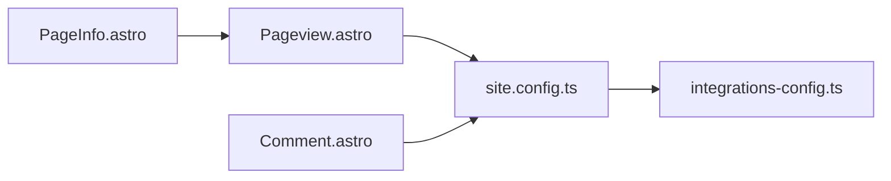

# 页面统计功能

<cite>
**本文引用的文件**
- [src/components/waline/PageInfo.astro](file://src/components/waline/PageInfo.astro)
- [src/components/waline/Pageview.astro](file://src/components/waline/Pageview.astro)
- [src/components/waline/Comment.astro](file://src/components/waline/Comment.astro)
- [src/components/waline/index.ts](file://src/components/waline/index.ts)
- [src/layouts/BlogPost.astro](file://src/layouts/BlogPost.astro)
- [src/layouts/IndividualPage.astro](file://src/layouts/IndividualPage.astro)
- [src/site.config.ts](file://src/site.config.ts)
- [packages/pure/types/integrations-config.ts](file://packages/pure/types/integrations-config.ts)
</cite>

## 目录
1. [简介](#简介)
2. [项目结构](#项目结构)
3. [核心组件](#核心组件)
4. [架构总览](#架构总览)
5. [组件详解](#组件详解)
6. [依赖关系分析](#依赖关系分析)
7. [性能考量](#性能考量)
8. [故障排查指南](#故障排查指南)
9. [结论](#结论)
10. [附录](#附录)

## 简介
本文件系统性阐述 Astro 主题 Pure 中的页面统计功能，围绕以下目标展开：
- 深入解析 PageInfo 组件如何采集并展示页面标题、URL、路径与统计信息
- 详解 Pageview 组件的 PV/UV 统计能力、数据来源与实时更新机制
- 说明页面统计与 Waline 系统的集成方式，包括统计字段同步与一致性保障
- 提供配置项说明（统计开关、隐私与性能优化）
- 给出扩展开发指南（自定义统计指标、数据导出与分析）
- 提供监控与维护建议及数据备份恢复策略

## 项目结构
页面统计功能主要由 Waline 子模块提供，核心文件分布如下：
- 组件层：PageInfo、Pageview、Comment
- 布局层：BlogPost、IndividualPage 引入并渲染统计组件
- 配置层：site.config.ts 定义 Waline 开关与服务端地址；类型定义约束配置结构
- 导出入口：waline/index.ts 暴露组件

图表来源
- [src/layouts/BlogPost.astro](file://src/layouts/BlogPost.astro#L1-L75)
- [src/layouts/IndividualPage.astro](file://src/layouts/IndividualPage.astro#L1-L77)
- [src/components/waline/PageInfo.astro](file://src/components/waline/PageInfo.astro#L1-L31)
- [src/components/waline/Pageview.astro](file://src/components/waline/Pageview.astro#L1-L31)
- [src/components/waline/Comment.astro](file://src/components/waline/Comment.astro#L1-L167)
- [src/site.config.ts](file://src/site.config.ts#L1-L207)
- [packages/pure/types/integrations-config.ts](file://packages/pure/types/integrations-config.ts#L39-L65)

章节来源
- [src/layouts/BlogPost.astro](file://src/layouts/BlogPost.astro#L1-L75)
- [src/layouts/IndividualPage.astro](file://src/layouts/IndividualPage.astro#L1-L77)
- [src/components/waline/index.ts](file://src/components/waline/index.ts#L1-L4)

## 核心组件
- PageInfo：负责在页面头部或合适位置渲染“浏览量”和“评论数”，并可按需加载 Pageview 组件以触发统计请求
- Pageview：独立的页面浏览量统计组件，通过动态导入 Waline 客户端的 pageview 模块，向 Waline 服务端上报当前路径的浏览量
- Comment：Waline 评论系统初始化组件，同时支持开启/关闭页面浏览量与评论数的展示

章节来源
- [src/components/waline/PageInfo.astro](file://src/components/waline/PageInfo.astro#L1-L31)
- [src/components/waline/Pageview.astro](file://src/components/waline/Pageview.astro#L1-L31)
- [src/components/waline/Comment.astro](file://src/components/waline/Comment.astro#L1-L167)

## 架构总览
页面统计在前端侧由 PageInfo 与 Pageview 协作完成，二者均依赖 site.config.ts 中的 Waline 服务端地址与 CDN 配置。Waline 服务端负责持久化与聚合浏览量/评论数，并通过客户端模块返回最新数据。

图表来源
- [src/layouts/BlogPost.astro](file://src/layouts/BlogPost.astro#L1-L75)
- [src/components/waline/PageInfo.astro](file://src/components/waline/PageInfo.astro#L1-L31)
- [src/components/waline/Pageview.astro](file://src/components/waline/Pageview.astro#L1-L31)
- [src/site.config.ts](file://src/site.config.ts#L1-L207)

## 组件详解

### PageInfo 组件
职责与行为
- 读取当前 URL 路径作为统计键
- 渲染浏览量占位元素与可选的评论数链接
- 当 view 为真且未启用评论时，自动插入 Pageview 组件以触发统计上报

关键点
- 使用 Astro.url.pathname 获取路径
- 通过 data-path 属性标注统计键，供 Pageview 或服务端识别
- 可选地渲染评论数并跳转到评论区锚点

章节来源
- [src/components/waline/PageInfo.astro](file://src/components/waline/PageInfo.astro#L1-L31)

### Pageview 组件
职责与行为
- 在页面加载后异步导入 Waline 客户端的 pageview 模块
- 通过服务端地址与当前 pathname 向 Waline 服务端发起统计请求
- 若请求在限定时间内未完成，主动取消以避免阻塞主线程

关键点
- 通过 define:vars 注入 npmCDN 与 walineServer，确保运行时可配置
- 使用 setTimeout 控制超时取消，提升交互流畅度
- 仅当页面存在 .waline-pageview-count 元素时执行统计

章节来源
- [src/components/waline/Pageview.astro](file://src/components/waline/Pageview.astro#L1-L31)

### Comment 组件
职责与行为
- 初始化 Waline 评论系统，支持表情包、反应按钮等特性
- 通过 additionalConfigs 透传配置，包括是否启用 pageview 与 comment 字段
- 可根据 showMeta 控制是否隐藏元信息区域

与统计的关系
- 通过 additionalConfigs.pageview 与 additionalConfigs.comment 控制页面是否展示浏览量与评论数
- 该配置最终影响 PageInfo 的渲染逻辑与 Comment 的初始化参数

章节来源
- [src/components/waline/Comment.astro](file://src/components/waline/Comment.astro#L1-L167)
- [src/site.config.ts](file://src/site.config.ts#L160-L180)

### 布局中的使用
- BlogPost：在文章头部根据 frontmatter 决定是否渲染 PageInfo，并在底部挂载 Comment
- IndividualPage：通用页面布局，同样可按需引入 PageInfo 与 Pageview

章节来源
- [src/layouts/BlogPost.astro](file://src/layouts/BlogPost.astro#L1-L75)
- [src/layouts/IndividualPage.astro](file://src/layouts/IndividualPage.astro#L1-L77)

## 依赖关系分析
- 组件耦合
  - PageInfo 依赖 Astro.url 与 Pageview 组件
  - Pageview 依赖 site.config.ts 中的 CDN 与服务端地址
  - Comment 依赖 Waline 客户端初始化与 additionalConfigs
- 外部依赖
  - @waline/client/pageview：用于独立统计
  - @waline/client：用于评论系统初始化与样式注入
- 类型约束
  - integrations-config.ts 对 waline 配置进行类型校验，确保 enable、server、additionalConfigs 等字段合法

图表来源
- [src/components/waline/PageInfo.astro](file://src/components/waline/PageInfo.astro#L1-L31)
- [src/components/waline/Pageview.astro](file://src/components/waline/Pageview.astro#L1-L31)
- [src/components/waline/Comment.astro](file://src/components/waline/Comment.astro#L1-L167)
- [src/site.config.ts](file://src/site.config.ts#L1-L207)
- [packages/pure/types/integrations-config.ts](file://packages/pure/types/integrations-config.ts#L39-L65)

章节来源
- [src/components/waline/index.ts](file://src/components/waline/index.ts#L1-L4)
- [packages/pure/types/integrations-config.ts](file://packages/pure/types/integrations-config.ts#L39-L65)

## 性能考量
- 异步加载与超时控制
  - Pageview 采用动态 import 并在 500ms 后若未完成则取消，降低对首屏的影响
- CDN 选择
  - 通过 config.npmCDN 指定资源分发节点，减少加载延迟
- 条件渲染
  - PageInfo 仅在需要时插入 Pageview，避免不必要的网络请求
- 评论与统计联动
  - 通过 additionalConfigs.pageview 与 additionalConfigs.comment 控制是否启用统计字段，减少 DOM 与网络开销

章节来源
- [src/components/waline/Pageview.astro](file://src/components/waline/Pageview.astro#L1-L31)
- [src/site.config.ts](file://src/site.config.ts#L35-L35)

## 故障排查指南
常见问题与定位思路
- 统计不更新
  - 检查 Waline 服务端地址是否正确，确认 site.config.ts 中 integ.waline.server 是否可用
  - 确认 Pageview 是否被条件渲染，以及页面是否存在 .waline-pageview-count
  - 观察浏览器控制台是否有加载失败日志
- 评论与统计冲突
  - 若同时启用了 Comment 与独立 Pageview，确认 additionalConfigs.pageview 与 additionalConfigs.comment 的设置
- 资源加载失败
  - 检查 npmCDN 配置与网络连通性，必要时更换 CDN 节点

章节来源
- [src/components/waline/Pageview.astro](file://src/components/waline/Pageview.astro#L1-L31)
- [src/components/waline/Comment.astro](file://src/components/waline/Comment.astro#L1-L167)
- [src/site.config.ts](file://src/site.config.ts#L160-L180)

## 结论
Pure 主题的页面统计功能以 PageInfo 与 Pageview 为核心，结合 Waline 服务端实现浏览量与评论数的展示与上报。通过合理的配置与性能优化策略，可在保证用户体验的同时获得可靠的统计数据。后续可通过扩展 additionalConfigs 与自定义统计指标进一步增强分析能力。

## 附录

### 配置项说明
- 统计开关与服务端
  - waline.enable：是否启用 Waline
  - waline.server：Waline 服务端地址
- 统计字段控制
  - additionalConfigs.pageview：是否在页面中展示浏览量
  - additionalConfigs.comment：是否在页面中展示评论数
- CDN 与资源
  - npmCDN：CDN 地址，用于动态导入 @waline/client/pageview
- 类型约束
  - integrations-config.ts 对 waline 配置进行类型校验，确保字段合法

章节来源
- [src/site.config.ts](file://src/site.config.ts#L160-L180)
- [packages/pure/types/integrations-config.ts](file://packages/pure/types/integrations-config.ts#L39-L65)

### 扩展开发指南
- 自定义统计指标
  - 在 additionalConfigs 中添加自定义字段，结合服务端能力进行二次处理
- 数据导出与分析
  - 通过 Waline 提供的数据接口定期拉取统计结果，生成报表
- 实时更新机制
  - 在 Pageview 中增加轮询或 WebSocket 推送，实现更及时的更新
- 隐私与合规
  - 默认不收集用户身份信息；如需匿名化处理，可在服务端配置中开启相应策略

[本节为概念性指导，无需代码来源]

### 监控与维护建议
- 监控指标
  - 页面加载耗时、Pageview 请求成功率、评论数/浏览量增长趋势
- 健康检查
  - 定期探测 walineServer 可用性，异常时切换备用节点
- 备份与恢复
  - 定期备份 Waline 数据库快照；在迁移或回滚时使用快照恢复

[本节为概念性指导，无需代码来源]