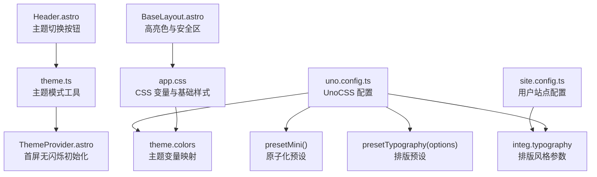
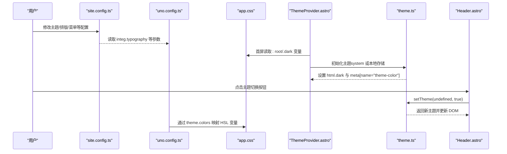
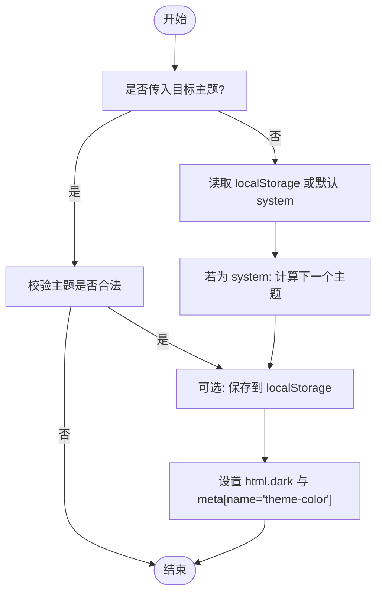
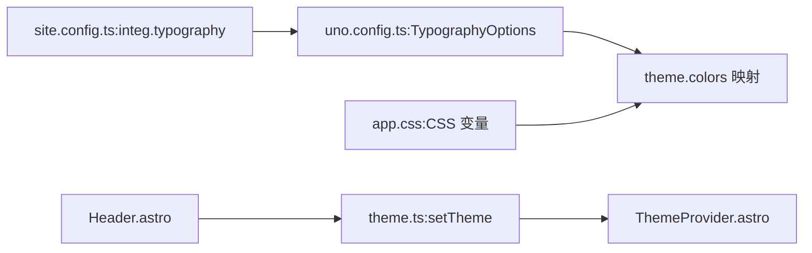

# 主题配置

<cite>
**本文引用的文件列表**
- [uno.config.ts](file://uno.config.ts)
- [app.css](file://src/assets/styles/app.css)
- [site.config.ts](file://src/site.config.ts)
- [theme.ts](file://packages/pure/utils/theme.ts)
- [ThemeProvider.astro](file://packages/pure/components/basic/ThemeProvider.astro)
- [Header.astro](file://packages/pure/components/basic/Header.astro)
- [theme-config.ts](file://packages/pure/types/theme-config.ts)
- [head.ts](file://packages/pure/schemas/head.ts)
- [logo.ts](file://packages/pure/schemas/logo.ts)
- [locale.ts](file://packages/pure/schemas/locale.ts)
- [share.ts](file://packages/pure/schemas/share.ts)
- [BaseLayout.astro](file://src/layouts/BaseLayout.astro)
</cite>

## 目录
1. [简介](#简介)
2. [项目结构](#项目结构)
3. [核心组件](#核心组件)
4. [架构总览](#架构总览)
5. [详细组件分析](#详细组件分析)
6. [依赖关系分析](#依赖关系分析)
7. [性能考量](#性能考量)
8. [故障排查指南](#故障排查指南)
9. [结论](#结论)
10. [附录](#附录)

## 简介
本指南围绕 Astro 主题 Pure 的主题配置展开，重点解析 uno.config.ts 中的 UnoCSS 配置、主题变量体系（颜色、字体、间距）、原子化 CSS 生成规则与样式优先级、主题模式切换（浅色/深色/系统）的实现方式，并提供可操作的主题定制示例与最佳实践。读者无需深入前端工程背景即可按步骤完成品牌色彩、字体与布局的定制。

## 项目结构
与主题配置直接相关的文件主要分布在以下位置：
- UnoCSS 核心配置：uno.config.ts
- 全局主题变量与基础样式：src/assets/styles/app.css
- 用户站点配置入口：src/site.config.ts
- 主题模式工具函数：packages/pure/utils/theme.ts
- 主题提供器组件：packages/pure/components/basic/ThemeProvider.astro
- 头部主题切换按钮：packages/pure/components/basic/Header.astro
- 主题配置类型与校验：packages/pure/types/theme-config.ts 及其子 schema
- 布局层的高亮色与安全区适配：src/layouts/BaseLayout.astro

图表来源
- [uno.config.ts](file://uno.config.ts#L174-L192)
- [app.css](file://src/assets/styles/app.css#L1-L49)
- [site.config.ts](file://src/site.config.ts#L141-L149)
- [theme.ts](file://packages/pure/utils/theme.ts#L12-L40)
- [ThemeProvider.astro](file://packages/pure/components/basic/ThemeProvider.astro#L6-L20)
- [Header.astro](file://packages/pure/components/basic/Header.astro#L87-L98)
- [BaseLayout.astro](file://src/layouts/BaseLayout.astro#L51-L89)

章节来源
- [uno.config.ts](file://uno.config.ts#L1-L193)
- [app.css](file://src/assets/styles/app.css#L1-L49)
- [site.config.ts](file://src/site.config.ts#L1-L207)

## 核心组件
- UnoCSS 配置与预设
  - 使用 presetMini 提供原子化 CSS 能力；presetTypography 提供 Markdown 排版样式。
  - 通过 theme.colors 将 CSS 变量映射为 UnoCSS 颜色别名，统一设计语言。
  - 自定义规则覆盖 presetMini 的不足，如 sr-only、object-cover、bg-cover、line-clamp-*。
  - safelist 白名单确保 TOC 与排版类名稳定输出。
- 全局主题变量与样式
  - 在 :root 与 .dark 中定义 HSL 变体的 CSS 变量，支持 UnoCSS 的 alpha 插值语法。
  - 设置默认边框色、颜色方案与全局链接过渡。
- 主题模式切换
  - 工具函数 setTheme 支持 system/light/dark 循环切换，持久化到 localStorage。
  - 首屏通过 ThemeProvider.astro 内联脚本避免“闪屏”，随后监听系统偏好变化。
  - Header 组件提供按钮触发切换，并展示当前主题状态。
- 用户站点配置
  - site.config.ts 汇集主题标题、作者、描述、图标、语言、页头/页脚菜单、分享等。
  - integ.typography 控制排版风格（块引字体、内联代码块风格）。
- 类型与校验
  - ThemeConfigSchema 与各子 Schema（head、logo、locale、share）保障配置项的类型安全与默认值。

章节来源
- [uno.config.ts](file://uno.config.ts#L127-L192)
- [app.css](file://src/assets/styles/app.css#L1-L49)
- [theme.ts](file://packages/pure/utils/theme.ts#L1-L41)
- [ThemeProvider.astro](file://packages/pure/components/basic/ThemeProvider.astro#L1-L41)
- [Header.astro](file://packages/pure/components/basic/Header.astro#L44-L108)
- [site.config.ts](file://src/site.config.ts#L3-L99)
- [theme-config.ts](file://packages/pure/types/theme-config.ts#L11-L192)
- [head.ts](file://packages/pure/schemas/head.ts#L3-L18)
- [logo.ts](file://packages/pure/schemas/logo.ts#L3-L12)
- [locale.ts](file://packages/pure/schemas/locale.ts#L3-L27)
- [share.ts](file://packages/pure/schemas/share.ts#L3-L9)

## 架构总览
下图展示了主题配置从用户配置到 UnoCSS 生成再到运行时主题切换的整体流程。

图表来源
- [site.config.ts](file://src/site.config.ts#L101-L149)
- [uno.config.ts](file://uno.config.ts#L174-L192)
- [app.css](file://src/assets/styles/app.css#L1-L49)
- [ThemeProvider.astro](file://packages/pure/components/basic/ThemeProvider.astro#L6-L20)
- [theme.ts](file://packages/pure/utils/theme.ts#L12-L40)
- [Header.astro](file://packages/pure/components/basic/Header.astro#L87-L98)

## 详细组件分析

### UnoCSS 配置与预设
- 预设与规则
  - presetMini：提供原子化类名能力（如 m-、p-、text-、bg-、border- 等）。
  - presetTypography：为 Markdown 内容提供排版样式，包含标题、链接、粗体、引用、表格、列表、图片、kbd 等。
  - 自定义规则：sr-only、object-cover、bg-cover、line-clamp-N，覆盖常见需求。
- 主题变量映射
  - theme.colors 将 CSS 变量映射为 UnoCSS 颜色别名，支持 alpha 插值，便于在任意组件中使用一致的语义化颜色。
- safelist
  - 白名单确保 TOC 与排版类名稳定输出，避免运行时动态类名被摇树移除。

章节来源
- [uno.config.ts](file://uno.config.ts#L174-L192)

### 全局主题变量与样式
- 变量定义
  - :root 定义浅色模式下的 HSL 变体；.dark 定义深色模式下的对应值。
  - 通过 --un-default-border-color、color-scheme 等变量统一底层边框与系统偏好。
- 基础样式
  - 全局链接过渡与悬停颜色基于 --primary，保持一致的交互反馈。
  - BaseLayout.astro 中通过 CSS 变量与 color-mix 实现高亮色与背景色的扩展，适配不同屏幕的安全区域。

章节来源
- [app.css](file://src/assets/styles/app.css#L1-L49)
- [BaseLayout.astro](file://src/layouts/BaseLayout.astro#L51-L89)

### 主题模式切换
- 运行时逻辑
  - setTheme 支持传入指定主题或循环切换；当选择 system 时，监听系统偏好变化并自动更新。
  - 首屏通过 ThemeProvider.astro 内联脚本读取 localStorage 或系统偏好，避免“闪屏”。
  - Header 组件提供按钮，点击后调用 setTheme 并展示 Toast 提示。
- 状态持久化
  - 主题状态保存在 localStorage，刷新页面后仍能维持用户选择。

图表来源
- [theme.ts](file://packages/pure/utils/theme.ts#L12-L40)
- [ThemeProvider.astro](file://packages/pure/components/basic/ThemeProvider.astro#L6-L20)
- [Header.astro](file://packages/pure/components/basic/Header.astro#L87-L98)

章节来源
- [theme.ts](file://packages/pure/utils/theme.ts#L1-L41)
- [ThemeProvider.astro](file://packages/pure/components/basic/ThemeProvider.astro#L1-L41)
- [Header.astro](file://packages/pure/components/basic/Header.astro#L44-L108)

### 排版与 Typography 配置
- 配置入口
  - integ.typography 控制排版风格：class、blockquoteStyle、inlineCodeBlockStyle。
- UnoCSS 集成
  - uno.config.ts 中根据 integ.typography 动态生成 colorScheme 与 cssExtend，覆盖标题锚点可见性、链接换行、内联代码块现代样式、块引装饰、表格与列表间距、kbd 阴影等细节。
- 优先级
  - UnoCSS 的 presetTypography 作为主干，再由 cssExtend 进行局部增强，确保可维护性与一致性。

章节来源
- [site.config.ts](file://src/site.config.ts#L141-L149)
- [uno.config.ts](file://uno.config.ts#L14-L125)

### 用户站点配置与类型安全
- 主题配置
  - title、author、description、favicon、socialCard、logo、locale、header/footer 菜单、customCss、prerender、npmCDN、content（externalLinks、blogPageSize、share）等。
- 类型与校验
  - ThemeConfigSchema 与子 Schema（head、logo、locale、share）确保配置项的类型正确与默认值完备，便于 IDE 提示与构建期校验。

章节来源
- [site.config.ts](file://src/site.config.ts#L3-L99)
- [theme-config.ts](file://packages/pure/types/theme-config.ts#L11-L192)
- [head.ts](file://packages/pure/schemas/head.ts#L3-L18)
- [logo.ts](file://packages/pure/schemas/logo.ts#L3-L12)
- [locale.ts](file://packages/pure/schemas/locale.ts#L3-L27)
- [share.ts](file://packages/pure/schemas/share.ts#L3-L9)

## 依赖关系分析
- UnoCSS 与 CSS 变量
  - uno.config.ts 的 theme.colors 依赖 app.css 中的 CSS 变量；UnoCSS 通过 HSL 变量与 alpha 插值生成最终样式。
- 主题模式与运行时
  - theme.ts 与 ThemeProvider.astro 共同保证首屏无闪烁；Header.astro 触发切换事件。
- 配置与运行时
  - site.config.ts 的 integ.typography 影响 uno.config.ts 的 Typography 选项，从而影响最终排版效果。

图表来源
- [site.config.ts](file://src/site.config.ts#L141-L149)
- [uno.config.ts](file://uno.config.ts#L14-L192)
- [app.css](file://src/assets/styles/app.css#L1-L49)
- [theme.ts](file://packages/pure/utils/theme.ts#L12-L40)
- [ThemeProvider.astro](file://packages/pure/components/basic/ThemeProvider.astro#L6-L20)
- [Header.astro](file://packages/pure/components/basic/Header.astro#L87-L98)

章节来源
- [uno.config.ts](file://uno.config.ts#L14-L192)
- [app.css](file://src/assets/styles/app.css#L1-L49)
- [site.config.ts](file://src/site.config.ts#L141-L149)
- [theme.ts](file://packages/pure/utils/theme.ts#L12-L40)
- [ThemeProvider.astro](file://packages/pure/components/basic/ThemeProvider.astro#L6-L20)
- [Header.astro](file://packages/pure/components/basic/Header.astro#L87-L98)

## 性能考量
- 首屏渲染
  - ThemeProvider.astro 使用 is:inline 脚本在首屏即设置主题类与主题色，避免闪烁。
- UnoCSS 输出
  - safelist 白名单确保关键类名稳定输出，减少运行时抖动。
  - presetMini 与 presetTypography 的组合在保证功能的同时尽量减少冗余类名。
- 主题切换
  - setTheme 仅切换 html.dark 与 meta[name="theme-color"]，开销极小。

章节来源
- [ThemeProvider.astro](file://packages/pure/components/basic/ThemeProvider.astro#L6-L20)
- [uno.config.ts](file://uno.config.ts#L184-L192)
- [theme.ts](file://packages/pure/utils/theme.ts#L34-L37)

## 故障排查指南
- 切换主题无效
  - 检查 localStorage 是否保存了合法主题值；确认 setTheme 的返回值与 html.dark 是否更新。
  - 若使用 system，确认系统偏好是否正确。
- 首屏闪烁
  - 确认 ThemeProvider.astro 的内联脚本是否执行；检查 html.dark 是否在首屏即存在。
- 排版样式异常
  - 检查 integ.typography 的配置是否与预期一致；确认 uno.config.ts 的 cssExtend 是否生效。
- 链接颜色不匹配
  - 检查 app.css 中 :root/.dark 的 --primary 值；确认 UnoCSS 的颜色映射是否正确。

章节来源
- [theme.ts](file://packages/pure/utils/theme.ts#L1-L41)
- [ThemeProvider.astro](file://packages/pure/components/basic/ThemeProvider.astro#L6-L20)
- [uno.config.ts](file://uno.config.ts#L14-L125)
- [app.css](file://src/assets/styles/app.css#L43-L48)

## 结论
本主题通过 UnoCSS 的原子化能力与 HSL 变量体系，实现了高度一致且可维护的设计语言；配合首屏无闪烁的主题初始化与灵活的系统偏好监听，提供了优秀的用户体验。通过 site.config.ts 与 integ.typography 的配置，用户可以轻松定制品牌色彩、字体与排版风格，并在组件中以语义化的方式复用主题变量。

## 附录

### UnoCSS 预设与生成规则
- 预设
  - presetMini：提供基础原子化类名集合。
  - presetTypography：为 Markdown 内容提供排版样式，支持 colorScheme 与 cssExtend。
- 生成规则
  - 通过 theme.colors 将 CSS 变量映射为 UnoCSS 颜色别名，支持 alpha 插值。
  - 自定义规则覆盖 presetMini 的不足，如 sr-only、object-cover、bg-cover、line-clamp-N。
- 样式优先级
  - UnoCSS 默认优先级较高；cssExtend 用于局部增强，建议仅在必要处覆盖。

章节来源
- [uno.config.ts](file://uno.config.ts#L174-L192)

### 主题变量定义与使用
- 颜色系统
  - :root 与 .dark 定义 primary、foreground、background、muted、card、border、input、ring、radius 等变量。
  - UnoCSS 通过 theme.colors 将这些变量映射为颜色别名，支持透明度插值。
- 字体与间距
  - UnoCSS 的 presetMini 提供文本、间距、边框等原子化类名；Typography 预设提供排版基线。
- 响应式断点
  - UnoCSS 的断点前缀（sm/md/lg/xl 等）在组件中直接使用；BaseLayout.astro 中也使用媒体查询适配安全区。

章节来源
- [app.css](file://src/assets/styles/app.css#L1-L49)
- [uno.config.ts](file://uno.config.ts#L127-L143)
- [BaseLayout.astro](file://src/layouts/BaseLayout.astro#L77-L88)

### 主题模式切换配置
- 模式类型
  - system、light、dark；支持循环切换与持久化。
- 首屏处理
  - ThemeProvider.astro 内联脚本在首屏设置主题类与主题色。
- 运行时监听
  - theme.ts 监听系统偏好变化；Header.astro 提供按钮触发切换。

章节来源
- [theme.ts](file://packages/pure/utils/theme.ts#L12-L40)
- [ThemeProvider.astro](file://packages/pure/components/basic/ThemeProvider.astro#L6-L20)
- [Header.astro](file://packages/pure/components/basic/Header.astro#L87-L98)

### 主题定制示例
- 品牌色彩定制
  - 在 app.css 中修改 :root 与 .dark 下的 HSL 变量，例如 primary、foreground、background 等。
  - UnoCSS 会自动通过 theme.colors 映射到颜色别名，无需手动写类名。
- 字体替换
  - 通过 site.config.ts 的 customCss 引入字体资源；在组件中使用 UnoCSS 文本类名（如 text-）与 Typography 预设。
- 布局调整
  - 在 BaseLayout.astro 中通过 CSS 变量与媒体查询调整安全区与容器内边距。
- 排版风格
  - 在 site.config.ts 的 integ.typography 中设置 class、blockquoteStyle、inlineCodeBlockStyle，影响 UnoCSS Typography 的输出。

章节来源
- [app.css](file://src/assets/styles/app.css#L1-L49)
- [site.config.ts](file://src/site.config.ts#L46-L99)
- [BaseLayout.astro](file://src/layouts/BaseLayout.astro#L51-L89)

### 主题配置与组件样式集成
- 组件中使用
  - 使用 UnoCSS 类名（如 text-primary、bg-muted、border-input）直接引用主题变量。
  - 在 Astro 组件中通过 define:vars 注入高亮色变量，结合 color-mix 实现高亮效果。
- 更新与维护
  - 优先通过 app.css 的变量与 uno.config.ts 的 theme.colors 进行集中管理。
  - 通过 site.config.ts 的 integ.typography 与 customCss 控制全局风格与资源引入。
  - 保持自定义规则最小化，避免与 UnoCSS 预设冲突。

章节来源
- [uno.config.ts](file://uno.config.ts#L127-L192)
- [BaseLayout.astro](file://src/layouts/BaseLayout.astro#L51-L89)
- [site.config.ts](file://src/site.config.ts#L141-L149)