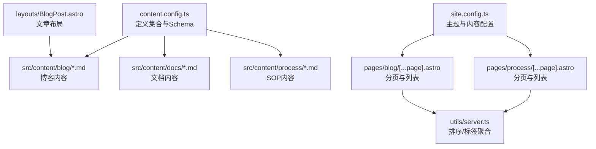
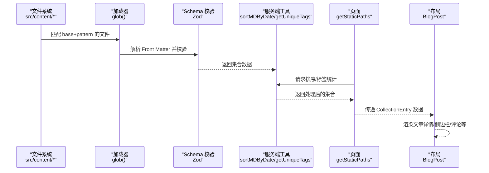
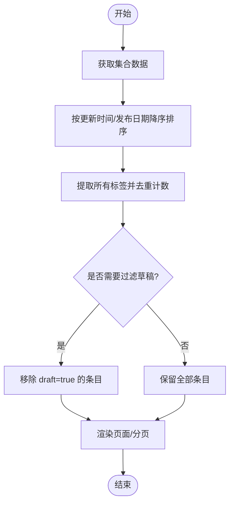
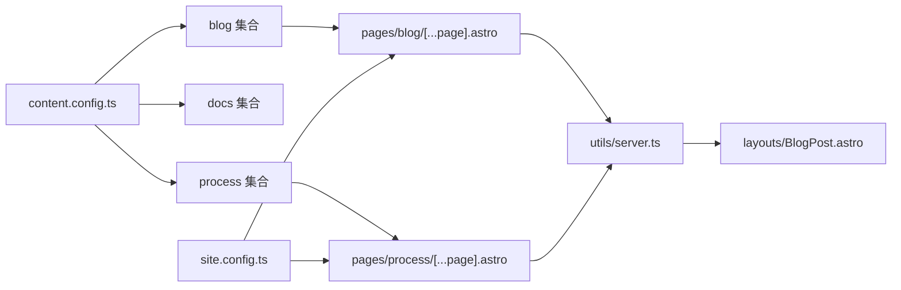

# 内容配置

<cite>
**本文引用的文件**
- [content.config.ts](file://src/content.config.ts)
- [blog 文档示例](file://src/content/blog/2025-08-24-miniforge-替代conda的Python环境和包管理工具.md)
- [docs 文档示例](file://src/content/blog/2025-09-20-五分钟快速部署：用 Docker 和 Docker Compose 部署 FastAPI 应用.md)
- [process 文档示例](file://src/content/process/小程序认证费用审批报销流程.md)
- [站点配置](file://src/site.config.ts)
- [博客分页页面](file://src/pages/blog/[...page].astro)
- [SOP 分页页面](file://src/pages/process/[...page].astro)
- [博客文章布局](file://src/layouts/BlogPost.astro)
- [主题配置类型定义](file://packages/pure/types/theme-config.ts)
- [用户配置类型定义](file://packages/pure/types/user-config.ts)
- [服务端工具函数](file://packages/pure/utils/server.ts)
</cite>

## 目录
1. [简介](#简介)
2. [项目结构](#项目结构)
3. [核心组件](#核心组件)
4. [架构总览](#架构总览)
5. [详细组件分析](#详细组件分析)
6. [依赖关系分析](#依赖关系分析)
7. [性能考量](#性能考量)
8. [故障排查指南](#故障排查指南)
9. [结论](#结论)
10. [附录](#附录)

## 简介
本指南面向使用 Astro 主题 Pure 的作者，系统讲解内容配置与内容集合的定义、字段校验、排序与分页、查询与过滤，以及与主题组件的集成方式。重点围绕 src/content.config.ts 的结构与用法，结合实际内容文件与页面组件，帮助你高效地组织博客文章、文档与 SOP 等内容类型。

## 项目结构
- 内容配置位于 src/content.config.ts，定义内容集合与字段 Schema。
- 内容文件位于 src/content 下，按集合划分目录（如 blog、docs、process）。
- 页面通过 Astro 的 getStaticPaths 与分页 API 获取集合数据并渲染。
- 主题配置位于 src/site.config.ts，影响内容展示行为（如分页大小、分享按钮等）。

图表来源
- [content.config.ts](file://src/content.config.ts#L1-L77)
- [博客分页页面](file://src/pages/blog/[...page].astro#L1-L111)
- [SOP 分页页面](file://src/pages/process/[...page].astro#L1-L98)
- [博客文章布局](file://src/layouts/BlogPost.astro#L1-L75)
- [站点配置](file://src/site.config.ts#L1-L207)
- [服务端工具函数](file://packages/pure/utils/server.ts#L40-L66)

章节来源
- [content.config.ts](file://src/content.config.ts#L1-L77)
- [站点配置](file://src/site.config.ts#L84-L98)

## 核心组件
- 内容集合定义：通过 defineCollection 指定加载器与 Schema，决定哪些文件被纳入集合、如何解析 Front Matter 字段。
- 字段 Schema：使用 Astro Zod Schema 对字段进行类型约束、长度限制、默认值与转换。
- 加载器：glob 加载器基于 base 与 pattern 定位文件，支持 md 与 mdx。
- 页面与分页：页面通过 getStaticPaths 调用集合数据，结合分页参数生成多页。
- 主题配置：站点配置中的 content 字段影响分页大小、外链样式等展示细节。

章节来源
- [content.config.ts](file://src/content.config.ts#L11-L41)
- [content.config.ts](file://src/content.config.ts#L43-L57)
- [content.config.ts](file://src/content.config.ts#L59-L74)
- [博客分页页面](file://src/pages/blog/[...page].astro#L13-L21)
- [SOP 分页页面](file://src/pages/process/[...page].astro#L13-L21)
- [站点配置](file://src/site.config.ts#L84-L98)

## 架构总览
内容从磁盘文件到页面渲染的完整流程如下：

图表来源
- [content.config.ts](file://src/content.config.ts#L12-L41)
- [content.config.ts](file://src/content.config.ts#L44-L57)
- [content.config.ts](file://src/content.config.ts#L60-L74)
- [博客分页页面](file://src/pages/blog/[...page].astro#L13-L21)
- [SOP 分页页面](file://src/pages/process/[...page].astro#L13-L21)
- [博客文章布局](file://src/layouts/BlogPost.astro#L14-L36)
- [服务端工具函数](file://packages/pure/utils/server.ts#L40-L66)

## 详细组件分析

### 内容集合定义与加载器
- 博客集合：加载 src/content/blog 下的 md 与 mdx 文件，使用 glob(base, pattern) 指定路径与扩展名。
- 文档集合：加载 src/content/docs 下的 md 与 mdx 文件。
- SOP 集合：加载 src/content/process 下的 md 与 mdx 文件。
- 导出集合：通过 export const collections 暴露给 Astro 内容引擎。

章节来源
- [content.config.ts](file://src/content.config.ts#L12-L14)
- [content.config.ts](file://src/content.config.ts#L44-L46)
- [content.config.ts](file://src/content.config.ts#L60-L62)
- [content.config.ts](file://src/content.config.ts#L76-L77)

### 字段 Schema 与类型约束
- 字符串字段：title、description 设置最大长度；language 可选。
- 日期字段：publishDate 必填，updatedDate 可选，均通过 coerce.date() 转换。
- 图片字段：heroImage 使用 image() 类型，支持 src、alt、inferSize、width、height、color 等可选属性。
- 数组字段：tags 默认空数组并通过 transform 去重与转小写。
- 布尔字段：draft 默认 false；comment 在博客集合中默认 true。
- 数字字段：order 默认 999，用于排序或权重。
- 特殊字段：docs 集合未包含 heroImage 与 comment 字段，但 process 集合包含两者。

章节来源
- [content.config.ts](file://src/content.config.ts#L16-L40)
- [content.config.ts](file://src/content.config.ts#L46-L56)
- [content.config.ts](file://src/content.config.ts#L62-L73)

### 内容排序、过滤与查询
- 排序：服务端工具函数按 updatedDate 或 publishDate 降序排列。
- 过滤：示例中未对 draft 字段进行过滤，若需隐藏草稿，可在调用处增加过滤逻辑。
- 查询：通过 getUniqueTags 与 getUniqueTagsWithCount 统计标签及出现次数，供侧边栏展示。

图表来源
- [服务端工具函数](file://packages/pure/utils/server.ts#L40-L66)
- [博客分页页面](file://src/pages/blog/[...page].astro#L13-L21)
- [SOP 分页页面](file://src/pages/process/[...page].astro#L13-L21)

章节来源
- [服务端工具函数](file://packages/pure/utils/server.ts#L40-L66)
- [博客分页页面](file://src/pages/blog/[...page].astro#L13-L21)
- [SOP 分页页面](file://src/pages/process/[...page].astro#L13-L21)

### 页面与分页集成
- 博客页面：通过 getStaticPaths 获取集合，使用 config.content.blogPageSize 控制每页数量，渲染 PostPreview 列表与分页器。
- SOP 页面：同理，但传入集合键为 'process'，并指定 basePath 用于链接生成。
- 布局：BlogPost 布局接收 CollectionEntry<'blog'>，读取标题、描述、日期、草稿标记与评论开关等字段，渲染头部、目录、版权与评论组件。

章节来源
- [博客分页页面](file://src/pages/blog/[...page].astro#L13-L21)
- [博客分页页面](file://src/pages/blog/[...page].astro#L23-L29)
- [SOP 分页页面](file://src/pages/process/[...page].astro#L13-L21)
- [博客文章布局](file://src/layouts/BlogPost.astro#L14-L36)

### 主题配置与内容展示
- 分页大小：站点配置中的 content.blogPageSize 影响页面每页条数。
- 外链样式：externalLinks.content 与 properties 控制外链后缀与样式。
- 分享按钮：share 数组控制展示的社交分享平台。
- 预渲染：prerender 与 pagefind 的组合关系由用户配置 Schema 校验保证。

章节来源
- [站点配置](file://src/site.config.ts#L84-L98)
- [主题配置类型定义](file://packages/pure/types/theme-config.ts#L172-L188)
- [用户配置类型定义](file://packages/pure/types/user-config.ts#L21-L23)

## 依赖关系分析
- content.config.ts 依赖 Astro 的 defineCollection 与 Zod Schema，定义集合与字段约束。
- 页面组件依赖服务端工具函数进行排序与标签统计。
- 布局组件依赖 CollectionEntry 类型，读取字段并渲染 UI。
- 站点配置影响页面分页与展示行为。

图表来源
- [content.config.ts](file://src/content.config.ts#L11-L74)
- [博客分页页面](file://src/pages/blog/[...page].astro#L1-L111)
- [SOP 分页页面](file://src/pages/process/[...page].astro#L1-L98)
- [博客文章布局](file://src/layouts/BlogPost.astro#L1-L75)
- [服务端工具函数](file://packages/pure/utils/server.ts#L40-L66)
- [站点配置](file://src/site.config.ts#L84-L98)

章节来源
- [content.config.ts](file://src/content.config.ts#L11-L74)
- [博客分页页面](file://src/pages/blog/[...page].astro#L1-L111)
- [SOP 分页页面](file://src/pages/process/[...page].astro#L1-L98)
- [博客文章布局](file://src/layouts/BlogPost.astro#L1-L75)
- [服务端工具函数](file://packages/pure/utils/server.ts#L40-L66)
- [站点配置](file://src/site.config.ts#L84-L98)

## 性能考量
- 预渲染与搜索：当 prerender 为 true 时，pagefind 默认启用；若禁用预渲染，需显式关闭 pagefind，否则会触发校验错误。
- 分页大小：合理设置 blogPageSize，避免单页数据过大导致渲染压力。
- 标签统计：getUniqueTagsWithCount 会对标签进行计数排序，建议在数据量较大时缓存或限制展示数量。

章节来源
- [用户配置类型定义](file://packages/pure/types/user-config.ts#L21-L23)
- [站点配置](file://src/site.config.ts#L34-L34)
- [服务端工具函数](file://packages/pure/utils/server.ts#L59-L66)

## 故障排查指南
- 字段类型不匹配：检查 Front Matter 是否符合 Schema 约束（如日期格式、字符串长度、布尔值）。
- 草稿显示问题：若希望隐藏 draft 内容，请在获取集合后自行过滤。
- 外链样式异常：确认站点配置中 externalLinks.content 与 properties 设置是否正确。
- 分页失效：确保 getStaticPaths 中传入的集合已按日期排序，且 pageSize 来自站点配置。

章节来源
- [content.config.ts](file://src/content.config.ts#L16-L40)
- [content.config.ts](file://src/content.config.ts#L46-L56)
- [content.config.ts](file://src/content.config.ts#L62-L73)
- [博客分页页面](file://src/pages/blog/[...page].astro#L13-L21)
- [SOP 分页页面](file://src/pages/process/[...page].astro#L13-L21)
- [站点配置](file://src/site.config.ts#L84-L98)

## 结论
通过 content.config.ts 明确的内容集合与 Schema，结合页面与服务端工具函数，可以稳定地实现博客、文档与 SOP 等内容类型的组织与展示。配合站点配置的主题能力，可进一步优化分页、外链与分享等用户体验。

## 附录

### 实际内容示例与字段对照
- 博客示例：包含 title、publishDate、updatedDate、tags、description 等字段。
- 文档示例：包含 title、publishDate、updatedDate、tags、description 等字段。
- SOP 示例：包含 title、description、publishDate、tags、order、draft 等字段。

章节来源
- [blog 文档示例](file://src/content/blog/2025-08-24-miniforge-替代conda的Python环境和包管理工具.md#L1-L51)
- [docs 文档示例](file://src/content/blog/2025-09-20-五分钟快速部署：用 Docker 和 Docker Compose 部署 FastAPI 应用.md#L1-L70)
- [process 文档示例](file://src/content/process/小程序认证费用审批报销流程.md#L1-L10)

### 最佳实践
- 命名约定：集合目录采用小写复数形式（如 blog、docs、process），便于识别与维护。
- 目录结构：每个集合独立目录，内容文件以日期前缀命名，利于排序与归档。
- 文件组织：统一使用 YAML Front Matter，字段保持一致，减少解析歧义。
- 字段设计：优先使用可选字段与默认值，避免缺失导致渲染失败。
- 排序策略：统一以 updatedDate 为主、publishDate 为辅的降序排序。
- 标签规范：使用 transform 去重与小写化，确保标签一致性。

章节来源
- [content.config.ts](file://src/content.config.ts#L12-L14)
- [content.config.ts](file://src/content.config.ts#L44-L46)
- [content.config.ts](file://src/content.config.ts#L60-L62)
- [服务端工具函数](file://packages/pure/utils/server.ts#L40-L66)