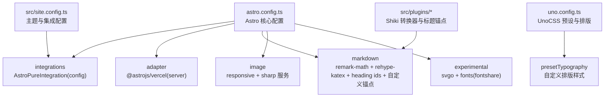
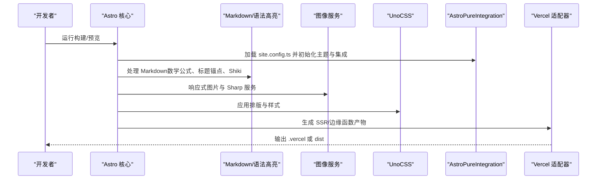
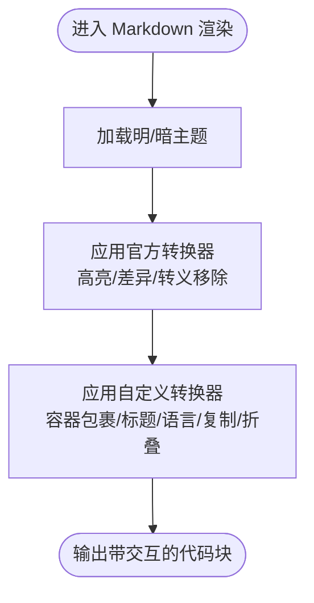
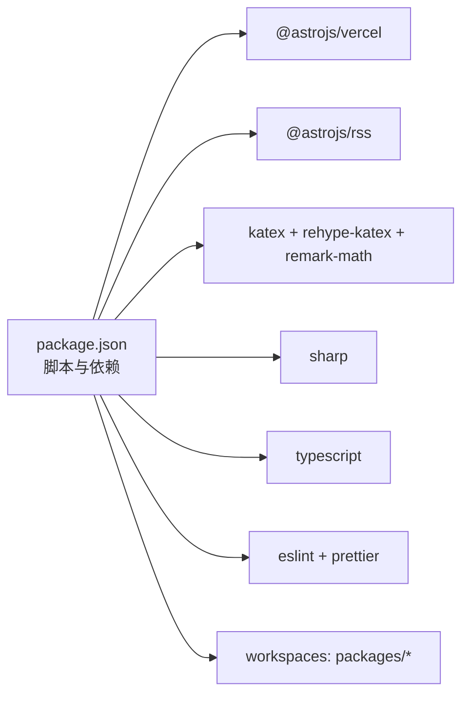

# 构建配置

<cite>
**本文引用的文件**
- [astro.config.ts](file://astro.config.ts)
- [package.json](file://package.json)
- [site.config.ts](file://src/site.config.ts)
- [uno.config.ts](file://uno.config.ts)
- [shiki-custom-transformers.ts](file://src/plugins/shiki-custom-transformers.ts)
- [transformers.ts](file://src/plugins/shiki-official/transformers.ts)
- [rehype-auto-link-headings.ts](file://src/plugins/rehype-auto-link-headings.ts)
- [tsconfig.json](file://tsconfig.json)
- [BaseLayout.astro](file://src/layouts/BaseLayout.astro)
- [virtual-user-config.ts](file://packages/pure/plugins/virtual-user-config.ts)
</cite>

## 目录
1. [简介](#简介)
2. [项目结构](#项目结构)
3. [核心组件](#核心组件)
4. [架构总览](#架构总览)
5. [详细组件分析](#详细组件分析)
6. [依赖关系分析](#依赖关系分析)
7. [性能考量](#性能考量)
8. [故障排查指南](#故障排查指南)
9. [结论](#结论)
10. [附录](#附录)

## 简介
本指南面向使用 Astro 主题 Pure 的开发者，系统性梳理构建配置与优化实践，覆盖以下重点：
- Astro 核心配置项：站点地址、输出目标、服务器与适配器、图片处理、Markdown 与语法高亮、实验特性等
- 插件与集成：Vercel 适配器、KaTeX 数学公式、标题锚点、Shiki 自定义与官方转换器、Pure 主题集成
- 第三方服务集成：评论系统、页面搜索、字体预加载、Typographic 排版样式
- 构建优化：代码分割、懒加载、资源压缩、实验特性（SVGO、字体优化）
- 开发与生产差异：本地开发、Vercel 部署、适配器模式切换
- 常见问题排查与性能监控建议

## 项目结构
该仓库采用多包工作区组织，核心构建配置集中在根目录的 Astro 配置文件中，主题 Pure 的用户配置位于 src/site.config.ts，UnoCSS 配置位于 uno.config.ts。

图表来源
- [astro.config.ts](file://astro.config.ts#L26-L131)
- [uno.config.ts](file://uno.config.ts#L174-L192)
- [site.config.ts](file://src/site.config.ts#L1-L207)

章节来源
- [astro.config.ts](file://astro.config.ts#L26-L131)
- [uno.config.ts](file://uno.config.ts#L174-L192)
- [site.config.ts](file://src/site.config.ts#L1-L207)

## 核心组件
- 站点与服务器
  - 站点地址与尾斜杠策略、服务器主机绑定
- 输出与适配器
  - 输出目标为 server，适配器为 Vercel
- 图片处理
  - 响应式图片样式、Sharp 图像服务
- Markdown 与语法高亮
  - KaTeX 数学公式、标题 ID、自动锚点、Shiki 主题与自定义/官方转换器
- 实验特性
  - SVG 优化、字体预加载（Fontshare）
- UnoCSS 与排版
  - Mini 与 Typography 预设、主题色与 safelist

章节来源
- [astro.config.ts](file://astro.config.ts#L26-L131)
- [uno.config.ts](file://uno.config.ts#L174-L192)

## 架构总览
下图展示构建流程的关键节点：配置加载、插件执行、适配器打包与产物生成。

图表来源
- [astro.config.ts](file://astro.config.ts#L26-L131)
- [site.config.ts](file://src/site.config.ts#L1-L207)
- [uno.config.ts](file://uno.config.ts#L174-L192)

## 详细组件分析

### Astro 核心配置（astro.config.ts）
- 基础设置
  - 站点地址与尾斜杠策略、服务器主机绑定
- 输出与适配器
  - 输出目标为 server，适配器为 Vercel；注释中保留了本地 standalone 模式示例
- 图像处理
  - 启用响应式样式与 Sharp 服务入口
- Markdown 与语法高亮
  - KaTeX 数学公式、标题 ID、自动锚点（标题前缀“#”）
  - Shiki 主题（明暗）、官方与自定义转换器链路
- 插件与集成
  - AstroPureIntegration 注入 Pure 主题能力（含 Sitemap、MDX、UnoCSS）
- 实验特性
  - 内容智能感知、SVGO、字体预加载（Fontshare）

章节来源
- [astro.config.ts](file://astro.config.ts#L26-L131)

### Markdown 与语法高亮（Shiki）
- 主题与转换器
  - 明/暗主题、官方转换器（高亮/差异/转义移除）、自定义转换器（容器包裹、标题、语言标签、复制按钮、折叠）
- 转换器顺序与类型兼容
  - 多版本 Shiki 类型共存时的类型断言与顺序执行

图表来源
- [astro.config.ts](file://astro.config.ts#L68-L95)
- [transformers.ts](file://src/plugins/shiki-official/transformers.ts#L1-L123)
- [shiki-custom-transformers.ts](file://src/plugins/shiki-custom-transformers.ts#L20-L153)

章节来源
- [astro.config.ts](file://astro.config.ts#L68-L95)
- [transformers.ts](file://src/plugins/shiki-official/transformers.ts#L1-L123)
- [shiki-custom-transformers.ts](file://src/plugins/shiki-custom-transformers.ts#L20-L153)

### 标题锚点与自动链接
- rehype-autolink-headings 插件为标题添加“#”锚点，支持前置/追加/包裹三种行为
- 与 rehype-heading-ids 协同生成带 id 的标题

章节来源
- [astro.config.ts](file://astro.config.ts#L53-L66)
- [rehype-auto-link-headings.ts](file://src/plugins/rehype-auto-link-headings.ts#L1-L43)

### UnoCSS 与排版（uno.config.ts）
- 预设组合：Mini 与 Typography
- 主题色变量映射与颜色体系
- 自定义排版样式（标题滚动边距、链接可见性、内联代码现代风格、引用装饰、表格与列表样式）
- safelist 白名单以确保 TOC 与排版类稳定生效

章节来源
- [uno.config.ts](file://uno.config.ts#L14-L192)

### 主题与集成配置（site.config.ts）
- 主题基础：标题、作者、描述、语言、Logo、分隔符、预渲染开关
- 头部菜单、页脚链接与社交信息
- 内容：外部链接样式、博客分页大小、分享平台
- 集成：友链日志、随机语录、Typography 风格、MediumZoom、Waline 评论系统参数

章节来源
- [site.config.ts](file://src/site.config.ts#L1-L207)

### 布局与全局样式（BaseLayout.astro）
- 全局样式引入：global.css 与 app.css
- 主题提供者、安全区域适配、高亮色变量注入
- 通用布局容器与 Header/Footer 组合

章节来源
- [BaseLayout.astro](file://src/layouts/BaseLayout.astro#L1-L92)

### TypeScript 路径别名（tsconfig.json）
- 支持路径映射（如 @/assets/*、@/components/* 等），便于模块导入与类型推断

章节来源
- [tsconfig.json](file://tsconfig.json#L17-L27)

### 构建产物与虚拟模块（packages/pure/plugins/virtual-user-config.ts）
- 提供虚拟模块：用户配置、项目上下文、自定义 CSS 导入、集合配置
- 用于在构建期注入主题配置与内容集合，减少运行时开销

章节来源
- [virtual-user-config.ts](file://packages/pure/plugins/virtual-user-config.ts#L60-L99)

## 依赖关系分析
- 核心依赖
  - @astrojs/vercel、@astrojs/rss、katex、rehype-katex、remark-math、sharp、typescript
- 开发依赖
  - ESLint、Prettier、Prettier 插件
- 工作区
  - packages/* 多包结构，主题 Pure 位于 packages/pure

图表来源
- [package.json](file://package.json#L1-L45)

章节来源
- [package.json](file://package.json#L1-L45)

## 性能考量
- 代码分割与懒加载
  - 使用 Astro 的按需渲染与组件拆分，避免一次性加载大体积模块
  - 动态导入重型库（如评论系统、图片缩放）以降低首屏负担
- 资源压缩与优化
  - 启用 SVGO 实验特性进行 SVG 优化
  - 图片响应式与 Sharp 服务提升加载体验
- 字体与排版
  - Fontshare 字体预加载，限定权重与子集，减少阻塞
  - UnoCSS 的 Mini 与 Typography 预设减少冗余样式
- 构建与缓存
  - 使用 Vercel 适配器的边缘函数与静态导出，结合预渲染开关平衡 SEO 与性能
  - 清理缓存与临时目录（.astro、.vercel、dist）以避免陈旧产物影响

章节来源
- [astro.config.ts](file://astro.config.ts#L45-L50)
- [astro.config.ts](file://astro.config.ts#L111-L130)
- [uno.config.ts](file://uno.config.ts#L174-L192)

## 故障排查指南
- 构建失败（Shiki 多版本类型冲突）
  - 现象：多版本 Shiki 类型导致编译报错
  - 处理：保持依赖版本一致或接受配置中的类型断言
  - 参考：Shiki 转换器配置与类型断言位置
- Markdown 数学公式不显示
  - 确认 KaTeX 插件已启用，且 Markdown 配置正确
  - 参考：KaTeX 与 remark-math 插件注册
- 标题无锚点
  - 确认 rehype-heading-ids 与 rehype-autolink-headings 均启用
  - 参考：标题锚点插件行为配置
- 图片加载异常
  - 检查响应式样式与 Sharp 服务入口是否正确
  - 参考：image 配置
- UnoCSS 排版样式缺失
  - 检查 safelist 是否包含所需类名（如 prose、TOC 相关）
  - 参考：uno.config.ts safelist

章节来源
- [astro.config.ts](file://astro.config.ts#L53-L95)
- [uno.config.ts](file://uno.config.ts#L184-L191)

## 结论
本指南基于现有配置文件，系统化梳理了 Astro 主题 Pure 的构建配置与优化策略。通过合理配置适配器、Markdown 插件、图像服务与 UnoCSS 排版，可在保证内容质量的同时获得良好的性能与可维护性。建议在团队协作中统一依赖版本、规范脚本与配置，并持续关注实验特性与第三方服务的稳定性。

## 附录
- 开发与生产差异
  - 开发：使用本地服务器与热更新
  - 生产：使用 Vercel 适配器与 server 输出，结合预渲染与字体优化
- 常用脚本
  - dev、build、preview、check、clean 等，详见 package.json

章节来源
- [package.json](file://package.json#L8-L22)
- [astro.config.ts](file://astro.config.ts#L36-L42)