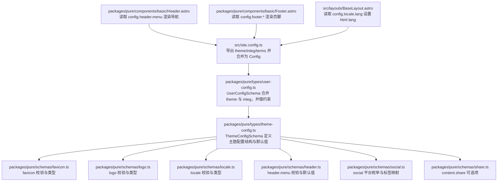
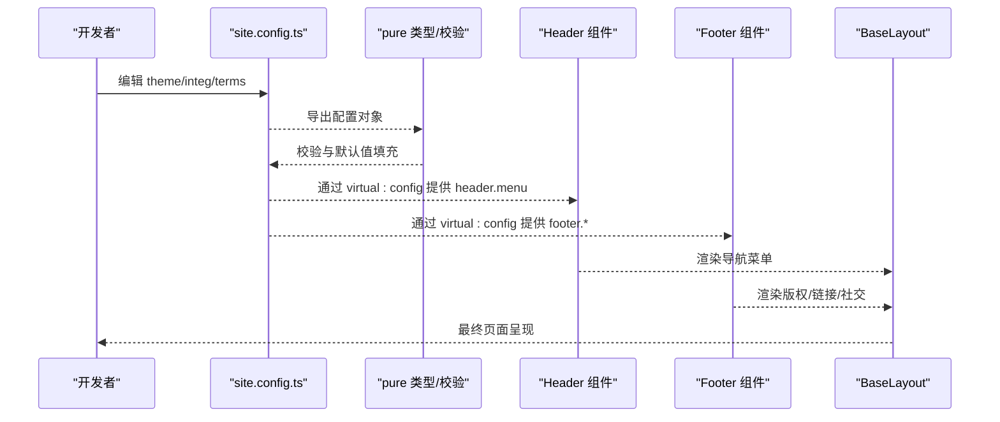

# 站点配置

<cite>
**本文引用的文件**
- [src/site.config.ts](file://src/site.config.ts)
- [packages/pure/types/theme-config.ts](file://packages/pure/types/theme-config.ts)
- [packages/pure/schemas/header.ts](file://packages/pure/schemas/header.ts)
- [packages/pure/schemas/locale.ts](file://packages/pure/schemas/locale.ts)
- [packages/pure/schemas/logo.ts](file://packages/pure/schemas/logo.ts)
- [packages/pure/schemas/favicon.ts](file://packages/pure/schemas/favicon.ts)
- [packages/pure/schemas/social.ts](file://packages/pure/schemas/social.ts)
- [packages/pure/schemas/share.ts](file://packages/pure/schemas/share.ts)
- [packages/pure/types/constants.ts](file://packages/pure/types/constants.ts)
- [packages/pure/types/user-config.ts](file://packages/pure/types/user-config.ts)
- [packages/pure/components/basic/Header.astro](file://packages/pure/components/basic/Header.astro)
- [packages/pure/components/basic/Footer.astro](file://packages/pure/components/basic/Footer.astro)
- [src/layouts/BaseLayout.astro](file://src/layouts/BaseLayout.astro)
</cite>

## 目录
1. [简介](#简介)
2. [项目结构](#项目结构)
3. [核心组件](#核心组件)
4. [架构总览](#架构总览)
5. [详细组件解析](#详细组件解析)
6. [依赖关系分析](#依赖关系分析)
7. [性能考量](#性能考量)
8. [故障排查指南](#故障排查指南)
9. [结论](#结论)
10. [附录](#附录)

## 简介
本指南面向使用 Astro 主题 Pure 的站点维护者，系统讲解站点配置文件 site.config.ts 的完整结构与各配置项的语义、默认值、可选值与实际使用方式。重点覆盖：
- 主题配置（theme）：标题、作者、描述、favicon、社交卡片、语言设置、Logo 等基础信息
- 头部配置（header）：菜单项 title 与 link 属性
- 页脚配置（footer）：版权信息、链接位置与样式、站点信誉展示、社交媒体账户
- 内容配置（content）：外部链接标记、分页大小、分享平台
- 配置校验规则与常见错误处理

## 项目结构
站点配置位于 src/site.config.ts，主题类型定义与校验位于 packages/pure/types 与 packages/pure/schemas 下，前端组件通过 virtual:config 读取配置并在运行时渲染。



图表来源
- [src/site.config.ts](file://src/site.config.ts#L1-L207)
- [packages/pure/types/user-config.ts](file://packages/pure/types/user-config.ts#L1-L27)
- [packages/pure/types/theme-config.ts](file://packages/pure/types/theme-config.ts#L1-L193)
- [packages/pure/schemas/favicon.ts](file://packages/pure/schemas/favicon.ts#L1-L43)
- [packages/pure/schemas/logo.ts](file://packages/pure/schemas/logo.ts#L1-L13)
- [packages/pure/schemas/locale.ts](file://packages/pure/schemas/locale.ts#L1-L30)
- [packages/pure/schemas/header.ts](file://packages/pure/schemas/header.ts#L1-L18)
- [packages/pure/schemas/social.ts](file://packages/pure/schemas/social.ts#L1-L45)
- [packages/pure/schemas/share.ts](file://packages/pure/schemas/share.ts#L1-L10)
- [packages/pure/components/basic/Header.astro](file://packages/pure/components/basic/Header.astro#L1-L209)
- [packages/pure/components/basic/Footer.astro](file://packages/pure/components/basic/Footer.astro#L1-L91)
- [src/layouts/BaseLayout.astro](file://src/layouts/BaseLayout.astro#L1-L92)

章节来源
- [src/site.config.ts](file://src/site.config.ts#L1-L207)
- [packages/pure/types/theme-config.ts](file://packages/pure/types/theme-config.ts#L1-L193)
- [packages/pure/types/user-config.ts](file://packages/pure/types/user-config.ts#L1-L27)

## 核心组件
- 主题配置（theme）
  - 基础信息：title、author、description、favicon、socialCard、logo、tagline
  - 语言设置：locale（lang、attrs、dateLocale、dateOptions）
  - 其他：titleDelimiter、prerender、npmCDN、head、customCss
  - 头部：header.menu
  - 页脚：footer（year、links、credits、social）
  - 内容：content（externalLinks、blogPageSize、share）

- 集成配置（integ）
  - links（友链日志、申请提示、头像缓存）
  - pagefind 搜索开关
  - typography 排版样式
  - mediumZoom 浮层缩放
  - waline 评论系统

- 条款列表（terms）
  - terms 页面的导航列表

章节来源
- [src/site.config.ts](file://src/site.config.ts#L1-L207)

## 架构总览
下图展示了从配置到渲染的关键流程：用户在 site.config.ts 中定义配置，类型与校验在 pure 包中定义；运行时组件通过 virtual:config 读取配置并渲染页面。



图表来源
- [src/site.config.ts](file://src/site.config.ts#L1-L207)
- [packages/pure/types/theme-config.ts](file://packages/pure/types/theme-config.ts#L1-L193)
- [packages/pure/components/basic/Header.astro](file://packages/pure/components/basic/Header.astro#L1-L209)
- [packages/pure/components/basic/Footer.astro](file://packages/pure/components/basic/Footer.astro#L1-L91)
- [src/layouts/BaseLayout.astro](file://src/layouts/BaseLayout.astro#L1-L92)

## 详细组件解析

### 主题配置（theme）
- 基础信息
  - title：网站标题，用于元数据与浏览器标签页
  - author：作者名，用于首页与版权声明
  - description：网站描述，用于页面元数据
  - favicon：站点图标路径（相对 public/），支持 .ico/.gif/.jpg/.png/.svg
  - socialCard：社交分享卡片图片路径（相对 public/）
  - logo：主页 Logo 配置（src、alt）
  - tagline：副标题（可选）
  - titleDelimiter：生成 <title> 时的分隔符（默认“•”）
  - prerender：是否预渲染（默认 true）
  - npmCDN：加载 npm 包的 CDN（默认 esm.sh）
  - head：注入到 <head> 的额外标签（数组）
  - customCss：自定义 CSS 列表（数组）

- 语言设置（locale）
  - lang：HTML lang 属性（默认 en-US）
  - attrs：OpenGraph locale 属性（默认 en_US）
  - dateLocale：日期本地化标识（默认 en-US）
  - dateOptions：日期格式化选项（如 weekday、year、month、day 等枚举）

- 头部（header）
  - menu：菜单项数组，每项含 title 与 link（默认包含 Blog/Projects/Links/About）

- 页脚（footer）
  - year：版权年份文本（如 © 年份）
  - links：链接数组，每项含 title、link、style（可选）、pos（位置，默认 1）
  - credits：是否显示“Astro & Pure theme powered”
  - social：社交账号映射（键为平台名，值为 URL；自动附加 label）

- 内容（content）
  - externalLinks：外部链接标记与属性
    - content：显示文本（默认“ ↗”）
    - properties：元素属性记录（如 style）
  - blogPageSize：博客分页条数（默认 8）
  - share：分享平台列表（默认包含 bluesky；当前支持 weibo、x、bluesky）

章节来源
- [src/site.config.ts](file://src/site.config.ts#L3-L99)
- [packages/pure/types/theme-config.ts](file://packages/pure/types/theme-config.ts#L11-L193)
- [packages/pure/schemas/favicon.ts](file://packages/pure/schemas/favicon.ts#L13-L38)
- [packages/pure/schemas/logo.ts](file://packages/pure/schemas/logo.ts#L3-L9)
- [packages/pure/schemas/locale.ts](file://packages/pure/schemas/locale.ts#L3-L27)
- [packages/pure/schemas/header.ts](file://packages/pure/schemas/header.ts#L3-L17)
- [packages/pure/schemas/social.ts](file://packages/pure/schemas/social.ts#L5-L44)
- [packages/pure/schemas/share.ts](file://packages/pure/schemas/share.ts#L3-L9)
- [packages/pure/types/constants.ts](file://packages/pure/types/constants.ts#L1-L21)

### 配置项默认值与可选值对照
- favicon
  - 默认值：/favicon/favicon.svg
  - 支持扩展名：.ico、.gif、.jpg、.jpeg、.png、.svg
- socialCard
  - 默认值：/images/social-card.png
- titleDelimiter
  - 默认值：“•”
- prerender
  - 默认值：true
- npmCDN
  - 默认值：https://esm.sh
- header.menu
  - 默认值：包含 Blog/Projects/Links/About
- footer.links[].pos
  - 默认值：1
- content.externalLinks.content
  - 默认值：“ ↗”
- content.blogPageSize
  - 默认值：8
- content.share
  - 默认值：['bluesky']
  - 可选值：weibo、x、bluesky

章节来源
- [packages/pure/types/theme-config.ts](file://packages/pure/types/theme-config.ts#L27-L36)
- [packages/pure/schemas/favicon.ts](file://packages/pure/schemas/favicon.ts#L13-L38)
- [packages/pure/types/theme-config.ts](file://packages/pure/types/theme-config.ts#L91-L114)
- [packages/pure/types/theme-config.ts](file://packages/pure/types/theme-config.ts#L101-L101)
- [packages/pure/types/theme-config.ts](file://packages/pure/types/theme-config.ts#L111-L114)
- [packages/pure/schemas/header.ts](file://packages/pure/schemas/header.ts#L11-L16)
- [packages/pure/types/theme-config.ts](file://packages/pure/types/theme-config.ts#L142-L147)
- [packages/pure/types/theme-config.ts](file://packages/pure/types/theme-config.ts#L175-L175)
- [packages/pure/types/theme-config.ts](file://packages/pure/types/theme-config.ts#L184-L184)
- [packages/pure/schemas/share.ts](file://packages/pure/schemas/share.ts#L8-L8)

### 实际使用示例（以路径代替代码片段）
- 在 site.config.ts 中设置标题与作者
  - 示例路径：[src/site.config.ts](file://src/site.config.ts#L5-L10)
- 在 site.config.ts 中配置语言与日期格式
  - 示例路径：[src/site.config.ts](file://src/site.config.ts#L16-L26)
- 在 site.config.ts 中配置 Logo
  - 示例路径：[src/site.config.ts](file://src/site.config.ts#L28-L31)
- 在 site.config.ts 中配置头部菜单
  - 示例路径：[src/site.config.ts](file://src/site.config.ts#L49-L57)
- 在 site.config.ts 中配置页脚链接与社交
  - 示例路径：[src/site.config.ts](file://src/site.config.ts#L60-L82)
- 在 site.config.ts 中配置内容分页与分享
  - 示例路径：[src/site.config.ts](file://src/site.config.ts#L84-L99)

章节来源
- [src/site.config.ts](file://src/site.config.ts#L5-L99)

### 运行时读取与渲染
- 头部组件读取 config.header.menu 渲染导航
  - 路径：[packages/pure/components/basic/Header.astro](file://packages/pure/components/basic/Header.astro#L24-L34)
- 页脚组件读取 config.footer.* 渲染版权、链接与社交
  - 路径：[packages/pure/components/basic/Footer.astro](file://packages/pure/components/basic/Footer.astro#L6-L14)、[packages/pure/components/basic/Footer.astro](file://packages/pure/components/basic/Footer.astro#L16-L56)、[packages/pure/components/basic/Footer.astro](file://packages/pure/components/basic/Footer.astro#L70-L78)
- 布局组件读取 config.locale.lang 设置 html lang
  - 路径：[src/layouts/BaseLayout.astro](file://src/layouts/BaseLayout.astro#L24-L24)

章节来源
- [packages/pure/components/basic/Header.astro](file://packages/pure/components/basic/Header.astro#L24-L34)
- [packages/pure/components/basic/Footer.astro](file://packages/pure/components/basic/Footer.astro#L6-L78)
- [src/layouts/BaseLayout.astro](file://src/layouts/BaseLayout.astro#L24-L24)

## 依赖关系分析
- 类型与校验
  - ThemeConfigSchema 定义了 theme 的结构、默认值与描述
  - UserConfigSchema 合并 theme 与 integ，并在转换阶段对 pagefind 做条件默认值与约束
- 组件依赖
  - Header/Footer 组件通过 virtual:config 读取 theme 配置
  - BaseLayout 使用 locale.lang 设置页面语言

```mermaid
classDiagram
class ThemeConfigSchema {
+title
+author
+description
+favicon
+socialCard
+logo
+tagline
+locale
+head
+customCss
+titleDelimiter
+prerender
+npmCDN
+header.menu
+footer
+content
}
class UserConfigSchema {
+ThemeConfigSchema
+integ
+transform(pagefind)
+refine(prerender/pagefind)
}
class HeaderComponent {
+config.header.menu
}
class FooterComponent {
+config.footer.year
+config.footer.links
+config.footer.credits
+config.footer.social
}
ThemeConfigSchema <.. UserConfigSchema : "合并"
UserConfigSchema ..> HeaderComponent : "virtual : config"
UserConfigSchema ..> FooterComponent : "virtual : config"
```

图表来源
- [packages/pure/types/theme-config.ts](file://packages/pure/types/theme-config.ts#L11-L193)
- [packages/pure/types/user-config.ts](file://packages/pure/types/user-config.ts#L6-L23)
- [packages/pure/components/basic/Header.astro](file://packages/pure/components/basic/Header.astro#L2-L2)
- [packages/pure/components/basic/Footer.astro](file://packages/pure/components/basic/Footer.astro#L2-L2)

章节来源
- [packages/pure/types/theme-config.ts](file://packages/pure/types/theme-config.ts#L11-L193)
- [packages/pure/types/user-config.ts](file://packages/pure/types/user-config.ts#L6-L23)

## 性能考量
- prerender 默认开启，有助于 SEO 与首屏性能；若关闭，pagefind 搜索将被禁用或需配合服务端渲染策略
- npmCDN 可切换至国内镜像以提升依赖加载速度
- 自定义 CSS 与 head 注入应适度，避免阻塞关键渲染路径

## 故障排查指南
- favicon 校验失败
  - 现象：构建时报错，提示 favicon 必须为 .ico/.gif/.jpg/.png/.svg
  - 处理：确保路径指向上述扩展名之一，或使用绝对 URL
  - 参考：[packages/pure/schemas/favicon.ts](file://packages/pure/schemas/favicon.ts#L17-L35)
- 语言与日期格式不生效
  - 现象：页面日期未按预期本地化
  - 处理：检查 locale.lang、attrs、dateLocale 与 dateOptions 是否合理
  - 参考：[packages/pure/schemas/locale.ts](file://packages/pure/schemas/locale.ts#L3-L27)
- 页脚 RSS 未显示
  - 现象：未配置 social.rss 时 RSS 图标不出现
  - 处理：在 footer.social 中显式添加 rss 或保持默认逻辑（组件会自动补全）
  - 参考：[packages/pure/components/basic/Footer.astro](file://packages/pure/components/basic/Footer.astro#L9-L14)
- pagefind 与 prerender 的约束
  - 现象：当 prerender 为 false 且 pagefind 为 true 时校验失败
  - 处理：保持 prerender 为 true，或关闭 pagefind
  - 参考：[packages/pure/types/user-config.ts](file://packages/pure/types/user-config.ts#L21-L23)
- 分享平台不在白名单
  - 现象：content.share 包含非支持平台导致校验失败
  - 处理：仅使用 weibo、x、bluesky
  - 参考：[packages/pure/schemas/share.ts](file://packages/pure/schemas/share.ts#L3-L9)、[packages/pure/types/constants.ts](file://packages/pure/types/constants.ts#L1-L21)

章节来源
- [packages/pure/schemas/favicon.ts](file://packages/pure/schemas/favicon.ts#L17-L35)
- [packages/pure/schemas/locale.ts](file://packages/pure/schemas/locale.ts#L3-L27)
- [packages/pure/components/basic/Footer.astro](file://packages/pure/components/basic/Footer.astro#L9-L14)
- [packages/pure/types/user-config.ts](file://packages/pure/types/user-config.ts#L21-L23)
- [packages/pure/schemas/share.ts](file://packages/pure/schemas/share.ts#L3-L9)
- [packages/pure/types/constants.ts](file://packages/pure/types/constants.ts#L1-L21)

## 结论
通过 site.config.ts 与纯函数式类型校验，Pure 主题提供了清晰、可扩展的站点配置模型。建议在修改配置时：
- 明确各字段的默认值与可选范围
- 遵循校验规则（如 favicon 扩展名、分享平台枚举）
- 关注 prerender 与 pagefind 的联动约束
- 在组件层面（Header/Footer/Layout）确认配置读取与渲染行为

## 附录
- 社交平台枚举（用于 footer.social 与分享）
  - 可用平台：github、gitlab、discord、youtube、instagram、x、telegram、rss、email、reddit、bluesky、tiktok、weibo、steam、bilibili、zhihu、coolapk、netease
  - 参考：[packages/pure/types/constants.ts](file://packages/pure/types/constants.ts#L1-L21)
- 头部菜单默认项
  - 默认包含：Blog、Projects、Links、About
  - 参考：[packages/pure/schemas/header.ts](file://packages/pure/schemas/header.ts#L11-L16)
- 页脚链接位置
  - pos=1：版权行左侧
  - pos=2：版权行右侧（例如站点政策链接）
  - 参考：[packages/pure/components/basic/Footer.astro](file://packages/pure/components/basic/Footer.astro#L16-L56)