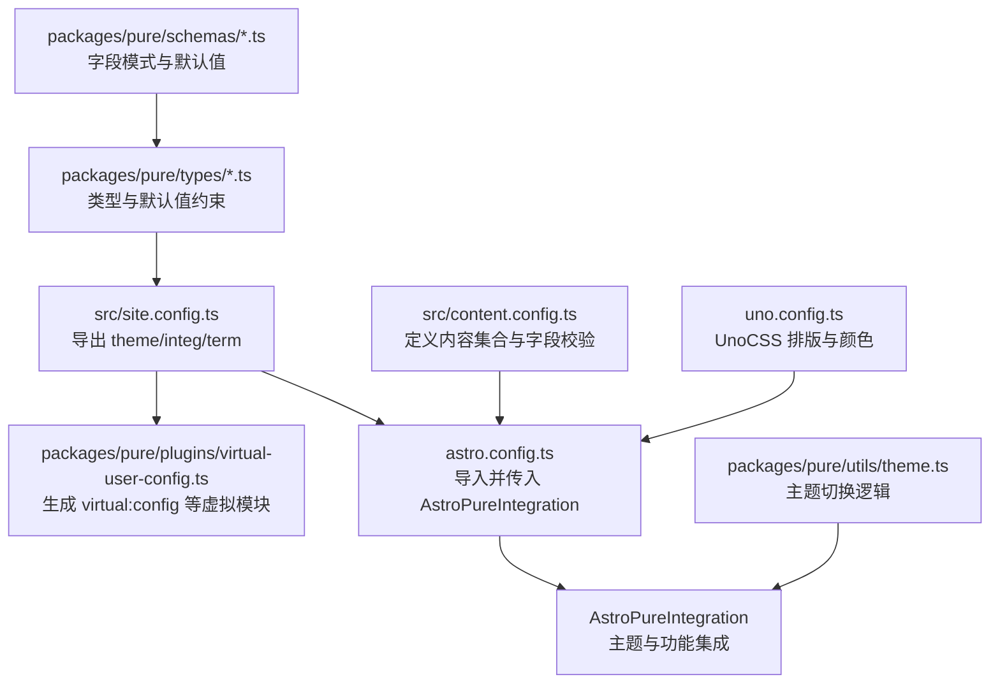
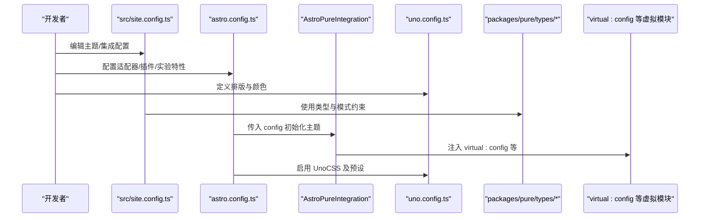
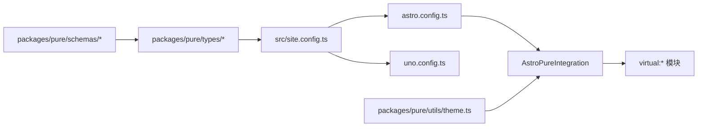

# 配置系统

<cite>
**本文引用的文件**
- [src/site.config.ts](file://src/site.config.ts)
- [src/content.config.ts](file://src/content.config.ts)
- [astro.config.ts](file://astro.config.ts)
- [uno.config.ts](file://uno.config.ts)
- [packages/pure/types/theme-config.ts](file://packages/pure/types/theme-config.ts)
- [packages/pure/types/integrations-config.ts](file://packages/pure/types/integrations-config.ts)
- [packages/pure/types/user-config.ts](file://packages/pure/types/user-config.ts)
- [packages/pure/schemas/header.ts](file://packages/pure/schemas/header.ts)
- [packages/pure/schemas/links.ts](file://packages/pure/schemas/links.ts)
- [packages/pure/schemas/locale.ts](file://packages/pure/schemas/locale.ts)
- [packages/pure/schemas/logo.ts](file://packages/pure/schemas/logo.ts)
- [packages/pure/plugins/virtual-user-config.ts](file://packages/pure/plugins/virtual-user-config.ts)
- [packages/pure/utils/theme.ts](file://packages/pure/utils/theme.ts)
- [package.json](file://package.json)
</cite>

## 目录
1. [简介](#简介)
2. [项目结构](#项目结构)
3. [核心组件](#核心组件)
4. [架构总览](#架构总览)
5. [详细组件分析](#详细组件分析)
6. [依赖分析](#依赖分析)
7. [性能考虑](#性能考虑)
8. [故障排查指南](#故障排查指南)
9. [结论](#结论)
10. [附录](#附录)

## 简介
本指南围绕 Astro 主题 Pure 的配置系统，系统性讲解以下配置文件与模块的职责、结构与使用方法：
- 站点配置：src/site.config.ts（主题设置、集成配置、条款卡片）
- 内容配置：src/content.config.ts（内容集合、字段校验与类型）
- 构建配置：astro.config.ts（插件、集成、适配器、实验特性）
- UnoCSS 主题定制：uno.config.ts（排版样式、颜色体系、安全名单）
- 类型与模式：packages/pure/types 与 packages/pure/schemas（强类型约束与默认值）
- 虚拟模块与运行时：packages/pure/plugins/virtual-user-config.ts、packages/pure/utils/theme.ts

目标是帮助你从零开始完成基础配置，并逐步实现高级定制，涵盖配置优先级、依赖关系与常见问题。

## 项目结构
与配置系统直接相关的关键文件与目录如下：
- 站点配置：src/site.config.ts
- 内容配置：src/content.config.ts
- 构建配置：astro.config.ts
- UnoCSS 配置：uno.config.ts
- 类型与模式：packages/pure/types/*.ts、packages/pure/schemas/*.ts
- 插件与虚拟模块：packages/pure/plugins/virtual-user-config.ts
- 运行时主题切换：packages/pure/utils/theme.ts
- 依赖声明：package.json

图表来源
- [src/site.config.ts](file://src/site.config.ts#L1-L207)
- [astro.config.ts](file://astro.config.ts#L1-L133)
- [uno.config.ts](file://uno.config.ts#L1-L193)
- [packages/pure/plugins/virtual-user-config.ts](file://packages/pure/plugins/virtual-user-config.ts#L1-L100)
- [packages/pure/types/theme-config.ts](file://packages/pure/types/theme-config.ts#L1-L193)
- [packages/pure/schemas/header.ts](file://packages/pure/schemas/header.ts#L1-L18)
- [packages/pure/schemas/links.ts](file://packages/pure/schemas/links.ts#L1-L31)
- [packages/pure/schemas/locale.ts](file://packages/pure/schemas/locale.ts#L1-L30)
- [packages/pure/schemas/logo.ts](file://packages/pure/schemas/logo.ts#L1-L13)
- [packages/pure/utils/theme.ts](file://packages/pure/utils/theme.ts#L1-L41)

章节来源
- [src/site.config.ts](file://src/site.config.ts#L1-L207)
- [src/content.config.ts](file://src/content.config.ts#L1-L77)
- [astro.config.ts](file://astro.config.ts#L1-L133)
- [uno.config.ts](file://uno.config.ts#L1-L193)
- [packages/pure/types/theme-config.ts](file://packages/pure/types/theme-config.ts#L1-L193)
- [packages/pure/types/integrations-config.ts](file://packages/pure/types/integrations-config.ts#L1-L66)
- [packages/pure/types/user-config.ts](file://packages/pure/types/user-config.ts#L1-L27)
- [packages/pure/schemas/header.ts](file://packages/pure/schemas/header.ts#L1-L18)
- [packages/pure/schemas/links.ts](file://packages/pure/schemas/links.ts#L1-L31)
- [packages/pure/schemas/locale.ts](file://packages/pure/schemas/locale.ts#L1-L30)
- [packages/pure/schemas/logo.ts](file://packages/pure/schemas/logo.ts#L1-L13)
- [packages/pure/plugins/virtual-user-config.ts](file://packages/pure/plugins/virtual-user-config.ts#L1-L100)
- [packages/pure/utils/theme.ts](file://packages/pure/utils/theme.ts#L1-L41)
- [package.json](file://package.json#L1-L45)

## 核心组件
- 站点配置（src/site.config.ts）：聚合主题配置 theme、集成配置 integ、条款卡片 terms，并统一导出为 Config。
- 内容配置（src/content.config.ts）：定义 blog/docs/process 等内容集合，使用 Astro Content Schema 进行字段校验与类型推断。
- 构建配置（astro.config.ts）：配置站点地址、适配器、图片服务、Markdown 插件链、Shiki 代码高亮、UnoCSS、实验特性等，并注入 AstroPureIntegration。
- UnoCSS 配置（uno.config.ts）：基于 site.config.ts 中的 integ.typography 自定义排版样式，定义颜色主题与安全名单。
- 类型与模式（packages/pure/types 与 packages/pure/schemas）：为 theme/integ 提供强类型约束、默认值与运行时校验。
- 虚拟模块（packages/pure/plugins/virtual-user-config.ts）：向主题与页面注入用户配置、项目上下文与自定义 CSS。
- 主题切换（packages/pure/utils/theme.ts）：提供本地存储与系统偏好监听的主题切换逻辑。

章节来源
- [src/site.config.ts](file://src/site.config.ts#L1-L207)
- [src/content.config.ts](file://src/content.config.ts#L1-L77)
- [astro.config.ts](file://astro.config.ts#L1-L133)
- [uno.config.ts](file://uno.config.ts#L1-L193)
- [packages/pure/types/theme-config.ts](file://packages/pure/types/theme-config.ts#L1-L193)
- [packages/pure/types/integrations-config.ts](file://packages/pure/types/integrations-config.ts#L1-L66)
- [packages/pure/types/user-config.ts](file://packages/pure/types/user-config.ts#L1-L27)
- [packages/pure/plugins/virtual-user-config.ts](file://packages/pure/plugins/virtual-user-config.ts#L1-L100)
- [packages/pure/utils/theme.ts](file://packages/pure/utils/theme.ts#L1-L41)

## 架构总览
下图展示配置系统在构建期与运行期的交互路径，以及各配置文件之间的依赖关系。

图表来源
- [src/site.config.ts](file://src/site.config.ts#L1-L207)
- [astro.config.ts](file://astro.config.ts#L1-L133)
- [uno.config.ts](file://uno.config.ts#L1-L193)
- [packages/pure/types/theme-config.ts](file://packages/pure/types/theme-config.ts#L1-L193)
- [packages/pure/types/integrations-config.ts](file://packages/pure/types/integrations-config.ts#L1-L66)
- [packages/pure/plugins/virtual-user-config.ts](file://packages/pure/plugins/virtual-user-config.ts#L1-L100)

## 详细组件分析

### 站点配置 site.config.ts
- 主题设置（theme）
  - 基础信息：标题、作者、描述、favicon、socialCard、语言与日期格式
  - 头像与标题分隔符、预渲染开关、npmCDN
  - 头部菜单、页脚版权、社交链接、外链展示样式
  - 内容侧：外链后缀、博客分页大小、分享渠道
- 集成配置（integ）
  - 友链：日志簿、申请提示、头像缓存
  - 搜索：Pagefind 开关
  - 随机语录：服务端与目标转换函数
  - 排版：UnoCSS typography 类名、块引风格、行内代码风格
  - MediumZoom：选择器与选项
  - 评论：Waline 开关、服务端、表情、额外属性
- 条款卡片（terms）
  - 用于 Terms 页面的列表项
- 导出
  - 将 theme 与 integ 合并为 Config 并默认导出

章节来源
- [src/site.config.ts](file://src/site.config.ts#L1-L207)
- [packages/pure/types/theme-config.ts](file://packages/pure/types/theme-config.ts#L1-L193)
- [packages/pure/types/integrations-config.ts](file://packages/pure/types/integrations-config.ts#L1-L66)
- [packages/pure/schemas/header.ts](file://packages/pure/schemas/header.ts#L1-L18)
- [packages/pure/schemas/links.ts](file://packages/pure/schemas/links.ts#L1-L31)
- [packages/pure/schemas/locale.ts](file://packages/pure/schemas/locale.ts#L1-L30)
- [packages/pure/schemas/logo.ts](file://packages/pure/schemas/logo.ts#L1-L13)

### 内容配置 content.config.ts
- 集合定义
  - blog：加载 src/content/blog 下的 Markdown/MDX，字段包括标题、描述、发布时间、可选更新时间、hero 图、标签（去重与小写）、语言、草稿、评论开关
  - docs：加载 src/content/docs 下的内容，字段与 blog 类似但包含排序字段
  - process：加载 src/content/process 下的内容，字段与 docs 类似，包含 SOP 排序与评论开关
- 字段校验与类型
  - 使用 Astro Zod Schema 对字段进行强类型约束与默认值处理
  - 标签字段通过 transform 实现去重与小写化
- 导出
  - collections 汇总上述集合

章节来源
- [src/content.config.ts](file://src/content.config.ts#L1-L77)

### 构建配置 astro.config.ts
- 基础设置
  - site 地址、尾斜杠策略、服务器主机
- 适配器与输出
  - Vercel 适配器、Server 输出模式
- 资源与图片
  - 响应式图片样式、Sharp 图片服务
- Markdown 与语法高亮
  - 数学公式插件、KaTeX、标题锚点、自动链接标题、Shiki 主题与自定义/官方转换器
- 集成
  - AstroPureIntegration(config)，注入站点配置
- 实验特性
  - 内容智能感知、SVG 优化、字体预加载与优化（Satoshi 字体）

章节来源
- [astro.config.ts](file://astro.config.ts#L1-L133)
- [package.json](file://package.json#L1-L45)

### UnoCSS 配置 uno.config.ts
- 基于 site.config.ts 的 integ.typography 动态定制排版
- 颜色体系：基于 CSS 变量的颜色映射
- 规则扩展：行高限制、对象覆盖、背景覆盖、行省略等实用规则
- 安全名单：保留目录与类名，确保构建产物包含必要的排版与 TOC 样式

章节来源
- [uno.config.ts](file://uno.config.ts#L1-L193)
- [src/site.config.ts](file://src/site.config.ts#L1-L207)

### 类型与模式（packages/pure/types 与 packages/pure/schemas）
- 主题配置类型（ThemeConfigSchema）
  - 强制字段与可选字段、默认值、描述与示例
  - 头部菜单、页脚链接、社交链接、语言与日期格式、外链与内容分页、分享渠道
- 集成配置类型（IntegrationConfigSchema）
  - 友链、Pagefind、随机语录、排版、MediumZoom、Waline
- 用户配置（UserConfigSchema）
  - 合并 theme 与 integ，并在 prerender 为 true 时默认启用 Pagefind，否则显式报错
- 模式（schemas）
  - HeaderMenu、FriendLinks、Locale、Logo 等字段模式与默认值

章节来源
- [packages/pure/types/theme-config.ts](file://packages/pure/types/theme-config.ts#L1-L193)
- [packages/pure/types/integrations-config.ts](file://packages/pure/types/integrations-config.ts#L1-L66)
- [packages/pure/types/user-config.ts](file://packages/pure/types/user-config.ts#L1-L27)
- [packages/pure/schemas/header.ts](file://packages/pure/schemas/header.ts#L1-L18)
- [packages/pure/schemas/links.ts](file://packages/pure/schemas/links.ts#L1-L31)
- [packages/pure/schemas/locale.ts](file://packages/pure/schemas/locale.ts#L1-L30)
- [packages/pure/schemas/logo.ts](file://packages/pure/schemas/logo.ts#L1-L13)

### 虚拟模块与运行时
- 虚拟模块（virtual:config、virtual:project-context、virtual:user-css、virtual:collection-config）
  - 将用户配置与项目上下文注入到主题与页面中，支持自定义 CSS 文件导入
- 主题切换（utils/theme.ts）
  - 支持 system/dark/light 切换，监听系统偏好变化，持久化到 localStorage，并设置 meta theme-color

章节来源
- [packages/pure/plugins/virtual-user-config.ts](file://packages/pure/plugins/virtual-user-config.ts#L1-L100)
- [packages/pure/utils/theme.ts](file://packages/pure/utils/theme.ts#L1-L41)

## 依赖分析
- 配置文件间依赖
  - astro.config.ts 依赖 src/site.config.ts 的配置对象
  - uno.config.ts 读取 src/site.config.ts 中的 integ.typography
  - 虚拟模块由 AstroPureIntegration 在构建期注入
- 类型与模式约束
  - packages/pure/types 与 packages/pure/schemas 为 site.config.ts 与 astro.config.ts 的输入提供强类型保障
- 运行时依赖
  - utils/theme.ts 与虚拟模块配合，实现主题切换与样式注入

图表来源
- [src/site.config.ts](file://src/site.config.ts#L1-L207)
- [astro.config.ts](file://astro.config.ts#L1-L133)
- [uno.config.ts](file://uno.config.ts#L1-L193)
- [packages/pure/types/theme-config.ts](file://packages/pure/types/theme-config.ts#L1-L193)
- [packages/pure/types/integrations-config.ts](file://packages/pure/types/integrations-config.ts#L1-L66)
- [packages/pure/plugins/virtual-user-config.ts](file://packages/pure/plugins/virtual-user-config.ts#L1-L100)
- [packages/pure/utils/theme.ts](file://packages/pure/utils/theme.ts#L1-L41)

章节来源
- [src/site.config.ts](file://src/site.config.ts#L1-L207)
- [astro.config.ts](file://astro.config.ts#L1-L133)
- [uno.config.ts](file://uno.config.ts#L1-L193)
- [packages/pure/types/theme-config.ts](file://packages/pure/types/theme-config.ts#L1-L193)
- [packages/pure/types/integrations-config.ts](file://packages/pure/types/integrations-config.ts#L1-L66)
- [packages/pure/plugins/virtual-user-config.ts](file://packages/pure/plugins/virtual-user-config.ts#L1-L100)
- [packages/pure/utils/theme.ts](file://packages/pure/utils/theme.ts#L1-L41)

## 性能考虑
- 预渲染与搜索
  - 当 prerender 为 true 时，默认启用 Pagefind；若禁用预渲染，将显式阻止启用 Pagefind，避免不兼容问题
- 图片与字体
  - 启用响应式图片与 Sharp 服务，减少带宽与提升加载体验
  - 使用字体预加载与优化，降低首屏阻塞
- 代码高亮
  - 通过 Shiki 主题与自定义/官方转换器优化代码块渲染性能与可读性
- UnoCSS
  - 仅按需引入必要预设，结合安全名单保证关键样式不被摇树

章节来源
- [packages/pure/types/user-config.ts](file://packages/pure/types/user-config.ts#L1-L27)
- [astro.config.ts](file://astro.config.ts#L1-L133)
- [uno.config.ts](file://uno.config.ts#L1-L193)

## 故障排查指南
- Pagefind 与预渲染
  - 若关闭预渲染但仍开启 Pagefind，将触发显式错误提示，需保持两者一致或移除冲突配置
- Markdown 与数学公式
  - 确保已启用 remark-math 与 rehype-katex 插件链，避免公式渲染异常
- 代码高亮
  - 检查 Shiki 主题与转换器是否正确加载，注意多版本类型冲突的忽略注释
- UnoCSS 排版
  - 若排版样式未生效，检查 integ.typography 的 class 与 inlineCodeBlockStyle/blockquoteStyle 是否与预期一致
- 主题切换
  - 若主题切换无效，确认 utils/theme.ts 的系统偏好监听与 localStorage 存储逻辑是否正常

章节来源
- [packages/pure/types/user-config.ts](file://packages/pure/types/user-config.ts#L1-L27)
- [astro.config.ts](file://astro.config.ts#L1-L133)
- [uno.config.ts](file://uno.config.ts#L1-L193)
- [packages/pure/utils/theme.ts](file://packages/pure/utils/theme.ts#L1-L41)

## 结论
通过将站点配置、内容配置、构建配置与 UnoCSS 配置有机结合，并借助强类型与模式约束，Astro 主题 Pure 的配置系统实现了从基础到高级的完整覆盖。遵循本文档的配置优先级与依赖关系，你可以高效地完成从零到一的站点搭建与持续迭代。

## 附录

### 配置优先级与合并规则
- 用户配置（site.config.ts）优先于默认值
- UserConfigSchema 在合并 theme 与 integ 时，对 pagefind 进行条件默认与校验
- AstroPureIntegration 在构建期读取用户配置并通过虚拟模块注入

章节来源
- [packages/pure/types/user-config.ts](file://packages/pure/types/user-config.ts#L1-L27)
- [src/site.config.ts](file://src/site.config.ts#L1-L207)
- [packages/pure/plugins/virtual-user-config.ts](file://packages/pure/plugins/virtual-user-config.ts#L1-L100)

### 常见配置场景示例（步骤说明）
- 启用 Pagefind 搜索
  - 在 site.config.ts 的 integ.pagefind 设为 true，并确保 theme.prerender 也为 true
- 自定义排版样式
  - 在 uno.config.ts 中调整 typography 的 class、inlineCodeBlockStyle、blockquoteStyle
- 添加自定义 CSS
  - 在 site.config.ts 的 theme.customCss 中添加相对路径，虚拟模块会自动导入
- 配置 Waline 评论
  - 在 site.config.ts 的 integ.waline 中设置 server、表情与额外属性
- 启用 MediumZoom
  - 在 site.config.ts 的 integ.mediumZoom 中设置 selector 与 options
- 配置友链与头像缓存
  - 在 site.config.ts 的 integ.links 中设置 logbook、applyTip、cacheAvatar

章节来源
- [src/site.config.ts](file://src/site.config.ts#L1-L207)
- [uno.config.ts](file://uno.config.ts#L1-L193)
- [packages/pure/types/integrations-config.ts](file://packages/pure/types/integrations-config.ts#L1-L66)