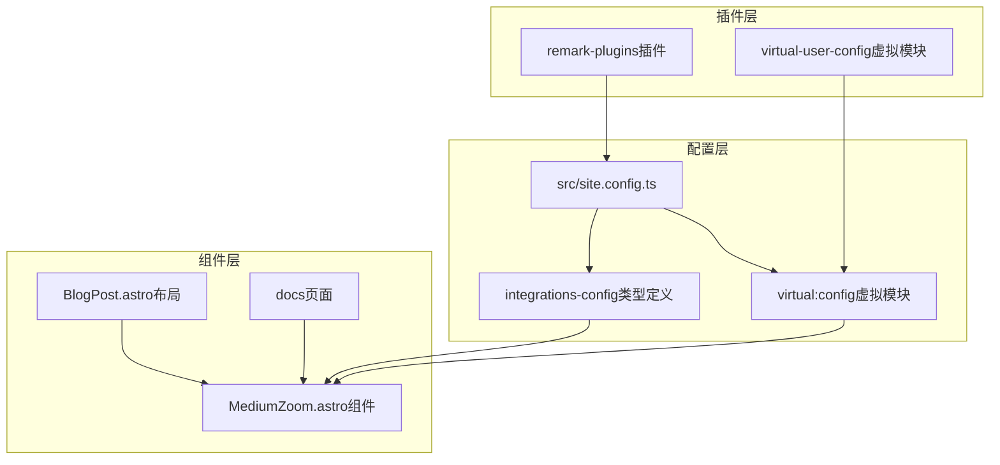
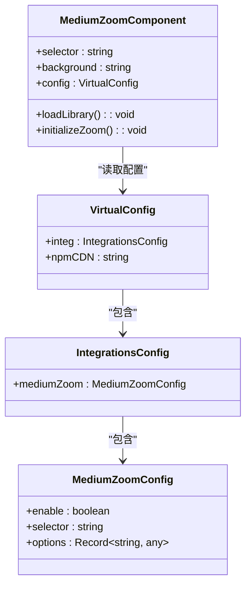
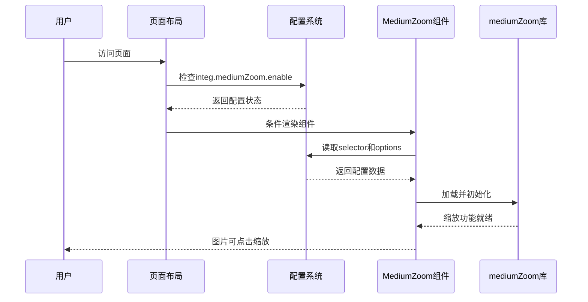
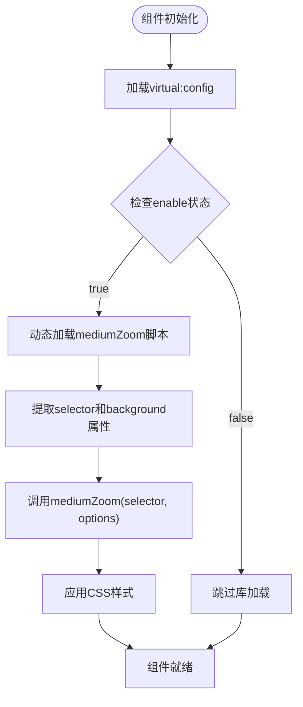
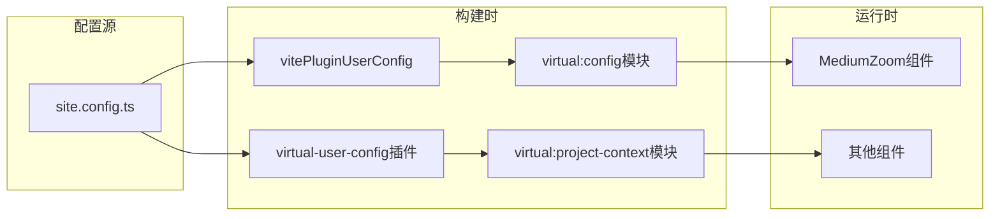
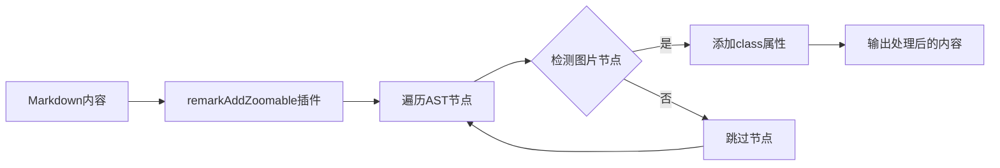
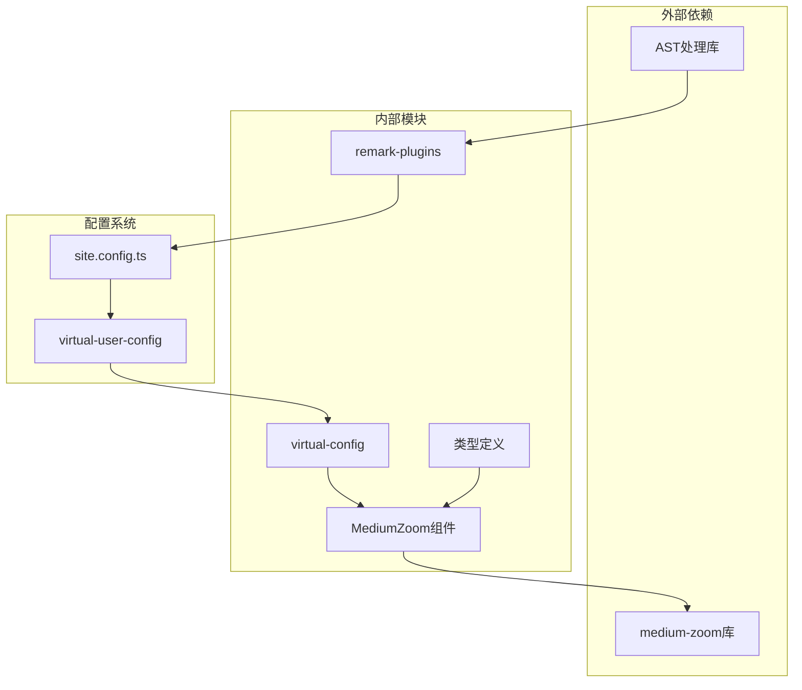

# Lightbox配置

<cite>
**本文档引用的文件**
- [packages/pure/components/advanced/MediumZoom.astro](file://packages/pure/components/advanced/MediumZoom.astro)
- [packages/pure/plugins/remark-plugins.ts](file://packages/pure/plugins/remark-plugins.ts)
- [packages/pure/plugins/virtual-user-config.ts](file://packages/pure/plugins/virtual-user-config.ts)
- [packages/pure/types/integrations-config.ts](file://packages/pure/types/integrations-config.ts)
- [src/layouts/BlogPost.astro](file://src/layouts/BlogPost.astro)
- [src/site.config.ts](file://src/site.config.ts)
- [src/pages/docs/[...id].astro](file://src/pages/docs/[...id].astro)
</cite>

## 目录
1. [简介](#简介)
2. [项目结构](#项目结构)
3. [核心组件](#核心组件)
4. [架构概览](#架构概览)
5. [详细组件分析](#详细组件分析)
6. [依赖关系分析](#依赖关系分析)
7. [性能考虑](#性能考虑)
8. [故障排除指南](#故障排除指南)
9. [结论](#结论)

## 简介

本文档为Astro主题Pure的Lightbox集成提供详细的配置指南，重点解释mediumZoom配置对象的各项属性。mediumZoom是一个轻量级的图片缩放库，通过简单的配置即可为网站添加图片点击放大效果。在Astro主题Pure中，该功能通过虚拟配置系统进行集中管理，并支持按需加载以优化性能。

## 项目结构

Astro主题Pure中的Lightbox集成采用模块化设计，主要涉及以下关键文件：

**图表来源**
- [src/site.config.ts](file://src/site.config.ts#L101-L181)
- [packages/pure/plugins/virtual-user-config.ts](file://packages/pure/plugins/virtual-user-config.ts#L61-L79)
- [packages/pure/types/integrations-config.ts](file://packages/pure/types/integrations-config.ts#L5-L62)

**章节来源**
- [src/site.config.ts](file://src/site.config.ts#L101-L181)
- [packages/pure/plugins/virtual-user-config.ts](file://packages/pure/plugins/virtual-user-config.ts#L61-L79)

## 核心组件

### MediumZoom组件架构

MediumZoom组件是Lightbox功能的核心实现，采用Astro组件的形式提供完整的图片缩放能力：

**图表来源**
- [packages/pure/components/advanced/MediumZoom.astro](file://packages/pure/components/advanced/MediumZoom.astro#L5-L11)
- [packages/pure/types/integrations-config.ts](file://packages/pure/types/integrations-config.ts#L40-L47)

### 配置对象详解

mediumZoom配置对象包含三个核心属性：

#### enable开关控制
- **作用**：控制是否加载整个mediumZoom库
- **默认值**：true
- **影响**：设置为false时完全不加载库文件，节省带宽和内存

#### selector选择器配置
- **作用**：指定哪些图片元素应该启用缩放效果
- **默认值**：'.prose .zoomable'
- **解析机制**：从virtual:config中读取配置
- **匹配规则**：基于CSS选择器匹配目标图片元素

#### options选项配置
- **作用**：传递给mediumZoom库的配置参数
- **默认值**：{ className: 'zoomable' }
- **核心属性**：className用于标识可缩放的图片元素

**章节来源**
- [packages/pure/components/advanced/MediumZoom.astro](file://packages/pure/components/advanced/MediumZoom.astro#L10-L11)
- [packages/pure/types/integrations-config.ts](file://packages/pure/types/integrations-config.ts#L40-L47)

## 架构概览

Lightbox集成的整体架构采用分层设计，确保配置、组件和插件之间的松耦合：

**图表来源**
- [src/layouts/BlogPost.astro](file://src/layouts/BlogPost.astro#L74)
- [packages/pure/components/advanced/MediumZoom.astro](file://packages/pure/components/advanced/MediumZoom.astro#L14-L16)

## 详细组件分析

### MediumZoom组件实现

MediumZoom组件通过Astro的虚拟模块系统获取配置信息，并动态加载mediumZoom库：

**图表来源**
- [packages/pure/components/advanced/MediumZoom.astro](file://packages/pure/components/advanced/MediumZoom.astro#L10-L17)

### 虚拟配置系统

虚拟配置系统通过vite插件机制提供运行时配置访问：

**图表来源**
- [packages/pure/plugins/virtual-user-config.ts](file://packages/pure/plugins/virtual-user-config.ts#L61-L79)

**章节来源**
- [packages/pure/components/advanced/MediumZoom.astro](file://packages/pure/components/advanced/MediumZoom.astro#L1-L48)
- [packages/pure/plugins/virtual-user-config.ts](file://packages/pure/plugins/virtual-user-config.ts#L19-L99)

### Markdown图片处理插件

remark-plugins提供了自动为Markdown图片添加缩放类名的功能：

**图表来源**
- [packages/pure/plugins/remark-plugins.ts](file://packages/pure/plugins/remark-plugins.ts#L9-L15)

**章节来源**
- [packages/pure/plugins/remark-plugins.ts](file://packages/pure/plugins/remark-plugins.ts#L1-L28)

## 依赖关系分析

Lightbox功能的依赖关系相对简单，主要涉及配置传递和条件加载：

**图表来源**
- [packages/pure/types/integrations-config.ts](file://packages/pure/types/integrations-config.ts#L1-L66)
- [packages/pure/plugins/remark-plugins.ts](file://packages/pure/plugins/remark-plugins.ts#L1-L28)

**章节来源**
- [packages/pure/types/integrations-config.ts](file://packages/pure/types/integrations-config.ts#L1-L66)
- [packages/pure/plugins/remark-plugins.ts](file://packages/pure/plugins/remark-plugins.ts#L1-L28)

## 性能考虑

### 按需加载策略

mediumZoom采用智能的按需加载机制，只有在配置启用时才加载库文件，有效减少不必要的资源消耗。

### CSS样式优化

组件内联了必要的CSS样式，避免额外的样式文件请求，同时使用现代CSS特性提升动画性能。

### 内存管理

通过条件渲染和懒加载策略，确保只有在需要时才占用内存资源。

## 故障排除指南

### 常见问题及解决方案

**问题1：图片无法缩放**
- 检查selector配置是否正确匹配目标图片
- 确认图片元素是否包含正确的className
- 验证mediumZoom组件是否被正确渲染

**问题2：库文件加载失败**
- 检查npmCDN配置是否可用
- 确认网络连接正常
- 验证浏览器是否阻止了第三方脚本加载

**问题3：样式冲突**
- 检查自定义CSS是否覆盖了zoom相关样式
- 确认CSS优先级设置
- 验证响应式设计兼容性

**章节来源**
- [packages/pure/components/advanced/MediumZoom.astro](file://packages/pure/components/advanced/MediumZoom.astro#L18-L47)
- [src/layouts/BlogPost.astro](file://src/layouts/BlogPost.astro#L74)

## 结论

Astro主题Pure的Lightbox集成为开发者提供了灵活而高效的图片缩放解决方案。通过虚拟配置系统和按需加载机制，在保证功能完整性的同时最大化了性能表现。合理的配置策略和最佳实践能够帮助用户轻松实现专业的图片浏览体验。

建议在生产环境中：
- 使用默认配置作为起点，根据需求进行微调
- 确保图片资源的合理尺寸和格式
- 定期检查CDN服务的可用性和性能
- 监控页面加载性能指标