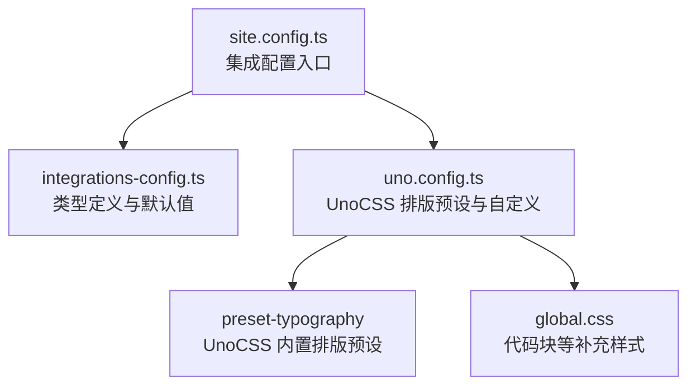
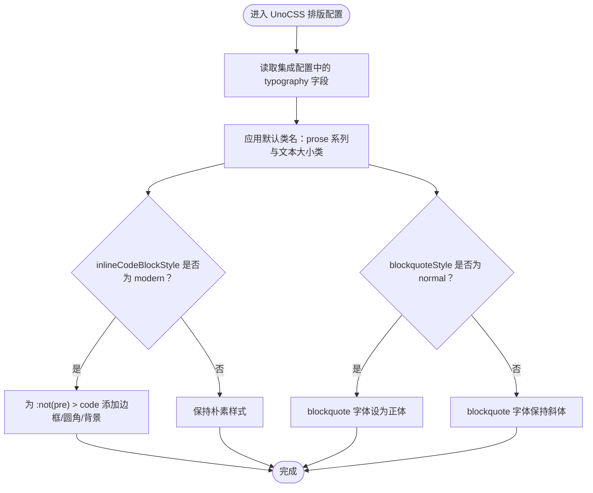

# 排版配置

<cite>
**本文引用的文件列表**
- [uno.config.ts](file://uno.config.ts)
- [site.config.ts](file://src/site.config.ts)
- [integrations-config.ts](file://packages/pure/types/integrations-config.ts)
- [global.css](file://src/assets/styles/global.css)
</cite>

## 目录
1. [简介](#简介)
2. [项目结构与排版相关模块](#项目结构与排版相关模块)
3. [核心配置项详解](#核心配置项详解)
4. [UnoCSS 排版预设与自定义](#unocss-排版预设与自定义)
5. [最佳实践与视觉效果示例](#最佳实践与视觉效果示例)
6. [故障排查](#故障排查)
7. [结论](#结论)

## 简介
本指南聚焦于 Astro 主题 Pure 的排版系统，围绕 typography 对象的配置进行系统化说明，涵盖：
- class 属性设置 prose 样式类与文本大小
- blockquoteStyle 配置：引用块的字体样式（normal/italic）
- inlineCodeBlockStyle 配置：行内代码块样式（code/modern）
- UnoCSS 排版预设的使用与自定义
- 排版配置的最佳实践与视觉效果参考

## 项目结构与排版相关模块
Pure 主题通过 UnoCSS 的 preset-typography 提供开箱即用的排版能力，并允许通过集成配置进行定制。关键位置如下：
- UnoCSS 排版配置：uno.config.ts
- 主题与集成配置入口：src/site.config.ts
- 集成配置类型定义：packages/pure/types/integrations-config.ts
- 全局样式补充：src/assets/styles/global.css

图表来源
- [uno.config.ts](file://uno.config.ts#L1-L192)
- [site.config.ts](file://src/site.config.ts#L101-L181)
- [integrations-config.ts](file://packages/pure/types/integrations-config.ts#L27-L37)
- [global.css](file://src/assets/styles/global.css#L64-L119)

章节来源
- [uno.config.ts](file://uno.config.ts#L1-L192)
- [site.config.ts](file://src/site.config.ts#L101-L181)
- [integrations-config.ts](file://packages/pure/types/integrations-config.ts#L1-L66)
- [global.css](file://src/assets/styles/global.css#L64-L119)

## 核心配置项详解
本节针对 typography 对象的关键字段进行逐项解析，帮助你理解其作用域与可选值。

- class 属性
  - 作用：为内容容器应用 UnoCSS 的 prose 系列样式类，以及文本大小等基础排版类。
  - 默认值：prose prose-pure dark:prose-invert dark:prose-pure prose-headings:font-medium
  - 可选扩展：可叠加 UnoCSS 文本大小类（如 text-sm、text-base、text-lg 等），以统一页面文本层级。
  - 注意：该类名由 UnoCSS 的 preset-typography 识别并生成对应的排版规则。

- blockquoteStyle 属性
  - 作用：控制引用块（blockquote）的字体样式。
  - 可选值：normal、italic
  - 默认值：italic
  - 影响范围：引用块的斜体样式；当设置为 normal 时，引用块将使用正体。

- inlineCodeBlockStyle 属性
  - 作用：控制行内代码块（code）的样式风格。
  - 可选值：code、modern
  - 默认值：modern
  - 影响范围：行内代码块的边框、圆角、背景色等现代样式；当设置为 code 时，采用更朴素的样式。

章节来源
- [integrations-config.ts](file://packages/pure/types/integrations-config.ts#L27-L37)
- [site.config.ts](file://src/site.config.ts#L141-L149)
- [uno.config.ts](file://uno.config.ts#L67-L91)

## UnoCSS 排版预设与自定义
UnoCSS 的 preset-typography 为 Markdown 渲染的内容提供了丰富的默认排版规则，Pure 在此基础上做了进一步定制与扩展。

- 颜色方案与变量
  - UnoCSS 使用 CSS 变量与颜色映射来统一排版色彩，例如前景色、标题色、链接色、代码色等。
  - Pure 将这些颜色映射到站点主题变量，确保深浅色模式下的一致性。

- 自定义规则
  - 行内代码块（:not(pre) > code）：默认保留换行与断词行为；当 inlineCodeBlockStyle 为 modern 时，会追加边框、圆角与背景色等现代样式。
  - 引用块（blockquote）：默认带装饰性右引号与阴影；当 blockquoteStyle 为 normal 时，引用块字体样式切换为正体。
  - 标题锚点：为标题添加可点击的锚点样式与滚动偏移，提升目录导航体验。
  - 表格：表格在移动端以横向滚动方式展示，字号微调以适配窄屏。

- safelist 建议
  - UnoCSS 在提取阶段可能遗漏某些动态类名，建议将常用排版类（如 text-base、prose）加入 safelist，避免运行时闪烁或样式缺失。

- 与全局样式的配合
  - global.css 中对代码块容器（pre）进行了额外美化，如行号、高亮与暗色主题下的颜色覆盖，与 UnoCSS 的排版预设形成互补。

图表来源
- [uno.config.ts](file://uno.config.ts#L67-L91)

章节来源
- [uno.config.ts](file://uno.config.ts#L1-L192)
- [global.css](file://src/assets/styles/global.css#L64-L119)

## 最佳实践与视觉效果示例
- 统一文本层级
  - 在 class 中叠加 UnoCSS 文本大小类（如 text-base），确保正文、标题、引用等元素的相对层级清晰。
  - 示例路径：[site.config.ts](file://src/site.config.ts#L143-L149)

- 引用块风格选择
  - 若追求极简与可读性，可将 blockquoteStyle 设为 normal，减少斜体带来的视觉干扰。
  - 示例路径：[uno.config.ts](file://uno.config.ts#L90)

- 行内代码块风格选择
  - modern 风格适合强调代码片段，搭配边框与背景提升可读性；code 风格适合不希望过度突出的场景。
  - 示例路径：[uno.config.ts](file://uno.config.ts#L67-L80)

- 深浅色一致性
  - 利用 UnoCSS 的 dark:prose-invert 与 dark:prose-pure 类，确保深色模式下的对比度与可读性。
  - 示例路径：[integrations-config.ts](file://packages/pure/types/integrations-config.ts#L30-L32)

- 移动端表格与代码块
  - 表格在窄屏下横向滚动，代码块提供行号与高亮；建议在内容中合理使用表格与代码块，避免过长内容影响阅读。
  - 示例路径：[uno.config.ts](file://uno.config.ts#L105-L106)、[global.css](file://src/assets/styles/global.css#L64-L119)

## 故障排查
- 引用块未按预期显示斜体或正体
  - 检查 blockquoteStyle 是否被正确设置为 normal 或 italic。
  - 确认 UnoCSS 预设已启用且未被其他样式覆盖。
  - 参考路径：[uno.config.ts](file://uno.config.ts#L90)

- 行内代码块样式不符合预期
  - 检查 inlineCodeBlockStyle 是否为 modern 或 code。
  - 若使用 modern，确认现代样式规则是否被 safelist 或主题变量覆盖。
  - 参考路径：[uno.config.ts](file://uno.config.ts#L67-L80)

- 文本大小未生效
  - 确认在 class 中叠加了 UnoCSS 文本大小类（如 text-base）。
  - 检查是否存在更高优先级的样式覆盖。
  - 参考路径：[integrations-config.ts](file://packages/pure/types/integrations-config.ts#L30-L32)

- 深色模式排版异常
  - 确保 dark:prose-invert 与 dark:prose-pure 类已正确应用。
  - 检查主题变量（如 --foreground、--muted）是否在深色模式下正常渲染。
  - 参考路径：[uno.config.ts](file://uno.config.ts#L14-L34)

- 表格与代码块在窄屏下不可读
  - 表格已设置横向滚动；若仍不可读，考虑减少列数或使用分段展示。
  - 代码块行号与高亮已在 global.css 中增强；若仍不可读，检查字体与字号设置。
  - 参考路径：[uno.config.ts](file://uno.config.ts#L105-L106)、[global.css](file://src/assets/styles/global.css#L64-L119)

## 结论
通过合理配置 typography 对象，你可以快速实现与主题一致的排版风格。建议：
- 使用 modern 风格的行内代码块与 italic 引用块，提升可读性；
- 在 class 中叠加合适的文本大小类，统一页面文本层级；
- 在深色模式下依赖 dark:prose-invert 与 dark:prose-pure，确保对比度；
- 如遇样式冲突，优先检查 safelist 与主题变量，必要时在 global.css 中补充局部样式。