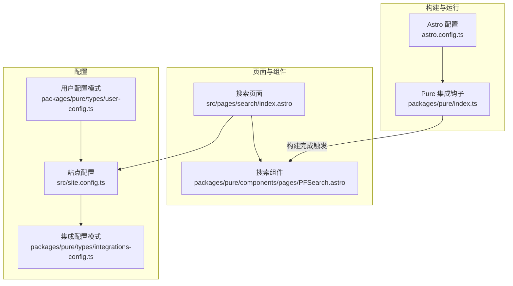
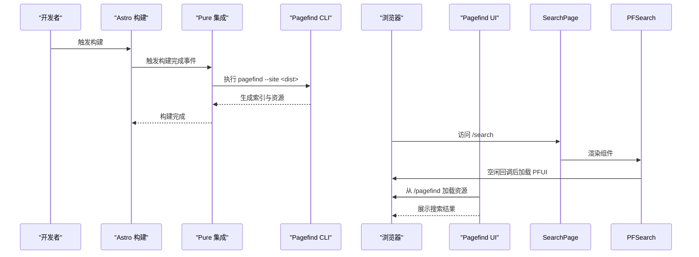
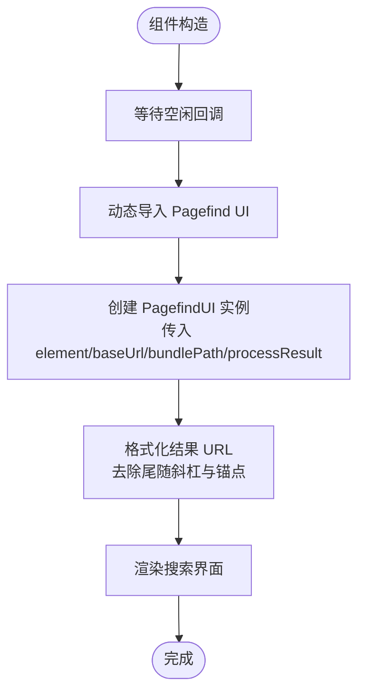
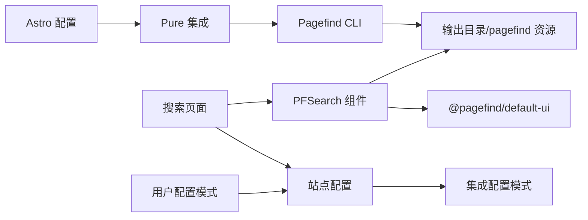

# 搜索功能配置

<cite>
**本文引用的文件**
- [packages/pure/components/pages/PFSearch.astro](file://packages/pure/components/pages/PFSearch.astro)
- [src/pages/search/index.astro](file://src/pages/search/index.astro)
- [packages/pure/types/integrations-config.ts](file://packages/pure/types/integrations-config.ts)
- [packages/pure/types/user-config.ts](file://packages/pure/types/user-config.ts)
- [src/site.config.ts](file://src/site.config.ts)
- [astro.config.ts](file://astro.config.ts)
- [packages/pure/index.ts](file://packages/pure/index.ts)
- [README.md](file://README.md)
</cite>

## 目录
1. [简介](#简介)
2. [项目结构](#项目结构)
3. [核心组件](#核心组件)
4. [架构总览](#架构总览)
5. [详细组件分析](#详细组件分析)
6. [依赖关系分析](#依赖关系分析)
7. [性能考虑](#性能考虑)
8. [故障排除指南](#故障排除指南)
9. [结论](#结论)

## 简介
本指南面向使用 Astro 主题 Pure 的用户，系统性讲解如何在项目中集成与配置 Pagefind 搜索功能。内容涵盖：
- pagefind 配置项与启用/禁用开关
- Pagefind 在 Astro 中的集成方式与工作原理
- 搜索界面组件 PFSearch 的使用与可定制项
- prerender 对搜索功能的影响（以及为何无法禁用）
- 性能优化建议与常见问题排查

## 项目结构
与搜索功能直接相关的文件主要分布在以下位置：
- 组件层：PFSearch 搜索界面组件
- 页面层：搜索页面入口，按配置条件渲染或提示禁用
- 配置层：站点配置与集成配置，含 pagefind 开关
- 构建层：Astro 集成在构建完成后自动调用 Pagefind 命令生成索引
- 文档层：主题 README 明确了“全文搜索由 Pagefind 提供”的特性

图表来源
- [src/pages/search/index.astro](file://src/pages/search/index.astro#L1-L34)
- [packages/pure/components/pages/PFSearch.astro](file://packages/pure/components/pages/PFSearch.astro#L1-L70)
- [src/site.config.ts](file://src/site.config.ts#L1-L207)
- [packages/pure/types/integrations-config.ts](file://packages/pure/types/integrations-config.ts#L1-L66)
- [packages/pure/types/user-config.ts](file://packages/pure/types/user-config.ts#L1-L26)
- [astro.config.ts](file://astro.config.ts#L1-L133)
- [packages/pure/index.ts](file://packages/pure/index.ts#L98-L114)

章节来源
- [README.md](file://README.md#L27-L28)
- [src/pages/search/index.astro](file://src/pages/search/index.astro#L1-L34)
- [packages/pure/components/pages/PFSearch.astro](file://packages/pure/components/pages/PFSearch.astro#L1-L70)
- [src/site.config.ts](file://src/site.config.ts#L123-L125)
- [packages/pure/types/integrations-config.ts](file://packages/pure/types/integrations-config.ts#L9-L14)
- [packages/pure/types/user-config.ts](file://packages/pure/types/user-config.ts#L15-L23)
- [astro.config.ts](file://astro.config.ts#L98-L104)
- [packages/pure/index.ts](file://packages/pure/index.ts#L98-L114)

## 核心组件
- 搜索页面入口：根据站点配置决定是否显示搜索组件，并在禁用时给出明确提示。
- 搜索界面组件 PFSearch：负责在浏览器端初始化 Pagefind UI，加载本地资源并格式化结果 URL。

章节来源
- [src/pages/search/index.astro](file://src/pages/search/index.astro#L20-L30)
- [packages/pure/components/pages/PFSearch.astro](file://packages/pure/components/pages/PFSearch.astro#L19-L52)

## 架构总览
Pagefind 在本项目中的工作流如下：
- 构建阶段：Astro 集成在构建完成后自动执行 Pagefind 命令，生成静态索引资源到输出目录。
- 运行阶段：搜索页面按配置渲染 PFSearch 组件；组件在空闲时间异步加载 Pagefind UI 并初始化，从站点的 pagefind 目录加载资源，展示搜索结果。

图表来源
- [packages/pure/index.ts](file://packages/pure/index.ts#L98-L114)
- [src/pages/search/index.astro](file://src/pages/search/index.astro#L20-L30)
- [packages/pure/components/pages/PFSearch.astro](file://packages/pure/components/pages/PFSearch.astro#L28-L49)

## 详细组件分析

### 搜索页面组件（index.astro）
- 功能要点
  - 读取站点配置中的集成开关 integ.pagefind
  - 当开启时渲染提示文本与 PFSearch 组件；当关闭时提示“Pagefind 已禁用”
  - 使用基础布局与返回按钮增强可用性

- 关键行为
  - 条件渲染：仅在 integ.pagefind 为真时显示搜索输入框与结果区域
  - 开发模式提示：开发环境下会提示搜索被禁用（用于区分构建产物）

章节来源
- [src/pages/search/index.astro](file://src/pages/search/index.astro#L1-L34)

### 搜索界面组件（PFSearch.astro）
- 功能要点
  - 自定义元素封装：注册 <site-search> 元素
  - 浏览器端初始化：在 DOMContentLoaded 后的空闲时间加载 Pagefind UI
  - 资源路径：通过 BASE_URL 拼接 /pagefind 目录，确保在子路径部署场景下也能正确加载
  - 结果格式化：统一处理主结果与子结果的 URL，去除尾随斜杠与锚点，提升一致性

- 可定制项（样式变量）
  - 尺度、主色、文字色、背景色、边框色、标签色、边框宽度、圆角半径、图片比例等
  - 通过 CSS 变量映射到主题变量，便于与整体风格保持一致

- 初始化流程
  - 等待空闲回调，避免阻塞首屏渲染
  - 异步导入 @pagefind/default-ui
  - 创建 PagefindUI 实例，传入元素选择器、基础路径、bundlePath、结果处理函数等

图表来源
- [packages/pure/components/pages/PFSearch.astro](file://packages/pure/components/pages/PFSearch.astro#L28-L49)

章节来源
- [packages/pure/components/pages/PFSearch.astro](file://packages/pure/components/pages/PFSearch.astro#L1-L70)

### 配置与模式
- 集成配置（integrations-config.ts）
  - pagefind 字段：布尔可选，用于控制是否启用 Pagefind 索引与 UI
  - 该字段在用户配置模式中被合并与校验

- 用户配置模式（user-config.ts）
  - 默认策略：若未显式设置 integ.pagefind，则默认跟随 prerender 设置
  - 校验规则：若 integ.pagefind 为真而 prerender 为假，将抛出错误提示“Pagefind 搜索不支持禁用预渲染”

- 站点配置（site.config.ts）
  - 在主题配置中声明 prerender: true
  - 在集成配置中显式设置 integ.pagefind: true

章节来源
- [packages/pure/types/integrations-config.ts](file://packages/pure/types/integrations-config.ts#L9-L14)
- [packages/pure/types/user-config.ts](file://packages/pure/types/user-config.ts#L15-L23)
- [src/site.config.ts](file://src/site.config.ts#L34-L34)
- [src/site.config.ts](file://src/site.config.ts#L124-L124)

### 构建集成（Astro Pure 集成）
- 触发时机：在构建完成事件中执行
- 行为：当 integ.pagefind 为真时，调用 npx pagefind --site <dist> 生成索引
- 影响：生成的 pagefind 资源位于输出目录的 /pagefind 下，供前端组件按 BASE_URL 正确加载

章节来源
- [astro.config.ts](file://astro.config.ts#L98-L104)
- [packages/pure/index.ts](file://packages/pure/index.ts#L98-L114)

## 依赖关系分析
- 组件依赖
  - PFSearch 依赖 @pagefind/default-ui（运行时动态导入）
  - 搜索页面依赖 PFSearch 组件与基础布局
- 配置依赖
  - 搜索页面读取站点配置中的 integ.pagefind
  - 用户配置模式对 pagefind 与 prerender 的默认值与约束进行转换与校验
- 构建依赖
  - Astro 集成在构建完成后调用 Pagefind CLI 生成索引

图表来源
- [packages/pure/components/pages/PFSearch.astro](file://packages/pure/components/pages/PFSearch.astro#L32-L33)
- [src/pages/search/index.astro](file://src/pages/search/index.astro#L2-L5)
- [src/site.config.ts](file://src/site.config.ts#L101-L181)
- [packages/pure/types/integrations-config.ts](file://packages/pure/types/integrations-config.ts#L5-L62)
- [packages/pure/types/user-config.ts](file://packages/pure/types/user-config.ts#L6-L26)
- [astro.config.ts](file://astro.config.ts#L98-L104)
- [packages/pure/index.ts](file://packages/pure/index.ts#L98-L114)

## 性能考虑
- 避免阻塞首屏
  - PFSearch 在空闲回调中初始化 UI，减少对首屏渲染的影响
- 资源加载优化
  - 通过 BASE_URL 动态拼接 bundlePath，确保在子路径部署时仍能正确加载资源
  - 关闭图片展示（showImages: false）可减少额外资源请求
- 结果处理
  - 统一格式化 URL，避免重复解析与跳转抖动
- 构建阶段
  - Pagefind 在构建完成后生成索引，避免运行时计算开销
- 建议
  - 若站点内容体量较大，可在构建机上启用缓存与并行能力，缩短 Pagefind 生成索引的时间
  - 控制搜索结果数量与展示层级，避免一次性渲染过多节点

章节来源
- [packages/pure/components/pages/PFSearch.astro](file://packages/pure/components/pages/PFSearch.astro#L28-L49)
- [packages/pure/components/pages/PFSearch.astro](file://packages/pure/components/pages/PFSearch.astro#L37-L38)
- [packages/pure/components/pages/PFSearch.astro](file://packages/pure/components/pages/PFSearch.astro#L38-L39)
- [packages/pure/index.ts](file://packages/pure/index.ts#L98-L114)

## 故障排除指南
- Pagefind 已禁用
  - 现象：搜索页面显示“Pagefind is disabled.”
  - 排查：确认站点配置中 integ.pagefind 是否为 true；检查用户配置模式是否因 prerender 为假导致 pagefind 被强制禁用
  - 处理：将 prerender 设为 true 或显式设置 integ.pagefind: true

- 构建后找不到 /pagefind 资源
  - 现象：浏览器控制台报 404，搜索无结果
  - 排查：确认构建完成事件是否触发 Pagefind CLI；确认输出目录中存在 /pagefind 目录
  - 处理：检查构建日志中 Pagefind 输出；确保构建命令具备执行权限

- 子路径部署下资源加载失败
  - 现象：BASE_URL 与 bundlePath 不匹配导致资源 404
  - 排查：确认 astro.config.ts 中的 site 与 base 配置；确认页面中 BASE_URL 的实际值
  - 处理：确保 bundlePath 以 BASE_URL 结尾且不含多余斜杠

- 开发环境提示搜索被禁用
  - 现象：开发模式下显示“你处于开发模式，搜索已禁用”
  - 说明：这是预期行为，开发模式下不会加载 Pagefind 资源
  - 处理：在生产构建后验证搜索功能

- 与 prerender 冲突
  - 现象：设置 integ.pagefind: true 但 prerender: false，构建时报错
  - 说明：用户配置模式明确禁止在禁用预渲染的情况下启用 Pagefind
  - 处理：将 prerender 设为 true，或完全移除 pagefind 配置以使用默认值

章节来源
- [src/pages/search/index.astro](file://src/pages/search/index.astro#L22-L29)
- [packages/pure/types/user-config.ts](file://packages/pure/types/user-config.ts#L21-L23)
- [packages/pure/components/pages/PFSearch.astro](file://packages/pure/components/pages/PFSearch.astro#L36-L37)
- [astro.config.ts](file://astro.config.ts#L28-L32)
- [packages/pure/index.ts](file://packages/pure/index.ts#L98-L114)

## 结论
- Pagefind 在 Astro 主题 Pure 中是默认启用的全文搜索方案，通过 Astro 集成在构建阶段自动生成索引，并在运行时由 PFSearch 组件加载 UI 与资源。
- 配置层面，pagefind 作为集成开关，受用户配置模式的默认值与校验规则影响；prerender 与 pagefind 存在强约束关系，不可同时为假。
- 使用上，只需在站点配置中开启 integ.pagefind，并确保 prerender 为真，即可获得开箱即用的搜索体验；如需微调样式与行为，可通过组件提供的 CSS 变量与初始化参数进行定制。