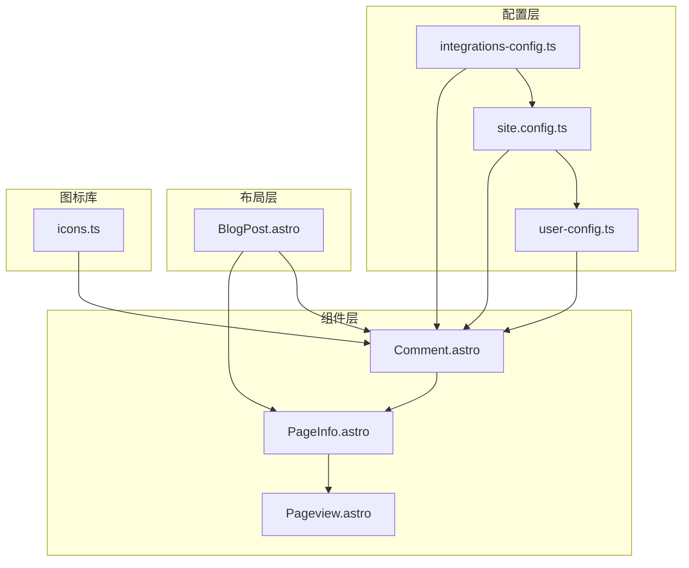
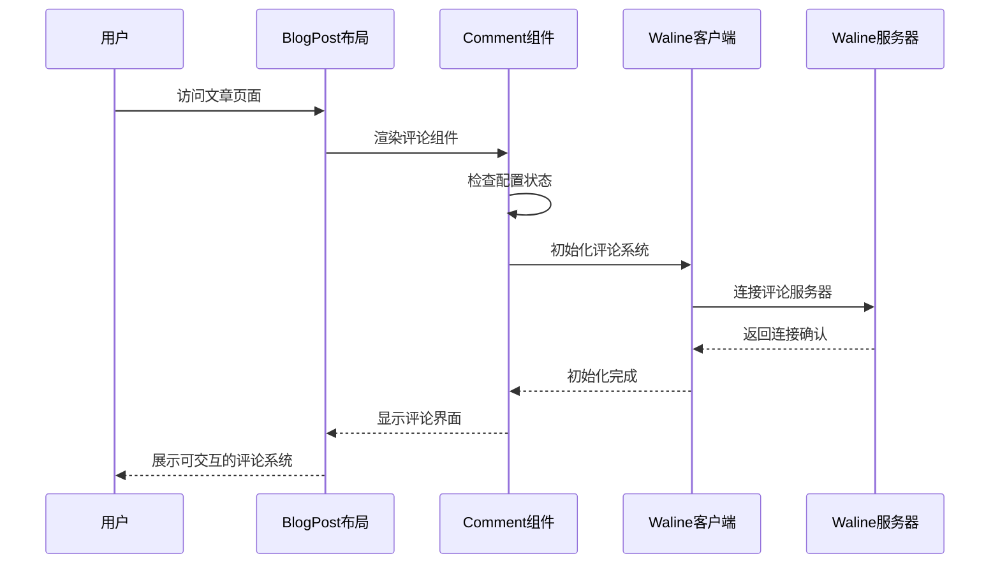
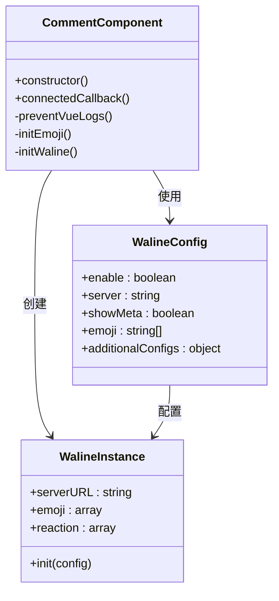
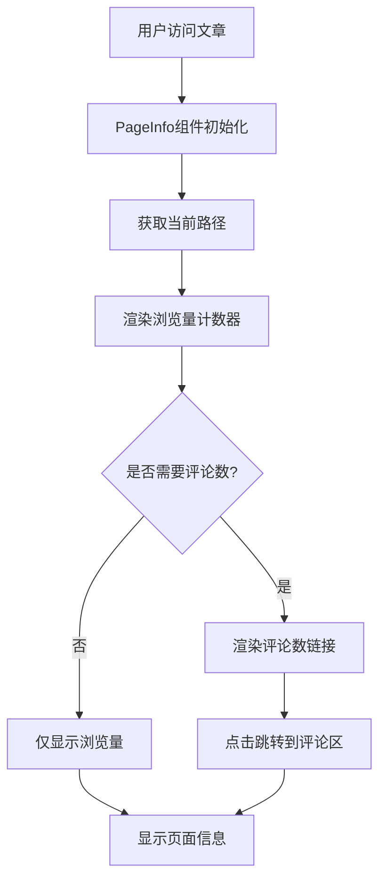
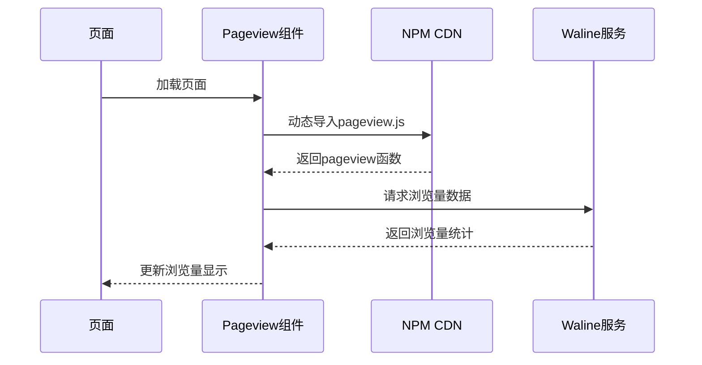

# 评论系统配置

<cite>
**本文档引用的文件**
- [integrations-config.ts](file://packages/pure/types/integrations-config.ts)
- [user-config.ts](file://packages/pure/types/user-config.ts)
- [site.config.ts](file://src/site.config.ts)
- [Comment.astro](file://src/components/waline/Comment.astro)
- [PageInfo.astro](file://src/components/waline/PageInfo.astro)
- [Pageview.astro](file://src/components/waline/Pageview.astro)
- [BlogPost.astro](file://src/layouts/BlogPost.astro)
- [icons.ts](file://packages/pure/libs/icons.ts)
</cite>

## 目录
1. [简介](#简介)
2. [项目结构](#项目结构)
3. [核心组件](#核心组件)
4. [架构概览](#架构概览)
5. [详细组件分析](#详细组件分析)
6. [依赖关系分析](#依赖关系分析)
7. [性能考虑](#性能考虑)
8. [故障排除指南](#故障排除指南)
9. [结论](#结论)

## 简介

Astro主题Pure的评论系统基于Waline构建，提供了完整的评论功能集成方案。本文档详细介绍了waline配置对象的完整结构，包括启用开关、服务器配置、元信息显示控制、表情包配置以及额外配置选项。

## 项目结构

评论系统在项目中的组织结构如下：



**图表来源**
- [integrations-config.ts](file://packages/pure/types/integrations-config.ts#L50-L61)
- [site.config.ts](file://src/site.config.ts#L161-L180)
- [Comment.astro](file://src/components/waline/Comment.astro#L1-L62)

**章节来源**
- [integrations-config.ts](file://packages/pure/types/integrations-config.ts#L1-L66)
- [site.config.ts](file://src/site.config.ts#L150-L207)

## 核心组件

### Waline配置对象结构

Waline评论系统的配置对象包含以下关键属性：

| 属性名 | 类型 | 默认值 | 描述 |
|--------|------|--------|------|
| enable | boolean | false | 启用/禁用Waline评论系统 |
| server | string | undefined | Waline服务器地址 |
| showMeta | boolean | true | 是否显示评论者元信息 |
| emoji | string[] | undefined | 表情包预设数组 |
| additionalConfigs | record | {} | 额外配置对象 |

### 配置验证规则

配置对象通过Zod Schema进行严格验证，确保配置的正确性和完整性。

**章节来源**
- [integrations-config.ts](file://packages/pure/types/integrations-config.ts#L50-L61)
- [user-config.ts](file://packages/pure/types/user-config.ts#L6-L26)

## 架构概览

评论系统的整体架构采用模块化设计，各组件职责明确：



**图表来源**
- [BlogPost.astro](file://src/layouts/BlogPost.astro#L67-L69)
- [Comment.astro](file://src/components/waline/Comment.astro#L21-L56)

## 详细组件分析

### Comment组件实现

Comment组件是评论系统的核心实现，负责初始化和管理Waline实例：



**图表来源**
- [Comment.astro](file://src/components/waline/Comment.astro#L28-L55)

#### 关键实现细节

1. **Vue兼容性处理**：通过设置全局变量来避免Vue相关的日志错误
2. **表情包加载**：动态从CDN加载指定的表情包预设
3. **配置合并**：将additionalConfigs与基础配置合并
4. **条件渲染**：仅在enable为true时才初始化组件

**章节来源**
- [Comment.astro](file://src/components/waline/Comment.astro#L21-L56)

### 页面信息组件

PageInfo组件提供文章的浏览量和评论数统计功能：



**图表来源**
- [PageInfo.astro](file://src/components/waline/PageInfo.astro#L13-L28)

**章节来源**
- [PageInfo.astro](file://src/components/waline/PageInfo.astro#L1-L30)

### 页面浏览量统计

Pageview组件独立实现浏览量统计功能：



**图表来源**
- [Pageview.astro](file://src/components/waline/Pageview.astro#L12-L30)

**章节来源**
- [Pageview.astro](file://src/components/waline/Pageview.astro#L1-L31)

## 依赖关系分析

评论系统各组件之间的依赖关系如下：

```mermaid
graph LR
subgraph "配置依赖"
A[integrations-config.ts] --> B[site.config.ts]
B --> C[user-config.ts]
end
subgraph "运行时依赖"
D[Comment.astro] --> E[@waline/client]
F[Pageview.astro] --> E
G[PageInfo.astro] --> F
end
subgraph "类型依赖"
H[icons.ts] --> D
I[BlogPost.astro] --> D
I --> G
end
A --> D
B --> D
C --> D
H --> D
I --> D
```

**图表来源**
- [integrations-config.ts](file://packages/pure/types/integrations-config.ts#L1-L66)
- [Comment.astro](file://src/components/waline/Comment.astro#L22-L24)

**章节来源**
- [BlogPost.astro](file://src/layouts/BlogPost.astro#L10-L12)

## 性能考虑

### 资源加载优化

1. **按需加载**：评论组件仅在需要时才加载相关资源
2. **CDN缓存**：表情包和脚本文件通过CDN分发，利用浏览器缓存
3. **异步加载**：页面浏览量统计采用异步方式，避免阻塞页面渲染

### 内存管理

1. **超时机制**：页面浏览量统计设置了500ms超时，防止长时间占用资源
2. **条件初始化**：只有在配置启用的情况下才创建Waline实例

## 故障排除指南

### 常见问题及解决方案

#### 1. 评论系统不显示

**可能原因**：
- waline.enable 设置为 false
- 服务器地址配置错误
- 网络连接问题

**解决步骤**：
1. 检查配置文件中的enable设置
2. 验证server URL的有效性
3. 确认网络连接正常

#### 2. 表情包加载失败

**可能原因**：
- CDN访问受限
- 表情包预设名称错误

**解决步骤**：
1. 检查表情包预设列表
2. 尝试更换CDN源
3. 验证表情包预设名称

#### 3. 元信息显示异常

**可能原因**：
- showMeta配置错误
- CSS样式冲突

**解决步骤**：
1. 检查showMeta配置
2. 查看相关CSS样式
3. 调整样式优先级

#### 4. 页面浏览量统计不更新

**可能原因**：
- 服务器连接失败
- 超时设置过短

**解决步骤**：
1. 检查服务器连接状态
2. 调整超时时间设置
3. 查看浏览器开发者工具中的网络请求

**章节来源**
- [Comment.astro](file://src/components/waline/Comment.astro#L34-L40)
- [Pageview.astro](file://src/components/waline/Pageview.astro#L22-L25)

## 结论

Astro主题Pure的评论系统通过Waline实现了功能完整、配置灵活的评论解决方案。系统采用模块化设计，配置验证严格，运行时性能优化良好。通过本文档的配置指南，用户可以轻松集成和定制评论系统，满足不同场景下的需求。

主要优势包括：
- 完整的配置选项支持
- 良好的性能表现
- 详细的错误处理机制
- 灵活的扩展能力

建议在生产环境中：
1. 确保服务器地址的稳定性和可用性
2. 根据实际需求调整表情包和样式配置
3. 监控评论系统的运行状态
4. 定期更新依赖包以获得最新功能和安全修复