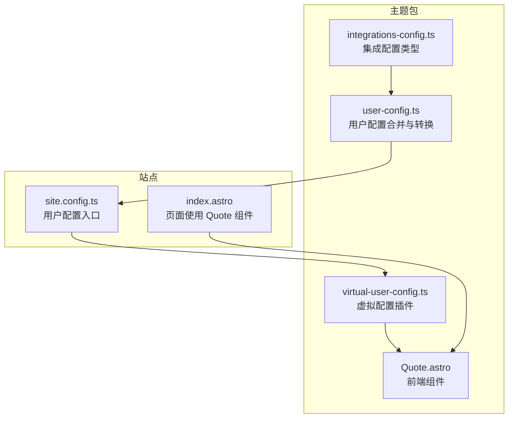
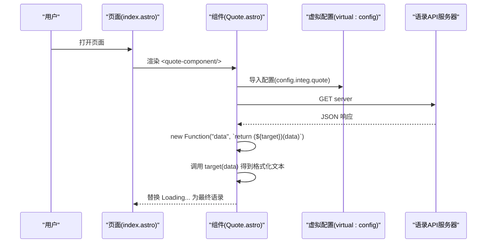
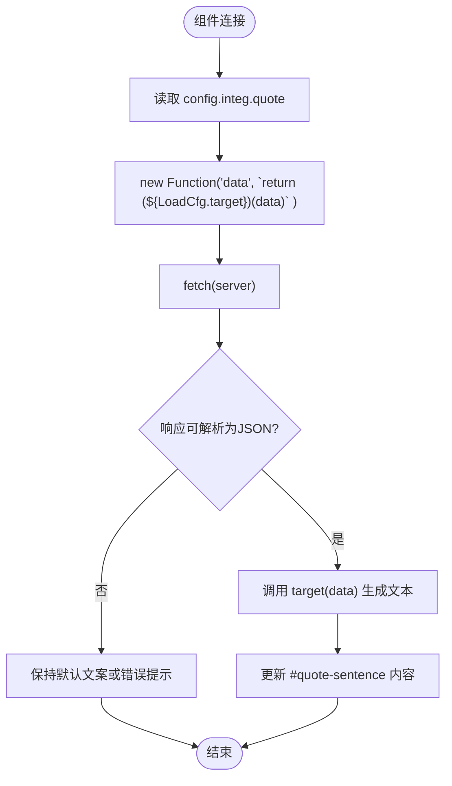
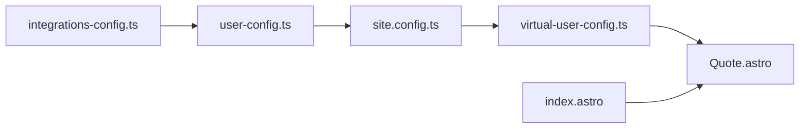

# 语录系统配置

<cite>
**本文引用的文件**
- [packages/pure/components/advanced/Quote.astro](file://packages/pure/components/advanced/Quote.astro)
- [packages/pure/plugins/virtual-user-config.ts](file://packages/pure/plugins/virtual-user-config.ts)
- [packages/pure/types/integrations-config.ts](file://packages/pure/types/integrations-config.ts)
- [packages/pure/types/user-config.ts](file://packages/pure/types/user-config.ts)
- [src/site.config.ts](file://src/site.config.ts)
- [src/pages/index.astro](file://src/pages/index.astro)
</cite>

## 目录
1. [简介](#简介)
2. [项目结构](#项目结构)
3. [核心组件](#核心组件)
4. [架构总览](#架构总览)
5. [详细组件分析](#详细组件分析)
6. [依赖分析](#依赖分析)
7. [性能考量](#性能考量)
8. [故障排查指南](#故障排查指南)
9. [结论](#结论)
10. [附录](#附录)

## 简介
本指南面向使用 Astro 主题 Pure 的用户，聚焦“语录系统”的配置与扩展。内容涵盖：
- quote 对象的配置结构与校验
- 三种语录 API 示例（Hitokoto、Quoteable、DummyJSON）
- target 函数的编写方法（数据提取、格式化、长度限制）
- 自定义语录显示格式（引号、作者信息、截断策略）
- 不同 API 的优缺点与选型建议

## 项目结构
与语录系统直接相关的文件与职责如下：
- Quote 组件：负责在页面中渲染随机语录，并通过浏览器 fetch 获取远程数据
- 虚拟配置模块：将用户配置注入到前端运行时
- 类型定义：对 quote 配置进行严格校验
- 用户配置：在站点配置中声明 quote 的 server 与 target
- 页面使用：在首页等页面中插入 Quote 组件

图表来源
- [packages/pure/components/advanced/Quote.astro](file://packages/pure/components/advanced/Quote.astro#L1-L40)
- [packages/pure/plugins/virtual-user-config.ts](file://packages/pure/plugins/virtual-user-config.ts#L61-L79)
- [packages/pure/types/integrations-config.ts](file://packages/pure/types/integrations-config.ts#L20-L25)
- [packages/pure/types/user-config.ts](file://packages/pure/types/user-config.ts#L6-L20)
- [src/site.config.ts](file://src/site.config.ts#L101-L140)
- [src/pages/index.astro](file://src/pages/index.astro#L65-L65)

章节来源
- [packages/pure/components/advanced/Quote.astro](file://packages/pure/components/advanced/Quote.astro#L1-L40)
- [packages/pure/plugins/virtual-user-config.ts](file://packages/pure/plugins/virtual-user-config.ts#L61-L79)
- [packages/pure/types/integrations-config.ts](file://packages/pure/types/integrations-config.ts#L20-L25)
- [packages/pure/types/user-config.ts](file://packages/pure/types/user-config.ts#L6-L20)
- [src/site.config.ts](file://src/site.config.ts#L101-L140)
- [src/pages/index.astro](file://src/pages/index.astro#L65-L65)

## 核心组件
- Quote 组件
  - 功能：在页面中展示随机语录，加载态显示“Loading...”，成功后替换为目标文本
  - 数据流：读取虚拟配置中的 integ.quote.server 与 integ.quote.target；通过 fetch 请求 server，解析 JSON 后调用 target 函数生成最终字符串并渲染
  - 关键点：由于虚拟配置以 JSON 字符串形式注入，target 必须以字符串形式提供，组件内部使用 new Function 将其还原为可执行函数
- 虚拟配置插件
  - 将用户配置导出为虚拟模块 virtual:config，供前端组件按需导入
- 类型与校验
  - quote 配置包含 server（字符串）与 target（字符串，但实际为函数体字符串）
  - 用户配置合并逻辑会将 quote 配置与主题配置合并，并进行必要的默认值与约束处理

章节来源
- [packages/pure/components/advanced/Quote.astro](file://packages/pure/components/advanced/Quote.astro#L19-L40)
- [packages/pure/plugins/virtual-user-config.ts](file://packages/pure/plugins/virtual-user-config.ts#L61-L79)
- [packages/pure/types/integrations-config.ts](file://packages/pure/types/integrations-config.ts#L20-L25)
- [packages/pure/types/user-config.ts](file://packages/pure/types/user-config.ts#L6-L20)

## 架构总览
下图展示了从站点配置到页面渲染的完整流程：

图表来源
- [src/pages/index.astro](file://src/pages/index.astro#L65-L65)
- [packages/pure/components/advanced/Quote.astro](file://packages/pure/components/advanced/Quote.astro#L22-L37)
- [packages/pure/plugins/virtual-user-config.ts](file://packages/pure/plugins/virtual-user-config.ts#L61-L79)
- [src/site.config.ts](file://src/site.config.ts#L128-L140)

## 详细组件分析

### Quote 组件实现要点
- 生命周期钩子：connectedCallback 中发起请求
- 数据处理：fetch 返回 JSON，再通过 target 函数生成最终字符串
- DOM 更新：将 #quote-sentence 文本替换为目标文本
- target 执行：由于配置以 JSON 注入，target 为字符串，组件内以 new Function 还原为函数

图表来源
- [packages/pure/components/advanced/Quote.astro](file://packages/pure/components/advanced/Quote.astro#L24-L37)

章节来源
- [packages/pure/components/advanced/Quote.astro](file://packages/pure/components/advanced/Quote.astro#L22-L37)

### 配置结构与类型约束
- quote 配置对象包含：
  - server：字符串，指向语录 API 的地址
  - target：字符串，表示一个函数体（接收 data 参数），用于从原始数据中提取并格式化为最终显示文本
- 类型校验确保：
  - server 为必填字符串
  - target 为必填字符串（函数体字符串）
- 用户配置合并：
  - 将主题配置与集成配置合并，形成最终的 config.integ

章节来源
- [packages/pure/types/integrations-config.ts](file://packages/pure/types/integrations-config.ts#L20-L25)
- [packages/pure/types/user-config.ts](file://packages/pure/types/user-config.ts#L6-L20)
- [src/site.config.ts](file://src/site.config.ts#L101-L140)

### 三种语录 API 示例与对比

- Hitokoto（一言）
  - server 示例：https://v1.hitokoto.cn/?c=a&c=c&c=i
  - target 示例：将 hitokoto 与 from 组合为“语录《作者》”
  - 优点：接口稳定、返回字段丰富、中文语录多
  - 缺点：可能包含不适合所有场景的内容；跨域与 HTTPS 需注意
  - 适用场景：中文博客、追求简洁风格

- Quoteable（由 lukePeavey 提供）
  - server 示例：http://api.quotable.io/quotes/random?maxLength=60
  - target 示例：取数组第一个元素的 content 字段
  - 优点：支持 maxLength 查询参数，便于控制长度；字段结构清晰
  - 缺点：服务稳定性依赖第三方；查询参数需自行拼接
  - 适用场景：需要统一长度控制的场景

- DummyJSON（由 dummyjson 提供）
  - server 示例：https://dummyjson.com/quotes/random
  - target 示例：对 quote 字段做长度判断，超过阈值则截断并追加省略号
  - 优点：返回结构简单；可直接在 target 中做长度限制
  - 缺点：字段名与一言不同，需适配
  - 适用场景：快速原型、对长度有强约束的展示

章节来源
- [src/site.config.ts](file://src/site.config.ts#L129-L139)

### target 函数编写指南
- 输入：API 返回的原始数据（unknown 类型）
- 输出：最终要显示的纯文本字符串
- 常见步骤：
  - 数据提取：从 data 中取出目标字段（如 hitokoto、quote、content 等）
  - 格式化：拼接引号、作者、标点等
  - 长度限制：根据需求对文本进行截断或省略
  - 错误兜底：当字段缺失或为空时返回默认文案
- 注意事项：
  - target 必须以字符串形式提供，组件内部会将其作为函数体执行
  - 为避免跨域与 HTTPS 问题，尽量选择支持 HTTPS 的公共 API
  - 在 target 中进行长度限制时，建议结合业务场景设置合理阈值

章节来源
- [packages/pure/components/advanced/Quote.astro](file://packages/pure/components/advanced/Quote.astro#L33-L36)
- [src/site.config.ts](file://src/site.config.ts#L129-L139)

### 自定义语录显示格式
- 引号与作者信息：可在 target 中拼接“《作者》”等格式
- 截断处理：对过长文本进行截断并在末尾追加省略号
- 组件样式：组件本身提供基础样式类，可通过 props 的 class 进一步定制
- 页面挂载：在首页等页面中插入 Quote 组件即可生效

章节来源
- [packages/pure/components/advanced/Quote.astro](file://packages/pure/components/advanced/Quote.astro#L7-L17)
- [src/pages/index.astro](file://src/pages/index.astro#L65-L65)

## 依赖分析
- 组件依赖虚拟配置模块，通过 virtual:config 获取 integ.quote
- 类型系统对 quote 的字段进行严格约束，保证配置正确性
- 页面通过 Astro 组件语法引入 Quote 组件，完成渲染

图表来源
- [packages/pure/types/integrations-config.ts](file://packages/pure/types/integrations-config.ts#L20-L25)
- [packages/pure/types/user-config.ts](file://packages/pure/types/user-config.ts#L6-L20)
- [src/site.config.ts](file://src/site.config.ts#L101-L140)
- [packages/pure/plugins/virtual-user-config.ts](file://packages/pure/plugins/virtual-user-config.ts#L61-L79)
- [packages/pure/components/advanced/Quote.astro](file://packages/pure/components/advanced/Quote.astro#L20-L22)
- [src/pages/index.astro](file://src/pages/index.astro#L65-L65)

章节来源
- [packages/pure/types/integrations-config.ts](file://packages/pure/types/integrations-config.ts#L20-L25)
- [packages/pure/types/user-config.ts](file://packages/pure/types/user-config.ts#L6-L20)
- [src/site.config.ts](file://src/site.config.ts#L101-L140)
- [packages/pure/plugins/virtual-user-config.ts](file://packages/pure/plugins/virtual-user-config.ts#L61-L79)
- [packages/pure/components/advanced/Quote.astro](file://packages/pure/components/advanced/Quote.astro#L20-L22)
- [src/pages/index.astro](file://src/pages/index.astro#L65-L65)

## 性能考量
- 网络请求：语录 API 的可用性与延迟直接影响首屏体验，建议选择就近且稳定的公共 API
- 渲染时机：组件在 connectedCallback 中发起请求，避免阻塞页面其他渲染
- 长度控制：在 target 中进行长度限制，减少 DOM 节点尺寸与重排成本
- 缓存策略：若语录内容不频繁变化，可考虑在服务端或边缘缓存中缓存结果（需配合自有服务）

## 故障排查指南
- 无法显示语录
  - 检查 server 是否可达且返回 JSON
  - 检查 target 是否能正确从 data 中提取字段
  - 若为跨域问题，确认 API 支持 CORS 或使用代理
- 显示异常或报错
  - 确认 target 为合法的函数体字符串
  - 在 target 中增加空值检查与兜底文案
- 加载态一直存在
  - 确保 fetch 成功并触发 then 分支
  - 检查组件是否正确替换 #quote-sentence 的文本

章节来源
- [packages/pure/components/advanced/Quote.astro](file://packages/pure/components/advanced/Quote.astro#L24-L37)

## 结论
- quote 配置通过严格的类型约束与虚拟配置注入，实现了灵活而可靠的前端渲染
- 通过三种常见 API 的示例，可以快速上手并根据业务需求选择合适的语录源
- target 函数是格式化的关键，建议在其中加入长度限制与错误兜底，提升稳定性
- 在页面中插入 Quote 组件即可完成展示，无需额外服务端逻辑

## 附录
- 使用建议
  - 初次使用：优先尝试 Hitokoto，配置简单、中文语料丰富
  - 需要统一长度：尝试 Quoteable 并利用 maxLength 参数
  - 快速验证：使用 DummyJSON，便于在 target 中直接做长度控制
- 最佳实践
  - 在 target 中统一处理标点与格式，避免重复逻辑
  - 对过长文本进行截断并保留语义完整性
  - 为不可用或错误情况提供明确的兜底文案