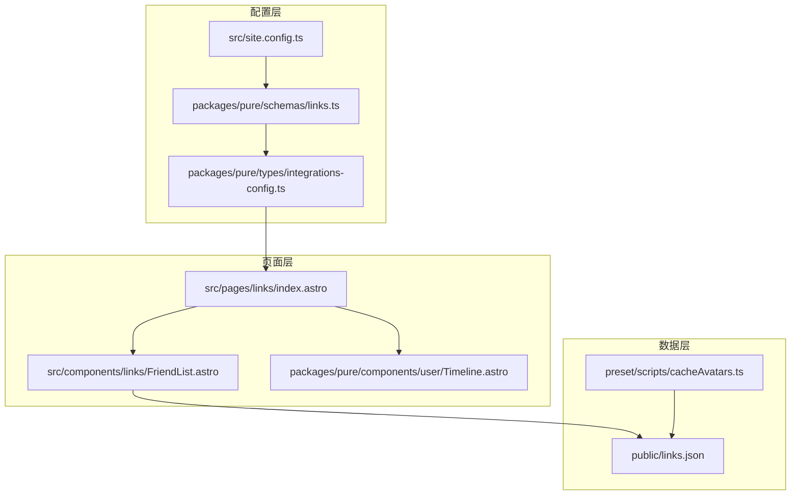
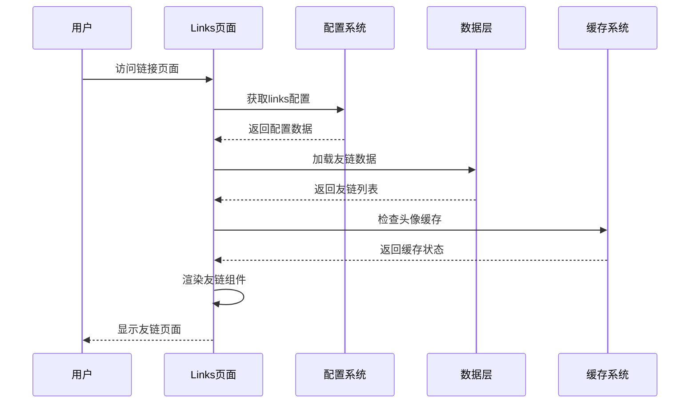
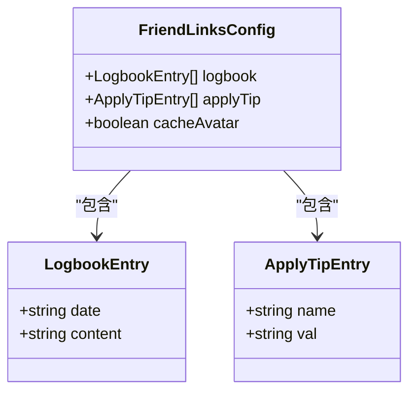
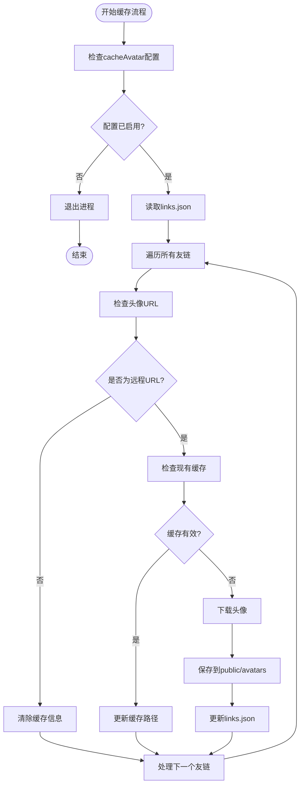
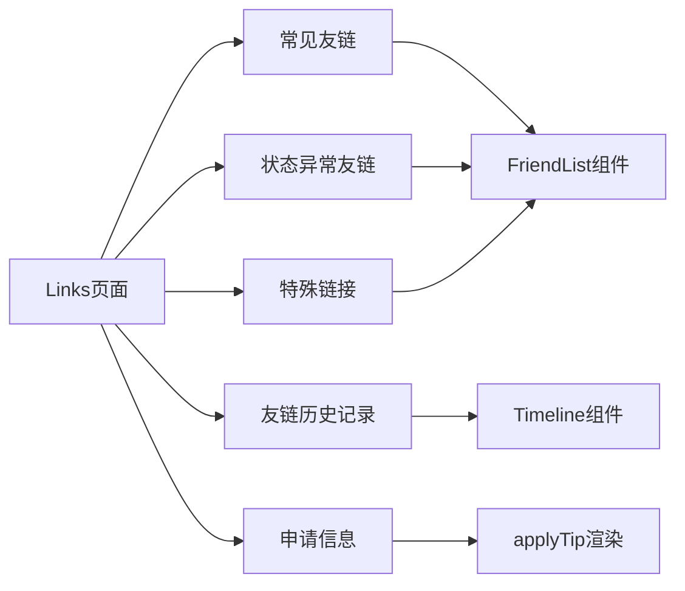
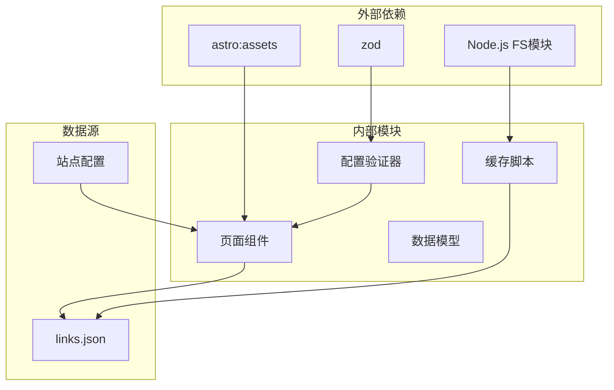

# 链接系统配置

<cite>
**本文档引用的文件**
- [packages/pure/schemas/links.ts](file://packages/pure/schemas/links.ts)
- [packages/pure/types/integrations-config.ts](file://packages/pure/types/integrations-config.ts)
- [packages/pure/components/user/Timeline.astro](file://packages/pure/components/user/Timeline.astro)
- [packages/pure/types/index.ts](file://packages/pure/types/index.ts)
- [src/site.config.ts](file://src/site.config.ts)
- [src/pages/links/index.astro](file://src/pages/links/index.astro)
- [src/components/links/FriendList.astro](file://src/components/links/FriendList.astro)
- [preset/scripts/cacheAvatars.ts](file://preset/scripts/cacheAvatars.ts)
- [public/links.json](file://public/links.json)
</cite>

## 目录
1. [简介](#简介)
2. [项目结构](#项目结构)
3. [核心组件](#核心组件)
4. [架构概览](#架构概览)
5. [详细组件分析](#详细组件分析)
6. [依赖关系分析](#依赖关系分析)
7. [性能考虑](#性能考虑)
8. [故障排除指南](#故障排除指南)
9. [结论](#结论)

## 简介

Astro主题Pure的链接系统是一个完整的友链管理解决方案，提供了友链展示、申请管理和头像缓存等功能。该系统通过links对象的三个核心配置实现了灵活的友链管理：友链日志簿（friend logbook）、自身链接信息（yourself link info）和头像缓存（cacheAvatar）功能。

## 项目结构

链接系统涉及多个关键文件和组件，形成了一个完整的友链管理生态系统：



**图表来源**
- [src/site.config.ts](file://src/site.config.ts#L101-L122)
- [packages/pure/schemas/links.ts](file://packages/pure/schemas/links.ts#L3-L19)
- [src/pages/links/index.astro](file://src/pages/links/index.astro#L1-L66)

**章节来源**
- [src/site.config.ts](file://src/site.config.ts#L101-L122)
- [packages/pure/schemas/links.ts](file://packages/pure/schemas/links.ts#L1-L31)

## 核心组件

链接系统由以下核心组件构成：

### 1. 配置验证器
- **FriendLinksSchema**: 验证links配置的结构和类型
- **IntegrationConfigSchema**: 验证整个集成配置

### 2. 页面组件
- **FriendList**: 展示友链列表的组件
- **Timeline**: 展示友链历史的时间线组件

### 3. 数据模型
- **TimelineEvent**: 时间线事件的数据结构
- **Friend**: 友链条目的数据结构

**章节来源**
- [packages/pure/schemas/links.ts](file://packages/pure/schemas/links.ts#L3-L19)
- [packages/pure/components/user/Timeline.astro](file://packages/pure/components/user/Timeline.astro#L1-L39)
- [packages/pure/types/index.ts](file://packages/pure/types/index.ts#L24-L27)

## 架构概览

链接系统的整体架构采用分层设计，确保了配置、数据和展示的分离：



**图表来源**
- [src/pages/links/index.astro](file://src/pages/links/index.astro#L15-L29)
- [src/components/links/FriendList.astro](file://src/components/links/FriendList.astro#L37-L40)

## 详细组件分析

### 配置验证系统

#### FriendLinksSchema配置结构

links对象包含三个主要配置项：



**图表来源**
- [packages/pure/schemas/links.ts](file://packages/pure/schemas/links.ts#L6-L18)

#### 默认配置值

系统提供了合理的默认配置：
- **logbook**: 空数组，允许用户添加友链历史记录
- **applyTip**: 包含标准的申请信息字段
- **cacheAvatar**: 默认关闭，避免不必要的资源消耗

**章节来源**
- [packages/pure/schemas/links.ts](file://packages/pure/schemas/links.ts#L20-L29)

### 友链日志簿（Friend Logbook）

#### 配置格式

友链日志簿采用简单的数组结构，每个条目包含：

| 字段名 | 类型 | 必需 | 描述 |
|--------|------|------|------|
| date | string | 是 | 事件发生的日期，格式为YYYY-MM-DD |
| content | string | 是 | 事件的描述内容，支持HTML格式 |

#### 使用方法

在配置文件中添加友链历史：

```typescript
// 在src/site.config.ts中
export const integ: IntegrationUserConfig = {
  links: {
    logbook: [
      { 
        date: '2025-03-16', 
        content: '添加了新的友链规则' 
      },
      { 
        date: '2025-03-15', 
        content: '优化了头像加载性能' 
      }
    ]
  }
}
```

#### 显示效果

日志簿通过Timeline组件展示，具有以下特点：
- 圆点状的时间标记
- 垂直线连接不同事件
- 鼠标悬停时圆点放大效果
- 响应式布局适配不同屏幕尺寸

**章节来源**
- [packages/pure/schemas/links.ts](file://packages/pure/schemas/links.ts#L6-L11)
- [packages/pure/components/user/Timeline.astro](file://packages/pure/components/user/Timeline.astro#L12-L38)

### 自身链接信息（Yourself Link Info）

#### applyTip配置结构

applyTip数组包含四个标准字段：

| 字段名 | 类型 | 必需 | 描述 |
|--------|------|------|------|
| name | string | 是 | 字段名称，如"Name"、"Desc"、"Link"、"Avatar" |
| val | string | 是 | 对应的值，如网站标题、描述、链接、头像URL |

#### 配置示例

```typescript
// 在src/site.config.ts中
export const integ: IntegrationUserConfig = {
  links: {
    applyTip: [
      { name: 'Name', val: '我的博客' },
      { name: 'Desc', val: '技术分享博客' },
      { name: 'Link', val: 'https://myblog.com/' },
      { name: 'Avatar', val: 'https://myblog.com/avatar.png' }
    ]
  }
}
```

#### 功能特性

- **一键复制**: 点击字段值可自动复制到剪贴板
- **视觉反馈**: 复制后显示Toast通知
- **国际化支持**: 同时提供中英文说明文本

**章节来源**
- [packages/pure/schemas/links.ts](file://packages/pure/schemas/links.ts#L12-L17)
- [src/pages/links/index.astro](file://src/pages/links/index.astro#L35-L49)

### 头像缓存（Cache Avatar）

#### 功能概述

头像缓存功能通过预下载和本地存储友链头像来提升页面加载性能。当启用时，系统会：

1. 检测友链头像是否为远程URL
2. 下载头像到本地public/avatars目录
3. 生成哈希标识符作为文件名
4. 更新links.json中的头像路径

#### 启用配置

```typescript
// 在src/site.config.ts中
export const integ: IntegrationUserConfig = {
  links: {
    cacheAvatar: true  // 启用头像缓存
  }
}
```

#### 缓存机制



**图表来源**
- [preset/scripts/cacheAvatars.ts](file://preset/scripts/cacheAvatars.ts#L34-L41)
- [preset/scripts/cacheAvatars.ts](file://preset/scripts/cacheAvatars.ts#L109-L163)

#### 性能优化

- **哈希校验**: 使用SHA256哈希确保缓存完整性
- **超时控制**: 请求超时10秒，避免长时间等待
- **错误处理**: 网络失败时保留原有头像路径
- **文件类型检测**: 支持jpg、png、webp、gif、svg、avif等格式

**章节来源**
- [preset/scripts/cacheAvatars.ts](file://preset/scripts/cacheAvatars.ts#L1-L198)

### 页面渲染系统

#### Links页面结构

链接页面采用模块化设计，包含多个友链区域：



**图表来源**
- [src/pages/links/index.astro](file://src/pages/links/index.astro#L20-L65)

#### 友链展示组件

FriendList组件负责友链卡片的渲染，具有以下特性：

- **随机排序**: 每次刷新时友链顺序随机变化
- **懒加载**: 头像使用loading='lazy'属性优化性能
- **响应式布局**: 支持移动端和桌面端的不同网格布局
- **悬停效果**: 提供渐变背景和箭头指示器

**章节来源**
- [src/components/links/FriendList.astro](file://src/components/links/FriendList.astro#L25-L40)

## 依赖关系分析

链接系统的依赖关系体现了清晰的分层架构：



**图表来源**
- [src/components/links/FriendList.astro](file://src/components/links/FriendList.astro#L2-L4)
- [preset/scripts/cacheAvatars.ts](file://preset/scripts/cacheAvatars.ts#L1-L6)

**章节来源**
- [packages/pure/types/integrations-config.ts](file://packages/pure/types/integrations-config.ts#L1-L65)

## 性能考虑

### 头像加载优化

1. **懒加载策略**: 所有头像都设置了loading='lazy'属性
2. **缓存机制**: 远程头像自动缓存到本地
3. **格式优化**: 支持现代图片格式如WebP和AVIF
4. **超时控制**: 避免网络请求阻塞页面渲染

### 页面渲染优化

1. **随机排序**: 减少友链列表的预测性，提升用户体验
2. **响应式设计**: 适配不同设备的显示效果
3. **渐进增强**: 组件支持渐进式功能增强

## 故障排除指南

### 常见问题及解决方案

#### 头像缓存未生效

**问题**: 启用了cacheAvatar但头像仍从原始URL加载

**解决方案**:
1. 确认在src/site.config.ts中正确设置了`cacheAvatar: true`
2. 检查preset/scripts/cacheAvatars.ts脚本是否正常执行
3. 验证public/avatars目录的写入权限

#### 友链页面显示异常

**问题**: 友链列表不显示或显示空白

**解决方案**:
1. 检查public/links.json的JSON格式是否正确
2. 确认links.json中的字段名称与schema一致
3. 验证友链数据的URL格式有效性

#### 时间线组件显示问题

**问题**: 友链历史记录不显示或格式错误

**解决方案**:
1. 确认logbook数组中的date字段格式为YYYY-MM-DD
2. 检查content字段是否包含有效的HTML内容
3. 验证Timeline组件的样式类是否正确加载

**章节来源**
- [preset/scripts/cacheAvatars.ts](file://preset/scripts/cacheAvatars.ts#L34-L41)
- [src/pages/links/index.astro](file://src/pages/links/index.astro#L27-L29)

## 结论

Astro主题Pure的链接系统通过精心设计的架构和完善的配置选项，为用户提供了一个功能完整、性能优异的友链管理解决方案。其核心优势包括：

1. **灵活的配置系统**: 通过schema验证确保配置的正确性和一致性
2. **优秀的性能表现**: 头像缓存和懒加载优化了页面加载速度
3. **良好的用户体验**: 响应式设计和交互效果提升了用户满意度
4. **易于维护**: 清晰的代码结构和模块化设计便于后续扩展

通过合理配置links对象的三个核心部分，用户可以轻松实现友链展示、申请管理和性能优化的平衡，构建出既美观又实用的友链页面。