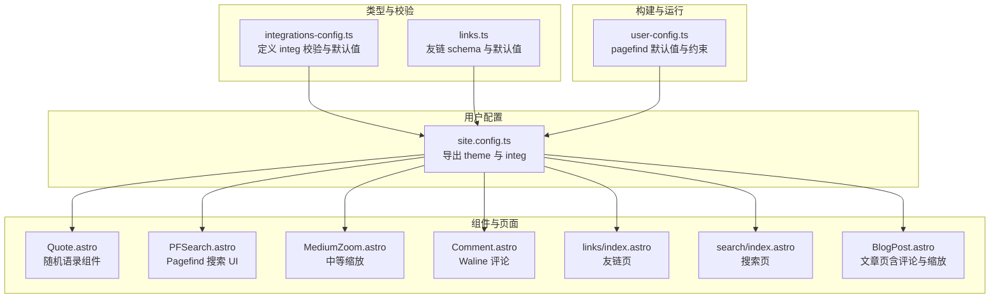
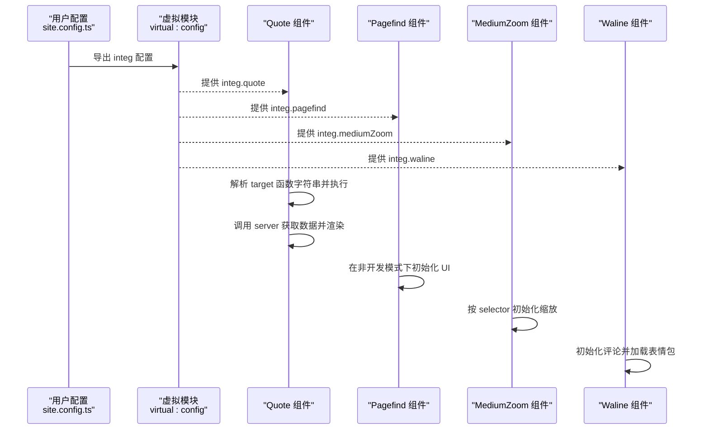
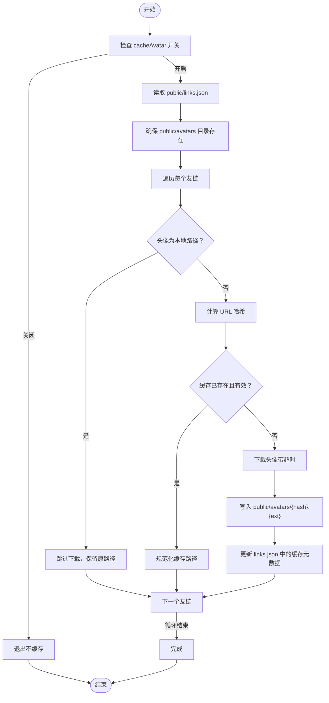
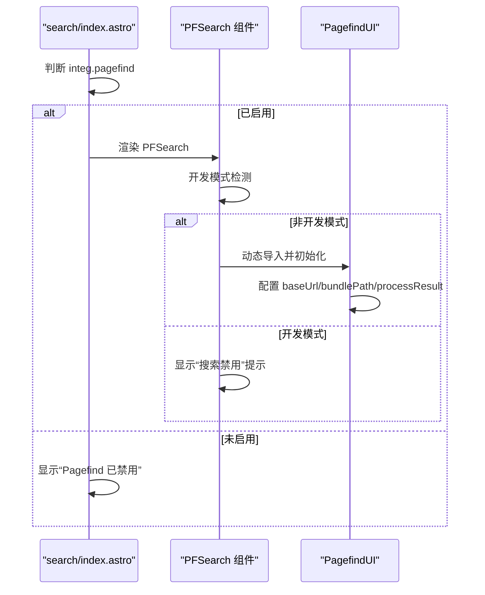
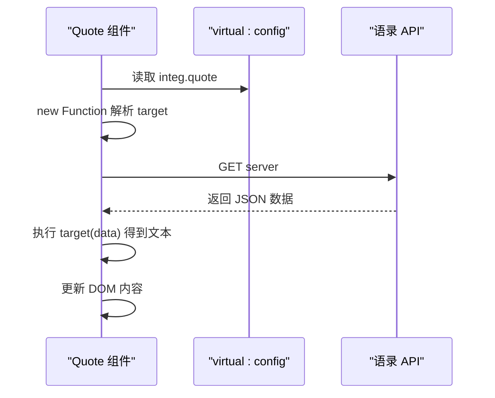
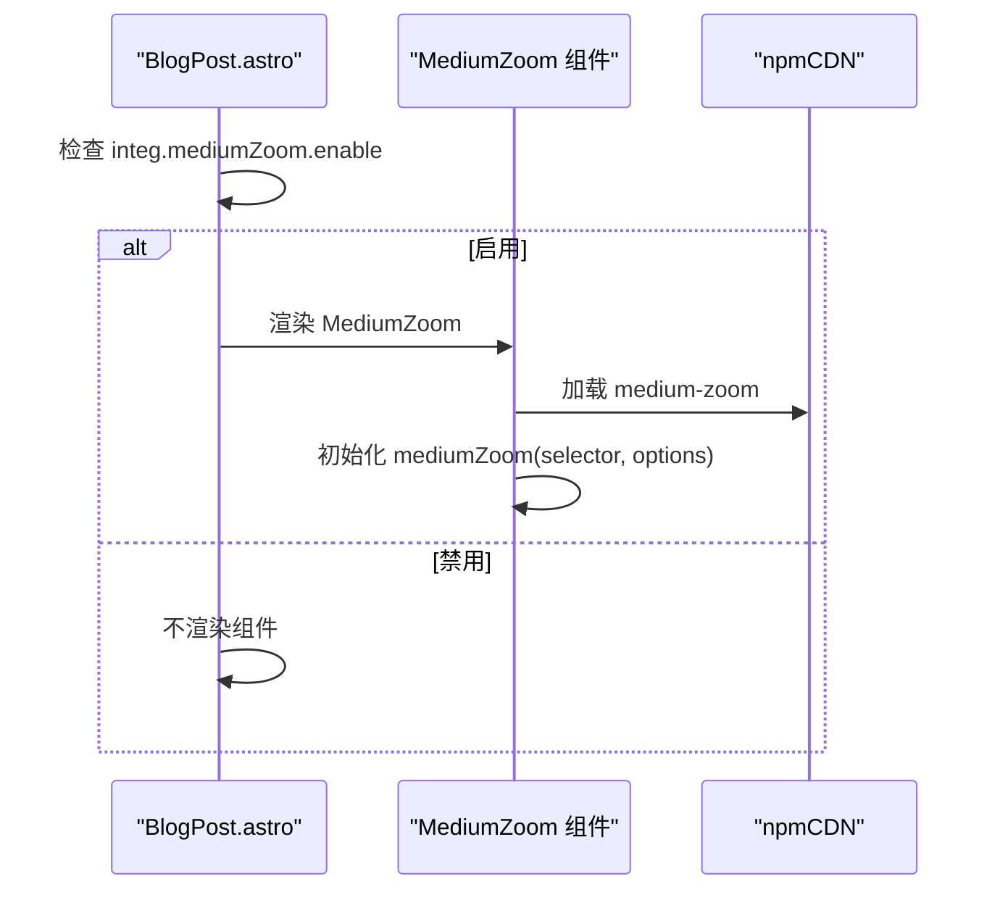
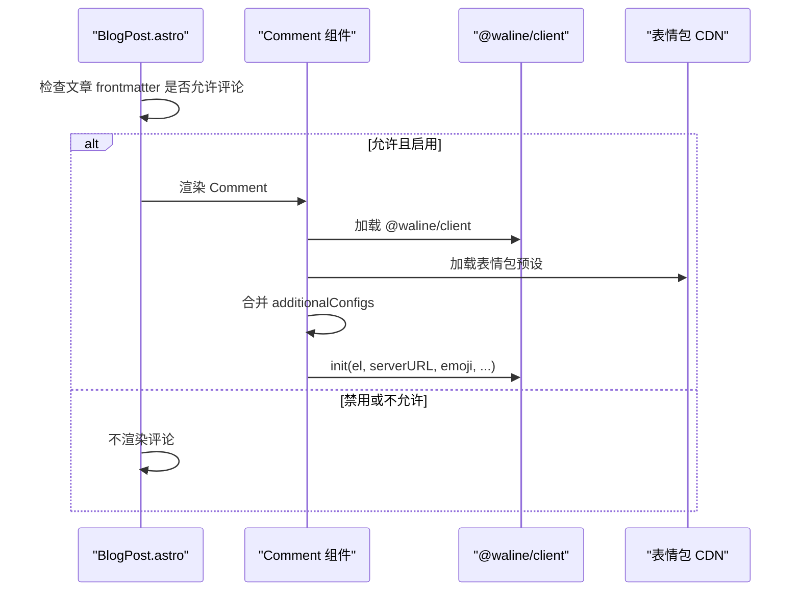
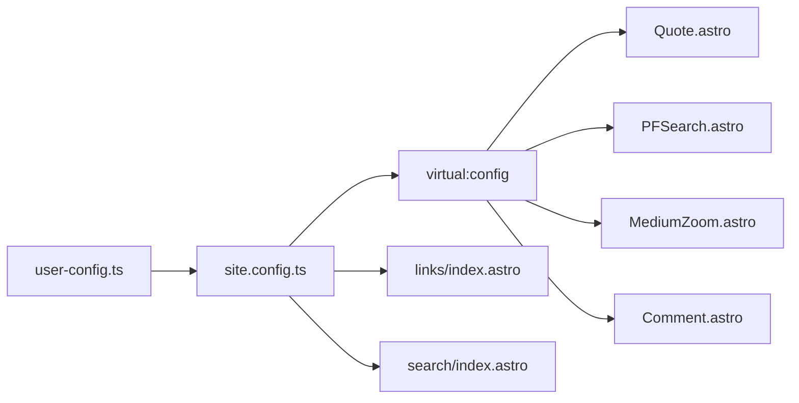

# 集成配置

<cite>
**本文档引用的文件**
- [packages/pure/types/integrations-config.ts](file://packages/pure/types/integrations-config.ts)
- [packages/pure/schemas/links.ts](file://packages/pure/schemas/links.ts)
- [src/site.config.ts](file://src/site.config.ts)
- [packages/pure/components/advanced/Quote.astro](file://packages/pure/components/advanced/Quote.astro)
- [packages/pure/components/pages/PFSearch.astro](file://packages/pure/components/pages/PFSearch.astro)
- [packages/pure/components/advanced/MediumZoom.astro](file://packages/pure/components/advanced/MediumZoom.astro)
- [src/components/waline/Comment.astro](file://src/components/waline/Comment.astro)
- [src/pages/links/index.astro](file://src/pages/links/index.astro)
- [src/pages/search/index.astro](file://src/pages/search/index.astro)
- [src/layouts/BlogPost.astro](file://src/layouts/BlogPost.astro)
- [preset/scripts/cacheAvatars.ts](file://preset/scripts/cacheAvatars.ts)
- [packages/pure/types/user-config.ts](file://packages/pure/types/user-config.ts)
- [packages/pure/types/theme-config.ts](file://packages/pure/types/theme-config.ts)
</cite>

## 目录
1. [简介](#简介)
2. [项目结构](#项目结构)
3. [核心组件](#核心组件)
4. [架构总览](#架构总览)
5. [详细组件分析](#详细组件分析)
6. [依赖关系分析](#依赖关系分析)
7. [性能考量](#性能考量)
8. [故障排查指南](#故障排查指南)
9. [结论](#结论)
10. [附录](#附录)

## 简介
本指南聚焦于 Astro 主题 Pure 的集成配置（integ 对象），围绕以下集成能力提供系统化说明与最佳实践：
- 友链系统（links）：友链日志簿、申请提示、头像缓存
- 搜索功能（pagefind）：启用与默认 UI 行为
- 随机语录（quote）：API 服务器选择与数据处理函数
- 排版（typography）：UnoCSS 排版样式类、引用块字体样式、行内代码块样式
- Lightbox（mediumZoom）：中等缩放库的启用与配置
- 评论系统（waline）：服务端地址、表情包、额外配置与本地化

## 项目结构
与集成配置直接相关的关键位置如下：
- 类型与校验：packages/pure/types/integrations-config.ts、packages/pure/schemas/links.ts
- 用户配置入口：src/site.config.ts（包含 theme 与 integ）
- 组件与页面使用：各组件与页面通过 virtual:config 注入配置
- 构建与运行时行为：packages/pure/types/user-config.ts（含 pagefind 默认值与约束）

**图表来源**
- [packages/pure/types/integrations-config.ts](file://packages/pure/types/integrations-config.ts#L1-L66)
- [packages/pure/schemas/links.ts](file://packages/pure/schemas/links.ts#L1-L31)
- [src/site.config.ts](file://src/site.config.ts#L101-L181)
- [packages/pure/components/advanced/Quote.astro](file://packages/pure/components/advanced/Quote.astro#L1-L41)
- [packages/pure/components/pages/PFSearch.astro](file://packages/pure/components/pages/PFSearch.astro#L1-L70)
- [packages/pure/components/advanced/MediumZoom.astro](file://packages/pure/components/advanced/MediumZoom.astro#L1-L48)
- [src/components/waline/Comment.astro](file://src/components/waline/Comment.astro#L1-L167)
- [src/pages/links/index.astro](file://src/pages/links/index.astro#L1-L66)
- [src/pages/search/index.astro](file://src/pages/search/index.astro#L1-L34)
- [src/layouts/BlogPost.astro](file://src/layouts/BlogPost.astro#L1-L75)
- [packages/pure/types/user-config.ts](file://packages/pure/types/user-config.ts#L1-L27)

**章节来源**
- [packages/pure/types/integrations-config.ts](file://packages/pure/types/integrations-config.ts#L1-L66)
- [packages/pure/schemas/links.ts](file://packages/pure/schemas/links.ts#L1-L31)
- [src/site.config.ts](file://src/site.config.ts#L101-L181)
- [packages/pure/types/user-config.ts](file://packages/pure/types/user-config.ts#L1-L27)

## 核心组件
本节概述 integ 中各集成项的职责与默认行为，并给出配置要点。

- 友链系统（links）
  - 支持 logbook（友链日志簿）、applyTip（申请提示字段集合）、cacheAvatar（是否缓存头像）
  - 默认值与结构由 schema 提供，支持自定义覆盖
- 搜索功能（pagefind）
  - 布尔开关；当 prerender 为真时默认启用；禁用时隐藏默认 UI
- 随机语录（quote）
  - server：语录 API 地址
  - target：函数字符串，用于从响应数据中提取目标文本
- 排版（typography）
  - class：UnoCSS 排版样式类，默认包含 prose 与暗色模式适配
  - blockquoteStyle：引用块字体样式（normal/italic）
  - inlineCodeBlockStyle：行内代码块样式（code/modern）
- Lightbox（mediumZoom）
  - enable：是否启用
  - selector：应用缩放效果的选择器
  - options：传递给 mediumZoom 的选项（如 className）
- 评论系统（waline）
  - enable：是否启用
  - server：服务端地址
  - showMeta：是否显示评论元信息
  - emoji：表情包预设数组
  - additionalConfigs：透传给 Waline 的额外配置（如 locale、pageview、comment 等）

**章节来源**
- [packages/pure/types/integrations-config.ts](file://packages/pure/types/integrations-config.ts#L5-L62)
- [packages/pure/schemas/links.ts](file://packages/pure/schemas/links.ts#L3-L31)
- [src/site.config.ts](file://src/site.config.ts#L101-L181)

## 架构总览
下图展示从用户配置到组件渲染的整体流程，以及关键依赖关系。

**图表来源**
- [src/site.config.ts](file://src/site.config.ts#L101-L181)
- [packages/pure/components/advanced/Quote.astro](file://packages/pure/components/advanced/Quote.astro#L19-L40)
- [packages/pure/components/pages/PFSearch.astro](file://packages/pure/components/pages/PFSearch.astro#L19-L53)
- [packages/pure/components/advanced/MediumZoom.astro](file://packages/pure/components/advanced/MediumZoom.astro#L14-L17)
- [src/components/waline/Comment.astro](file://src/components/waline/Comment.astro#L21-L56)

## 详细组件分析

### 友链系统（links）
- 结构与默认值
  - logbook：数组，每项包含日期与内容
  - applyTip：数组，每项包含名称与值，提供默认示例
  - cacheAvatar：布尔，控制是否启用头像缓存脚本
- 使用场景
  - 友链页展示分组、状态异常链接与历史记录
  - 页面中展示“申请链接”的站点信息，支持一键复制
- 头像缓存脚本
  - 读取 public/links.json，按 URL 生成哈希并下载图片至 public/avatars
  - 自动更新 links.json 中的缓存路径与哈希
  - 支持多种图片格式识别与超时控制
- 最佳实践
  - 启用 cacheAvatar 以提升首屏加载速度
  - 将头像 URL 规范化，避免重复下载
  - 定期运行缓存脚本以保持缓存新鲜度

**图表来源**
- [preset/scripts/cacheAvatars.ts](file://preset/scripts/cacheAvatars.ts#L165-L198)

**章节来源**
- [packages/pure/schemas/links.ts](file://packages/pure/schemas/links.ts#L3-L31)
- [src/pages/links/index.astro](file://src/pages/links/index.astro#L1-L66)
- [preset/scripts/cacheAvatars.ts](file://preset/scripts/cacheAvatars.ts#L1-L198)

### 搜索功能（pagefind）
- 启用方式
  - 在 integ.pagefind 设为 true 时，搜索页会渲染 Pagefind UI
  - 开发模式下 UI 会被禁用，提示搜索不可用
- 运行机制
  - 仅在非开发模式下初始化 Pagefind UI
  - 设置 baseUrl 与 bundlePath，处理结果 URL 格式化
- 最佳实践
  - 保持 prerender 为 true 以启用默认 pagefind
  - 如需禁用，显式设置 pagefind 为 false 并在页面中隐藏搜索入口

**图表来源**
- [src/pages/search/index.astro](file://src/pages/search/index.astro#L20-L31)
- [packages/pure/components/pages/PFSearch.astro](file://packages/pure/components/pages/PFSearch.astro#L19-L53)

**章节来源**
- [src/pages/search/index.astro](file://src/pages/search/index.astro#L1-L34)
- [packages/pure/components/pages/PFSearch.astro](file://packages/pure/components/pages/PFSearch.astro#L1-L70)
- [packages/pure/types/user-config.ts](file://packages/pure/types/user-config.ts#L15-L23)

### 随机语录（quote）
- 配置要点
  - server：语录 API 地址
  - target：函数字符串，接收响应数据并返回目标文本
- 组件行为
  - 通过 virtual:config 获取配置
  - 使用 new Function 动态解析 target，避免直接执行函数字符串带来的安全风险
  - 加载完成后替换占位文本
- API 示例
  - Hitokoto：按分类返回语句
  - Quoteable：随机返回一条引文
  - DummyJSON：返回随机语录并截断过长内容
- 最佳实践
  - 选择稳定可靠的公开 API
  - 在 target 中进行长度与格式控制，避免渲染异常
  - 为 fallback 文案准备错误兜底

**图表来源**
- [packages/pure/components/advanced/Quote.astro](file://packages/pure/components/advanced/Quote.astro#L19-L40)

**章节来源**
- [packages/pure/types/integrations-config.ts](file://packages/pure/types/integrations-config.ts#L20-L25)
- [packages/pure/components/advanced/Quote.astro](file://packages/pure/components/advanced/Quote.astro#L1-L41)
- [src/site.config.ts](file://src/site.config.ts#L127-L140)

### 排版（typography）
- 配置项
  - class：UnoCSS 排版样式类，默认包含 prose、暗色模式适配与标题字重
  - blockquoteStyle：引用块字体样式（normal/italic）
  - inlineCodeBlockStyle：行内代码块样式（code/modern）
- 使用建议
  - 根据设计风格调整 class，确保与主题色板一致
  - 引用块与行内代码块样式应与正文形成层次区分
- 注意事项
  - 若自定义样式类，需保证与 UnoCSS 的 typography 预设兼容

**章节来源**
- [packages/pure/types/integrations-config.ts](file://packages/pure/types/integrations-config.ts#L27-L37)
- [src/site.config.ts](file://src/site.config.ts#L141-L149)

### Lightbox（mediumZoom）
- 配置项
  - enable：是否启用缩放库
  - selector：应用缩放效果的选择器（默认针对 .prose 下可缩放元素）
  - options：传递给库的选项（如 className）
- 组件行为
  - 通过 npmCDN 加载 medium-zoom
  - 在组件挂载时按 selector 初始化缩放
  - 提供基础全局样式以控制遮罩与图片状态
- 最佳实践
  - 为需要缩放的图片添加可识别的 className 或使用默认选择器
  - 在文章布局中统一开启，避免对非图片元素误触发

**图表来源**
- [src/layouts/BlogPost.astro](file://src/layouts/BlogPost.astro#L74-L75)
- [packages/pure/components/advanced/MediumZoom.astro](file://packages/pure/components/advanced/MediumZoom.astro#L14-L17)

**章节来源**
- [packages/pure/types/integrations-config.ts](file://packages/pure/types/integrations-config.ts#L39-L47)
- [packages/pure/components/advanced/MediumZoom.astro](file://packages/pure/components/advanced/MediumZoom.astro#L1-L48)
- [src/layouts/BlogPost.astro](file://src/layouts/BlogPost.astro#L1-L75)

### 评论系统（waline）
- 配置项
  - enable：是否启用
  - server：服务端地址
  - showMeta：是否显示评论元信息
  - emoji：表情包预设数组
  - additionalConfigs：透传配置（如 locale、pageview、comment、imageUploader 等）
- 组件行为
  - 仅在启用时渲染容器与初始化逻辑
  - 动态加载表情包预设并合并 additionalConfigs
  - 通过 CDN 加载 @waline/client 并初始化
- 最佳实践
  - 为国际化需求在 additionalConfigs.locale 中提供本地化文案
  - 控制 pageview 与 comment 的显示以优化页面性能
  - 如需自定义反应按钮图标，可在额外配置中扩展

**图表来源**
- [src/layouts/BlogPost.astro](file://src/layouts/BlogPost.astro#L67-L69)
- [src/components/waline/Comment.astro](file://src/components/waline/Comment.astro#L21-L56)

**章节来源**
- [packages/pure/types/integrations-config.ts](file://packages/pure/types/integrations-config.ts#L49-L61)
- [src/components/waline/Comment.astro](file://src/components/waline/Comment.astro#L1-L167)
- [src/layouts/BlogPost.astro](file://src/layouts/BlogPost.astro#L1-L75)
- [src/site.config.ts](file://src/site.config.ts#L160-L180)

## 依赖关系分析
- 配置注入
  - 组件通过 virtual:config 获取 integ，避免硬编码
- 运行时约束
  - 当 prerender 为假时，pagefind 默认被禁用；若仍启用将触发校验错误
- 组件耦合
  - Quote、PFSearch、MediumZoom、Waline 分别独立消费 integ 的对应字段
  - 友链页与搜索页分别消费 links 与 pagefind 配置

**图表来源**
- [src/site.config.ts](file://src/site.config.ts#L101-L181)
- [packages/pure/types/user-config.ts](file://packages/pure/types/user-config.ts#L15-L23)
- [packages/pure/components/advanced/Quote.astro](file://packages/pure/components/advanced/Quote.astro#L19-L40)
- [packages/pure/components/pages/PFSearch.astro](file://packages/pure/components/pages/PFSearch.astro#L19-L53)
- [packages/pure/components/advanced/MediumZoom.astro](file://packages/pure/components/advanced/MediumZoom.astro#L14-L17)
- [src/components/waline/Comment.astro](file://src/components/waline/Comment.astro#L21-L56)
- [src/pages/links/index.astro](file://src/pages/links/index.astro#L1-L66)
- [src/pages/search/index.astro](file://src/pages/search/index.astro#L1-L34)

**章节来源**
- [packages/pure/types/user-config.ts](file://packages/pure/types/user-config.ts#L1-L27)
- [src/site.config.ts](file://src/site.config.ts#L101-L181)

## 性能考量
- pagefind
  - 仅在非开发模式下初始化，避免不必要的资源加载
  - 与 prerender 协同：prerender 为真时默认启用，减少 SSR/CSR 差异
- mediumZoom
  - 通过选择器精确匹配，避免对大量元素绑定事件
  - 仅在启用时加载库，降低初始包体
- waline
  - 表情包按需加载，避免一次性引入过多资源
  - 通过 additionalConfigs 控制功能开关，减少冗余渲染
- 友链头像缓存
  - 仅在启用时运行，避免 CI/CD 额外耗时
  - 缓存命中则跳过下载，降低带宽与时间成本

[本节为通用指导，无需特定文件引用]

## 故障排查指南
- pagefind 在开发模式下不可用
  - 现象：搜索页显示“开发模式下搜索禁用”
  - 处理：切换到生产构建或禁用 pagefind
  - 参考：[search/index.astro](file://src/pages/search/index.astro#L8-L15)
- pagefind 与 prerender 冲突
  - 现象：禁用 prerender 时启用 pagefind 将报错
  - 处理：保持 prerender 为真或显式禁用 pagefind
  - 参考：[user-config.ts](file://packages/pure/types/user-config.ts#L21-L23)
- waline 初始化失败
  - 现象：评论区空白或报错
  - 处理：确认 serverURL 正确、表情包预设可用、additionalConfigs 无冲突
  - 参考：[Comment.astro](file://src/components/waline/Comment.astro#L45-L51)
- mediumZoom 未生效
  - 现象：图片无法缩放
  - 处理：检查 selector 是否匹配目标图片、确保组件已渲染
  - 参考：[MediumZoom.astro](file://packages/pure/components/advanced/MediumZoom.astro#L10-L17)
- 友链头像缓存未更新
  - 现象：头像未下载或路径异常
  - 处理：确认 cacheAvatar 开启、links.json 格式正确、网络可达
  - 参考：[cacheAvatars.ts](file://preset/scripts/cacheAvatars.ts#L34-L41)

**章节来源**
- [src/pages/search/index.astro](file://src/pages/search/index.astro#L8-L15)
- [packages/pure/types/user-config.ts](file://packages/pure/types/user-config.ts#L21-L23)
- [src/components/waline/Comment.astro](file://src/components/waline/Comment.astro#L45-L51)
- [packages/pure/components/advanced/MediumZoom.astro](file://packages/pure/components/advanced/MediumZoom.astro#L10-L17)
- [preset/scripts/cacheAvatars.ts](file://preset/scripts/cacheAvatars.ts#L34-L41)

## 结论
通过上述集成配置，Pure 主题在友链、搜索、语录、排版、缩放与评论等方面提供了开箱即用的能力。建议结合站点特性合理选择与定制：
- 优先启用 pagefind 与 mediumZoom，以提升检索与阅读体验
- 为 waline 提供稳定的 server 与合适的本地化配置
- 使用友链头像缓存脚本优化加载性能
- 在 typography 中平衡可读性与设计一致性

[本节为总结性内容，无需特定文件引用]

## 附录
- 配置示例路径
  - 友链配置：[src/site.config.ts](file://src/site.config.ts#L104-L122)
  - 搜索配置：[src/site.config.ts](file://src/site.config.ts#L124-L124)
  - 随机语录配置：[src/site.config.ts](file://src/site.config.ts#L127-L140)
  - 排版配置：[src/site.config.ts](file://src/site.config.ts#L141-L149)
  - Lightbox 配置：[src/site.config.ts](file://src/site.config.ts#L153-L159)
  - 评论配置：[src/site.config.ts](file://src/site.config.ts#L161-L180)
- 关键类型与校验
  - 集成配置类型：[integrations-config.ts](file://packages/pure/types/integrations-config.ts#L5-L62)
  - 友链 schema：[links.ts](file://packages/pure/schemas/links.ts#L3-L31)
  - 用户配置合并与约束：[user-config.ts](file://packages/pure/types/user-config.ts#L6-L23)

**章节来源**
- [src/site.config.ts](file://src/site.config.ts#L101-L181)
- [packages/pure/types/integrations-config.ts](file://packages/pure/types/integrations-config.ts#L1-L66)
- [packages/pure/schemas/links.ts](file://packages/pure/schemas/links.ts#L1-L31)
- [packages/pure/types/user-config.ts](file://packages/pure/types/user-config.ts#L1-L27)