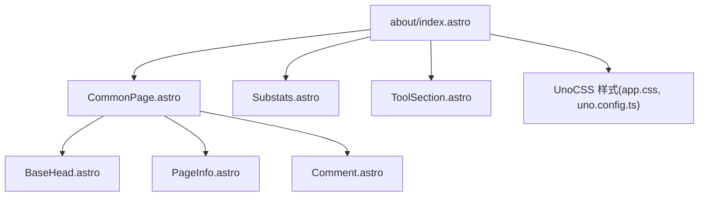
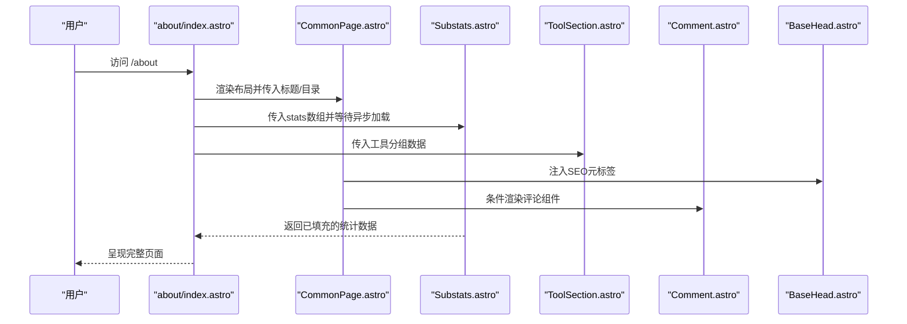
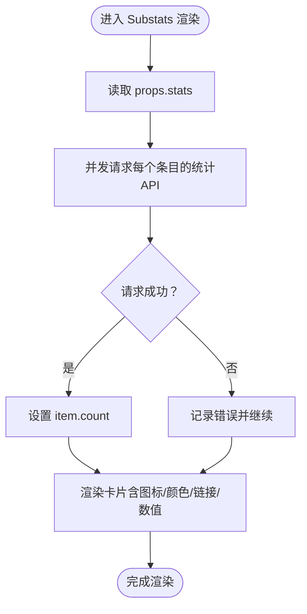
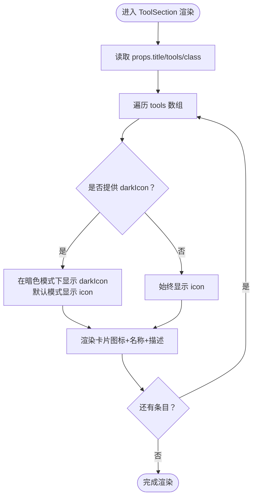
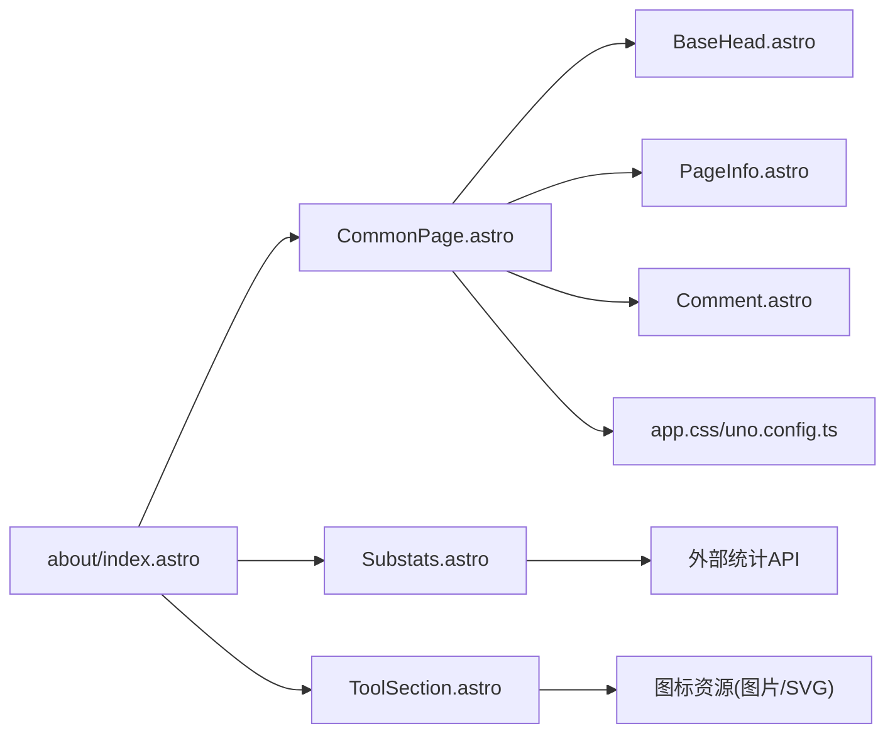

# 关于页面

<cite>
**本文引用的文件**
- [about/index.astro](file://src/pages/about/index.astro)
- [Substats.astro](file://src/components/about/Substats.astro)
- [ToolSection.astro](file://src/components/about/ToolSection.astro)
- [CommonPage.astro](file://src/layouts/CommonPage.astro)
- [PageInfo.astro](file://src/components/waline/PageInfo.astro)
- [Comment.astro](file://src/components/waline/Comment.astro)
- [BaseHead.astro](file://src/components/BaseHead.astro)
- [app.css](file://src/assets/styles/app.css)
- [uno.config.ts](file://uno.config.ts)
- [theme-config.ts](file://packages/pure/types/theme-config.ts)
- [integrations-config.ts](file://packages/pure/types/integrations-config.ts)
- [social.ts](file://packages/pure/schemas/social.ts)
- [constants.ts](file://packages/pure/types/constants.ts)
</cite>

## 目录
1. [简介](#简介)
2. [项目结构](#项目结构)
3. [核心组件](#核心组件)
4. [架构总览](#架构总览)
5. [组件详解](#组件详解)
6. [依赖关系分析](#依赖关系分析)
7. [性能考量](#性能考量)
8. [故障排查指南](#故障排查指南)
9. [结论](#结论)
10. [附录](#附录)

## 简介
本指南面向Astro主题Pure的“关于页面”，围绕about/index.astro的实现进行深入解析，涵盖以下目标：
- 个人信息展示、技能统计与工具使用情况的呈现方式
- Substats组件的统计数据展示（关注者数、文章数等）与数据来源
- ToolSection组件的工具展示（开发工具、设计软件、技术栈）与图标/暗色模式适配
- 页面数据来源与动态内容生成方法
- 个性化定制与样式调整建议
- SEO与用户体验优化建议

## 项目结构
关于页面位于src/pages/about/index.astro，采用布局组件CommonPage.astro承载标题、目录、评论与页脚信息；页面内嵌入Substats与ToolSection两个子组件，分别用于社交平台统计数据展示与工具列表展示。

图表来源
- [about/index.astro](file://src/pages/about/index.astro#L1-L251)
- [CommonPage.astro](file://src/layouts/CommonPage.astro#L1-L34)
- [Substats.astro](file://src/components/about/Substats.astro#L1-L74)
- [ToolSection.astro](file://src/components/about/ToolSection.astro#L1-L91)
- [BaseHead.astro](file://src/components/BaseHead.astro#L38-L77)
- [PageInfo.astro](file://src/components/waline/PageInfo.astro#L1-L31)
- [Comment.astro](file://src/components/waline/Comment.astro#L1-L167)
- [app.css](file://src/assets/styles/app.css#L1-L49)
- [uno.config.ts](file://uno.config.ts#L1-L193)

章节来源
- [about/index.astro](file://src/pages/about/index.astro#L1-L251)
- [CommonPage.astro](file://src/layouts/CommonPage.astro#L1-L34)

## 核心组件
- about/index.astro：页面主体，负责组织段落、标题、列表、组件与时间线等静态/半静态内容，并通过布局组件统一注入标题、目录与评论系统。
- Substats.astro：异步拉取外部统计数据并渲染为卡片列表，支持平台图标、颜色与链接跳转。
- ToolSection.astro：以网格形式展示工具条目，支持图片或SVG图标，以及暗色模式下的双套图标切换。
- CommonPage.astro：页面布局容器，提供标题、侧边目录、页脚信息与评论插槽。
- Waline评论与浏览量：PageInfo.astro与Comment.astro共同提供浏览量与评论计数，按站点集成配置启用。

章节来源
- [about/index.astro](file://src/pages/about/index.astro#L1-L251)
- [Substats.astro](file://src/components/about/Substats.astro#L1-L74)
- [ToolSection.astro](file://src/components/about/ToolSection.astro#L1-L91)
- [CommonPage.astro](file://src/layouts/CommonPage.astro#L1-L34)
- [PageInfo.astro](file://src/components/waline/PageInfo.astro#L1-L31)
- [Comment.astro](file://src/components/waline/Comment.astro#L1-L167)

## 架构总览
下图展示了关于页面从请求到渲染的关键流程，包括数据加载、组件渲染与评论系统初始化。

图表来源
- [about/index.astro](file://src/pages/about/index.astro#L16-L251)
- [CommonPage.astro](file://src/layouts/CommonPage.astro#L18-L34)
- [Substats.astro](file://src/components/about/Substats.astro#L21-L36)
- [ToolSection.astro](file://src/components/about/ToolSection.astro#L1-L91)
- [Comment.astro](file://src/components/waline/Comment.astro#L21-L56)
- [BaseHead.astro](file://src/components/BaseHead.astro#L38-L77)

## 组件详解

### Substats 组件：统计数据展示
Substats组件负责从外部统计服务拉取平台数据并渲染为可点击卡片，支持图标、颜色、平台名称、文本描述与数值显示。

- 数据来源与加载
  - 异步函数遍历stats数组，对每个条目调用外部API接口，解析JSON并设置count字段。
  - 使用Promise.all并发发起请求，提升加载效率。
  - 若请求失败，记录错误但不中断渲染。
- 渲染逻辑
  - 每个条目渲染为一个带平台图标的链接卡片，悬停时有边框与背景过渡效果。
  - 当存在count时显示数值与单位文本；否则显示占位符。
  - 底部标注“实时显示”与Substats来源链接。

图表来源
- [Substats.astro](file://src/components/about/Substats.astro#L21-L36)
- [Substats.astro](file://src/components/about/Substats.astro#L39-L74)

章节来源
- [Substats.astro](file://src/components/about/Substats.astro#L1-L74)

### ToolSection 组件：工具展示
ToolSection用于展示一组工具条目，支持图片或SVG图标，并在暗色模式下自动切换深色版本图标。

- 数据结构
  - 支持两种图标来源：ImageMetadata（图片）与raw SVG模块（字符串Promise）。
  - 可选darkIcon，若提供则在暗色模式下隐藏默认图标，显示darkIcon。
- 渲染逻辑
  - 使用两列网格布局，每项为可点击卡片，包含图标、名称与描述。
  - 图标区域使用圆角背景与填充，确保在浅/深色模式下均清晰可见。
  - 暗色模式下通过hidden/dark:hidden类控制图标显隐。

图表来源
- [ToolSection.astro](file://src/components/about/ToolSection.astro#L22-L24)
- [ToolSection.astro](file://src/components/about/ToolSection.astro#L32-L91)

章节来源
- [ToolSection.astro](file://src/components/about/ToolSection.astro#L1-L91)

### 页面布局与评论系统
- CommonPage.astro
  - 接收title、headings、view、comment等属性，注入标题与侧边目录。
  - 提供header、bottom、bottom-sidebar三个插槽，便于扩展。
- Waline评论与浏览量
  - PageInfo.astro：根据当前路径查询浏览量与评论数，支持仅显示浏览量或同时显示评论数。
  - Comment.astro：按站点配置初始化Waline评论系统，注入自定义样式变量，适配明/暗色主题。

章节来源
- [CommonPage.astro](file://src/layouts/CommonPage.astro#L1-L34)
- [PageInfo.astro](file://src/components/waline/PageInfo.astro#L1-L31)
- [Comment.astro](file://src/components/waline/Comment.astro#L1-L167)

### 关于页面数据来源与动态内容
- 外部API
  - Substats组件通过外部统计服务接口获取平台数据，如GitHub关注者、Telegram订阅者、Steam游戏数等。
- 内容数据
  - about/index.astro中直接声明了工具分组与社交统计数据，属于静态数据。
- 动态内容生成
  - 子组件内部通过异步函数与Promise.all实现并发数据加载，保证页面渲染时数据可用。
  - 评论系统在客户端初始化，按配置启用/禁用。

章节来源
- [about/index.astro](file://src/pages/about/index.astro#L43-L190)
- [Substats.astro](file://src/components/about/Substats.astro#L21-L36)
- [Comment.astro](file://src/components/waline/Comment.astro#L21-L56)

## 依赖关系分析
- 组件耦合
  - about/index.astro依赖CommonPage.astro作为布局容器，依赖Substats与ToolSection作为展示组件。
  - Substats与ToolSection均为纯展示组件，无跨组件循环依赖。
- 外部依赖
  - Substats依赖外部统计服务接口，需考虑网络延迟与失败处理。
  - ToolSection依赖图标资源（图片或SVG），需确保资源路径正确。
  - 评论系统依赖Waline客户端库与站点配置，需确保CDN与服务端URL正确。
- 主题与样式
  - app.css与uno.config.ts提供全局主题变量与排版样式，影响所有组件的视觉表现。

图表来源
- [about/index.astro](file://src/pages/about/index.astro#L1-L251)
- [CommonPage.astro](file://src/layouts/CommonPage.astro#L1-L34)
- [Substats.astro](file://src/components/about/Substats.astro#L21-L36)
- [ToolSection.astro](file://src/components/about/ToolSection.astro#L1-L91)
- [BaseHead.astro](file://src/components/BaseHead.astro#L38-L77)
- [PageInfo.astro](file://src/components/waline/PageInfo.astro#L1-L31)
- [Comment.astro](file://src/components/waline/Comment.astro#L1-L167)
- [app.css](file://src/assets/styles/app.css#L1-L49)
- [uno.config.ts](file://uno.config.ts#L1-L193)

## 性能考量
- 并发请求
  - Substats使用Promise.all并发请求多个平台数据，减少总等待时间，但需注意外部API限流与失败重试策略。
- 资源加载
  - ToolSection支持图片与SVG两种图标，建议优先使用SVG以减小体积；若使用图片，建议开启压缩与懒加载。
- 样式与主题
  - UnoCSS与主题变量统一管理样式，避免重复定义；合理使用原子类可降低CSS体积。
- 评论系统
  - 评论初始化在客户端执行，建议在首屏渲染完成后异步加载，避免阻塞关键路径。

[本节为通用性能建议，无需特定文件来源]

## 故障排查指南
- Substats无法显示数据
  - 检查外部统计服务接口是否可达，确认stats.api字段格式正确。
  - 查看浏览器控制台是否有网络错误或跨域问题。
- 工具图标不显示
  - 确认图标资源路径有效，图片资源需为ImageMetadata，SVG需为raw模块导入。
  - 检查暗色模式下是否提供了darkIcon，否则在深色模式可能不显示。
- 评论系统未加载
  - 确认站点配置中waline.enable为true且serverURL有效。
  - 检查CDN与客户端库加载是否成功，必要时切换npmCDN地址。
- SEO与分享
  - 确认BaseHead中title、description、og:type、og:image等元标签正确设置。
  - 如需自定义社交卡片，可在站点配置中设置socialCard路径。

章节来源
- [Substats.astro](file://src/components/about/Substats.astro#L21-L36)
- [ToolSection.astro](file://src/components/about/ToolSection.astro#L42-L80)
- [Comment.astro](file://src/components/waline/Comment.astro#L21-L56)
- [BaseHead.astro](file://src/components/BaseHead.astro#L38-L77)

## 结论
关于页面通过布局组件与子组件协作，实现了个人信息、工具展示与社交统计数据的有机整合。Substats与ToolSection分别承担动态数据与静态/半静态内容的展示职责，配合Waline评论系统与统一的主题样式，形成完整的用户体验闭环。通过合理的数据来源管理、样式与性能优化，可进一步提升页面的可维护性与访问体验。

[本节为总结性内容，无需特定文件来源]

## 附录

### 个性化定制与样式调整
- 主题变量与颜色
  - 在app.css中调整根变量可统一改变主色、前景色、背景色与边框色，影响所有组件。
- UnoCSS排版与样式
  - 通过uno.config.ts中的typography配置调整标题、段落、代码块与表格等排版细节。
- 社交链接与图标
  - social.ts与constants.ts定义了受支持的社交平台枚举，可在站点配置中添加对应链接。
- 页面元信息
  - BaseHead中提供title、description、og:type、og:image、twitter:card等SEO元标签，可根据需要扩展。

章节来源
- [app.css](file://src/assets/styles/app.css#L1-L49)
- [uno.config.ts](file://uno.config.ts#L14-L125)
- [social.ts](file://packages/pure/schemas/social.ts#L1-L44)
- [constants.ts](file://packages/pure/types/constants.ts#L1-L20)
- [BaseHead.astro](file://src/components/BaseHead.astro#L38-L77)