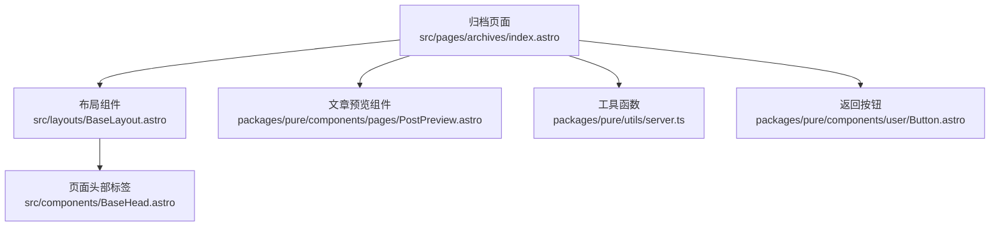
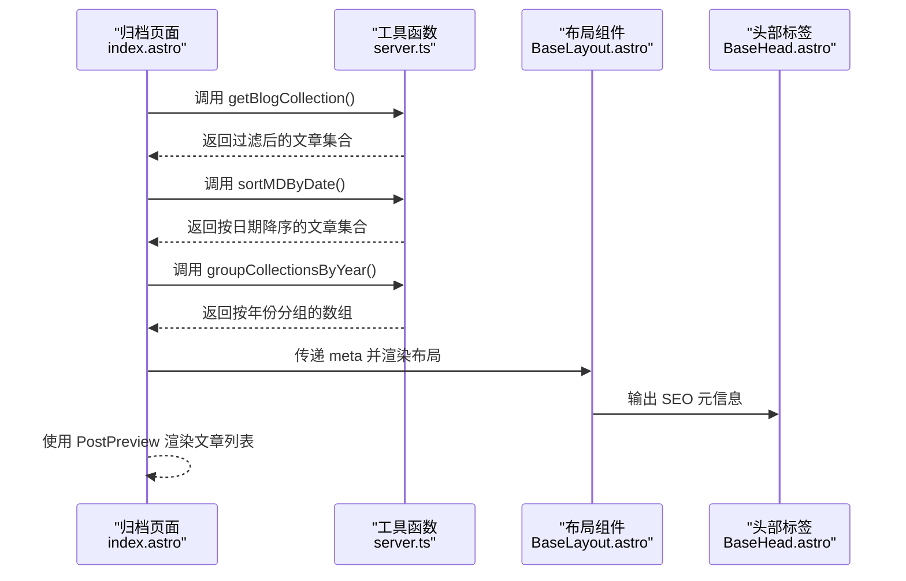
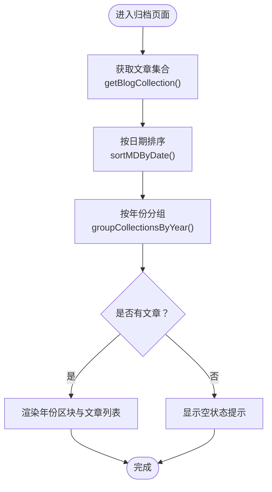
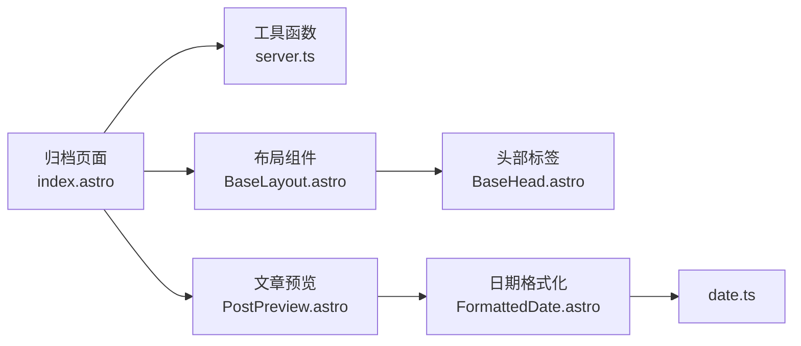

# 归档页面

<cite>
**本文引用的文件**
- [src/pages/archives/index.astro](file://src/pages/archives/index.astro)
- [packages/pure/utils/server.ts](file://packages/pure/utils/server.ts)
- [packages/pure/components/pages/PostPreview.astro](file://packages/pure/components/pages/PostPreview.astro)
- [packages/pure/components/user/Button.astro](file://packages/pure/components/user/Button.astro)
- [packages/pure/components/user/FormattedDate.astro](file://packages/pure/components/user/FormattedDate.astro)
- [packages/pure/utils/date.ts](file://packages/pure/utils/date.ts)
- [src/layouts/BaseLayout.astro](file://src/layouts/BaseLayout.astro)
- [src/components/BaseHead.astro](file://src/components/BaseHead.astro)
- [src/pages/blog/[...page].astro](file://src/pages/blog/[...page].astro)
- [packages/pure/components/pages/Paginator.astro](file://packages/pure/components/pages/Paginator.astro)
</cite>

## 目录
1. [简介](#简介)
2. [项目结构](#项目结构)
3. [核心组件](#核心组件)
4. [架构总览](#架构总览)
5. [组件详解](#组件详解)
6. [依赖关系分析](#依赖关系分析)
7. [性能与可扩展性](#性能与可扩展性)
8. [SEO与URL设计](#seo与url设计)
9. [交互与可用性](#交互与可用性)
10. [故障排查](#故障排查)
11. [结论](#结论)

## 简介
本指南围绕 Astro 主题 Pure 的归档页面实现进行系统化技术说明，重点覆盖以下方面：
- archives/index.astro 的数据处理流程：按时间排序、按年份分组、渲染年份区块与文章列表
- 归档页面的用户交互设计：返回按钮、年份标题视觉层次、文章预览卡片链接跳转
- SEO 优化策略与 URL 结构设计：页面元信息、OG/Twitter 标签、站点地图链接
- 定制化与样式调整：组件属性、CSS 变量、主题切换
- 大量文章时的性能优化与分页策略：服务端预渲染、分页组件、懒加载与资源优化

## 项目结构
归档页面位于 src/pages/archives/index.astro，采用服务端预渲染（prerender）以提升首屏性能与 SEO 表现。页面通过 Pure 主题提供的工具函数从内容集合中读取并处理文章数据，再由 PostPreview 组件渲染为可点击的文章列表项。

图表来源
- [src/pages/archives/index.astro](file://src/pages/archives/index.astro#L1-L53)
- [src/layouts/BaseLayout.astro](file://src/layouts/BaseLayout.astro#L1-L92)
- [packages/pure/components/pages/PostPreview.astro](file://packages/pure/components/pages/PostPreview.astro#L1-L153)
- [packages/pure/utils/server.ts](file://packages/pure/utils/server.ts#L1-L66)
- [packages/pure/components/user/Button.astro](file://packages/pure/components/user/Button.astro#L1-L91)
- [src/components/BaseHead.astro](file://src/components/BaseHead.astro#L38-L77)

章节来源
- [src/pages/archives/index.astro](file://src/pages/archives/index.astro#L1-L53)
- [src/layouts/BaseLayout.astro](file://src/layouts/BaseLayout.astro#L1-L92)

## 核心组件
- 归档页面主文件：负责数据获取、排序、分组与渲染
- 工具函数：提供内容集合读取、按年份分组、按日期排序等能力
- 文章预览组件：统一渲染文章标题、日期、标签与跳转链接
- 返回按钮组件：提供“返回”交互，支持预取加速
- 布局与头部：承载页面骨架与 SEO 元信息输出

章节来源
- [src/pages/archives/index.astro](file://src/pages/archives/index.astro#L1-L53)
- [packages/pure/utils/server.ts](file://packages/pure/utils/server.ts#L1-L66)
- [packages/pure/components/pages/PostPreview.astro](file://packages/pure/components/pages/PostPreview.astro#L1-L153)
- [packages/pure/components/user/Button.astro](file://packages/pure/components/user/Button.astro#L1-L91)
- [src/layouts/BaseLayout.astro](file://src/layouts/BaseLayout.astro#L1-L92)
- [src/components/BaseHead.astro](file://src/components/BaseHead.astro#L38-L77)

## 架构总览
归档页面采用“页面层 + 工具层 + 渲染层”的分层设计：
- 页面层：解析内容集合、排序与分组，生成年份区块
- 工具层：提供 getBlogCollection、sortMDByDate、groupCollectionsByYear 等纯函数
- 渲染层：使用 PostPreview 渲染每篇文章；Button 提供返回交互；BaseLayout 汇总头部与布局

图表来源
- [src/pages/archives/index.astro](file://src/pages/archives/index.astro#L9-L11)
- [packages/pure/utils/server.ts](file://packages/pure/utils/server.ts#L8-L46)
- [src/layouts/BaseLayout.astro](file://src/layouts/BaseLayout.astro#L17-L22)
- [src/components/BaseHead.astro](file://src/components/BaseHead.astro#L38-L77)

## 组件详解

### 归档页面主流程（archives/index.astro）
- 数据获取与处理
  - 通过 getBlogCollection 获取内容集合，并在生产环境自动过滤草稿
  - 使用 sortMDByDate 按更新/发布日期降序排列
  - 使用 groupCollectionsByYear 按年份分组并按年份倒序排列
- 渲染策略
  - 当无文章时显示提示文案
  - 对每个年份区块渲染一个大标题背景（年份数字），并统计该年文章数量
  - 在每个区块内使用 PostPreview 渲染文章列表项，支持预取跳转

图表来源
- [src/pages/archives/index.astro](file://src/pages/archives/index.astro#L9-L11)
- [packages/pure/utils/server.ts](file://packages/pure/utils/server.ts#L8-L46)

章节来源
- [src/pages/archives/index.astro](file://src/pages/archives/index.astro#L1-L53)
- [packages/pure/utils/server.ts](file://packages/pure/utils/server.ts#L1-L66)

### 文章预览组件（PostPreview.astro）
- 功能要点
  - 接收文章条目与渲染结果，计算发布时间（优先使用更新时间）
  - 支持详细模式与基础模式，基础模式下仅显示标题与日期
  - 通过 a 标签跳转到文章详情页，启用预取加速
  - 详细模式下展示摘要、阅读时长、语言与标签
- 交互与样式
  - 悬停高亮与图标过渡动画
  - 可选封面图与遮罩效果（详细模式）

章节来源
- [packages/pure/components/pages/PostPreview.astro](file://packages/pure/components/pages/PostPreview.astro#L1-L153)

### 返回按钮组件（Button.astro）
- 功能要点
  - 支持多种变体（back/ahead/button/pill）
  - back 变体提供向左箭头图标与悬停动画
  - 启用 data-astro-prefetch 实现链接预取
- 适用场景
  - 归档页面返回博客首页
  - 博客分页页面返回归档页面

章节来源
- [packages/pure/components/user/Button.astro](file://packages/pure/components/user/Button.astro#L1-L91)

### 日期格式化（FormattedDate.astro 与 date.ts）
- 功能要点
  - 通过 getFormattedDate 将日期格式化为本地化字符串
  - 支持传入自定义格式选项，覆盖默认配置
  - PostPreview 中用于展示文章发布/更新日期
- 作用范围
  - 归档页面与文章详情页均复用该格式化能力

章节来源
- [packages/pure/components/user/FormattedDate.astro](file://packages/pure/components/user/FormattedDate.astro#L1-L22)
- [packages/pure/utils/date.ts](file://packages/pure/utils/date.ts#L1-L18)

### 布局与头部（BaseLayout.astro 与 BaseHead.astro）
- BaseLayout
  - 引入全局样式与主题提供器
  - 作为页面骨架承载 Header、内容区与 Footer
  - 支持高亮色变量注入与安全区域适配
- BaseHead
  - 输出 canonical、title/description、Open Graph、Twitter 卡片等 SEO 元信息
  - 提供站点地图链接

章节来源
- [src/layouts/BaseLayout.astro](file://src/layouts/BaseLayout.astro#L1-L92)
- [src/components/BaseHead.astro](file://src/components/BaseHead.astro#L38-L77)

### 分页组件（Paginator.astro）
- 作用
  - 在需要分页的页面（如博客列表、标签列表）提供上一页/下一页导航
- 归档页面现状
  - 当前归档页面未启用分页组件，适合文章量不大的场景
  - 若未来文章量增长，可在对应页面引入并配置分页参数

章节来源
- [packages/pure/components/pages/Paginator.astro](file://packages/pure/components/pages/Paginator.astro#L1-L33)

## 依赖关系分析
- 归档页面依赖工具函数进行数据处理，避免在页面层编写重复逻辑
- PostPreview 依赖日期格式化与主题工具，确保一致的展示风格
- BaseLayout 与 BaseHead 提供统一的页面骨架与 SEO 输出

图表来源
- [src/pages/archives/index.astro](file://src/pages/archives/index.astro#L1-L53)
- [packages/pure/utils/server.ts](file://packages/pure/utils/server.ts#L1-L66)
- [packages/pure/components/pages/PostPreview.astro](file://packages/pure/components/pages/PostPreview.astro#L1-L153)
- [packages/pure/components/user/FormattedDate.astro](file://packages/pure/components/user/FormattedDate.astro#L1-L22)
- [packages/pure/utils/date.ts](file://packages/pure/utils/date.ts#L1-L18)
- [src/layouts/BaseLayout.astro](file://src/layouts/BaseLayout.astro#L1-L92)
- [src/components/BaseHead.astro](file://src/components/BaseHead.astro#L38-L77)

## 性能与可扩展性
- 服务端预渲染（prerender: true）
  - 归档页面启用预渲染，减少首屏等待与 SSR 压力
  - 适合静态归档结构，无需动态交互
- 数据处理复杂度
  - 排序：O(n log n)，分组：O(n)，整体 O(n log n)
  - 对于大量文章，建议结合分页或懒加载策略
- 分页策略
  - 在博客列表与标签页面已引入分页组件，归档页面可参考其模式扩展
  - 可通过路由参数控制页码，按需加载与渲染
- 资源优化
  - PostPreview 启用 data-astro-prefetch，提升跳转体验
  - 布局与头部仅在必要时引入额外资源，保持轻量化

章节来源
- [src/pages/archives/index.astro](file://src/pages/archives/index.astro#L7-L11)
- [packages/pure/components/pages/Paginator.astro](file://packages/pure/components/pages/Paginator.astro#L1-L33)
- [src/pages/blog/[...page].astro](file://src/pages/blog/[...page].astro#L52-L80)

## SEO与URL设计
- 页面元信息
  - 归档页面设置标题与描述，便于搜索引擎识别
  - BaseHead 输出 canonical、Open Graph、Twitter 卡片与站点地图链接
- URL 结构
  - 归档页面路径为 /archives，简洁明确
  - 文章详情页路径为 /blog/{id}，与 PostPreview 的链接一致
  - 标签页路径为 /tags/{tag}，便于按标签检索
- 内容可见性
  - 生产环境自动过滤草稿，避免收录未发布内容
  - 日期字段优先使用更新时间，确保最新状态被索引

章节来源
- [src/pages/archives/index.astro](file://src/pages/archives/index.astro#L13-L16)
- [packages/pure/utils/server.ts](file://packages/pure/utils/server.ts#L8-L13)
- [src/components/BaseHead.astro](file://src/components/BaseHead.astro#L38-L77)
- [packages/pure/components/pages/PostPreview.astro](file://packages/pure/components/pages/PostPreview.astro#L34-L35)

## 交互与可用性
- 返回导航
  - 归档页面提供 back 变体按钮，返回博客首页
  - 博客分页页面提供“查看全部按年归档”链接，引导至归档页面
- 文章列表交互
  - 每个 PostPreview 为可点击卡片，支持预取跳转
  - 详细模式下展示摘要、阅读时长与标签，增强信息密度
- 无障碍
  - 列表容器与标题具备 aria-label 与语义化结构
  - 时间与日期使用 time 元素，便于屏幕阅读器识别

章节来源
- [packages/pure/components/user/Button.astro](file://packages/pure/components/user/Button.astro#L31-L55)
- [src/pages/blog/[...page].astro](file://src/pages/blog/[...page].astro#L69-L71)
- [packages/pure/components/pages/PostPreview.astro](file://packages/pure/components/pages/PostPreview.astro#L21-L122)

## 故障排查
- 无文章显示
  - 检查内容集合是否为空或全部为草稿（生产环境会过滤草稿）
  - 确认 Frontmatter 中的日期字段存在且可解析
- 排序异常
  - 确保 updatedDate 或 publishDate 至少有一个有效值
  - 如需按创建时间排序，可在工具函数中调整比较逻辑
- 预览链接无效
  - 确认 basePath 与实际路由一致（默认 /blog）
  - 检查文章 id 是否符合路由规则
- SEO 元信息缺失
  - 确认 BaseHead 正常输出 title、description、canonical 等标签
  - 检查站点配置与语言选项

章节来源
- [packages/pure/utils/server.ts](file://packages/pure/utils/server.ts#L8-L13)
- [packages/pure/utils/server.ts](file://packages/pure/utils/server.ts#L40-L46)
- [packages/pure/components/pages/PostPreview.astro](file://packages/pure/components/pages/PostPreview.astro#L34-L35)
- [src/components/BaseHead.astro](file://src/components/BaseHead.astro#L38-L77)

## 结论
归档页面通过清晰的分层设计与工具函数封装，实现了高效、可维护的按年份展示与文章列表渲染。配合预渲染、预取与 SEO 元信息，归档页面在性能与可发现性方面表现良好。对于大规模内容，建议结合分页与懒加载策略进一步优化用户体验与资源占用。