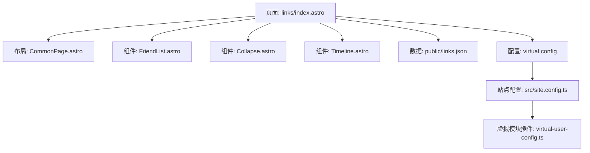
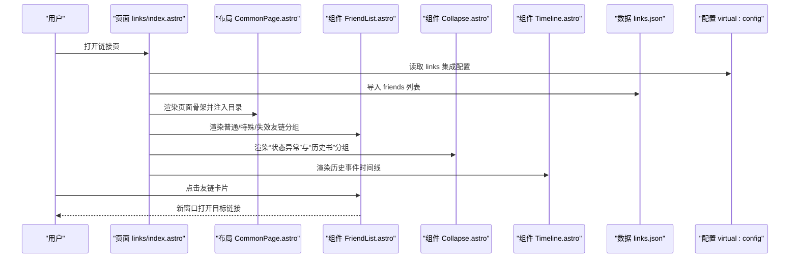
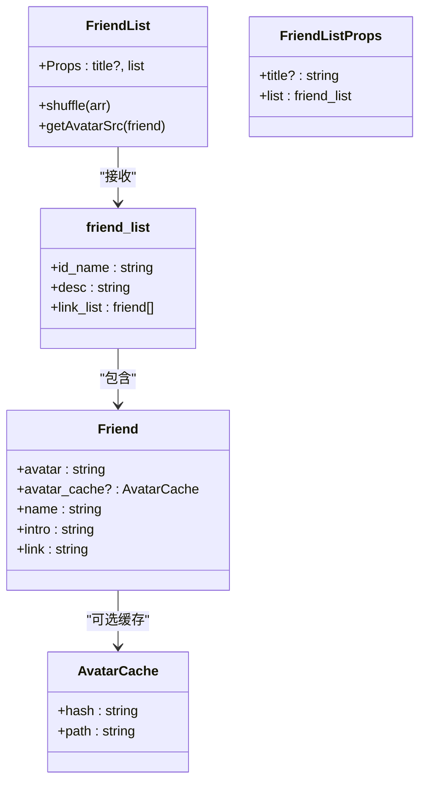
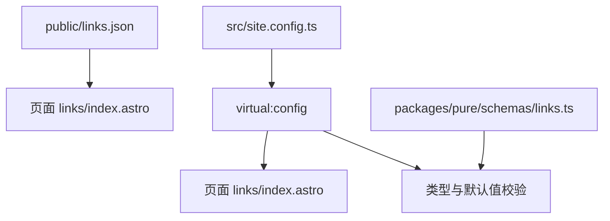
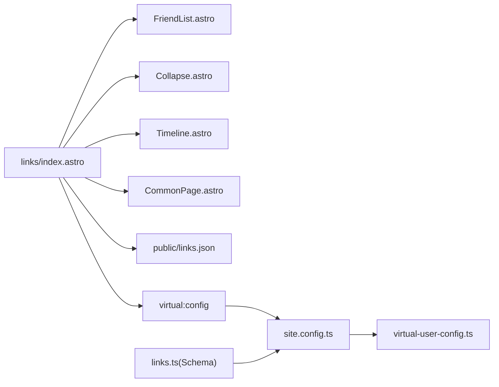

# 链接页面

<cite>
**本文引用的文件**
- [src/pages/links/index.astro](file://src/pages/links/index.astro)
- [src/components/links/FriendList.astro](file://src/components/links/FriendList.astro)
- [public/links.json](file://public/links.json)
- [packages/pure/schemas/links.ts](file://packages/pure/schemas/links.ts)
- [src/site.config.ts](file://src/site.config.ts)
- [packages/pure/plugins/virtual-user-config.ts](file://packages/pure/plugins/virtual-user-config.ts)
- [src/layouts/CommonPage.astro](file://src/layouts/CommonPage.astro)
- [packages/pure/components/user/Collapse.astro](file://packages/pure/components/user/Collapse.astro)
- [packages/pure/components/user/Timeline.astro](file://packages/pure/components/user/Timeline.astro)
- [packages/pure/plugins/rehype-external-links.ts](file://packages/pure/plugins/rehype-external-links.ts)
- [src/assets/styles/app.css](file://src/assets/styles/app.css)
</cite>

## 目录
1. [简介](#简介)
2. [项目结构](#项目结构)
3. [核心组件](#核心组件)
4. [架构总览](#架构总览)
5. [详细组件分析](#详细组件分析)
6. [依赖分析](#依赖分析)
7. [性能考量](#性能考量)
8. [故障排查指南](#故障排查指南)
9. [结论](#结论)
10. [附录](#附录)

## 简介
本技术指南围绕 Astro 主题 Pure 的链接页面进行深入解析，重点覆盖以下方面：
- links/index.astro 的实现与页面组织
- 友链展示组件 FriendList 的渲染逻辑、交互与样式
- 友链数据结构与配置项的来源与更新方式
- 用户交互设计：点击跳转、悬停效果、响应式布局
- 友链交换标准与最佳实践
- SEO 优化策略与反向链接管理建议
- 安全注意事项：外链安全与恶意链接防护

## 项目结构
链接页面位于 src/pages/links/index.astro，采用模块化组件组合的方式：
- 页面引入公共布局组件与自定义组件
- 从 public/links.json 加载友链数据
- 从虚拟配置模块 virtual:config 读取集成配置（如友链申请提示、历史记录）
- 使用 Collapse 与 Timeline 组件增强可折叠与时间线展示

图表来源
- [src/pages/links/index.astro](file://src/pages/links/index.astro#L1-L66)
- [src/layouts/CommonPage.astro](file://src/layouts/CommonPage.astro#L1-L34)
- [src/components/links/FriendList.astro](file://src/components/links/FriendList.astro#L1-L119)
- [packages/pure/components/user/Collapse.astro](file://packages/pure/components/user/Collapse.astro#L1-L83)
- [packages/pure/components/user/Timeline.astro](file://packages/pure/components/user/Timeline.astro#L1-L39)
- [public/links.json](file://public/links.json#L1-L40)
- [src/site.config.ts](file://src/site.config.ts#L101-L122)
- [packages/pure/plugins/virtual-user-config.ts](file://packages/pure/plugins/virtual-user-config.ts#L62-L62)

章节来源
- [src/pages/links/index.astro](file://src/pages/links/index.astro#L1-L66)
- [src/layouts/CommonPage.astro](file://src/layouts/CommonPage.astro#L1-L34)

## 核心组件
- 页面容器与导航：links/index.astro 负责组织标题、段落、分组区域与申请说明，并注入目录标题用于右侧目录生成。
- 友链展示组件：FriendList.astro 负责渲染友链卡片，支持随机打散、头像缓存策略、悬停遮罩与背景图层。
- 可折叠容器：Collapse.astro 提供展开/收起交互，配合图标动画与过渡效果。
- 时间线组件：Timeline.astro 渲染历史事件列表，带圆点与连接线。
- 数据与配置：public/links.json 提供友链数据；virtual:config 提供站点集成配置（含友链申请提示、历史记录、头像缓存开关）。

章节来源
- [src/pages/links/index.astro](file://src/pages/links/index.astro#L1-L66)
- [src/components/links/FriendList.astro](file://src/components/links/FriendList.astro#L1-L119)
- [packages/pure/components/user/Collapse.astro](file://packages/pure/components/user/Collapse.astro#L1-L83)
- [packages/pure/components/user/Timeline.astro](file://packages/pure/components/user/Timeline.astro#L1-L39)
- [public/links.json](file://public/links.json#L1-L40)
- [src/site.config.ts](file://src/site.config.ts#L101-L122)
- [packages/pure/plugins/virtual-user-config.ts](file://packages/pure/plugins/virtual-user-config.ts#L62-L62)

## 架构总览
链接页面的数据流与组件交互如下：

图表来源
- [src/pages/links/index.astro](file://src/pages/links/index.astro#L1-L66)
- [src/layouts/CommonPage.astro](file://src/layouts/CommonPage.astro#L1-L34)
- [src/components/links/FriendList.astro](file://src/components/links/FriendList.astro#L1-L119)
- [packages/pure/components/user/Collapse.astro](file://packages/pure/components/user/Collapse.astro#L1-L83)
- [packages/pure/components/user/Timeline.astro](file://packages/pure/components/user/Timeline.astro#L1-L39)
- [public/links.json](file://public/links.json#L1-L40)
- [src/site.config.ts](file://src/site.config.ts#L101-L122)

## 详细组件分析

### 页面容器：links/index.astro
- 功能要点
  - 从 public/links.json 导入 friends 数据
  - 从 virtual:config 读取 links 集成配置（logbook、applyTip、cacheAvatar）
  - 使用 CommonPage.astro 作为页面骨架，注入目录标题 headings，启用评论区
  - 分三段展示：普通友链、状态异常（折叠）、历史书（时间线）、特殊链接
  - 提供“申请友链”的说明与编辑入口链接
- 关键交互
  - 申请信息复制：通过内联脚本调用剪贴板 API 并触发 toast 提示
  - 外链打开：使用新窗口打开，遵循外链安全策略

章节来源
- [src/pages/links/index.astro](file://src/pages/links/index.astro#L1-L66)

### 友链展示组件：FriendList.astro
- 数据模型
  - 单个友链项包含：头像、名称、简介、链接
  - 分组项包含：分组 id、描述、友链数组
- 渲染逻辑
  - 支持可选标题渲染
  - 对友链数组进行随机打散，避免固定顺序
  - 使用 astro:assets 的 Image 组件加载头像，支持头像缓存策略
  - 卡片布局采用响应式网格：sm:两列、lg:三列
- 交互与视觉
  - 外层 a 标签设置 target="_blank" 实现新窗口打开
  - 悬停时显示半透明遮罩与箭头图标，提供视觉反馈
  - 卡片背景使用头像作为弱化背景图层，提升层次感
- 头像缓存策略
  - 当配置开启时优先使用缓存路径，否则回退到原始头像地址
  - 缓存路径由外部预处理生成，减少跨域与慢速头像源的影响

图表来源
- [src/components/links/FriendList.astro](file://src/components/links/FriendList.astro#L6-L41)

章节来源
- [src/components/links/FriendList.astro](file://src/components/links/FriendList.astro#L1-L119)

### 友链数据与配置
- 友链数据来源
  - public/links.json 提供 friends 数组，每个元素是一个分组对象，包含 id_name、desc、link_list
- 配置来源
  - virtual:config 来自虚拟模块，由 virtual-user-config.ts 注入
  - src/site.config.ts 中 integ.links 提供 logbook、applyTip、cacheAvatar 等配置
- 配置模式校验
  - packages/pure/schemas/links.ts 定义了友链配置的 Schema，默认值与描述，确保配置结构正确

图表来源
- [public/links.json](file://public/links.json#L1-L40)
- [src/site.config.ts](file://src/site.config.ts#L101-L122)
- [packages/pure/schemas/links.ts](file://packages/pure/schemas/links.ts#L1-L31)
- [packages/pure/plugins/virtual-user-config.ts](file://packages/pure/plugins/virtual-user-config.ts#L62-L62)

章节来源
- [public/links.json](file://public/links.json#L1-L40)
- [src/site.config.ts](file://src/site.config.ts#L101-L122)
- [packages/pure/schemas/links.ts](file://packages/pure/schemas/links.ts#L1-L31)
- [packages/pure/plugins/virtual-user-config.ts](file://packages/pure/plugins/virtual-user-config.ts#L62-L62)

### 布局与交互组件
- CommonPage.astro
  - 提供页面骨架、标题、目录、评论区与底部插槽
- Collapse.astro
  - 自定义元素，提供展开/收起切换、图标动画与过渡
- Timeline.astro
  - 渲染时间线事件，支持圆点与竖线连接

章节来源
- [src/layouts/CommonPage.astro](file://src/layouts/CommonPage.astro#L1-L34)
- [packages/pure/components/user/Collapse.astro](file://packages/pure/components/user/Collapse.astro#L1-L83)
- [packages/pure/components/user/Timeline.astro](file://packages/pure/components/user/Timeline.astro#L1-L39)

### 用户交互设计
- 友链点击跳转
  - 使用 target="_blank" 在新窗口打开，避免破坏当前页面上下文
- 悬停效果
  - 卡片悬停时遮罩与箭头图标出现，提供明确的交互提示
- 响应式布局
  - sm:两列、lg:三列的网格布局，适配不同屏幕尺寸
- 申请信息复制
  - 通过内联脚本写入剪贴板并触发 toast 提示，提升用户体验

章节来源
- [src/components/links/FriendList.astro](file://src/components/links/FriendList.astro#L48-L87)
- [src/pages/links/index.astro](file://src/pages/links/index.astro#L35-L49)

### SEO 优化策略与反向链接管理
- 页面元信息
  - 使用 CommonPage.astro 注入标题与目录，便于搜索引擎理解页面结构
- 友链链接属性
  - 采用 rel="nofollow noopener noreferrer" 规避权重流失与安全风险
- 内容组织
  - 将“申请说明”与“历史书”等信息结构化，提升可读性与可索引性
- 反向链接管理
  - 建议在自身站点的“关于”或“链接”页提供反向链接指引，保持一致性与可追踪性

章节来源
- [packages/pure/plugins/rehype-external-links.ts](file://packages/pure/plugins/rehype-external-links.ts#L37-L74)
- [src/layouts/CommonPage.astro](file://src/layouts/CommonPage.astro#L1-L34)

### 安全考虑：外链安全与恶意链接防护
- 外链安全
  - 默认对外部链接添加 rel="nofollow noopener noreferrer"，防止 opener 攻击与权重泄露
- 恶意链接防护
  - 对于状态异常的友链，使用折叠容器隐藏潜在风险链接
  - 历史书时间线可用于记录与审计变更，便于后续审查
- 头像与缓存
  - 启用头像缓存可降低跨域与慢速源带来的安全与性能风险

章节来源
- [packages/pure/plugins/rehype-external-links.ts](file://packages/pure/plugins/rehype-external-links.ts#L37-L74)
- [src/components/links/FriendList.astro](file://src/components/links/FriendList.astro#L37-L40)
- [src/pages/links/index.astro](file://src/pages/links/index.astro#L24-L29)

## 依赖分析
- 页面对组件与数据的依赖
  - links/index.astro 依赖 FriendList、Collapse、Timeline、CommonPage
  - 依赖 public/links.json 与 virtual:config
- 配置注入机制
  - virtual-user-config.ts 将用户配置转换为虚拟模块，供页面与组件按需导入
- 类型与默认值约束
  - links 配置的 Schema 保证字段存在与类型正确，提供默认值

图表来源
- [src/pages/links/index.astro](file://src/pages/links/index.astro#L1-L66)
- [src/components/links/FriendList.astro](file://src/components/links/FriendList.astro#L1-L119)
- [packages/pure/components/user/Collapse.astro](file://packages/pure/components/user/Collapse.astro#L1-L83)
- [packages/pure/components/user/Timeline.astro](file://packages/pure/components/user/Timeline.astro#L1-L39)
- [src/layouts/CommonPage.astro](file://src/layouts/CommonPage.astro#L1-L34)
- [public/links.json](file://public/links.json#L1-L40)
- [src/site.config.ts](file://src/site.config.ts#L101-L122)
- [packages/pure/plugins/virtual-user-config.ts](file://packages/pure/plugins/virtual-user-config.ts#L62-L62)
- [packages/pure/schemas/links.ts](file://packages/pure/schemas/links.ts#L1-L31)

章节来源
- [src/pages/links/index.astro](file://src/pages/links/index.astro#L1-L66)
- [src/site.config.ts](file://src/site.config.ts#L101-L122)
- [packages/pure/plugins/virtual-user-config.ts](file://packages/pure/plugins/virtual-user-config.ts#L62-L62)
- [packages/pure/schemas/links.ts](file://packages/pure/schemas/links.ts#L1-L31)

## 性能考量
- 图片懒加载
  - 使用 astro:assets 的 Image 组件并设置 loading="lazy"，减少首屏阻塞
- 头像缓存
  - 启用 cacheAvatar 可显著降低跨域与慢速头像源的加载时间
- 随机打散
  - 对友链数组进行随机排序，避免固定顺序导致的热点集中
- 响应式网格
  - 通过 CSS 媒体查询实现多列布局，减少 DOM 重排与重绘

章节来源
- [src/components/links/FriendList.astro](file://src/components/links/FriendList.astro#L53-L60)
- [src/components/links/FriendList.astro](file://src/components/links/FriendList.astro#L96-L103)
- [src/components/links/FriendList.astro](file://src/components/links/FriendList.astro#L25-L29)
- [src/assets/styles/app.css](file://src/assets/styles/app.css#L43-L48)

## 故障排查指南
- 友链未显示
  - 检查 public/links.json 的 friends 结构是否正确
  - 确认分组 link_list 是否为空或格式错误
- 头像加载失败
  - 若启用缓存，确认缓存路径有效；否则回退到原始头像地址
  - 检查跨域与 HTTPS 问题
- 外链无法打开或安全警告
  - 确认 rel 属性已正确添加
  - 检查 target="_blank" 设置
- 折叠与时间线不生效
  - 确认 Collapse 组件的自定义元素注册与样式加载正常
  - 检查传入的 events 与标题是否正确

章节来源
- [public/links.json](file://public/links.json#L1-L40)
- [src/components/links/FriendList.astro](file://src/components/links/FriendList.astro#L37-L40)
- [packages/pure/plugins/rehype-external-links.ts](file://packages/pure/plugins/rehype-external-links.ts#L37-L74)
- [packages/pure/components/user/Collapse.astro](file://packages/pure/components/user/Collapse.astro#L58-L83)

## 结论
链接页面通过清晰的数据结构、模块化的组件与合理的安全策略，实现了美观、易用且可维护的友链展示方案。结合 SEO 优化与反向链接管理建议，可进一步提升页面的可发现性与生态价值。建议在实际部署中启用头像缓存、严格审核状态异常链接，并持续维护历史书记录，以保障用户体验与安全性。

## 附录
- 友链交换标准与最佳实践
  - 互推要求：双方均已在自身站点展示对方链接
  - 站点健康：具备正式域名、内容活跃、符合法律法规
  - 内容质量：至少拥有一定数量的原创文章且近期有更新
  - 审核流程：通过评论或 PR 提交申请，管理员复核后加入
- 头像缓存启用建议
  - 在 src/site.config.ts 中将 integ.links.cacheAvatar 设为 true
  - 预先生成 public/avatars/ 下的缓存文件，缩短加载时间
- 外链安全与合规
  - 始终为外部链接添加 rel="nofollow noopener noreferrer"
  - 对可疑或违规链接使用折叠容器隐藏，必要时移除

章节来源
- [src/site.config.ts](file://src/site.config.ts#L120-L122)
- [src/pages/links/index.astro](file://src/pages/links/index.astro#L51-L64)
- [packages/pure/plugins/rehype-external-links.ts](file://packages/pure/plugins/rehype-external-links.ts#L37-L74)