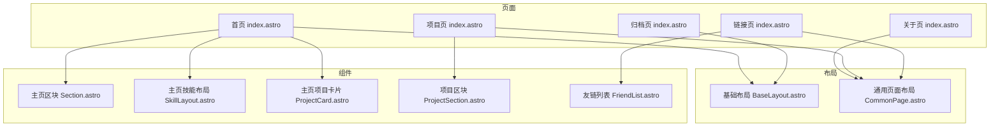
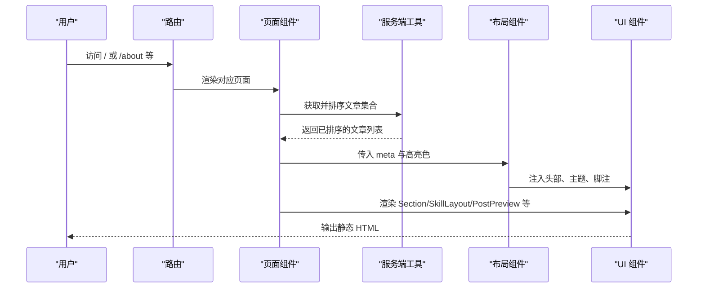
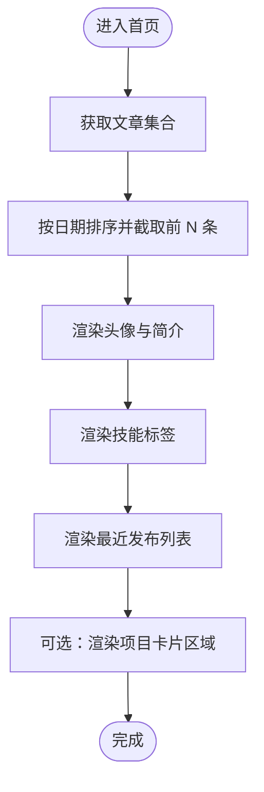
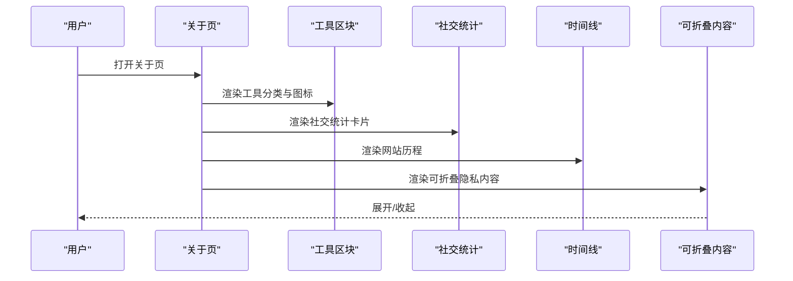
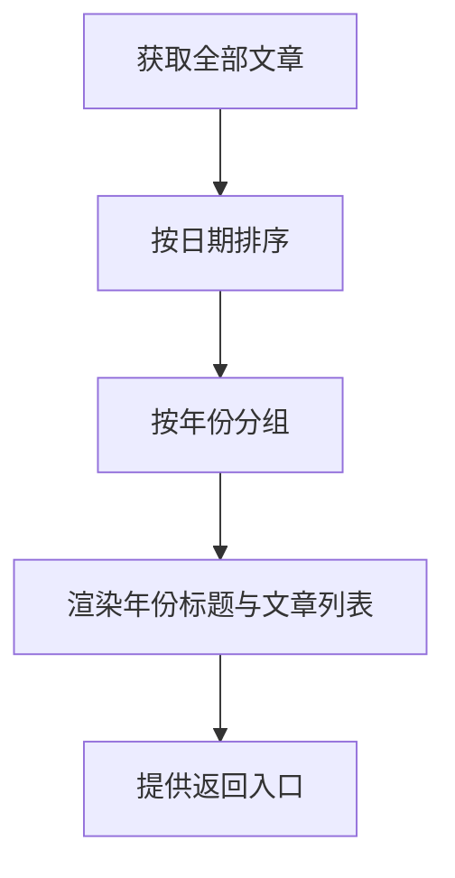
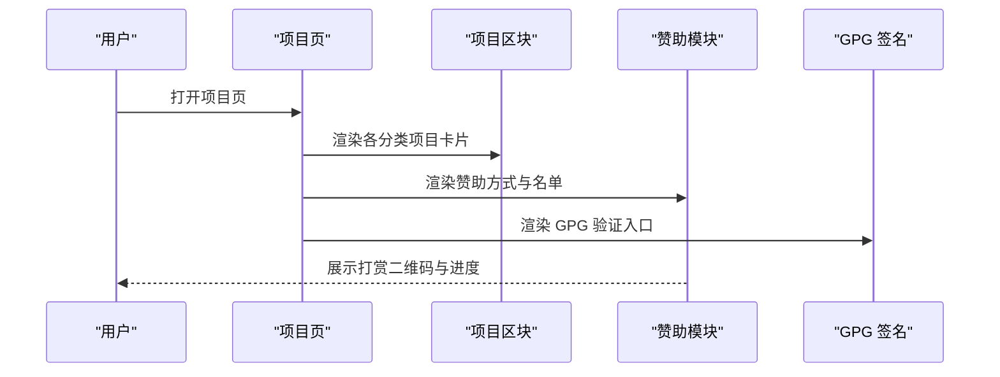
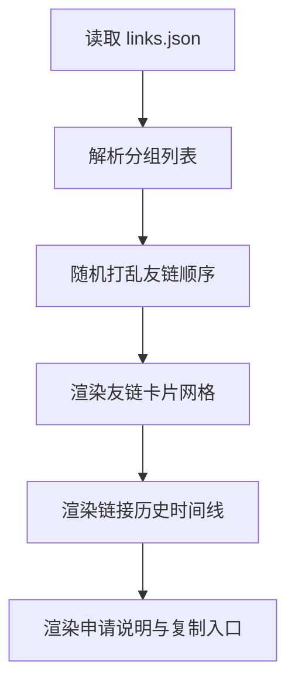
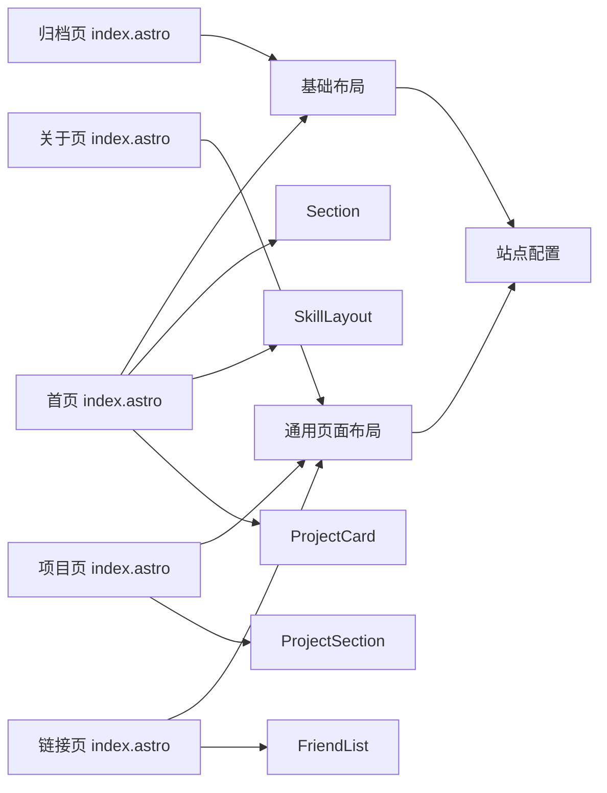

# 页面开发

<cite>
**本文引用的文件**
- [首页 index.astro](file://src/pages/index.astro)
- [关于页 index.astro](file://src/pages/about/index.astro)
- [归档页 index.astro](file://src/pages/archives/index.astro)
- [项目页 index.astro](file://src/pages/projects/index.astro)
- [链接页 index.astro](file://src/pages/links/index.astro)
- [基础布局 BaseLayout.astro](file://src/layouts/BaseLayout.astro)
- [通用页面布局 CommonPage.astro](file://src/layouts/CommonPage.astro)
- [主页区块 Section.astro](file://src/components/home/Section.astro)
- [主页技能布局 SkillLayout.astro](file://src/components/home/SkillLayout.astro)
- [主页项目卡片 ProjectCard.astro](file://src/components/home/ProjectCard.astro)
- [项目区块 ProjectSection.astro](file://src/components/projects/ProjectSection.astro)
- [友链列表 FriendList.astro](file://src/components/links/FriendList.astro)
- [站点配置 site.config.ts](file://src/site.config.ts)
</cite>

## 目录
1. [引言](#引言)
2. [项目结构](#项目结构)
3. [核心组件](#核心组件)
4. [架构总览](#架构总览)
5. [详细组件分析](#详细组件分析)
6. [依赖关系分析](#依赖关系分析)
7. [性能考虑](#性能考虑)
8. [故障排查指南](#故障排查指南)
9. [结论](#结论)
10. [附录](#附录)

## 引言
本指南面向使用 Astro 主题 Pure 的开发者，系统讲解首页、关于页、归档页、项目页与链接页的页面实现与最佳实践。内容覆盖页面数据获取、组件复用模式、SEO 与性能优化、以及可扩展与定制建议，帮助你在不牺牲可维护性的前提下，快速构建高质量的静态站点页面。

## 项目结构
- 页面位于 src/pages 下，按路径映射生成路由，如 /about、/archives、/projects、/links 等。
- 布局层分为基础布局 BaseLayout（注入全局样式、主题提供者、头部与底部）与通用页面布局 CommonPage（集成目录与评论）。
- 页面组件与业务组件分别位于 src/components 下，如 home、projects、links 等子目录，便于复用与扩展。
- 站点配置集中于 src/site.config.ts，统一管理标题、作者、语言、菜单、页脚、内容策略、集成开关等。

图表来源
- [首页 index.astro](file://src/pages/index.astro#L1-L128)
- [关于页 index.astro](file://src/pages/about/index.astro#L1-L251)
- [归档页 index.astro](file://src/pages/archives/index.astro#L1-L53)
- [项目页 index.astro](file://src/pages/projects/index.astro#L1-L205)
- [链接页 index.astro](file://src/pages/links/index.astro#L1-L66)
- [基础布局 BaseLayout.astro](file://src/layouts/BaseLayout.astro#L1-L92)
- [通用页面布局 CommonPage.astro](file://src/layouts/CommonPage.astro#L1-L34)
- [主页区块 Section.astro](file://src/components/home/Section.astro#L1-L15)
- [主页技能布局 SkillLayout.astro](file://src/components/home/SkillLayout.astro#L1-L18)
- [主页项目卡片 ProjectCard.astro](file://src/components/home/ProjectCard.astro#L1-L74)
- [项目区块 ProjectSection.astro](file://src/components/projects/ProjectSection.astro#L1-L104)
- [友链列表 FriendList.astro](file://src/components/links/FriendList.astro#L1-L119)

章节来源
- [首页 index.astro](file://src/pages/index.astro#L1-L128)
- [关于页 index.astro](file://src/pages/about/index.astro#L1-L251)
- [归档页 index.astro](file://src/pages/archives/index.astro#L1-L53)
- [项目页 index.astro](file://src/pages/projects/index.astro#L1-L205)
- [链接页 index.astro](file://src/pages/links/index.astro#L1-L66)
- [基础布局 BaseLayout.astro](file://src/layouts/BaseLayout.astro#L1-L92)
- [通用页面布局 CommonPage.astro](file://src/layouts/CommonPage.astro#L1-L34)

## 核心组件
- 数据获取与排序：页面通过服务端工具函数获取并排序文章集合，确保首页与归档页的数据一致性与性能可控。
- 组件复用：Section、SkillLayout、PostPreview、ProjectSection、FriendList 等组件在多个页面中重复使用，降低耦合度。
- 布局体系：BaseLayout 提供全局样式与主题能力；CommonPage 负责目录、评论与页面信息区段，提升页面一致性。
- SEO 与可访问性：通过 BaseHead 注入元信息，合理使用语义化标签与 aria 属性，提升搜索引擎与辅助技术友好度。

章节来源
- [首页 index.astro](file://src/pages/index.astro#L28-L30)
- [归档页 index.astro](file://src/pages/archives/index.astro#L9-L11)
- [通用页面布局 CommonPage.astro](file://src/layouts/CommonPage.astro#L1-L34)
- [基础布局 BaseLayout.astro](file://src/layouts/BaseLayout.astro#L1-L92)

## 架构总览
页面渲染采用 Astro 的 Islands 架构，页面负责数据获取与布局，组件负责 UI 与交互。数据流自上而下注入，组件通过 props 接收数据，最终输出静态 HTML。

图表来源
- [首页 index.astro](file://src/pages/index.astro#L28-L30)
- [归档页 index.astro](file://src/pages/archives/index.astro#L9-L11)
- [基础布局 BaseLayout.astro](file://src/layouts/BaseLayout.astro#L24-L50)
- [通用页面布局 CommonPage.astro](file://src/layouts/CommonPage.astro#L18-L33)

## 详细组件分析

### 首页 index.astro 实现
- 数据获取与展示
  - 使用服务端工具获取全部文章并按日期降序排列，限制展示数量，保证首页加载性能与信息密度。
  - 头像与站点配置来自站点配置，确保一致性与可维护性。
- 内容组织
  - 个人简介与标签：头像、作者名、位置标签等。
  - 技能点：前端、后端、项目管理三列技能标签，使用 Pill 样式按钮展示。
  - 最近发布：使用 PostPreview 列表展示最新文章，并提供“更多”入口跳转到博客列表。
  - 可选项目展示：预留项目卡片区域，便于扩展作品集。
- 用户体验优化
  - 图片懒加载与优先级设置，提升首屏性能。
  - 动画与间距统一，增强视觉节奏。
  - 高亮色通过布局注入，营造一致的主题氛围。

图表来源
- [首页 index.astro](file://src/pages/index.astro#L28-L30)
- [首页 index.astro](file://src/pages/index.astro#L66-L95)
- [主页区块 Section.astro](file://src/components/home/Section.astro#L7-L14)
- [主页技能布局 SkillLayout.astro](file://src/components/home/SkillLayout.astro#L12-L17)

章节来源
- [首页 index.astro](file://src/pages/index.astro#L1-L128)
- [主页区块 Section.astro](file://src/components/home/Section.astro#L1-L15)
- [主页技能布局 SkillLayout.astro](file://src/components/home/SkillLayout.astro#L1-L18)
- [主页项目卡片 ProjectCard.astro](file://src/components/home/ProjectCard.astro#L1-L74)

### 关于页 about/index.astro 实现
- 设计目标
  - 展示个人信息、工具栈、社交统计、博客历程与致谢资源。
- 结构与组件
  - 工具展示：分门别类展示设计、生产力、开发与环境工具，使用工具图标与描述增强可读性。
  - 社交统计：通过 Substats 组件展示 GitHub、Telegram、Steam 等平台数据。
  - 博客历程：使用 Timeline 展示站点历史与里程碑。
  - 可折叠内容：使用 Collapse 封装隐私或长内容，保持页面整洁。
  - 支持赞助：提供直达赞助模块的入口。
- 交互与可访问性
  - 使用标题锚点与目录生成，提升长页面导航体验。
  - 评论系统可按需开启，满足读者互动需求。

图表来源
- [关于页 index.astro](file://src/pages/about/index.astro#L40-L156)
- [关于页 index.astro](file://src/pages/about/index.astro#L158-L220)

章节来源
- [关于页 index.astro](file://src/pages/about/index.astro#L1-L251)
- [通用页面布局 CommonPage.astro](file://src/layouts/CommonPage.astro#L1-L34)

### 归档页 archives/index.astro 实现
- 功能要点
  - 全量文章按日期排序并按年份分组，形成时间线式的归档视图。
  - 年份标题采用装饰性大字背景，突出层次感。
  - 每年条目使用 PostPreview 列表，支持返回博客列表。
- 性能与 SEO
  - 预渲染开启，利于 SEO 与首屏性能。
  - 语义化结构与 aria-label 提升可访问性。

图表来源
- [归档页 index.astro](file://src/pages/archives/index.astro#L7-L17)
- [归档页 index.astro](file://src/pages/archives/index.astro#L29-L50)

章节来源
- [归档页 index.astro](file://src/pages/archives/index.astro#L1-L53)

### 项目页 projects/index.astro 实现
- 功能要点
  - 项目概览：展示主题、课程笔记、其他仓库等分类区块。
  - 项目卡片：支持图片背景与链接集合，直观呈现项目信息与入口。
  - 赞助与打赏：提供多种支付方式与赞助名单，鼓励社区贡献。
  - GPG 签名：展示验证文件真实性的方式与入口。
- 交互与可访问性
  - 使用 Collapse 封装旧项目，避免页面拥挤。
  - 图片懒加载与无障碍属性，提升可用性。

图表来源
- [项目页 index.astro](file://src/pages/projects/index.astro#L50-L137)
- [项目页 index.astro](file://src/pages/projects/index.astro#L148-L183)
- [项目区块 ProjectSection.astro](file://src/components/projects/ProjectSection.astro#L35-L103)

章节来源
- [项目页 index.astro](file://src/pages/projects/index.astro#L1-L205)
- [项目区块 ProjectSection.astro](file://src/components/projects/ProjectSection.astro#L1-L104)

### 链接页 links/index.astro 实现
- 功能要点
  - 友链展示：按分组随机展示正常与异常状态的友链，支持头像缓存策略。
  - 链接历史：使用 Timeline 记录友链变更与趣事。
  - 申请说明：提供站点信息复制入口与申请规范，便于维护。
- 交互与可访问性
  - 随机排序打乱顺序，避免排名效应。
  - 友链卡片悬停效果与遮罩动画，增强交互反馈。

图表来源
- [链接页 index.astro](file://src/pages/links/index.astro#L1-L66)
- [友链列表 FriendList.astro](file://src/components/links/FriendList.astro#L25-L118)

章节来源
- [链接页 index.astro](file://src/pages/links/index.astro#L1-L66)
- [友链列表 FriendList.astro](file://src/components/links/FriendList.astro#L1-L119)

## 依赖关系分析
- 页面到布局
  - 首页与归档页使用基础布局，注入全局样式与主题变量。
  - 关于页与项目页使用通用页面布局，集成目录、评论与页面信息。
- 页面到组件
  - 首页依赖 Section、SkillLayout、PostPreview、ProjectCard 等组件。
  - 项目页依赖 ProjectSection、Sponsorship、Sponsors 等组件。
  - 链接页依赖 FriendList。
- 配置到页面
  - 站点配置统一提供标题、作者、语言、菜单、页脚、内容策略与集成开关，页面通过导入直接使用。

图表来源
- [首页 index.astro](file://src/pages/index.astro#L1-L12)
- [归档页 index.astro](file://src/pages/archives/index.astro#L1-L5)
- [关于页 index.astro](file://src/pages/about/index.astro#L1-L5)
- [项目页 index.astro](file://src/pages/projects/index.astro#L1-L8)
- [链接页 index.astro](file://src/pages/links/index.astro#L1-L7)
- [基础布局 BaseLayout.astro](file://src/layouts/BaseLayout.astro#L1-L10)
- [通用页面布局 CommonPage.astro](file://src/layouts/CommonPage.astro#L1-L6)
- [站点配置 site.config.ts](file://src/site.config.ts#L1-L207)

章节来源
- [首页 index.astro](file://src/pages/index.astro#L1-L12)
- [关于页 index.astro](file://src/pages/about/index.astro#L1-L5)
- [归档页 index.astro](file://src/pages/archives/index.astro#L1-L5)
- [项目页 index.astro](file://src/pages/projects/index.astro#L1-L8)
- [链接页 index.astro](file://src/pages/links/index.astro#L1-L7)
- [基础布局 BaseLayout.astro](file://src/layouts/BaseLayout.astro#L1-L10)
- [通用页面布局 CommonPage.astro](file://src/layouts/CommonPage.astro#L1-L6)
- [站点配置 site.config.ts](file://src/site.config.ts#L1-L207)

## 性能考虑
- 预渲染与静态生成
  - 归档页启用预渲染，有利于 SEO 与首屏性能。
- 图片优化
  - 使用懒加载与优先级设置，减少主线程阻塞。
  - 项目与友链卡片背景图采用遮罩与渐变，兼顾美观与体积。
- 数据获取与缓存
  - 文章集合在构建期获取并排序，避免运行时重复计算。
  - 友链头像支持本地缓存策略，降低第三方请求成本。
- 代码分割与按需加载
  - 评论、主题提供者等按需注入，避免不必要的资源加载。

章节来源
- [归档页 index.astro](file://src/pages/archives/index.astro#L7-L7)
- [首页 index.astro](file://src/pages/index.astro#L45-L51)
- [项目区块 ProjectSection.astro](file://src/components/projects/ProjectSection.astro#L50-L64)
- [友链列表 FriendList.astro](file://src/components/links/FriendList.astro#L37-L40)

## 故障排查指南
- 图片路径错误
  - 现象：页面抛出“图片不存在”的错误。
  - 排查：检查站点配置中的 logo 路径与实际文件是否存在；检查项目卡片与友链卡片的图片 glob 是否匹配。
  - 参考
    - [首页 index.astro](file://src/pages/index.astro#L33-L39)
    - [主页项目卡片 ProjectCard.astro](file://src/components/home/ProjectCard.astro#L26-L32)
    - [项目区块 ProjectSection.astro](file://src/components/projects/ProjectSection.astro#L24-L46)
    - [友链列表 FriendList.astro](file://src/components/links/FriendList.astro#L37-L40)
- 友链头像缓存
  - 现象：头像加载失败或显示异常。
  - 排查：确认站点配置中是否启用头像缓存，以及缓存路径是否正确。
  - 参考
    - [友链列表 FriendList.astro](file://src/components/links/FriendList.astro#L37-L40)
    - [站点配置 site.config.ts](file://src/site.config.ts#L120-L122)
- 评论与统计未生效
  - 现象：评论区为空或访问统计不可见。
  - 排查：确认通用页面布局是否传入 comment 与 view 参数，以及站点配置中 waline 与 pageview 开关。
  - 参考
    - [通用页面布局 CommonPage.astro](file://src/layouts/CommonPage.astro#L18-L33)
    - [站点配置 site.config.ts](file://src/site.config.ts#L160-L180)

章节来源
- [首页 index.astro](file://src/pages/index.astro#L33-L39)
- [主页项目卡片 ProjectCard.astro](file://src/components/home/ProjectCard.astro#L26-L32)
- [项目区块 ProjectSection.astro](file://src/components/projects/ProjectSection.astro#L24-L46)
- [友链列表 FriendList.astro](file://src/components/links/FriendList.astro#L37-L40)
- [通用页面布局 CommonPage.astro](file://src/layouts/CommonPage.astro#L18-L33)
- [站点配置 site.config.ts](file://src/site.config.ts#L120-L122)
- [站点配置 site.config.ts](file://src/site.config.ts#L160-L180)

## 结论
通过统一的布局体系、可复用的组件与规范化的数据获取策略，Astro 主题 Pure 在首页、关于页、归档页、项目页与链接页上实现了良好的可维护性与用户体验。结合预渲染、图片优化与按需加载等手段，可在保证 SEO 与性能的同时，快速扩展新页面与新功能。

## 附录
- 页面扩展建议
  - 新增页面：遵循现有布局命名与导入约定，优先复用 Section、PostPreview、ProjectSection、FriendList 等组件。
  - 数据来源：尽量在构建期完成数据聚合与排序，减少运行时负担。
  - SEO 优化：为每个页面提供明确的 meta 标题与描述，必要时在布局中注入 Open Graph 与 Twitter Card。
  - 性能优化：继续推进图片懒加载、骨架屏与关键 CSS 内联，关注 Lighthouse 指标。
- 定制化指南
  - 样式：通过站点配置中的 customCss 与主题变量扩展样式；避免在页面内硬编码样式。
  - 功能：在站点配置中启用/禁用集成（如 waline、pagefind、mediumZoom），并在页面中按需引入。