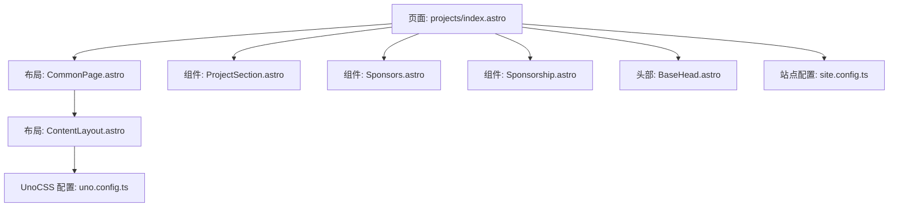
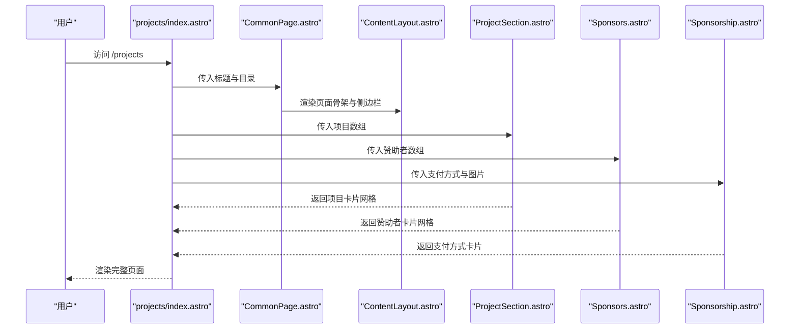
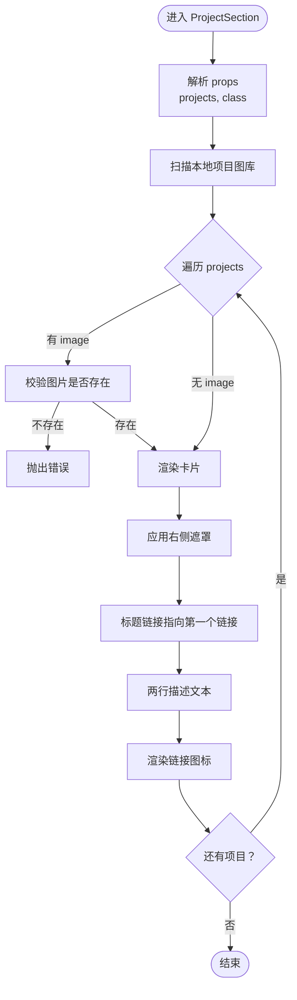
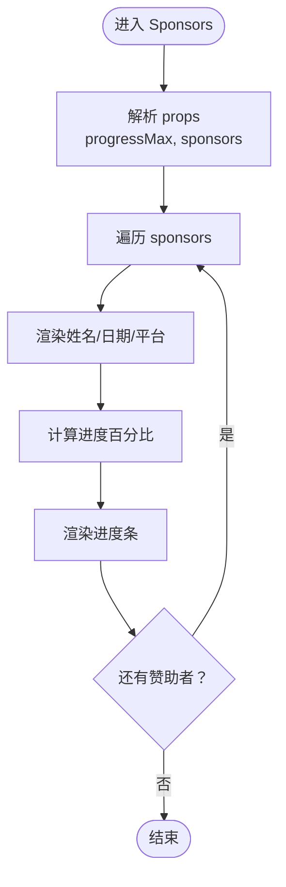
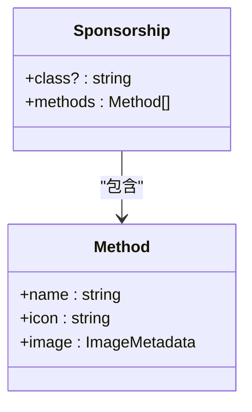
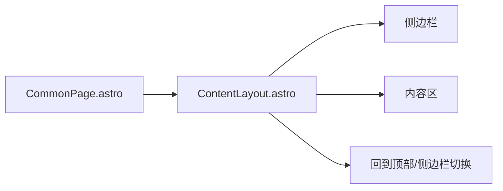
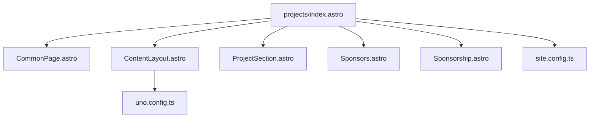
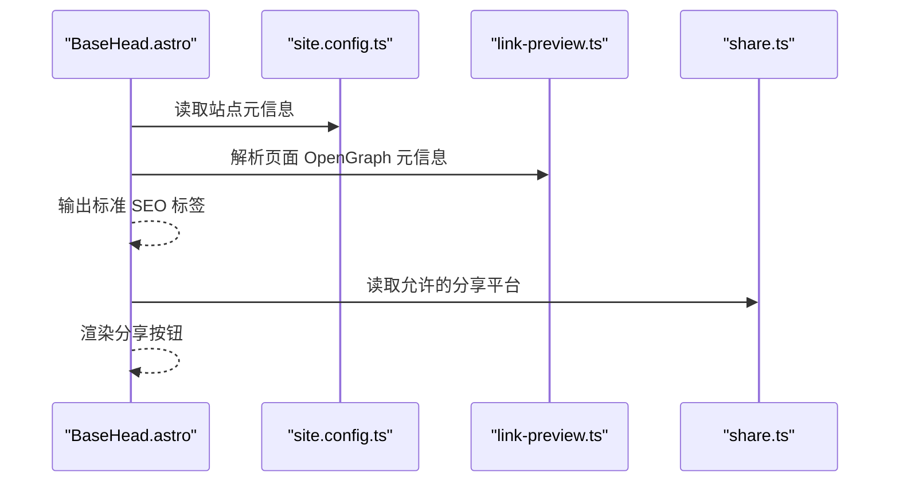
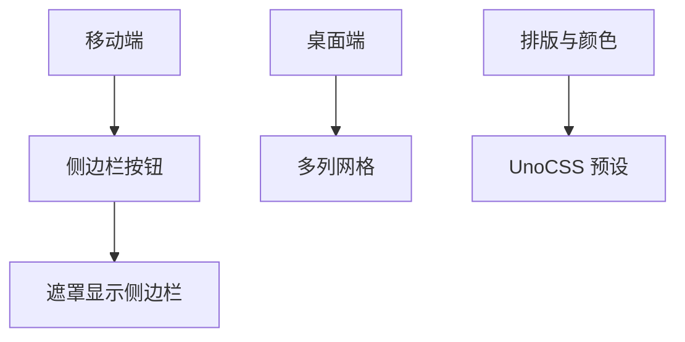
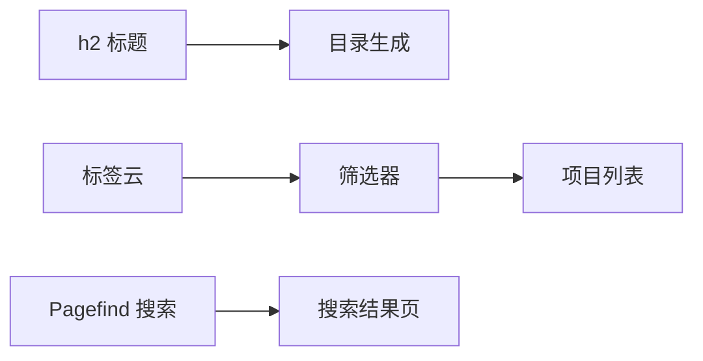

# 项目页面

<cite>
**本文引用的文件**
- [src/pages/projects/index.astro](file://src/pages/projects/index.astro)
- [src/components/projects/ProjectSection.astro](file://src/components/projects/ProjectSection.astro)
- [src/components/projects/Sponsors.astro](file://src/components/projects/Sponsors.astro)
- [src/components/projects/Sponsorship.astro](file://src/components/projects/Sponsorship.astro)
- [src/layouts/CommonPage.astro](file://src/layouts/CommonPage.astro)
- [src/layouts/ContentLayout.astro](file://src/layouts/ContentLayout.astro)
- [src/components/BaseHead.astro](file://src/components/BaseHead.astro)
- [uno.config.ts](file://uno.config.ts)
- [src/site.config.ts](file://src/site.config.ts)
- [packages/pure/plugins/link-preview.ts](file://packages/pure/plugins/link-preview.ts)
- [packages/pure/schemas/share.ts](file://packages/pure/schemas/share.ts)
</cite>

## 目录
1. [简介](#简介)
2. [项目结构](#项目结构)
3. [核心组件](#核心组件)
4. [架构总览](#架构总览)
5. [组件详解](#组件详解)
6. [依赖关系分析](#依赖关系分析)
7. [性能与可访问性](#性能与可访问性)
8. [SEO与社交分享](#seo与社交分享)
9. [响应式与布局设计](#响应式与布局设计)
10. [分类、筛选与搜索](#分类筛选与搜索)
11. [故障排查](#故障排查)
12. [结论](#结论)

## 简介
本指南聚焦于 Astro 主题 Pure 的项目页面实现，围绕 projects/index.astro 展开，系统讲解项目卡片展示（ProjectSection）、赞助商展示（Sponsors）与赞助信息（Sponsorship）三部分组件的使用与扩展；同时给出页面布局、响应式适配、SEO 优化与社交分享的实践建议，并提供分类、标签筛选与搜索的实现思路。

## 项目结构
项目页面采用分层布局：页面容器（CommonPage）承载标题、目录与评论区；内容区（ContentLayout）提供侧边栏、主内容与底部槽位；具体页面（projects/index.astro）内组合多个业务组件完成“项目列表 + 赞助信息 + 赞助商墙”的展示。

**图表来源**
- [src/pages/projects/index.astro](file://src/pages/projects/index.astro#L1-L205)
- [src/layouts/CommonPage.astro](file://src/layouts/CommonPage.astro#L1-L34)
- [src/layouts/ContentLayout.astro](file://src/layouts/ContentLayout.astro#L1-L156)
- [src/components/projects/ProjectSection.astro](file://src/components/projects/ProjectSection.astro#L1-L104)
- [src/components/projects/Sponsors.astro](file://src/components/projects/Sponsors.astro#L1-L34)
- [src/components/projects/Sponsorship.astro](file://src/components/projects/Sponsorship.astro#L1-L58)
- [src/components/BaseHead.astro](file://src/components/BaseHead.astro#L1-L99)
- [uno.config.ts](file://uno.config.ts#L1-L193)
- [src/site.config.ts](file://src/site.config.ts#L1-L207)

**章节来源**
- [src/pages/projects/index.astro](file://src/pages/projects/index.astro#L1-L205)
- [src/layouts/CommonPage.astro](file://src/layouts/CommonPage.astro#L1-L34)
- [src/layouts/ContentLayout.astro](file://src/layouts/ContentLayout.astro#L1-L156)

## 核心组件
- 项目展示区：通过多次渲染 ProjectSection 组件，按分类（Programs/Learnings/Others）组织项目卡片。
- 赞助信息区：Sponsorship 展示支付方式与二维码，Sponsors 展示赞助者列表与进度条。
- 页面布局：CommonPage 注入标题、目录与评论；ContentLayout 提供侧边栏与移动端交互。

**章节来源**
- [src/pages/projects/index.astro](file://src/pages/projects/index.astro#L50-L183)
- [src/components/projects/ProjectSection.astro](file://src/components/projects/ProjectSection.astro#L1-L104)
- [src/components/projects/Sponsors.astro](file://src/components/projects/Sponsors.astro#L1-L34)
- [src/components/projects/Sponsorship.astro](file://src/components/projects/Sponsorship.astro#L1-L58)
- [src/layouts/CommonPage.astro](file://src/layouts/CommonPage.astro#L1-L34)
- [src/layouts/ContentLayout.astro](file://src/layouts/ContentLayout.astro#L1-L156)

## 架构总览
项目页面的数据流自上而下：页面组件负责组织内容与导航标题，布局组件负责结构与交互，业务组件负责数据渲染与样式。

**图表来源**
- [src/pages/projects/index.astro](file://src/pages/projects/index.astro#L22-L183)
- [src/layouts/CommonPage.astro](file://src/layouts/CommonPage.astro#L18-L33)
- [src/layouts/ContentLayout.astro](file://src/layouts/ContentLayout.astro#L18-L75)
- [src/components/projects/ProjectSection.astro](file://src/components/projects/ProjectSection.astro#L35-L103)
- [src/components/projects/Sponsors.astro](file://src/components/projects/Sponsors.astro#L17-L33)
- [src/components/projects/Sponsorship.astro](file://src/components/projects/Sponsorship.astro#L21-L37)

## 组件详解

### ProjectSection：项目卡片展示
- 输入参数
  - class：可选外层类名
  - projects：项目数组，每项包含可选图片路径、名称、描述与链接数组
- 图片与遮罩
  - 使用 Astro 的 import.meta.glob 动态导入本地项目图库，支持 jpeg、jpg、png、gif、avif、webp
  - 通过 CSS 掩膜实现右侧到左侧的渐变遮罩，营造图文混排视觉
- 链接与图标
  - 链接类型映射：github、site、doc、release 对应不同图标
  - 第一个链接作为标题链接，其余为按钮图标
- 响应式网格
  - 默认单列，sm 及以上双列，间距与内边距随尺寸调整

**图表来源**
- [src/components/projects/ProjectSection.astro](file://src/components/projects/ProjectSection.astro#L23-L103)

**章节来源**
- [src/components/projects/ProjectSection.astro](file://src/components/projects/ProjectSection.astro#L1-L104)

### Sponsors：赞助者展示
- 输入参数
  - class：可选外层类名
  - progressMax：进度条最大金额阈值，默认 25
  - sponsors：赞助者数组，含姓名、平台、金额、日期
- 展示要点
  - 每个赞助者卡片包含：姓名、日期与平台、金额进度条
  - 进度条宽度按金额与阈值计算，上限 100%

**图表来源**
- [src/components/projects/Sponsors.astro](file://src/components/projects/Sponsors.astro#L14-L33)

**章节来源**
- [src/components/projects/Sponsors.astro](file://src/components/projects/Sponsors.astro#L1-L34)

### Sponsorship：赞助信息展示
- 输入参数
  - class：可选外层类名
  - methods：支付方式数组，含名称、图标名、图片元数据
- 展示要点
  - 每个支付方式以卡片形式呈现，图标覆盖在图片之上
  - 悬停时图标淡出、图片清晰度提升，形成“点击解锁”效果
  - 支付方式在移动端纵向排列，桌面端横向排列

**图表来源**
- [src/components/projects/Sponsorship.astro](file://src/components/projects/Sponsorship.astro#L9-L16)

**章节来源**
- [src/components/projects/Sponsorship.astro](file://src/components/projects/Sponsorship.astro#L1-L58)

### 页面布局与交互
- CommonPage
  - 接收标题与目录 headings，注入页面信息与评论槽位
- ContentLayout
  - 提供固定/粘性侧边栏、移动端遮罩与开关按钮
  - 内容区域支持高亮色与返回按钮

**图表来源**
- [src/layouts/CommonPage.astro](file://src/layouts/CommonPage.astro#L18-L33)
- [src/layouts/ContentLayout.astro](file://src/layouts/ContentLayout.astro#L18-L75)

**章节来源**
- [src/layouts/CommonPage.astro](file://src/layouts/CommonPage.astro#L1-L34)
- [src/layouts/ContentLayout.astro](file://src/layouts/ContentLayout.astro#L1-L156)

## 依赖关系分析
- 项目页面依赖布局与通用组件，业务组件之间低耦合，便于复用与替换
- 图片资源通过 Astro 的 import.meta.glob 在构建期收集，减少运行时开销
- UnoCSS 提供统一的排版与颜色体系，确保跨组件一致性

**图表来源**
- [src/pages/projects/index.astro](file://src/pages/projects/index.astro#L4-L11)
- [src/layouts/CommonPage.astro](file://src/layouts/CommonPage.astro#L4-L6)
- [src/layouts/ContentLayout.astro](file://src/layouts/ContentLayout.astro#L4-L6)
- [uno.config.ts](file://uno.config.ts#L174-L193)
- [src/site.config.ts](file://src/site.config.ts#L1-L207)

**章节来源**
- [src/pages/projects/index.astro](file://src/pages/projects/index.astro#L1-L205)
- [uno.config.ts](file://uno.config.ts#L1-L193)
- [src/site.config.ts](file://src/site.config.ts#L1-L207)

## 性能与可访问性
- 图片懒加载：所有图片均设置 lazy 加载，降低首屏压力
- 构建期资源收集：import.meta.glob 在构建阶段解析资源，避免运行时查找
- 响应式网格：基于 UnoCSS 的栅格系统，减少额外样式计算
- 可访问性建议
  - 为图标链接添加 aria-label
  - 为图片提供合适的 alt 文本
  - 确保颜色对比度满足 WCAG 基准

[本节为通用建议，不直接分析具体文件]

## SEO与社交分享
- 页面头部标签
  - BaseHead 统一输出标题、描述、作者、Open Graph、Twitter 卡片与站点地图等
  - 支持自定义社交头图与规范链接
- 社交分享
  - 站点配置中声明支持的分享平台（如 weibo、x、bluesky）
  - 可结合第三方插件解析页面 OpenGraph 元信息用于预览生成

**图表来源**
- [src/components/BaseHead.astro](file://src/components/BaseHead.astro#L10-L77)
- [src/site.config.ts](file://src/site.config.ts#L96-L98)
- [packages/pure/plugins/link-preview.ts](file://packages/pure/plugins/link-preview.ts#L83-L110)
- [packages/pure/schemas/share.ts](file://packages/pure/schemas/share.ts#L1-L9)

**章节来源**
- [src/components/BaseHead.astro](file://src/components/BaseHead.astro#L1-L99)
- [src/site.config.ts](file://src/site.config.ts#L96-L98)
- [packages/pure/plugins/link-preview.ts](file://packages/pure/plugins/link-preview.ts#L83-L110)
- [packages/pure/schemas/share.ts](file://packages/pure/schemas/share.ts#L1-L9)

## 响应式与布局设计
- 移动优先：ContentLayout 在移动端提供侧边栏遮罩与切换按钮，保证信息密度与可用性
- 网格系统：项目卡片默认单列，sm 双列，lg 多列，配合 UnoCSS 的栅格规则
- 字体与排版：UnoCSS typography 预设统一段落、标题、表格与代码块风格
- 主题变量：通过 UnoCSS 主题颜色与变量，确保全局一致的色彩体系

**图表来源**
- [src/layouts/ContentLayout.astro](file://src/layouts/ContentLayout.astro#L77-L156)
- [uno.config.ts](file://uno.config.ts#L14-L125)

**章节来源**
- [src/layouts/ContentLayout.astro](file://src/layouts/ContentLayout.astro#L1-L156)
- [uno.config.ts](file://uno.config.ts#L1-L193)

## 分类、筛选与搜索
- 分类与标题锚点
  - 页面通过 h2 标题与 headings 列表生成目录与锚点，便于分段浏览
- 标签筛选
  - 可参考博客页的标签侧边栏模式，在项目页增加标签云与分页
- 搜索
  - 站点已启用 pagefind，可在项目页集成搜索入口或独立搜索页

[本图为概念示意，不对应具体源码文件]

**章节来源**
- [src/pages/projects/index.astro](file://src/pages/projects/index.astro#L13-L19)
- [src/site.config.ts](file://src/site.config.ts#L124-L124)

## 故障排查
- 项目图片未显示或报错
  - 确认图片路径存在于本地图库，且扩展名符合 glob 规则
  - 若路径不存在，组件会抛出错误提示
- 支付方式卡片悬停效果异常
  - 检查样式作用域与 hover 规则是否被覆盖
- 目录不显示
  - 确认 headings 参数正确传入，且页面包含 h2 标题

**章节来源**
- [src/components/projects/ProjectSection.astro](file://src/components/projects/ProjectSection.astro#L42-L46)
- [src/layouts/CommonPage.astro](file://src/layouts/CommonPage.astro#L18-L20)
- [src/pages/projects/index.astro](file://src/pages/projects/index.astro#L13-L19)

## 结论
项目页面通过清晰的分层与组件化设计，实现了“项目展示 + 赞助信息 + 赞助者墙”的完整体验。借助布局组件与 UnoCSS，页面具备良好的可维护性与一致性；结合 SEO 与社交分享能力，有助于提升曝光与传播。后续可在标签筛选与搜索方面进一步增强交互体验。