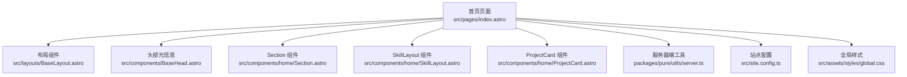
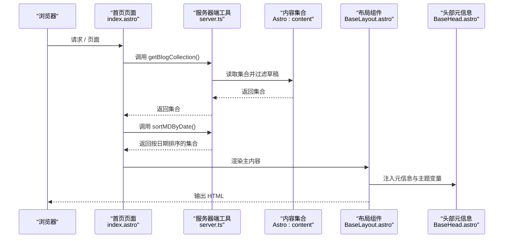
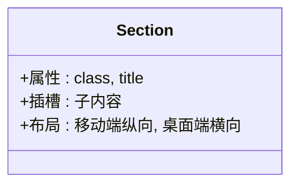
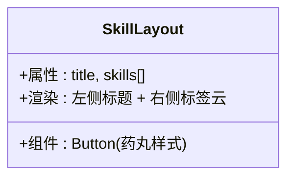
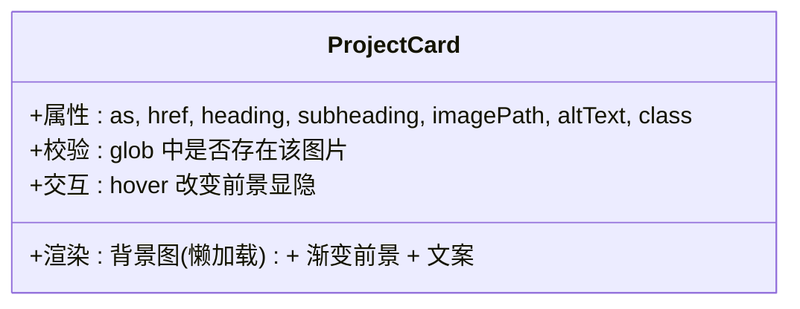
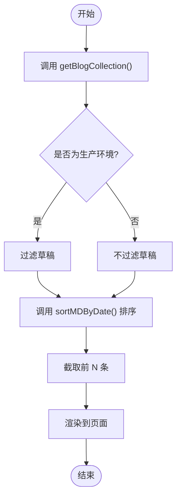
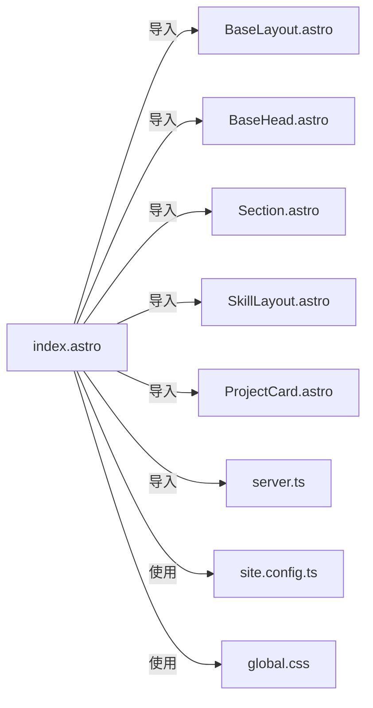

# 首页开发

<cite>
**本文引用的文件**
- [src/pages/index.astro](file://src/pages/index.astro)
- [src/components/home/Section.astro](file://src/components/home/Section.astro)
- [src/components/home/ProjectCard.astro](file://src/components/home/ProjectCard.astro)
- [src/components/home/SkillLayout.astro](file://src/components/home/SkillLayout.astro)
- [packages/pure/utils/server.ts](file://packages/pure/utils/server.ts)
- [src/layouts/BaseLayout.astro](file://src/layouts/BaseLayout.astro)
- [src/components/BaseHead.astro](file://src/components/BaseHead.astro)
- [src/site.config.ts](file://src/site.config.ts)
- [src/assets/styles/global.css](file://src/assets/styles/global.css)
</cite>

## 目录
1. [引言](#引言)
2. [项目结构](#项目结构)
3. [核心组件](#核心组件)
4. [架构总览](#架构总览)
5. [详细组件分析](#详细组件分析)
6. [依赖关系分析](#依赖关系分析)
7. [性能与SEO优化](#性能与seo优化)
8. [故障排查指南](#故障排查指南)
9. [结论](#结论)
10. [附录](#附录)

## 引言
本指南面向使用 Astro 主题 Pure 的开发者，系统讲解首页 index.astro 的实现架构与最佳实践，涵盖页面布局设计、组件组合模式、数据获取策略，并深入解析四大核心区域（个人头像与简介、技能展示、最新文章列表、项目展示）的实现方式。同时，提供 Section 组件、ProjectCard 组件、SkillLayout 组件的使用方法与布局技巧，详解 getBlogCollection() 与 sortMDByDate() 等服务器端函数的调用与行为，给出 SEO 与性能优化建议，以及首页定制与扩展的实操方案。

## 项目结构
首页位于 src/pages/index.astro，采用纯 Astro 组件化页面，通过 BaseLayout 套娃布局，结合自定义组件 Section、SkillLayout、ProjectCard 与第三方组件 Button、Card、Label、Icon、Quote、PostPreview 实现内容组织与展示。数据层通过 Pure 提供的服务器端工具函数从 Astro 内容集合中读取并排序文章，再以静态渲染的方式输出到页面。

图表来源
- [src/pages/index.astro](file://src/pages/index.astro#L1-L128)
- [src/layouts/BaseLayout.astro](file://src/layouts/BaseLayout.astro#L1-L92)
- [src/components/BaseHead.astro](file://src/components/BaseHead.astro#L1-L99)
- [src/components/home/Section.astro](file://src/components/home/Section.astro#L1-L15)
- [src/components/home/SkillLayout.astro](file://src/components/home/SkillLayout.astro#L1-L18)
- [src/components/home/ProjectCard.astro](file://src/components/home/ProjectCard.astro#L1-L74)
- [packages/pure/utils/server.ts](file://packages/pure/utils/server.ts#L1-L67)
- [src/site.config.ts](file://src/site.config.ts#L1-L207)
- [src/assets/styles/global.css](file://src/assets/styles/global.css#L1-L287)

章节来源
- [src/pages/index.astro](file://src/pages/index.astro#L1-L128)
- [src/layouts/BaseLayout.astro](file://src/layouts/BaseLayout.astro#L1-L92)
- [src/components/BaseHead.astro](file://src/components/BaseHead.astro#L1-L99)
- [src/site.config.ts](file://src/site.config.ts#L1-L207)

## 核心组件
- Section 组件：用于包裹一个标题与一组子内容，支持响应式布局与插槽分发，便于统一风格的区块组织。
- SkillLayout 组件：用于按“分类+标签云”的形式展示技能清单，适合技能卡片化展示。
- ProjectCard 组件：用于项目卡片展示，支持多态标签（如 a 或其他 HTML 标签）、懒加载图片与渐变前景覆盖。
- 服务器端工具：getBlogCollection() 与 sortMDByDate() 负责从内容集合中筛选并按日期排序，确保首页最新文章列表的正确性与一致性。

章节来源
- [src/components/home/Section.astro](file://src/components/home/Section.astro#L1-L15)
- [src/components/home/SkillLayout.astro](file://src/components/home/SkillLayout.astro#L1-L18)
- [src/components/home/ProjectCard.astro](file://src/components/home/ProjectCard.astro#L1-L74)
- [packages/pure/utils/server.ts](file://packages/pure/utils/server.ts#L1-L67)

## 架构总览
首页的整体数据流与渲染流程如下：
- 页面在编译期或构建期执行服务器端逻辑，读取内容集合并排序。
- 将排序后的文章列表与静态资源路径注入到模板中。
- 使用 Section、SkillLayout、ProjectCard 等组件进行区块化渲染。
- 布局层 BaseLayout 注入头部元信息 BaseHead，设置主题色与安全边距，保证跨设备一致体验。

图表来源
- [src/pages/index.astro](file://src/pages/index.astro#L29-L30)
- [packages/pure/utils/server.ts](file://packages/pure/utils/server.ts#L8-L13)
- [packages/pure/utils/server.ts](file://packages/pure/utils/server.ts#L40-L46)
- [src/layouts/BaseLayout.astro](file://src/layouts/BaseLayout.astro#L24-L49)
- [src/components/BaseHead.astro](file://src/components/BaseHead.astro#L1-L99)

## 详细组件分析

### Section 组件
- 设计要点
  - 接收标题与类名属性，内部使用 Flex 布局，移动端纵向排列，桌面端横向排列，左侧标题区固定宽度，右侧内容区自适应。
  - 使用插槽承载子内容，便于复用与扩展。
- 布局技巧
  - 通过 md: 前缀实现断点切换，适配不同屏幕尺寸。
  - 结合 cn 工具类合并样式，保持一致的间距与对齐。

图表来源
- [src/components/home/Section.astro](file://src/components/home/Section.astro#L1-L15)

章节来源
- [src/components/home/Section.astro](file://src/components/home/Section.astro#L1-L15)

### SkillLayout 组件
- 设计要点
  - 接收标题与技能数组，左侧标题占 1/5 宽度，右侧标签云占 4/5 宽度。
  - 技能标签使用 Button 组件并设置为药丸样式，形成轻量级标签云。
- 布局技巧
  - 使用 md:flex-row 在桌面端横向排列，md:w-4/5 控制右侧宽度占比。
  - 通过 gap-x 与 gap-y 控制标签间距，提升可读性。

图表来源
- [src/components/home/SkillLayout.astro](file://src/components/home/SkillLayout.astro#L1-L18)

章节来源
- [src/components/home/SkillLayout.astro](file://src/components/home/SkillLayout.astro#L1-L18)

### ProjectCard 组件
- 设计要点
  - 支持多态标签（as 属性），默认为 a 标签，可传入 href 与 target。
  - 图片懒加载（loading="lazy"），背景图覆盖卡片，前景为渐变遮罩，悬停时前景增强。
  - 校验图片路径是否存在于 glob 中，避免运行时报错。
- 布局技巧
  - 使用绝对定位与透明度过渡，实现悬停时前景显隐。
  - 通过 group 选择器与 hover 效果联动，增强交互反馈。

图表来源
- [src/components/home/ProjectCard.astro](file://src/components/home/ProjectCard.astro#L1-L74)

章节来源
- [src/components/home/ProjectCard.astro](file://src/components/home/ProjectCard.astro#L1-L74)

### 服务器端函数：getBlogCollection 与 sortMDByDate
- getBlogCollection
  - 功能：根据环境变量决定是否过滤草稿，返回指定内容类型的集合。
  - 行为：生产环境过滤 draft=true 的条目；开发环境不过滤。
- sortMDByDate
  - 功能：按更新时间或发布时间降序排序，确保最新文章在前。
  - 行为：若无有效时间字段则按 0 处理，保证排序稳定性。
- 在首页中的使用
  - 先获取全部文章集合，再按日期排序并截取前 N 条，作为“最近发布”区域的数据源。

图表来源
- [packages/pure/utils/server.ts](file://packages/pure/utils/server.ts#L8-L13)
- [packages/pure/utils/server.ts](file://packages/pure/utils/server.ts#L40-L46)
- [src/pages/index.astro](file://src/pages/index.astro#L29-L30)

章节来源
- [packages/pure/utils/server.ts](file://packages/pure/utils/server.ts#L1-L67)
- [src/pages/index.astro](file://src/pages/index.astro#L29-L30)

### 首页四大核心区域解析
- 个人头像与简介区域
  - 使用 Astro Assets 的 Image 组件加载头像，设置高优先级加载与预取，保证首屏可见。
  - 通过 Label 与 Icon 组合展示地点等信息，保持简洁一致的视觉语言。
- 技能展示区域
  - 使用 SkillLayout 分类展示前端、后端、项目管理等技能标签，标签使用 Button 药丸样式，形成清晰的标签云。
- 最新文章列表区域
  - 使用 PostPreview 渲染每篇文章的预览，配合 Section 统一标题与容器样式。
  - 通过 Button 提供“更多”入口跳转至博客列表页。
- 项目展示区域（预留）
  - 已在首页注释中提供示例，可直接启用并替换为实际项目资源。

章节来源
- [src/pages/index.astro](file://src/pages/index.astro#L44-L124)

## 依赖关系分析
- 页面依赖
  - BaseLayout：提供全局布局、主题变量注入与安全边距处理。
  - BaseHead：负责 SEO 元信息、图标、字体预加载、社交卡片等。
  - 自定义组件：Section、SkillLayout、ProjectCard。
  - 第三方组件：Button、Card、Label、Icon、Quote、PostPreview。
  - 服务器端工具：getBlogCollection、sortMDByDate。
- 配置与样式
  - site.config.ts：站点标题、作者、描述、Logo、菜单、页脚、分享等配置。
  - global.css：动画、代码块、滚动条等全局样式。

图表来源
- [src/pages/index.astro](file://src/pages/index.astro#L1-L12)
- [src/layouts/BaseLayout.astro](file://src/layouts/BaseLayout.astro#L1-L10)
- [src/components/BaseHead.astro](file://src/components/BaseHead.astro#L1-L10)
- [src/site.config.ts](file://src/site.config.ts#L1-L207)
- [src/assets/styles/global.css](file://src/assets/styles/global.css#L1-L33)

章节来源
- [src/pages/index.astro](file://src/pages/index.astro#L1-L12)
- [src/layouts/BaseLayout.astro](file://src/layouts/BaseLayout.astro#L1-L10)
- [src/components/BaseHead.astro](file://src/components/BaseHead.astro#L1-L10)
- [src/site.config.ts](file://src/site.config.ts#L1-L207)
- [src/assets/styles/global.css](file://src/assets/styles/global.css#L1-L33)

## 性能与SEO优化
- 图片懒加载与首屏优化
  - 头像与项目卡片均使用懒加载，减少初始带宽占用。
  - 头像设置高优先级加载与预取，确保首屏可见。
- 内容优先加载
  - 使用动画延迟逐段出现，改善感知性能。
- SEO 最佳实践
  - BaseHead 自动生成标题、描述、作者、社交卡片、规范链接、站点地图、RSS 订阅等。
  - 生产环境注入站点标识脚本，便于监控与品牌传播。
- 主题与无障碍
  - BaseLayout 支持安全边距与深浅色主题变量，提升跨设备与无障碍体验。
- 样式与字体
  - 字体预加载与主题变量注入，减少 FOIT/FOFT 风险。

章节来源
- [src/pages/index.astro](file://src/pages/index.astro#L45-L51)
- [src/components/BaseHead.astro](file://src/components/BaseHead.astro#L1-L99)
- [src/layouts/BaseLayout.astro](file://src/layouts/BaseLayout.astro#L24-L91)
- [src/assets/styles/global.css](file://src/assets/styles/global.css#L1-L33)

## 故障排查指南
- 图片路径不存在
  - ProjectCard 会在 glob 中找不到图片时抛出错误，检查 imagePath 是否正确指向 src/assets/projects 下的资源。
- 头像路径校验失败
  - index.astro 对头像路径进行 glob 校验，若路径不匹配会抛错，检查 site.config.ts 中 logo.src 是否与实际文件一致。
- 文章集合为空
  - 若 getBlogCollection 返回空集，最近文章区域不会渲染；检查内容目录与草稿状态。
- 标签云样式异常
  - SkillLayout 使用 Button 药丸样式，若自定义样式冲突，请检查按钮组件的默认样式覆盖。

章节来源
- [src/components/home/ProjectCard.astro](file://src/components/home/ProjectCard.astro#L26-L32)
- [src/pages/index.astro](file://src/pages/index.astro#L33-L39)
- [packages/pure/utils/server.ts](file://packages/pure/utils/server.ts#L8-L13)

## 结论
首页 index.astro 通过清晰的区块化组件与稳定的服务器端数据流，实现了可维护、可扩展且具备良好 SEO 与性能表现的主页。借助 Section、SkillLayout、ProjectCard 等组件，开发者可以快速搭建个人简介、技能展示、文章列表与项目展示等核心模块；通过 BaseLayout 与 BaseHead 的统一注入，确保跨设备与跨平台的一致体验。

## 附录
- 自定义与扩展建议
  - 新增区域：在 Section 中添加新的子区块，复用现有样式与布局。
  - 技能扩展：在 SkillLayout 中新增分类与技能标签，保持标签云风格一致。
  - 项目卡片：替换 ProjectCard 的图片与文案，或启用注释中的示例区块。
  - 数据来源：如需扩展数据源，可在服务器端工具中增加新的集合读取与排序逻辑。
- 配置项参考
  - 站点标题、作者、描述、Logo、菜单、页脚、分享等配置集中在 site.config.ts，便于集中管理。

章节来源
- [src/site.config.ts](file://src/site.config.ts#L1-L207)
- [src/pages/index.astro](file://src/pages/index.astro#L14-L28)
- [packages/pure/utils/server.ts](file://packages/pure/utils/server.ts#L1-L67)