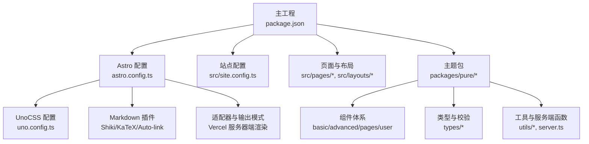
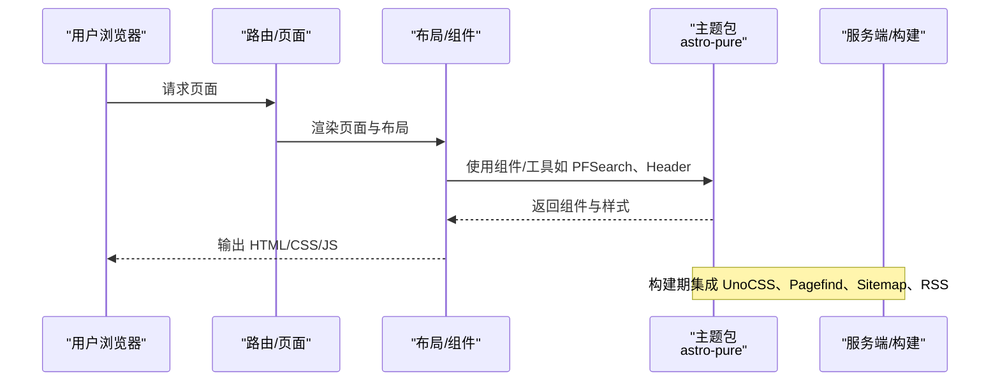
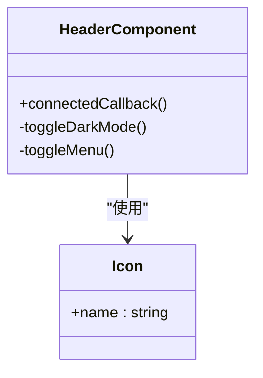
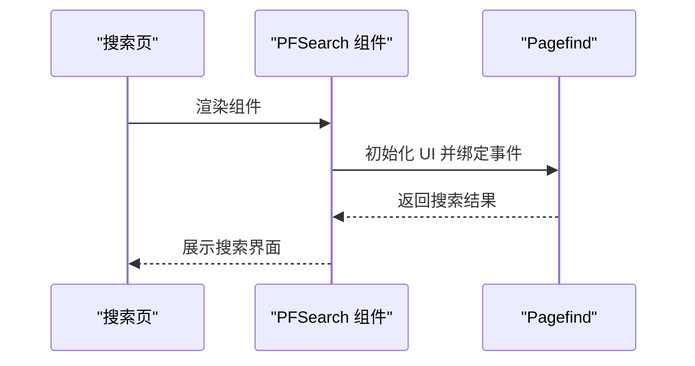
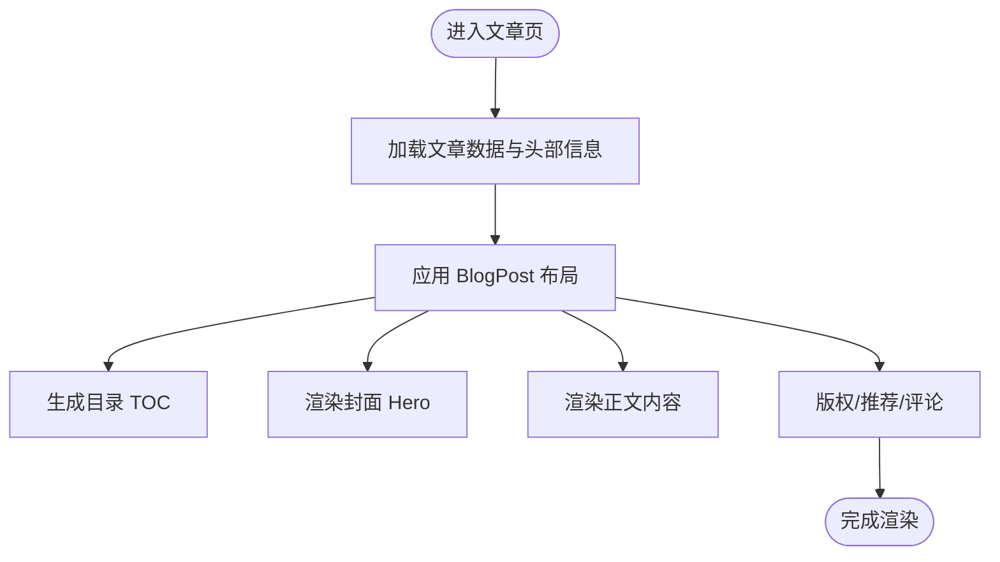
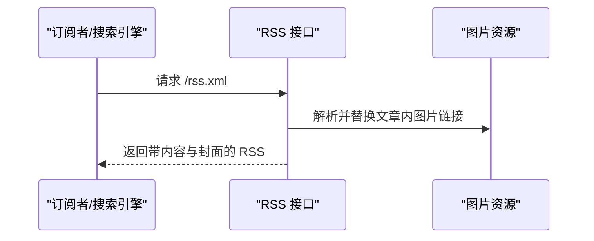
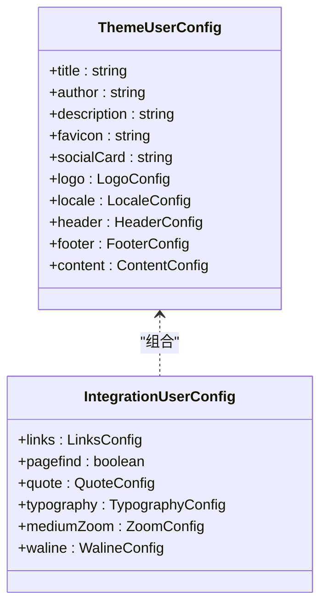
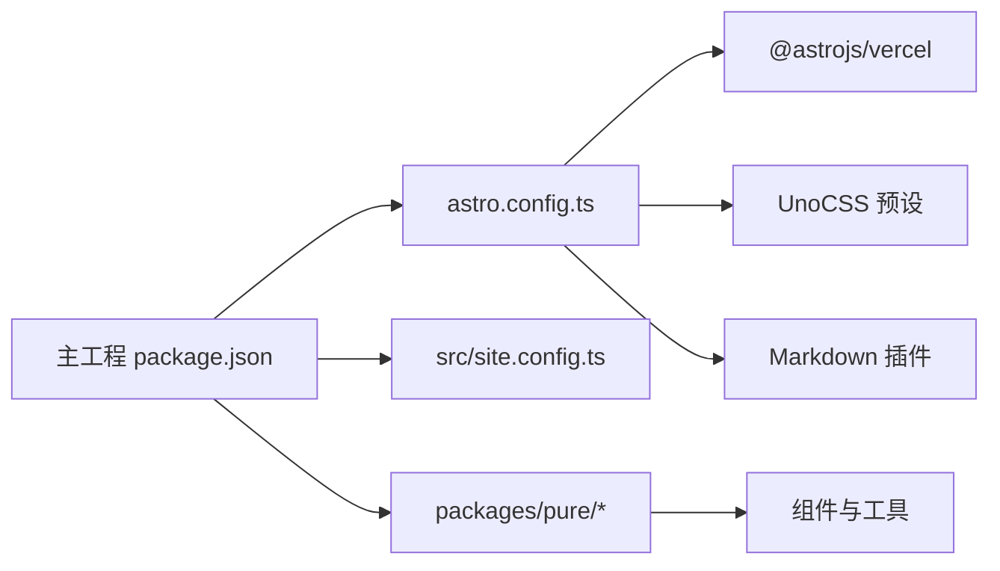

# 项目概述

<cite>
**本文引用的文件**
- [README.md](file://README.md)
- [package.json](file://package.json)
- [packages/pure/package.json](file://packages/pure/package.json)
- [astro.config.ts](file://astro.config.ts)
- [uno.config.ts](file://uno.config.ts)
- [src/site.config.ts](file://src/site.config.ts)
- [packages/pure/types/theme-config.ts](file://packages/pure/types/theme-config.ts)
- [packages/pure/components/basic/Header.astro](file://packages/pure/components/basic/Header.astro)
- [packages/pure/components/pages/PFSearch.astro](file://packages/pure/components/pages/PFSearch.astro)
- [src/pages/search/index.astro](file://src/pages/search/index.astro)
- [src/layouts/BlogPost.astro](file://src/layouts/BlogPost.astro)
- [src/pages/rss.xml.ts](file://src/pages/rss.xml.ts)
- [src/pages/robots.txt.ts](file://src/pages/robots.txt.ts)
- [LICENSE](file://LICENSE)
</cite>

## 目录
1. [引言](#引言)
2. [项目结构](#项目结构)
3. [核心组件](#核心组件)
4. [架构总览](#架构总览)
5. [详细组件分析](#详细组件分析)
6. [依赖关系分析](#依赖关系分析)
7. [性能考量](#性能考量)
8. [故障排查指南](#故障排查指南)
9. [结论](#结论)
10. [附录](#附录)

## 引言
本项目是一个基于 Astro 5.x 的博客与文档主题，名为“Astro Theme Pure”。其核心目标是提供一个“简单、快速且强大”的内容站点解决方案，兼顾高性能、简洁设计与良好的可扩展性。项目通过 Astro 的静态生成能力与现代前端工具链（UnoCSS、Pagefind、KaTeX 等）实现快速加载、响应式布局、全文搜索、Sitemap 与 RSS 订阅等关键功能，并内置丰富的组件体系，既可作为模板直接使用，也可集成到其他 Astro 项目中。

- 项目定位：面向个人博客、技术文档站与知识库的轻量级主题方案
- 核心价值主张：以 Astro 5.x 为基础，结合 UnoCSS 与 Pagefind，构建高性能、易维护、可定制的主题
- 目标用户：追求简洁与性能的独立作者、技术博主、开源项目文档站点维护者

**章节来源**
- file://README.md#L1-L100
- file://package.json#L1-L45
- file://packages/pure/package.json#L1-L51

## 项目结构
项目采用工作区（workspaces）组织方式，核心由以下部分构成：
- 主工程与主题包分离：主工程负责站点配置与页面布局，主题包（packages/pure）提供可复用的组件、类型与工具
- 配置层：astro.config.ts 负责 Astro 构建与集成；uno.config.ts 负责 UnoCSS 预设与主题变量；site.config.ts 提供主题与集成配置
- 页面与布局：src/pages 与 src/layouts 下定义页面与内容布局；搜索页、RSS、robots.txt 等通过 Astro API Route 实现
- 组件与插件：packages/pure/components 提供基础、高级与页面级组件；plugins 提供 Markdown/代码高亮等增强

**图表来源**
- [package.json](file://package.json#L1-L45)
- [astro.config.ts](file://astro.config.ts#L1-L133)
- [uno.config.ts](file://uno.config.ts#L1-L193)
- [src/site.config.ts](file://src/site.config.ts#L1-L207)
- [packages/pure/package.json](file://packages/pure/package.json#L1-L51)

**章节来源**
- file://package.json#L1-L45
- file://astro.config.ts#L1-L133
- file://uno.config.ts#L1-L193
- file://src/site.config.ts#L1-L207
- file://packages/pure/package.json#L1-L51

## 核心组件
- 主题与集成：通过 AstroPureIntegration 将主题能力注入站点，自动启用 Sitemap、MDX、UnoCSS 等
- 头部导航：Header 组件支持深色模式切换、移动端菜单展开、滚动态样式变化
- 搜索：PFSearch 组件基于 Pagefind，默认在生产环境启用，开发环境禁用
- 文章布局：BlogPost 布局集成目录（TOC）、封面图（Hero）、版权与推荐、评论系统与 MediumZoom 图片缩放
- RSS 与 Sitemap：RSS 通过 @astrojs/rss 动态生成；Sitemap 由主题包自动提供
- 可访问性与 SEO：robots.txt 明确爬虫规则并指向 Sitemap；Open Graph 社交卡片按文章设置

**章节来源**
- file://packages/pure/components/basic/Header.astro#L1-L209
- file://packages/pure/components/pages/PFSearch.astro#L1-L70
- file://src/pages/search/index.astro#L1-L34
- file://src/layouts/BlogPost.astro#L1-L75
- file://src/pages/rss.xml.ts#L1-L84
- file://src/pages/robots.txt.ts#L1-L20

## 架构总览
下图展示了从请求到页面渲染的关键路径，以及主题包与主工程的协作关系：

**图表来源**
- [astro.config.ts](file://astro.config.ts#L99-L104)
- [packages/pure/package.json](file://packages/pure/package.json#L39-L49)
- [src/site.config.ts](file://src/site.config.ts#L124-L125)

**章节来源**
- file://astro.config.ts#L99-L104
- file://packages/pure/package.json#L39-L49
- file://src/site.config.ts#L124-L125

## 详细组件分析

### 头部导航组件（Header）
- 功能要点
  - 固定顶部、滚动隐藏与样式过渡
  - 深色/浅色/系统三态主题切换
  - 移动端菜单折叠与展开
  - 内置搜索入口
- 设计与交互
  - 使用自定义元素与内联脚本优化首屏加载
  - 基于 UnoCSS 变量与暗色类名实现主题切换
- 与站点配置联动
  - 菜单项来自 virtual:config，标题与图标通过 Icon 组件统一

**图表来源**
- [packages/pure/components/basic/Header.astro](file://packages/pure/components/basic/Header.astro#L76-L108)

**章节来源**
- file://packages/pure/components/basic/Header.astro#L1-L209

### 全文搜索（PFSearch）
- 技术实现
  - Pagefind 默认 UI，生产环境按需懒加载
  - 自定义结果处理与 URL 规范化
- 集成方式
  - 在搜索页通过组件引入，根据配置开关决定是否启用
- 样式与主题
  - 基于 UnoCSS 变量覆盖 Pagefind UI 主题色与圆角

**图表来源**
- [src/pages/search/index.astro](file://src/pages/search/index.astro#L20-L30)
- [packages/pure/components/pages/PFSearch.astro](file://packages/pure/components/pages/PFSearch.astro#L19-L53)

**章节来源**
- file://src/pages/search/index.astro#L1-L34
- file://packages/pure/components/pages/PFSearch.astro#L1-L70

### 文章布局（BlogPost）
- 结构组成
  - Hero 封面区、TOC 目录侧边栏、正文槽位、底部版权与推荐、评论与阅读统计
- 功能特性
  - 动态 Open Graph 图片（heroImage 或默认社交卡片）
  - MediumZoom 图片缩放（可配置）
  - KaTeX 数学公式渲染（Markdown 插件）
- 与服务端工具协作
  - 使用 server 工具函数获取文章集合与排序

**图表来源**
- [src/layouts/BlogPost.astro](file://src/layouts/BlogPost.astro#L47-L75)

**章节来源**
- file://src/layouts/BlogPost.astro#L1-L75

### RSS 与 Sitemap
- RSS
  - 动态生成，替换内容中的图片链接为绝对地址，注入自定义字段与样式表
- Sitemap
  - 主题包自动提供，配合 robots.txt 指向索引文件
- SEO
  - robots.txt 明确爬虫规则并指向 Sitemap，提升搜索引擎收录效率

**图表来源**
- [src/pages/rss.xml.ts](file://src/pages/rss.xml.ts#L56-L81)
- [src/pages/robots.txt.ts](file://src/pages/robots.txt.ts#L11-L12)

**章节来源**
- file://src/pages/rss.xml.ts#L1-L84
- file://src/pages/robots.txt.ts#L1-L20

### 主题配置与类型约束
- 主题配置（theme）
  - 站点元数据、语言与日期格式、Logo、页头菜单、页脚链接与社交、内容分页与分享按钮等
- 集成配置（integ）
  - 搜索开关、随机语录、排版风格、MediumZoom、评论系统（Waline）等
- 类型与校验
  - 使用 Zod Schema 对主题配置进行输入校验，确保类型安全与文档一致性

**图表来源**
- [src/site.config.ts](file://src/site.config.ts#L3-L99)
- [src/site.config.ts](file://src/site.config.ts#L101-L181)
- [packages/pure/types/theme-config.ts](file://packages/pure/types/theme-config.ts#L11-L193)

**章节来源**
- file://src/site.config.ts#L1-L207
- file://packages/pure/types/theme-config.ts#L1-L193

## 依赖关系分析
- 运行时与构建时依赖
  - Astro 5.x、@astrojs/rss、@astrojs/sitemap、@astrojs/vercel、UnoCSS、Pagefind、KaTeX、Shiki 等
- 主题包导出
  - 主入口、用户组件、高级组件、工具与服务端函数等模块化导出，便于在其他项目中按需引入
- 配置与适配
  - Astro 配置启用 Vercel 适配器与服务器端渲染；UnoCSS 预设 Mini 与 Typography；字体预加载与优化

**图表来源**
- [package.json](file://package.json#L23-L35)
- [packages/pure/package.json](file://packages/pure/package.json#L38-L49)
- [astro.config.ts](file://astro.config.ts#L3-L42)
- [uno.config.ts](file://uno.config.ts#L175-L178)

**章节来源**
- file://package.json#L1-L45
- file://packages/pure/package.json#L1-L51
- file://astro.config.ts#L1-L133
- file://uno.config.ts#L1-L193

## 性能考量
- 构建与运行模式
  - 服务器端渲染（SSR）与 Vercel 适配器，减少首屏等待
  - 图片服务使用 Sharp，按需生成响应式尺寸
- 样式与字体
  - UnoCSS Mini 与 Typography 预设，按需提取与安全列表，降低 CSS 体积
  - 字体预加载与子集化，减少阻塞
- 内容与搜索
  - Pagefind 按需加载，开发环境禁用，避免不必要的资源消耗
  - 文章内容与图片链接在 RSS 中做绝对化处理，提升缓存命中率
- 代码质量
  - ESLint、Prettier 与 TypeScript 统一规范，减少运行时错误与体积膨胀

[本节为通用性能建议，不直接分析具体文件]

## 故障排查指南
- 搜索功能不可用
  - 确认生产环境与配置开关：开发环境默认禁用，生产环境需开启 pagefind
  - 检查 base URL 与 pagefind 资源路径映射
- RSS 内图片链接异常
  - 确认图片路径解析逻辑与动态导入映射正确
- Sitemap 未被收录
  - 检查 robots.txt 是否正确指向 sitemap-index.xml
- 主题样式异常
  - 确认 UnoCSS 预设与安全列表配置，检查主题变量覆盖是否生效
- 深色模式切换无效
  - 检查本地存储键值与自定义元素事件绑定

**章节来源**
- file://src/pages/search/index.astro#L22-L30
- file://packages/pure/components/pages/PFSearch.astro#L32-L48
- file://src/pages/rss.xml.ts#L20-L54
- file://src/pages/robots.txt.ts#L11-L12
- file://uno.config.ts#L184-L192
- file://packages/pure/components/basic/Header.astro#L87-L98

## 结论
Astro Theme Pure 以 Astro 5.x 为核心，结合 UnoCSS 与 Pagefind，提供了开箱即用的高性能博客与文档主题方案。其简洁的设计、完善的组件体系、可配置的集成能力与严格的类型约束，使其既能满足初学者快速上手，也能为有经验的开发者提供深度定制空间。通过合理的构建与运行策略，项目在性能、SEO 与可维护性方面均具备良好表现。

[本节为总结性内容，不直接分析具体文件]

## 附录

### 技术栈概览
- 核心框架：Astro 5.x
- 样式与原子化：UnoCSS（Mini + Typography）
- 全文搜索：Pagefind
- 数学公式：KaTeX
- 代码高亮：Shiki（官方与自定义转换器）
- 适配与部署：@astrojs/vercel
- RSS/Sitemap：@astrojs/rss 与主题包集成
- 类型与校验：TypeScript + Zod

**章节来源**
- file://package.json#L23-L35
- file://packages/pure/package.json#L39-L49
- file://astro.config.ts#L1-L133
- file://uno.config.ts#L175-L178

### 版本与许可证
- 主工程版本：4.1.2
- 主题包版本：1.4.0
- 许可证：Apache-2.0

**章节来源**
- file://package.json#L7-L7
- file://packages/pure/package.json#L5-L8
- file://LICENSE#L1-L203