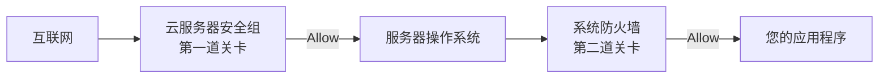

部署应用时，开放端口需要在两个地方配置，它们不是重复劳动，而是互补关系。

#### 1. 流量访问路径图

#### 2. 区别对照表

| 特性 | **云服务器安全组 (Security Group)** | **系统防火墙 (UFW/Firewalld)** |
| :--- | :--- | :--- |
| **位置** | 云平台**网络层面**的虚拟防火墙 | 服务器**操作系统内部**的软件防火墙 |
| **控制对象** | 控制能否进入**整台云服务器** | 控制服务器内部能否访问**某个具体应用** |
| **管理界面** | 阿里云、腾讯云等云平台的控制台 | 服务器命令行 **或** 1Panel 可视化界面 |
| **特点** | **必须**配置，是流量进入服务器的**前提** | 推荐配置，提供第二层防护和管理便利 |

#### 3. 操作黄金法则
**一个需要被公网访问的应用，必须同时在“安全组”和“系统防火墙”中放行其端口。**
1.  **安全组**：登录云平台控制台，添加**入方向**规则，协议`TCP`，端口号`XXXX`，授权来源`0.0.0.0/0`（或更精确的IP）。
2.  **系统防火墙**：在 1Panel 的 `防火墙` 页面，添加一条允许规则，协议`TCP`，端口号`XXXX`。

---